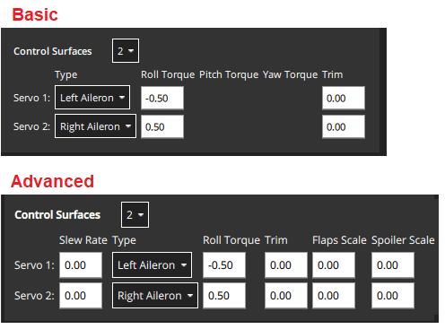

# 액추에이터 설정 및 테스트

<Badge type="tip" text="PX4 v1.14" />

The _Actuators Setup_ view is used to customize the specific geometry of the vehicle, assign actuators and motors to flight controller outputs, and test the actuator and motor response.

## 개요

Open the view in _QGroundControl_ here: **"Q" (app menu) > Vehicle Setup > Actuators** (tab). The displayed elements depend on the [selected frame](../config/airframe.md), with outputs mapped by default as shown in the [Airframe Reference](../airframes/airframe_reference.md).

The view has three sections:

- [기하](#geometry): [선택한 기체](../config/airframe.md)의 기하 도형을 설정합니다. 여기에는 [모터](#motor-geometry)의 수, 위치 및 속성과 [제어 표면](#control-surfaces-geometry) 및 [모터 틸트 서보](#motor-tilt-servo-geometry)의 수와 속성이 포함됩니다.
- [액추에이터 출력](#actuator-outputs): 모터, 제어 표면 및 기타 액추에이터를 특정 출력에 할당합니다.
- [액추에이터 테스트](#actuator-testing): 모터와 액추에이터가 예상대로 방향과 속도로 움직이는 지 테스트합니다.

A quadcopter might have an setup screen similar to the one shown below. This defines a 4-rotor copter with X-geometry. It maps the 4 motors to the AUX1 to AUX4 outputs, and specifies that the connect to DShot1200 ESC. It also maps PWM400 AUX outputs for controlling a parachute and landing gear.


지오메트리 섹션은 선택한 [기체](../config/airframe.md)에 대해 구성 가능한 지오메트리 관련 매개변수를 설정하는 데 사용됩니다. 여기에는 [모터](#motor-geometry)의 수와 위치, [제어 표면](#control-surfaces-geometry)의 수, 기능 및 속성이 포함됩니다. VTOL 틸트로터 차량의 경우 [틸트 서보](#motor-tilt-servo-geometry)의 수와 속성도 포함됩니다.

## 지오메트리

The geometry section is used to set any configurable geometry-related parameters for the selected [airframe](../config/airframe.md). This includes the number and position of [motors](#motor-geometry), and the number, function, and properties of [control surfaces](#control-surfaces-geometry). For VTOL tiltrotor vehicles, it will also include the number and properties of [tilt servos](#motor-tilt-servo-geometry)

모터 지오메트리 섹션에서는 모터 수, 상대 위치 및 각 모터의 기타 속성을 설정합니다.

- 선택한 기체 유형에 대한 _구성 가능_ 필드만 표시됩니다. 기체에 대해 구성할 수 없는 필드는 숨겨져 있습니다.
- 모터 위치 다이어그램은 현재 멀티콥터 프레임에만 표시됩니다.
:::

### 모터 지오메트리

The motor geometry section lets you set the number of motors, the relative position, and other properties of each motor.

멀티콥터 기체의 기하학적 구성은 각 모터의 상대적 x,y 위치를 보여주는 다이어그램을 제공합니다. 다른 프레임의 모터 위치에 대한 광범위한 이해는 [기체 참조](../airframes/airframe_reference.md)를 참고하십시오. For example, `Tilted-by` and `axis` are only relevant for [Tiltrotor VTOL](#motor-geometry-vtol-tiltrotor) and [Standard VTOL](#motor-geometry-standard-vtol) vehicles, respectively.

The geometry configuration for multicopter airframes provides a diagram showing the relative x,y positions for each of the motors. See the [Airframe Reference](../airframes/airframe_reference.md) for an broad understanding of the motor positions for other frames.

Core geometry concepts and the configuration for a number of different frames are provided in the following sections.

#### 모터 지오메트리: 멀티콥터

The image below shows the geometry setup for a quadrotor multicopter frame with and without advanced settings.


각 모터에 대해 다음을 설정할 수 있습니다:

For each motor you can then set:

- `위치 X`: [X 위치](#motor-position-coordinate-system), 미터 단위.
- `위치 Y`: [Y 위치](#motor-position-coordinate-system), 미터 단위.
- `위치 Z`: [Z 위치](#motor-position-coordinate-system), 미터 단위.
- (고급) `CCW 방향`: 모터가 시계 반대 방향으로 회전하는 것을 나타내는 확인란입니다(시계 방향의 경우 선택 취소).
- (고급) `양방향`: 모터가 [양방향](#bidirectional-motors)임을 나타내는 확인란
- (고급) `슬루율`: 자세한 내용은 [제어 표면 기하학](#control-surfaces-geometry) 섹션을 참조하십시오.

::: info The `X`, `Y`, `Z` positions are in [FRD coordinate frame, relative to the _centre of gravity_](#motor-position-coordinate-system). Note, this may not be the same as the position of the flight controller!
:::

#### 모터 지오메트리: VTOL Quadrotor Tailsitter

모터는 [멀티콥터 지오메트리](#motor-geometry-multicopter)와 동일한 구성 필드를 갖습니다.

Motors have the same configuration fields as for the [multicopter geometry](#motor-geometry-multicopter).


#### 모터 지오메트리: VTOL 틸트로터

The motor geometry for a [Generic Quadplane VTOL Tiltrotor](../airframes/airframe_reference.md#vtol_vtol_tiltrotor_generic_quadplane_vtol_tiltrotor) is shown below (the approach for configuring other [VTOL tiltrotors](../airframes/airframe_reference.md#vtol_vtol_tiltrotor_generic_quadplane_vtol_tiltrotor) will be similar).


- `기울기`: 모터를 기울이는 데 사용되는 관련 서보입니다. 이 서보의 속성은 [모터 틸트 서보 지오메트리](#motor-tilt-servo-geometry)에 정의되어 있습니다.

#### 모터 형상: 표준 VTOL

The motor geometry for a [Generic Standard VTOL](../airframes/airframe_reference.md#vtol_standard_vtol_generic_standard_vtol) is shown below (the approach for configuring other "Standard VTOL" will be similar).


다른 기체 유형은 프레임 유형에 적합한 모터 형상을 정의합니다. 다시 한 번 이러한 모터는 일반적으로 위에 표시된 것과 같은 종류의 속성을 가집니다.

- `축`: `위로`, `아래로`, `앞으로`, `뒤로`, ` 중 하나 왼쪽으로`, `오른쪽으로`, `사용자 지정`
  - `사용자 지정`을 선택하면 UI에 모터 방향 설정을 위한 세 개의 추가 필드가 표시됩니다.

#### 모터 지오메트리: 기타 기체

Other vehicle types will define an appropriate motor geometry for their frame type. Once again these motors will generally have the same kinds of properties as shown above.

모터 위치를 나타내는 좌표계는 FRD(몸체 프레임 내)이며, 여기서 X축은 앞쪽, Y축은 오른쪽, Z축은 아래쪽을 가르킵니다.

#### 모터 위치 좌표계

The coordinate system for motor positions is FRD (in body frame), where the X axis points forward, the Y axis to the right and the Z axis down.

The origin is the vehicle's **centre-of-gravity (COG)**. This may **NOT** be the same position as the location of the autopilot.


#### 양방향 모터

Some vehicles may use bidirectional motors (i.e. motors that support spinning in both directions). For example, ground vehicles that want to move forwards and backwards, or VTOL vehicles that have pusher motors that can turn in either direction.

If bidiectional motors are used, make sure to select the **Reversible** checkbox for those motors (the checkbox is displayed as an "advanced" option).


Note that you will need to also ensure that the ESC associated with bidirectional motors is configured appropriately (e.g. 3D mode enabled for DShot ESCs, which can be achieved via [DShot commands](../peripherals/dshot.md#commands)).

### 조종면 지오메트리

The control surfaces section of the geometry panel lets you set the number and types of control surfaces that are present on the vehicle. You may also need to set trim and slew rate values in some cases. More advanced users can also configure the roll scale, yaw scale, and pitch scale (generally the defaults are acceptable, and this is not needed). An "example" control surface section for a vehicle with two ailerons is shown below. Note that ailerons only affect roll, so the pitch and yaw fields are disabled.



::: info Only the most common settings are displayed by default. Select the **Advanced** checkbox in the top right corner of the view to display all settings.
:::

The fields are:

- `조종면`: 조종면의 갯수(먼저 설정하십시오!)
- `유형`: 각 조종면의 유형: `LeftAileron`, `RightAileron`, `Elevator`, `Rudder</0 >, <code>왼쪽 엘레본`, `오른쪽 엘레본`, `왼쪽 V-Tail`, `오른쪽 V-Tail`, `왼쪽 플랩`, `오른쪽 플랩`, `에어브레이크`, `맞춤형`.
- `Roll Torque`: Effectiveness of actuator around roll axis (normalised: -1 to 1). [일반적으로 기본 액추에이터 값을 사용하여야 합니다](#actuator-roll-pitch-and-yaw-scaling).
- `Pitch Torque`: Effectiveness of actuator around pitch axis (normalised: -1 to 1). [일반적으로 기본 액추에이터 값을 사용하여야 합니다](#actuator-roll-pitch-and-yaw-scaling).
- `Yaw Torque`: Effectiveness of actuator around yaw axis (normalised: -1 to 1). [일반적으로 기본 액추에이터 값을 사용합니다](#actuator-roll-pitch-and-yaw-scaling).
- `트림`: 입력 없이 중앙에 오도록 액추에이터에 추가된 오프셋입니다. 이것은 시행착오를 거쳐 결정될 수 있습니다.
- (Advanced) `Slew Rate`: Minimum time allowed for the motor/servo signal to pass through the full output range, in seconds.
  - The setting limits the rate of change of an actuator (if not specified then no rate limit is applied). It is intended for actuators that may be damaged if they move too fast — such as the tilting actuators on a tiltrotor VTOL vehicle.
  - For example, a setting of 2.0 means that the motor/servo will not be commanded to move from 0 to 1 at a rate that completes the operation in less than 2 seconds (in case of reversible motors, the range is -1 to 1).
- (Advanced) `Flap Scale`: How much this actuator is deflected at the "full flaps configuration" \[0, 1\] (see [Flap Scale and Spoiler Scale Configuration](#flap-scale-and-spoiler-scale-configuration) below). Can be used to configure aerodynamic surface as flap or to compensate for generated torque through main flaps.
- (Advanced) `Spoiler Scale`: How much this actuator is deflected at the "full spoiler configuration" \[0, 1\] (see [Flap Scale and Spoiler Scale Configuration](#flap-scale-and-spoiler-scale-configuration) below). Can be used to configure aerodynamic surface as spoiler or to compensate for generated torque through main spoiler.
- (VTOL only) `Lock control surfaces in hover`:
  - `사용`: 대부분의 차량은 호버링 시 조종면을 사용하지 않습니다. 이 설정을 사용하여 기체 역학에 영향을 미치지 않도록 잠그십시오.
  - `비활성화`: 듀오 테일시터(피치 및 요 제어에 엘레본 사용)와 같이 호버링에서 조종면을 사용하는 기체를 설정합니다. 또한 조종면을 사용하여 고속으로 이동할 때 호버 모드에서 추가 안정화를 제공하거나 강한 바람이 부는 기체에 대하여 설정합니다.

#### Flap Scale and Spoiler Scale Configuration

"Flap-control" and "Spoiler-control" are aerodynamic configurations that can either be commanded manually by the pilot (using RC, say), or are set automatically by the controller. For example, a pilot or the landing system might engage "Spoiler-control" in order to reduce the airspeed before landing.

The configurations are an _abstract_ way for the controller to tell the allocator how much it should adjust the aerodynamic properties of the wings relative to the "full flaps" or "full spoiler" configuration (between `[0,1]`, where "1" indicates the full range). The allocator then uses any of the available control surfaces it wants in order to achieve the requested configuration: usually flaps, ailerons, and elevator.

The `flap scale` and `spoiler scale` settings in the actuator UI inform the allocator how much ailerons, elevators, flaps, spoilers, and other control surfaces, contribute to a requested "Flap-control" and/or "Spoiler-control" value. Specifically, they indicate how much each control surface should be deflected when the controller is demanding "full flaps" or "full spoiler".

In the following example, the vehicle has two ailerons, one elevator, one rudder and two flaps as control surfaces:


- The flaps have both `Flap Scale` set to 1, meaning that they will be fully deflected with the flap-control at 1. They also have a slew rate of 0.5/s, meaning that it will take 2s to fully deflect them (a slew rate on the flaps is generally recommended to reduce the disturbances their movement creates).
- The ailerons are primarily tasked to provide the commanded roll torque. They also have `Spoiler Scale` set to 0.5, and will additionally be deflected upwards 50% if the controller demands full spoiler configuration. The aileron deflection is thus the sum of the (asymmetrical) deflection for the roll torque, plus the (symmetrical) deflection for the spoiler setpoint.
- The elevator is primarily tasked to provide pitch torque. It also has non-zero entries in the `Flap Scale` and `Spoiler Scale` fields. These are the elevator deflections added to compensate for the pitching moments generated by the flaps and spoiler actuators. In the case here the elevator would be deflected 0.3 up when the flaps are fully deployed to counteract the pitching down moment caused by the flaps.

#### 액추에이터 롤, 피치 및 요 스케일링

::: info
For the majority of airframe setups the default values for each control surface types should not be changed.
:::

The `Roll scale`, `Pitch scale` and `Yaw scale` values indicate the normalized effectiveness of the actuator around the corresponding axis.

Tuning the values is a low/level/advanced topic, and is generally only needed when tuning coupled control surfaces (like an elevon, that controls both pitch and roll). In this case the things you need to know are:

- 입력된 숫자는 할당 매트릭스에 직접 입력되며, 원하는 순간(정규화)에서 제어 신호를 얻기 위해 반전됩니다.
- 배율을 높이면 제어 표면의 처짐이 _감소_됩니다(역전될 때).

<!-- For more information see: []() (PX4 Dev Summit, 2022) -->

#### 조종면 처짐 규칙

The diagram below shows the convention for deflections:


In summary:

- **수평 조종면:** 위쪽으로 이동하면 양의 편향이 발생합니다. 에일러론 등 포함
- **수직 조종면:** 오른쪽으로 이동하면 양의 편향이 발생합니다. 러더 등이 포함됩니다.
- **혼합 조종면:** 위쪽/오른쪽 방향 움직임은 양수입니다(위와 같이). V-Tail 등이 포함됩니다.

<!-- Also see this comment: https://github.com/PX4/PX4-Autopilot/blob/96b03040491e727752751c0e0beed87f0966e6d4/src/modules/control_allocator/module.yaml#L492 -->

### 모터 틸트 서보 지오메트리

[VTOL tiltrotor vehicles](../frames_vtol/tiltrotor.md) can tilt their motors to transition between hover and forward flight. This section defines the properties of the tilting servos. These are mapped to specific motors in the motor geometry for a tiltrotor.

The example below shows the tilt servo setup for the [tiltrotor motor geometry shown above](../config/actuators.md#motor-geometry-vtol-tiltrotor).


The values that can be set are:

- `틸트 서보`: 서보(틸트 가능한 모터)의 수입니다.
- `최소 기울기 각도`: z축을 기준으로 한 [최대 기울기 각도](#tilt-servo-coordinate-system)(도)
- `최대 기울기 각도`: Z축을 기준으로 한 [최소 기울기 각도](#tilt-servo-coordinate-system)(도)
- `기울기 방향`: `앞쪽으로`(양의 x 방향) 또는 `오른쪽으로`(양의 y 방향).
- `제어에 사용`: [요/피치에 사용되는 틸트 서보](#tilt-servos-for-yaw-pitch-control)
  - `없음`: 토크 제어를 사용하지 않습니다.
  - `요`: 요를 제어하는 데 사용되는 틸트 서보입니다.
  - `피치`: 피치를 제어하는 데 사용되는 틸트 서보입니다.
  - `요 및 피치 모두`: 틸트 서보는 요와 피치를 모두 제어하는 데 사용됩니다.

#### 틸트 서보 좌표계

The coordinate system for tilt rotor angles is shown below. The reference direction for tilt angles is straight upwards (0 degrees). Tilt angles towards the front or right of the vehicle are positive, and towards the back or to the left are negative.


The `Angle at min tilt` and `Angle at max tilt` indicate the range of movement for the tilt servo. The minimum tilt is the smaller _numerical value_ (not absolute) of the two angles.

If the max/min tilt vectors are **P<sub>0</sub>** and **P<sub>1</sub>** as shown above, both tilt angles are positive but **θ<sub>0</sub>** is smaller:

- `최소 기울기 각도` = **θ<sub>0</sub>**
- `최대 기울기 각도` = **θ<sub>1</sub>**

::: info If the diagram was mirrored so that **P<sub>0</sub>** and **P<sub>1</sub>** were tilting into the -x, -y quadrant, then both the tilt angles would be negative. Because **θ<sub>1</sub>** would more negative (smaller) than **θ<sub>0</sub>**, it would be the `Angle at min tilt`.

Similarly, a servo that moves:

- between the upright and forward positions would have `min=0` and `max=90`.
- 수직 위치를 중심으로 대칭적으로 45도는 `최소=-45` 및 `최대=45`입니다.
- 수직 위치와 후방 위치 사이의 값은 `min=-90` 및 `max=0`입니다.
:::

The `Tilt direction` indicates whether the servo tilts in the plane towards the `Front` or `Right` of the vehicle. On the diagram this would be represented by **α** that can only take values of 0 (front) or 90 (right).

#### 요/피치 제어용 틸트 서보

이 기능의 사용 여부는 `제어에 사용`에서 설정합니다.

- Yaw는 일반적으로 이러한 방식으로 설정되지만 모터는 4개 이상의 모터가 있는 기체에서 대신 사용되는 경우가 많습니다.
- 피치는 일반적으로 차동 모터 추력을 사용하여 제어합니다. 틸트 서보를 사용한 제어는 [Bicopter](https://www.youtube.com/watch?v=hfss7nCN40A)와 같이 차동 추력을 사용할 수 없는 기체에 유용합니다.

_액추에이터 출력_ 섹션은 모터, 제어 표면 서보 및 특정 프레임에서 사용하는 기타 액츄에이터를 비행 컨트롤러의 물리적 출력에 할당하고 해당 출력에 대한 매개변수를 설정합니다.

## 액추에이터 출력

The _Actuator Outputs_ section is used to assign motors, control surface servos, and other actuators used by the particular frame to the physical outputs on the flight controller, and to set parameters for those outputs.


Separate tabs are displayed for each output bus supported by the connected flight controller: PWM MAIN (I/O Board output), PWM AUX (FMU Board output), UAVCAN.

Motors and actuators (which are referred to as "[functions](#output-functions)") can be assigned to any physical output on any of the available buses.

PWM 출력은 하드웨어 타이머 그룹을 기반으로 그룹화됩니다. 즉, 한 그룹의 모든 출력은 동일한 프로토콜에서 동일한 속도로 작동하여야 합니다(예: 한 그룹의 모든 출력에 대해 400Hz의 PWM 신호).

PWM AUX 탭에는 일반적으로 [카메라 캡처/트리거 입력](../peripherals/camera.md#trigger-configuration)으로 사용되는 CAP 출력이 있습니다. 그러나, CAP 출력을 다른 출력 기능에 매핑할 수 있으며 다른 AUX 출력을 카메라 캡처/트리거 입력으로 사용 가능합니다. Therefore it is not possible to map Servo and a Motor in the same output group, as they usually operate at a different rate.

The PWM AUX tab has CAP outputs that are generally used as the [camera capture/trigger input](../camera/fc_connected_camera.md#trigger-configuration). However you can map the CAP outputs to other output functions, and other AUX outputs can be used as camera capture/triggering input.

::: info
Configuring the Camera Capture / Trigger input requires a reboot to take effect
:::

You should assign functions to the outputs that match your physical wiring of motors and servos, and use the [Actuator Testing](#actuator-testing) section described below to determine appropriate output parameter values. These steps are covered in [Output Assignment and Configuration](#output-assignment-and-configuration).

### Output Functions

Output functions are used to map the "logical functions" of an airframe, such as `Motor 1` or `Landing gear`, to physical outputs like FMU output pin 2. This makes it easy to use a particular output pin for almost any purpose.

Some functions are only relevant to particular frames or output types, and will not be offered on others.

Functions include:

- `Disabled`: Output has no assigned function.
- `Constant_Min`: Output set to constant minimum value (-1).
- `Constant_Max`: Output is set to constant maximum value (+1).
- `Motor 1` to `Motor 12`: Output is indicated motor. Only motors allowed for airframe are displayed.
- `Servo 1` to `Servo 8`: Servo output. These are further assigned a specific meaning based on airframe, such as "tilt servo", "left aileron".
- `Peripheral via Acutator Set 1` to `Peripheral via Acutator Set 6`: [Generic Actuator Control with MAVLink](../payloads/generic_actuator_control.md#generic-actuator-control-with-mavlink).
- `Landing Gear`: Output is landing gear.
- `Parachute`: Output is parachute. The minimum value is sent in normal use and the maximum value is emitted when a failsafe is triggered.
- `RC Roll`: Output is passthrough roll from RC ([RC_MAP_ROLL](../advanced_config/parameter_reference.md#RC_MAP_ROLL) maps an RC channel to this output). An RC channel is mapped to the output using .
- `RC Pitch`: Output is passthrough pitch from RC ([RC_MAP_PITCH](../advanced_config/parameter_reference.md#RC_MAP_PITCH) maps an RC channel to this output).
- `RC Throttle`: Output is passthrough throttle from RC ([RC_MAP_THROTTLE](../advanced_config/parameter_reference.md#RC_MAP_THROTTLE) maps an RC channel to this output).
- `RC Yaw`: Output is yaw from RC ([RC_MAP_YAW](../advanced_config/parameter_reference.md#RC_MAP_YAW) maps an RC channel to this output).
- `RC Flaps`: Output is flaps from RC ([RC_MAP_FLAPS](../advanced_config/parameter_reference.md#RC_MAP_FLAPS) maps an RC channel to this output).
- `RC AUXn` to `RC AUX1`: Outputs used for [arbitrary payloads triggered by RC passthrough](../payloads/generic_actuator_control.md#generic-actuator-control-with-rc).
- `Gimbal Roll`: Output controls gimbal roll.
- `Gimbal Pitch`: Output controls Gimbal pitch.
- `Gimbal Yaw`: Output controls Gimbal yaw.

The following functions can only be applied to FMU outputs:

- `Camera_Trigger`: Output to trigger camera. Enabled when [`TRIG_MODE==0`](../advanced_config/parameter_reference.md#TRIG_MODE). Configured via `TRIG_*` parameters.
- `Camera_Capture`: Input to get image capture notification. Enabled when [CAM_CAP_FBACK==0](../advanced_config/parameter_reference.md#CAM_CAP_FBACK). Configured via `CAM_CAP_*` parameters.
- `PPS_Input`: Pulse-per-second input capture. Used for GPS synchronisation. Enabled when [`PPS_CAP_ENABLE==0`](../advanced_config/parameter_reference.md#PPS_CAP_ENABLE)

오른쪽 하단의 _액추에이터 테스트_ 섹션에는 액츄에이터 및 모터 설정을 테스트(및 결정)하는 데 사용할 수 있는 슬라이더가 있습니다. [액추에이터 출력](#actuator-outputs) 섹션에 정의된 각 출력에 대해 슬라이더가 제공됩니다. 아래 슬라이더 예는 일반적인 VTOL Tiltrotor 기체에 대한 섹션을 나타냅니다.

## 액추에이터 테스트

The _Actuator Testing_ section in lower-right corner provides sliders that can be used to test (and determine) actuator and motor settings. A slider is provided for each output defined in the [Actuator Outputs](#actuator-outputs) section. The slider example below shows the section for a typical VTOL Tiltrotor airframe.


:::note
**슬라이더 활성화** 스위치를 토글한 후 액추에이터/모터는 해당 슬라이더가 _이동_될 때까지 아무 작업도 하지 않습니다. 이것은 스위치가 활성화된 후 갑작스러운 모터 움직임을 방지하기 위한 안전 장치입니다.

::: info After you toggle the **Enable sliders** switch, actuators/motors won't do anything until the corresponding slider is _moved_. This is a safety feature to prevent sudden motor movements after switch is enabled.
:::

Sliders can be used to verify the following:

1. 액추에이터(모터, 제어 표면 등)는 예상 출력에 할당됩니다.
1. PWM 출력 값이 `해제`일 때 모터가 회전하지 않습니다.
1. 모터는 `최소` PWM 출력 값에서 거의 회전하지 않습니다.
1. 모터가 예상 방향으로 **양의 추력**을 제공합니다.
1. 조종면은 출력 값 `시동`에 대하여 올바른 유휴 위치에 있습니다.
1. Control Surfaces move in the direction as defined in the [Control Surface Convention](#control-surface-deflection-convention)
1. 모터 틸트 서보가 출력 값 `해제`에 대해 올바른 유휴 위치에 있습니다.
1. Motor Tilt Servos move in the direction as defined in the [Tilt Servo Convention](#tilt-servo-coordinate-system)

## 출력 할당 및 설정

**식별 & 모터 할당** 버튼은 반자동 프로세스를 사용하여 모터를 PWM 출력에 할당합니다.

- MC vehicles that have connected motors to PWM outputs can use the [Identify & Assign Motors](#multicopter-pwm-motor-assignment) button to perform motor assignment "semi-automatically".
- 모터와 액추에이터의 출력 할당은 슬라이더를 사용하여 수행/확인할 수 있습니다([출력 할당(수동)](#output-assignment-manual) 참조).
- 모든 출력에 대한 해제, 최소 및 최대 설정도 슬라이더를 사용하여 결정할 수 있습니다. This is shown as part of [Motor Configuration](#motor-configuration), [Control Surface Setup](#control-surface-setup), [Tilt servo setup](#tilt-servo-setup)

### 멀티콥터 PWM: 모터 할당

You can use the **Identify & Assign Motors** button to assign motors to PWM outputs using a semi-automated process.

:::warning
출력이나 테스트를 할당하기 전에 모터에서 프로펠러를 제거하십시오. On other frames you can follow the instructions in [Output Assignment (Manual)](#output-assignment-manual).
:::

:::warning
Remove the propellers from motors before assigning outputs or any testing.
:::


When you click the button, QGC sends a command to a motor, causing it to spin. To assign that motor to an output you simply select the corresponding motor displayed in the screen. QGC will then spin the next motor for you to assign, and so on.

Instructions:

1. 프레임의 모터와 일치하도록 모터 형상을 설정합니다.
1. 모터를 할당할 PWM 탭을 선택합니다.
1. **식별 & 모터 할당** 버튼을 클릭합니다.
1. 하나의 모터가 회전하기 시작합니다(참고할 수 없을 정도로 회전이 너무 빨리 멈추면 **모터 다시 회전** 클릭).

   지오메트리 섹션에서 해당 모터를 선택합니다.

   

1. 모든 모터를 할당한 후 도구는 출력에 대한 올바른 모터 매핑을 설정한 다음 종료됩니다.

### 출력 할당(수동)

:::warning
Remove the propellers from motors before assigning outputs or any testing.
:::

액추에이터에 할당하려면:

To assign an actuator:

1. 먼저 _액추에이터 출력_ 섹션에서 정확할 것으로 _가능성이 있는_ 출력에 기능을 할당합니다.
1. _액추에이터 테스트_ 섹션에서 **슬라이더 사용** 스위치를 전환합니다.
1. 테스트하려는 액추에이터의 슬라이더를 이동합니다.
   - 모터는 최소 추력 위치로 이동하여야 합니다.
   - 서보는 중간 위치 근처로 이동하여야 합니다.
1. 어떤 액츄에이터가 차량에서 움직이는 지 확인하십시오. 이것은 지오메트리에 대한 액추에이터 위치와 일치해야 합니다([기체 참조](../airframes/airframe_reference.md)는 여러 표준 기체에 대한 모터 위치를 나타냅니다).
   - 올바른 액츄에이터가 움직이면 다음 단계로 진행합니다.
   - 잘못된 액츄에이터가 움직이면 출력 할당을 변경합니다.
   - 아무 것도 움직이지 않으면, 슬라이더를 범위 중간에 늘리고 필요한 경우 더 높입니다. 그 후 아무 것도 움직이지 않으면, 출력이 연결되지 않거나 모터에 전원이 공급되지 않거나 출력 설정에 오류가 있을 수 있습니다. 문제를 해결하여야 합니다("무엇이든"이 움직이는지 확인하기 위하여 다른 액추에이터 출력을 시도할 수 있음).
1. 슬라이더를 "무장 해제" 위치로 되돌립니다(모터의 경우 슬라이더 하단, 서보의 경우 슬라이더 중앙).
1. 모든 액추에이터에 대하여 반복합니다.

### 모터 설정

::: info If using PWM or OneShot ESCs, you should first perform [ESC Calibration](../advanced_config/esc_calibration.md) (this topic also covers PWM specific motor configuration).

[DShot](../peripherals/dshot.md) ESCs do not require configuration of the command limits but only rotation direction.
:::

:::warning
Remove propellers!
:::

각각의 모터에 대하여:

- don't spin when disarmed (at the `disarmed` PWM output value).
- barely but reliably spin up at the `minimum` PWM output value.
- have the _lowest_ `maximum` PWM output value that spins the motor at its _highest_ rate.
- give **positive thrust** in the expected direction.

For each motor:

1. 모터 슬라이더를 아래로 당겨서 아래쪽에 찰칵 소리가 나도록 합니다. In this position the motor is set to the outputs `disarmed` value.
   - 모터가 이 위치에서 회전하지 않는 지 확인하십시오.
   - If the motor spins, reduce the corresponding PWM `disarmed` value in the [Actuator Outputs](#actuator-outputs) section to below the level at which it still spins.
2. 슬라이더가 _최소_ 위치에 고정될 때까지 슬라이더를 천천히 위로 이동합니다. In this position the motor is set to the outputs `minimum` value.

   - 이 위치에서 모터가 매우 느리게 회전하는 지 확인합니다.
   - If the motor is not spinning, or spinning too fast you will need to adjust the corresponding PWM `minimum` value in the [Actuator Outputs](#actuator-outputs) such that the motors barely spin.

        ::: info
  For DShot output, this is not required.

:::

3. Increase the slider value to a level where you can verify that the motor is spinning in the correct direction and that it would give a positive thrust in the expected direction.

   - The expected thrust direction can vary by vehicle type. For example in multicopters the thrust should always point upwards, while in a fixed-wing vehicle the thrust will push the vehicle forwards.
   - For VTOL, thrust should point upwards when the Tilt Servo is at 0 degrees as defined the [Tilt Servo Convention](#tilt-servo-coordinate-system). Testing of the [Tilt Servo](#tilt-servo-setup) is covered below as well.
   - If thrust is in the wrong direction, you may need to [reverse the motors](#reversing-motors).

4. Increase the slider value to the maximum value, so the motor is spinning quickly. Reduce the value of the PWM output's `maximum` value just below the default. Listen to the tone of the motors as you increase the value in small (25us) increments. The "optimal" maximum value is the value at which you last hear a change in the tone.

### 조종면 설정

First set the _frame rate_ for the servos used in each group of outputs. This would normally be set to the maximum value supported by your servo. Below we show how you would set it to PWM50 (the most common value).


::: info You will almost certainly need to change the pulse rate from the default of 400Hz because support is rare (if not supported the servo will usually make an "odd" noise). If you're using PWM servos, PWM50 is far more common. If a high rate servo is _really_ needed, DShot offers better value.
:::

For each of the control surfaces:

1. 무장 해제 시 표면이 중립 위치를 유지하도록 `비시동 해제` 값을 설정합니다. 이것은 일반적으로 PWM 서보의 경우 약 `1500`입니다.
2. Move the slider for the surface upwards (positive command) and verify that it moves in the direction defined in the [Control Surface Convention](#control-surface-deflection-convention).
   - 조종면이 반대 방향으로 이동하는 경우 `Rev Range` 확인란을 클릭하여 범위를 반대로 설정합니다.
3. Move the slider again to the middle and check if the Control Surfaces are aligned in the neutral position of the wing

   - If it is not aligned, you can set the **Trim** value for the control surface. ::: info This is done in the `Trim` setting of the Geometry panel, usually by "trial and error". 
:::

   - After setting the trim for a control surface, move its slider away from the center, release, and then back into disarmed (middle) position. Confirm that surface is in the neutral position.

     ```

     ```

::: info Another way to test without using the sliders would be to set the [`COM_PREARM_MODE`](../advanced_config/parameter_reference.md#COM_PREARM_MODE) parameter to `Always`:

- 이렇게 하면 기체가 무장 해제된 경우에도 서보 제어가 가능하며 제어 표면에 트림 설정이 지속적으로 적용됩니다.
- Trim에 대해 다른 값을 설정하고 정렬을 확인한 다음 만족하는 값으로 설정할 수 있습니다.
:::

### 틸트 서보 설정

First set the _frame rate_ for the servos used in each group of outputs. This would normally be set to the maximum value supported by your servo. Below it is set to PWM50 (the most common value). Note, this part of the setup is the same as for control surfaces above.


For each of the tilt servos:

1. `Disarmed` 값(예: PWM Servo의 경우 `1000` 또는 `2000`)을 설정하여 설정 _해제_ 시 서보가 예상 방향으로 위치하도록 합니다.
2. 서보의 슬라이더를 가장 낮은 위치에 놓고 양수 값 증가가 `최소 기울기 각도`(기하학 섹션에 정의됨)를 가리키는 지 확인합니다.

   

3. 서보의 슬라이더를 가장 높은 위치에 놓고 양의 모터 추력이 `최대 기울기 각도`를 가리키는 지 확인합니다(기하학 섹션에 정의됨).

### 기타 참고 사항

- 안전 버튼을 쿨러야 액츄에이트를 테스트 할 수 있습니다.
- 중지 스위치를 사용하면 모터를 즉시 중지할 수 있습니다.
- 해당 슬라이더가 변경될 때까지 서보는 실제로 이동하지 않습니다.
- 매개 변수 [COM_MOT_TEST_EN](../advanced_config/parameter_reference.md#COM_MOT_TEST_EN)을 사용하여 액츄에이터 테스트를 완전히 비활성화 할 수 있습니다.
- 셸에서 [actuator_test](../modules/modules_command.md#actuator-test)는 액추에이터를 테스트할 수 있습니다.
- VTOL은 **고정익 비행** 중에 위쪽을 가리키는 모터를 자동으로 끕니다.
  - 표준 VTOL: 멀티콥터 모터로 정의된 모터가 꺼집니다.
  - 틸트로터: 연결된 틸트 서보가 없는 모터는 꺼집니다.
  - 테이시터는 고정익 비행시에도 모터를 끄지 않습니다.

### 모터 역전

The motors must turn in the direction defined in configured geometry ("**Direction CCW**" checkboxes). If any motors do not turn in the correct direction they must be reversed.

There are several options:

- If the ESCs are configured as [DShot](../peripherals/dshot.md) you can permanently reverse the direction via UI. The **Set Spin Direction** buttons are displayed below the Actuator sliders (if DShot motors are used). These popup a dialog in which you select the motor for which you want to apply the direction.

  

  Note that the current direction cannot be queried, so you may need to try both options.

- 모터 케이블 3개 중 2개를 변경하면됩니다(어떤 케이블이든 상관 없음).

  :::note
모터가 총알 커넥터를 사용하지 않은 경우에는 납땜을 다시 하여야 합니다 (이러한 이유로 DShot ESC를 선호합니다).
:::
