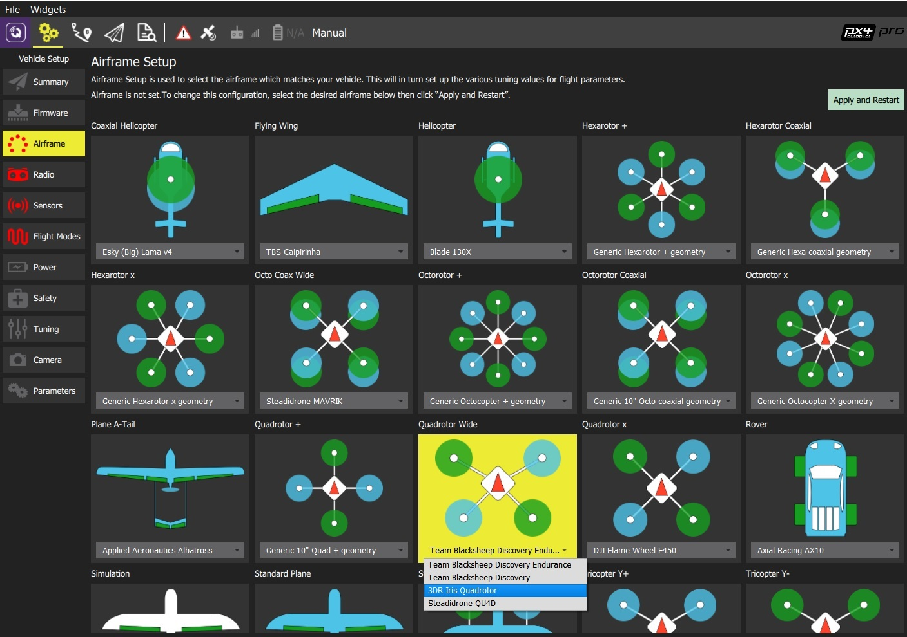

# Airframe Setup

펌웨어를 설치 한 후 당신의 특정 기체 </ 0>에 맞는 펌웨어 매개 변수를 구성해야합니다.
 

## 기체(항공기) 설정

기체 설정하기

1. *QGroundControl *을 시작하고 차량을 연결합니다.
2. 상단 툴바에서 ** 기어 </ 0> 아이콘 (차량 설정) 을 선택한 다음 사이드 바에서 ** 기체 </ 0>를 선택하십시오. </li> 
    
    * 당신의 기체와 일치하는 넓은 차량 그룹/유형을 선택한 다음 그룹 내의 드롭 다운을 사용하여 자신의 차량과 가장 일치하는 기체를 선택하십시오.
        
        
        
        위의 예는 * Quadrotor Wide </ 0> 그룹에서 선택된 * 3DR Iris Quadrotor </ 0>입니다.
</li> 
        
        * ** 적용을 클릭한 후 다시 시작</ 0>을 클릭하십시오. 다음 명령에서 ** 적용 </ 0>을 클릭하여 설정을 저장하고 차량을 다시 시작하십시오.
 
            
            </li> </ol> 
            
            ## 추가 정보
            
            * [QGroundControl 사용자 안내서 > Airframe](https://docs.qgroundcontrol.com/en/SetupView/Airframe.html)
            *  PX4 설치 비디오 - @ 37s </ 0> (Youtube)</li> </ul>