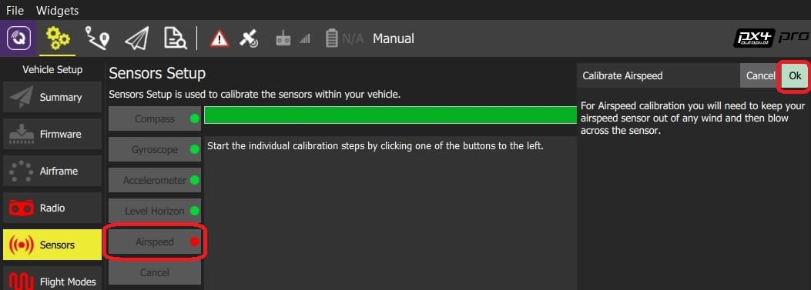

# 대기속도 캘리브레이션

대기 속도 캘리브레이션은 오프셋을 결정하기 위해 대기 속도가 0 인 안정된 기준선을 읽어야합니다. 바람을 막기 위해 피톳 튜브를 손을 둥글게 감아 막고(만약 실내에서 캘리브레이션을 진행한다면 하지 않아도 됩니다), 튜브를 입으로 불어 주십시오(바람을 불어서 캘리브레이션 완료 신호를 보냅니다).

:::note
Fixed Wing and VTOL vehicles usually have an airspeed sensor.
:::

## 캘리브레이션 수행

To calibrate the airspeed sensor:

1. *QGroundControl *을 시작하고 기체에 연결합니다.
2. 상단 툴바에서 **톱니바퀴** 아이콘(기체 설정)을 선택한 다음 사이드 바에서 **센서**를 선택하십시오.
3. **대기속도** 센서 버튼을 클릭합니다.
    
    

4. 센서로 부는 바람을 막으십시오 (예: 손을 컵 모양으로 감쌀 수 있습니다). 피톳 튜브의 구멍을 막지 않도록 주의하십시오.

5. **확인**을 눌러 캘리브레이션을 시작하십시오.
6. 피톳 튜브의 끝에 입으로 바람을 불어 캘리브레이션 완료 신호를 보내십시오.
    
:::tip
Blowing into the tube is also a basic check that the dynamic and static ports are installed correctly. If they are swapped then the sensor will read a large negative differential pressure when you blow into the tube, and the calibration will abort with an error.
:::

7. 덮개를 제거하기 전에 2-3초간 기다립니다(몇 초 후 캘리브레이션이 자동으로 완료됩니다).

## 시험

After calibration a quick test is to press your finger against the tip of the pitot and hold it. You should see the system read and hold a positive airspeed until you release.

## 추가 정보

* [QGroundControl 사용 설명서 > 센서](https://docs.qgroundcontrol.com/en/SetupView/sensors_px4.html#airspeed)