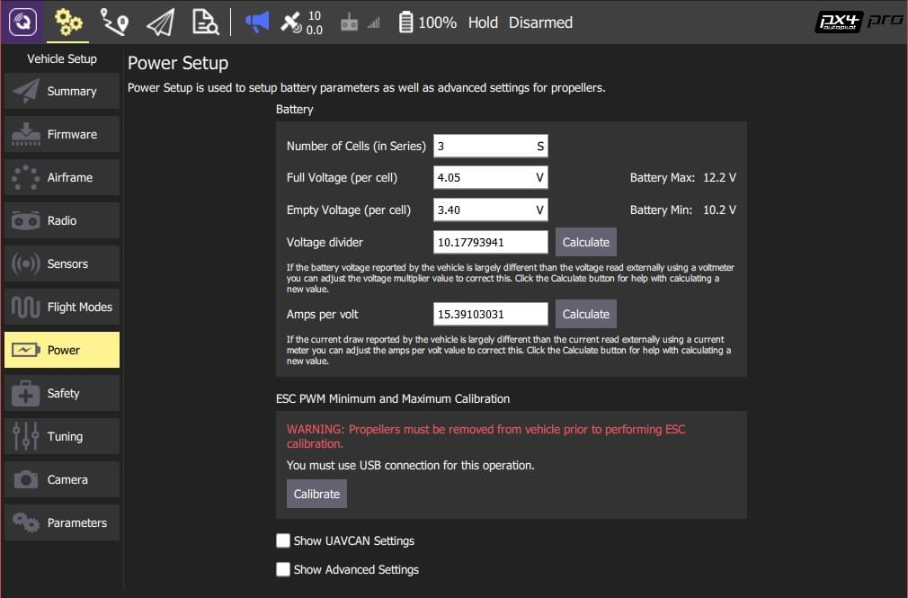

# 배터리 파워 모듈 설정

전원 설정 방법에 대하여 설명합니다.

:::note PX4의 배터리 모니터링은 호환되는 하드웨어에서 사용할 수 있습니다. 대부분의 경우 배터리 전압을 측정하는 전원 모듈을 의미하며, 배터리와 차량 사이의 전류도 측정 할 수 있습니다.
:::

## 개요

전원 설정의 목표는 배터리 잔량 비율 및 용량을 정확하게 추정하여 기체의 전원이 부족하여 충돌 사고가 발생하지 않도록 하는 것입니다 (또는 배터리가 과방 전으로 인해 손상되는 경우).

PX4는 여러가지 효과적인 용량 추정 방법을 제공합니다.

1. [기본 배터리 설정](#basic_settings) (기본값) : 측정 원시 전압이 "최저" 전압과 "최고"전압의 범위와 비교됩니다. 측정 전압 (및 해당 용량)은 부하시 변동으로 인하여 대략적인 추정치입니다.
2. [부하 보상을 통한 전압 기반 추정](#load_compensation) : 부하가 용량 계산에 미치는 영향을 고려합니다.
3. [전류 통합을 사용한 전압 기반 추정](#current_integration) : 사용 가능한 용량에 대한 부하 보상 전압 기반 추정값을 소비된 충전의 전류 기반 추정과 융합합니다. 그 결과 스마트 배터리와 비슷한 용량 추정치를 얻을 수 있습니다.

기타 다른 방법들은 이 방법들을 응용한 것입니다. 사용하는 접근 방식은 차량의 전원 모듈이 전류를 측정 가능 여부에 따라 다릅니다.

:::note
아래 지침은 배터리 1 보정 매개 변수를 참조합니다 : `BAT1 _*`. 다른 배터리는 `BATx_*` 매개 변수를 사용합니다. 여기서 `x`는 배터리 번호입니다. 모든 배터리 보정 매개 변수가 [여기에](../advanced_config/parameter_reference.md#battery-calibration) 나열됩니다.
:::

:::tip
여기에서 설명하는 PX4 구성 외에도 ESC의 저전압 차단이 비활성화되거나 예상 최소 전압 아래로 설정되어 있는지 확인하여야 합니다. 이렇게하면 PX4에서 배터리 오류 안전 동작을 관리하고 배터리가 충전되어있는 동안 ESC가 차단되지 않도록합니다 (선택한 "빈 배터리"설정에 따라).
:::

:::tip
아래의 [배터리 유형 비교](#battery-type-comparison)는 기본 배터리 유형 간의 차이점과 배터리 설정에 미치는 영향을 설명합니다.
:::

## 기본 배터리 설정 (기본값)

기본 배터리 설정은 용량 추정 기본 방법을 사용하도록 PX4를 구성합니다. 이 방법은 측정 된 원시 배터리 전압을 "빈"셀과 "충전"셀 (셀 수에 따라 조정 됨)에 대한 셀 전압 범위와 비교합니다.

:::note
이 접근 방식은 측정 전압이 부하 상태에서 변함에 따라 추정된 전하의 변동으로 인하여 상대적으로 대략적인 추정치를 계산합니다.
:::

배터리 1의 기본 설정 방법

1. *QGroundControl*을 시작하고 기체를 연결합니다.
2. 상단 도구 모음에서 **톱니 바퀴** 아이콘(기체 설정)을 선택한 다음 가장자리 표시줄에서 **파워**를 선택하십시오.

배터리 특성을 나타내는 기본 설정이 제공됩니다. 아래 섹션에서는 각 필드에 대해 설정할 값들을 설명합니다.

:::note
*QGroundControl*을 설정시에 이 보기에서 배터리 1에 대한 값만을 설정할 수 있습니다. 배터리가 여러 개인 경우에는 다음 섹션에 설명 된대로 배터리 2 (`BAT2_*`)에 대한 [매개 변수를 직접 설정](../advanced_config/parameters.md) 하여야 합니다.
:::

### 셀의 갯수(직렬 연결)

이것은 배터리에 직렬로 연결된 셀 수를 설정합니다. 일반적으로 배터리에 "S"앞에 숫자로 표시합니다 (예 : "3S", "5S").

:::note
단일 갈바닉 배터리 셀의 전압은 배터리 유형의 화학적 특성에 따라 달라집니다. 리튬 폴리머(LiPo) 배터리와 리튬 이온 배터리는 모두 3.7V의 동일한 *이름의* 셀 전압을 갖습니다. 더 높은 전압(기체에 효율적인 전력을 공급함)을 공급하기 위하여 여러개의 셀이 *직렬로*로 연결됩니다. 터미널의 배터리 전압은 셀 전압의 배수입니다.
:::

셀 개수가 제공되지 않은 경우 배터리 전압을 단일 셀의 공칭 전압으로 나누어 계산할 수 있습니다. 아래의 표는 배터리의 전압-셀 관계를 나타냅니다.

| 셀  | LiPo (V) | LiIon (V) |
| -- | -------- | --------- |
| 1S | 3.7      | 3.7       |
| 2S | 7.4      | 7.4       |
| 3S | 11.1     | 11.1      |
| 4S | 14.8     | 14.8      |
| 5S | 18.5     | 18.5      |
| 6S | 22.2     | 22.2      |

:::note
이 설정은 [매개 변수](../advanced_config/parameters.md) : [BAT1_N_CELLS](../advanced_config/parameter_reference.md#BAT1_N_CELLS) 및 [BAT2_N_CELLS](../advanced_config/parameter_reference.md#BAT2_N_CELLS)에 해당합니다.
:::

### 충전 완료 전압 (셀당)

이렇게하면 각 셀의 *공칭* 최대 전압(셀이 "최대"로 간주되는 최저 전압)이 설정됩니다.

이 값은 배터리의 공칭 최대 셀 전압보다 약간 낮게 설정해야하지만, 비행 몇 분 후에도 예상 용량이 100 %가 될 정도로 낮지 않아야 합니다.

사용할 적절한 값은 다음과 같습니다.

- **LiPo:** 4.05V (*QGroundControl*의 기본값)
- **LiIon:** 4.05V

:::note
전체 배터리의 전압은 충전 후 시간이 지남에 따라 약간 떨어질 수 있습니다. 최대 값보다 약간 낮게 설정하여 이 하락값을 보정합니다.
:::

:::note
이 설정은 [매개 변수](../advanced_config/parameters.md) : [BAT1_V_CHARGED](../advanced_config/parameter_reference.md#BAT1_V_CHARGED) 및 [BAT2_V_CHARGED](../advanced_config/parameter_reference.md#BAT2_V_CHARGED)에 해당합니다.
:::

### 방전 전압 (셀 당)

이는 각 셀의 공칭 최소 안전 전압을 설정합니다(이 전압 미만을 사용하면 배터리가 손상 될 수 있음).

:::note
배터리가 비어있을을 설정하는 단일 값은 없습니다. 너무 낮은 값을 선택하면 과방전으로 인해 배터리가 손상될 수 있습니다 (그리고, 기체 충돌이 발생할 수 있습니다). 너무 높은 값을 선택하면 비행 시간이 줄어들게 됩니다.
:::

최소 셀당 전압에 대한 경험 규칙

| 단계                   | LiPo (V) | LiIon (V) |
| -------------------- | -------- | --------- |
| 보수적 (무부하 전압)         | 3.7      | 3         |
| "실제"최소값 (부하/비행 중 전압) | 3.5      | 2.7       |
| 배터리 손상 (부하 전압)       | 3.0      | 2.5       |

:::tip
안전을 위하여 배터리를 빨리 재충전할수록 더 좋습니다. 배터리를 오랜 기간 사용할 수 있습니다.
:::

:::note
이 설정은 [매개 변수](../advanced_config/parameters.md) : [BAT1_V_EMPTY](../advanced_config/parameter_reference.md#BAT1_V_EMPTY) 및 [BAT2_V_EMPTY](../advanced_config/parameter_reference.md#BAT2_V_EMPTY)에 해당합니다.
:::

### 전압 분배기

전원 모듈과 비행 컨트롤러의 ADC를 통해 전압을 측정하는 차량이있는 경우 보드 당 한 번씩 측정을 확인하고 보정하여야 합니다. 보정 작업에는 멀티 미터가 필요합니다.

분배기를 보정하는 가장 쉬운 방법은 *QGroundControl*을 사용하고 [설정 > 전원 설정](https://docs.qgroundcontrol.com/en/SetupView/Power.html) (QGroundControl 사용 설명서)에 대한 단계별 가이드를 따르는 것입니다.

:::note
이 설정은 [BAT1_V_DIV](../advanced_config/parameter_reference.md#BAT1_V_DIV) 및 [BAT2_V_DIV](../advanced_config/parameter_reference.md#BAT2_V_DIV) 매개 변수에 해당합니다.
:::

### 볼트 당 암페어

:::tip
기본 구성 (부하 보상 없음 등)을 사용하는 경우에는이 설정이 필요하지 않습니다.
:::

[전류 기반 부하 보상](#current_based_load_compensation) 또는 [전류 통합](#current_integration)을 사용하는 경우 전압 분배기 당 암페어를 보정하여야 합니다.

분배기를 보정하는 가장 쉬운 방법은 *QGroundControl*을 사용하고 [설정 > 전원 설정](https://docs.qgroundcontrol.com/en/SetupView/Power.html) (QGroundControl 사용 설명서)에 대한 단계별 가이드를 따르는 것입니다.

:::note
이 설정은 [BAT1_A_PER_V](../advanced_config/parameter_reference.md#BAT1_A_PER_V) 및 [BAT2_A_PER_V](../advanced_config/parameter_reference.md#BAT2_A_PER_V) 매개 변수에 해당합니다.
:::

## 부하 보상을 통한 전압 기반 추정

:::note
부하 보상값을 적절하게 설정하면 배터리 용량 추정의 전압이 훨씬 더 안정적이며 상하강 비행시 값의 변화가 적습니다.
:::

부하 보상은 [기본 구성](#basic_settings)을 사용할 때 발생하는 부하시 측정 된 전압/예상 용량의 변동에 대응하려고 합니다. 이는 *무부하* 배터리의 전압을 추정하고 남은 용량을 추정하기 위해 해당 전압 (측정 된 전압 대신)을 사용하여 작동합니다.

:::note
부하 보상을 사용하려면 [기본 구성](#basic_settings)을 설정하여야 합니다. *빈 전압* ([BAT_V_EMPTY](../advanced_config/parameter_reference.md#BAT_V_EMPTY))은 보상 된 전압이 추정에 사용되기 때문에 (보상없는 경우보다) 더 높게 설정해야합니다 (일반적으로 다음 경우에 예상되는 나머지 셀 전압보다 약간 낮은 값으로 설정).
:::

PX4는 아래 두 매개 변수 중 하나를 [설정](../advanced_config/parameters.md)하여 활성화되는 두 가지 부하 보상 방법을 지원합니다.

- [BAT1_R_INTERNAL](../advanced_config/parameter_reference.md#BAT1_R_INTERNAL) - [전류 기반 부하 보상](#current_based_load_compensation) (권장).
- [BAT1_V_LOAD_DROP](../advanced_config/parameter_reference.md#BAT1_V_LOAD_DROP) - [추력 기반 부하 보상](#thrust_based_load_compensation).

### 전류 기반 부하 보상 (권장되는 방식)

이 부하 보상 방법은 부하를 결정하기 위해 전류를 측정합니다. [추력 기반 부하 보상](#thrust_based_load_compensation)보다 훨씬 정확하지만 전류 센서가 필요합니다.

이 기능을 활성화하려면

1. 매개 변수 [BAT1_R_INTERNAL](../advanced_config/parameter_reference.md#BAT1_R_INTERNAL)을 배터리 1의 내부 저항으로 설정합니다 (다른 배터리에 대해서도 반복).
  
:::tip
배터리의 내부 저항을 측정 할 수있는 LiPo 충전기가 있습니다. 일반적인 값은 셀당 5mΩ이지만 방전 전류 등급, 수명 및 셀 상태에 따라 달라질 수 있습니다.
:::

2. 기본 설정 화면에서 [전압 분배기당 전류값](#current_divider)을 보정해야합니다.

### 추력 기반 부하 보상

이 부하 보상 방법은 모터에 할당된 총 추력을 기준으로 부하를 추정합니다.

:::caution
이 방법은 추력 명령과 전류 사이에 지연이 있고 추력이 전류에 선형 적으로 비례하지 않기 때문에 정확하지 않습니다. 차량에 전류 센서가있는 경우에는 [전류 기반 부하 보상](#current_based_load_compensation) 방법을 사용하십시오.
:::

이 기능을 활성화하려면

1. 매개 변수 [BAT1_V_LOAD_DROP](../advanced_config/parameter_reference.md#BAT1_V_LOAD_DROP)를 최대 추력 부하에서 셀에 표시되는 전압 강하량으로 설정합니다.

## 전류 통합과 융합된 전압 기반 추정

:::note
이것은 상대적 배터리 소모량을 측정하는 가장 정확한 방법입니다. 부팅시마다 새로 충전한 배터리를 정확하게 설정하면 추정 품질이 스마트 배터리의 품질과 비슷해질 것입니다 (이론적으로 정확한 남은 비행 시간 추정이 가능합니다).
:::

이 방법은 사용 가능한 용량에 대한 전압 기반 추정치를 소비 된 충전의 전류 기반 추정치와 *융합*하여 남은 배터리 용량을 평가합니다. 전류를 정확하게 측정할 수있는 하드웨어가 필요합니다.

이 기능을 활성화하려면

1. 먼저 [전류 기반 부하 보상](#current_based_load_compensation)을 사용하여 정확한 전압 추정을 설정합니다.
  
:::tip
[전압 분배기 당 전류](#current_divider) 설정 보정 포함.
:::

2. 매개 변수 [BAT1_CAPACITY](../advanced_config/parameter_reference.md#BAT1_CAPACITY)를 라벨에 인쇄된 배터리 용량의 약 90 %로 설정합니다.
  
:::note
이 값을 너무 높게 설정하지 마십시오. 예상치가 잘못되거나 예상 용량이 갑자기 떨어질 수 있습니다.
:::

* * *

**추가 정보**

시간이 지남에 따라 소비된 전하의 추정치는 측정된 전류를 수학적으로 통합하여 생성됩니다 (이 접근법은 매우 정확한 소비 에너지의 추정치를 제공합니다).

시스템 시작시 PX4는 먼저 전압 기반 추정치를 사용하여 초기 배터리 충전량을 결정합니다. 그런 다음이 추정치를 현재 통합의 값과 융합하여 더 나은 추정치를 제공합니다. 융합된 각 추정치에 배치된 상대값은 배터리 상태에 따라 달라집니다. 배터리가 비워 질수록 전압 기반 추정치가 더 많이 융합됩니다. 이는 과방전을 방지합니다 (예 : 잘못된 용량으로 구성되었거나, 초기치가 잘못 되었기 때문).

항상 정상적인 전체 배터리로 시작하는 경우이 방법은 스마트 배터리에서 사용하는 방법과 유사합니다.

:::note
전류 통합은 *초기* 용량을 결정할 수있는 방법이 없기 때문에 자체적으로 (전압 기반 추정없이) 사용할 수 없습니다. 전압 추정을 사용하면 초기 용량을 추정하고 가능한 오류에 대한 지속적인 피드백을 제공할 수 있습니다 (예 : 배터리에 결함이 있거나 다른 방법을 사용하여 계산 된 용량간에 불일치가있는 경우).
:::

## 매개 변수 마이그레이션 참고 사항

PX4 v1.10 이후 다중 배터리 지원이 추가되어 `BAT_` 접두사가있는 모든 이전 매개 변수에 해당하는 접두사 `BAT1_`이있는 새 매개 변수가 생성되었습니다. `BAT_` 및 `BAT1_`에 대한 변경 사항은 현재 동기화되어 있습니다.

- 이전 매개 변수 또는 새 매개 변수가 변경되면 값이 다른 매개 변수에 복사됩니다 (양방향으로 동기화 된 상태로 유지됨).
- 부팅시 이전 새 매개 변수가 다른 경우 이전 `BAT_` 매개 변수의 값이 새 `BAT1_` 매개 변수에 복사됩니다.

## 배터리 유형 비교

이 섹션에서는 여러가지 유형의 배터리(특히 LiPo 및 Li-Ion)를 개략적으로 비교합니다.

### 개요

- Li-Ion 배터리는 LiPo 배터리 팩보다 에너지 밀도가 높지만, 방전율이 낮아지고 배터리 비용이 비쌉니다.
- LiPo 배터리는 쉽게 구할 수 있으며, 다중 로터 항공기에서 흔히 볼 수 있는 높은 방전율을 견딜수 있습니다.
- 비행기의 종류와 임무에 따라 선택하여야 합니다. 리튬이온 배터리가 내구성에 이점이 많지만, 조심하여 사용하여야 합니다. 따라서 비행 목적과 상황에 따라 결정하여야합니다.

### 장점

LiPo

- 보편적으로 사용됨.
- 다양한 크기, 용량 및 전압
- 저렴한 가격
- 용량 대비 높은 방전율 (높은 C 등급)
- 높은 충전율

Li-Ion

- 높은 에너지 밀도 (최대 60 % 더 높음)

### 단점:

LiPo

- 낮은 에너지 밀도(상대적임) 
- 공급 업체가 많아지면 품질이 높아질 것입니다.

Li-Ion

- 일반적으로 사용되지 않음.
- 가격이 비쌈.
- 대형 기체에서는 널리 사용되지 않음
- 모든 셀은 상대적으로 작기 때문에 더 큰 팩은 필요한 전압과 용량을 생성하기 위해 직렬 및 병렬로 연결된 많은 셀로 구성됩니다.
- 배터리 크기에 비해 낮은 방전율 (C 등급)
- 고전류가 필요한 차량에 적용하기 어렵습니다.
- 낮은 충전 속도 (용량 대비)
- 충전과 방전시에 면밀한 온도 모니터링이 필요합니다.
- 최대 용량을 사용하려면 ESC에서 설정을 변경해야합니다 ( "표준"ESC 저전압 설정이 너무 높음).
- 거의 비었을 때 배터리의 전압은 Lipo와 Li-ion 사이에 ~ 3V 차이가있을 수 있습니다 (6S 배터리 사용시). 추력 기대치에 영향을 미칠 수 있습니다. 

### C 등급

- C 등급은 단순히 모든 배터리 유형의 명시된 용량의 배수입니다.
- C 등급은 충전 및 방전 속도와 관련이 있으며 다릅니다. 
  - 예를 들어, 방전율이 10C 인 2000mAh 배터리 (전압에 관계없이)는 20A의 전류 (2000 / 1000 = 2Ah x 10C = 20A)를 안전하고 지속적으로 방전할 수 있습니다.
- C 등급은 항상 제조업체에서 제공합니다 (종종 배터리 팩 외부에 있음). 정확한 값을 계산할 수 있지만 추가 정보가 필요하고 베터리 셀의 내부 저항을 측정해야합니다.
- LiPo 배터리는 항상 리튬이온 배터리보다 높은 C 등급을 갖습니다. 이는 화학적 성질과 셀당 내부 저항으로 인하여 LiPo 배터리의 방전 속도가 더 높습니다.
- C 등급의 충전 및 방전에 대한 제조업체 지침을 준수하는 것은 배터리의 상태와 기체를 안전하게 작동하는 데 매우 중요합니다 (예 : 충전 및 방전 중 화재, "퍼핑"팩 및 기타 차선 상태).

### 에너지 밀도

- 에너지 밀도는 배터리 중량당 저장할 수 있는 에너지의 양입니다. 일반적으로 킬로그램 당 와트시(Wh/Kg)로 측정/비교 됩니다. 
  - 와트시는 공칭(완전 충전 된 전압이 아님)에 용량을 곱한 값으로 간단히 계산됩니다. 3.7v X 5 Ah = 18.5Wh. 3 셀 배터리 팩이있는 경우 팩은 18.5Wh X 3 = 55Wh의 저장 에너지가 됩니다.
- 배터리 무게를 고려하면 와트시를 무게로 나누어 에너지 밀도를 계산합니다. 
  - 예 : 55Wh 나눈 값 (그램 단위의 배터리 무게를 1000으로 나눈 값). 이 배터리의 무게가 300g이고 55/(300/1000)=185 Wh/Kg라고 가정합니다.
- 이 숫자 185 Wh/Kg는 최고급 LiPo 배터리의 수치입니다. 반면에 리튬 이온 배터리는 260Wh/Kg에 달할 수 있습니다. 즉, 온보드 배터리 1kg 당 75 와트시를 더 사용가능합니다. 
  - 차량이 비행하는 데 걸리는 와트 (배터리 전류 모듈이 표시 할 수 있음)를 알고 있다면, 이 증가 된 저장 용량을 추가 중량없이 비행 시간 증가와 동일시 할 수 있습니다.