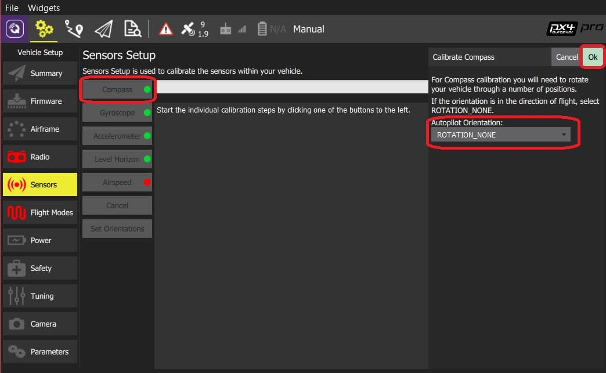

# 나침반 보정

나침반 보정은 내부 및 외부 [나침반 센서](../gps_compass/README.md)들을 설정합니다. *QGroundControl*에서 차량을 설정 방향으로 배치하고, 지정된 축을 기준으로 차량을 회전하도록 안내합니다.

You will need to calibrate your compass on first use, and you may need to recalibrate it if the vehicles is ever exposed to a very strong magnetic field, or if it is used in an area with abnormal magnetic characteristics.

:::note
If you are using an external magnetometer/compass (or a compass integrated into a GPS module) make sure it is [mounted](../assembly/mount_gps_compass.md) as far as possible from other electronics and in a *supported orientation*. Instructions for *connecting* your GPS+compass can be found in [Basic Assembly](../assembly/README.md) for your specific autopilot hardware. Once connected, *QGroundControl* will automatically detect the external magnetometer.
:::

:::tip
Indications of a poor compass calibration include multicopter circling during hover, toilet bowling (circling at increasing radius/spiraling-out, usually constant altitude, leading to fly-way), or veering off-path when attempting to fly straight.
:::

## 보정 방법 

The calibration steps are:

1. 큰 금속 물체등과 같이 자기장이 강한 곳에서 멀리 떨어진 위치를 선택하십시오. :::tip 금속이 많은 장소는 보정 작업에 적당하지 않습니다. 사무실 테이블 위에서나 (종종 금속 막대 포함) 또는 차량 옆에서 보정하지 마십시오. 철근이 고르지 않게 분포된 콘크리트 슬래브 근처 장소들도 보정에 영향을 미칠 수 있습니다.
:::
2. *QGroundControl*을 시작하고 드론에 연결합니다.
3. 상단 도구 모음에서 **톱니 바퀴** 아이콘(기체 설정)을 선택한 다음 가장자리 표시줄에서 **센서**를 선택하십시오.
4. **나침반** 센서 버튼을 클릭합니다.
    
    
    
:::note
이 작업 이전에 [비행콘트롤러 방향](../config/flight_controller_orientation.md)을 미리 설정하여야 합니다. 미리 설정하지 않았다면, 여기에서 설정할 수 있습니다.
:::

5. **확인**을 눌러 보정작업을 시작합니다.

6. 기체를 아래에 표시된 자세로 놓고 그대로 유지해주십시오 메시지가 표시되면(방향 이미지가 노란색으로 변함) 기체를 지정축을 기준으로 한 방향으로 회전시킵니다. 현재 방향에 대해 보정이 완료되면 화면의 그림이 녹색으로 바뀝니다.
    
    

7. 드론의 모든 방향에 대해 보정 과정을 반복합니다. 

Once you've calibrated the vehicle in all the positions *QGroundControl* will display *Calibration complete* (all orientation images will be displayed in green and the progress bar will fill completely). You can then proceed to the next sensor.

## 추가 정보

* [Peripherals > GPS & Compass > Compass Configuration](../gps_compass/README.md#compass-configuration)
* [QGroundControl User Guide > Sensors](https://docs.qgroundcontrol.com/en/SetupView/sensors_px4.html#compass)
* [PX4 Setup Video - @2m38s](https://youtu.be/91VGmdSlbo4?t=2m38s) (Youtube)
* [Compass Power Compensation](../advanced_config/compass_power_compensation.md) (Advanced Configuration)