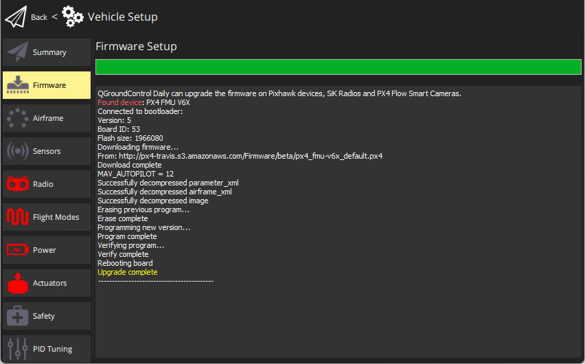

# 펌웨어 설치 및 업데이트

*QGroundControl* **데스크톱** 버전에서 [Pixhawk 시리즈](../getting_started/flight_controller_selection.md) 비행 콘트롤러의 PX4 펌웨어를 설치할 수 있습니다.

:::warning
**펌웨어 설치를 시작하기 전에** 직접 또는 텔레메트리 연결을 포함한 기체의 모든 USB 연결을 *해제*하여야 합니다. 기체에 배터리를 연결하지 *않아야* 합니다.
:::

## PX4 안정 버전 설치

가장 최근에 출시된 PX4 버전은 알려진 버그들이 수정되었으며, 최신 기능을 지원합니다.

:::tip
안정 버전은 기본적으로 설치되는 버전입니다.
:::

PX4 설치

1. *QGroundControl*을 시작하고 기체에 연결합니다.
1. *펌웨어 설정*을 오픈하여 사이드바의 **"Q" icon > Vehicle Setup > Firmware**을 선택하십시오.

   

1. USB를 통해 비행 콘트롤러를 컴퓨터에 직접 연결합니다.

:::note

주컴퓨터에서 전원이 공급되는 USB 포트에 직접 연결합니다(USB 허브로 연결하지 마십시오).
:::

1. Select the **PX4 Pro Stable Release vX.x.x** option to install the latest stable version of PX4 *for your flight controller* (autodetected).

   

1. 업데이트를 시작하려면 **OK** 버튼을 클릭합니다.

   펌웨어가 업그레이드(펌웨어 다운로드, 이전 펌웨어 삭제 등)를 진행합니다. 각 단계 화면을 표출하고, 전체 진행률이 표시줄에 출력됩니다.

   

   펌웨어의 업로드가 완료되면, 장치가 재부팅되고 다시 연결됩니다.

:::tip
*QGroundControl* FMUv2 대상 설치(설치 하는 동안 콘솔 참조) 하고 새로운 보드, 비행 콘트롤러에서 모든 메모리를 액세스 하려면 [부트 로더를 업데이트](#bootloader) 하여야 합니다.
:::

다음으로 [기체 프레임](../config/airframe.md)을 지정하여야 합니다(그리고 센서, 라디오 등).

## Installing PX4 Main, Beta or Custom Firmware

다른 버전의 PX4 설치

1. Connect the vehicle as above, and select **PX4 Pro Stable Release vX.x.x**. 
1. **고급 설정**을 선택하고 드롭 다운 목록에서 설치할 버전을 선택합니다.
   - **표준 버전 (안정) :** 기본 버전 (즉, 설치를 위해 고급 설정을 사용할 필요가 없습니다!)
   - **베타 테스트 (베타):** 베타/후보 버전입니다. 신규 버전 출시 이전에 테스트 할 경우에만 사용할 수 있습니다.
   - **Developer Build (master):** The latest build of PX4/PX4-Autopilot _main_ branch.
   - **사용자 지정 펌웨어 파일 ... :** 사용자 지정 펌웨어 파일 (예 : 로컬에서 빌드 한 파일). 사용자 정의 펌웨어 파일을 선택한 경우 다음 단계에서 파일 시스템에서 사용자 정의 펌웨어를 선택하여야 합니다.

그러면 펌웨어 업데이트가 이전과 같이 계속됩니다.

## Bootloader Update

Pixhawk hardware usually comes with an appropriate bootloader version pre-installed.

A case where you may need to update is newer Pixhawk boards that install FMUv2 firmware. 다른 버전의 PX4 설치

You can update it by following the instructions in [Bootloader update > FMUv2 Bootloader Update](../advanced_config/bootloader_update.md#fmuv2-bootloader-update).

## 추가 정보

* [QGroundControl User Guide > Firmware](https://docs.qgroundcontrol.com/master/en/SetupView/Firmware.html).
* [PX4 설정 비디오](https://youtu.be/91VGmdSlbo4) (유튜브)
