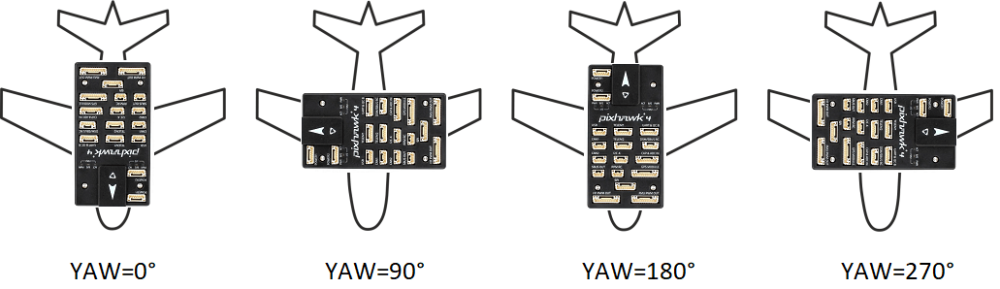

# 비행 컨트롤러와 센서의 방향

기본적으로 비행 컨트롤러와 외장 나침반 센서는 윗면이 위를 향하고 화살표가 기체 정면을 향하도록 기체에 장착되어야 합니다. 보드나 외장 나침반 센서가 다른 방향으로 설치된 경우에는 펌웨어에서 해당 방향을 추가로 설정하여야 합니다.

## 방향 알아내기

비행 컨트롤러의 ROLL, PITCH 및 YAW 오프셋은 기체의 전진 (x), 오른쪽 (y), 아래 (z) 축을 중심을 기준으로 계산됩니다.

회전 축은 한 회전 단계에서 다음 단계까지 동일하게 유지됩니다. 따라서 회전을 수행하는 프레임은 고정되어 있습니다. 이를 *외부 회전*이라고도합니다.

예를 들어, 아래에 표시된 기체는 z축을 중심으로 각각 다음과 같이 회전합니다: `ROTATION_NONE`, `ROTATION_YAW_90`,`ROTATION_YAW_180`,`ROTATION_YAW_270`.

:::note VTOL
Tailsitter 기체의 경우 모든 센서 보정에 대해 멀티 로터 구성 (즉, 차량에 대한 상대적인 이륙, 이륙, 호버링, 착륙)에 따라 차량 방향을 설정합니다.

축은 일반적으로 전진 비행 중에는 차량의 방향에 상대적입니다. 자세한 정보는 [기본 개념](../getting_started/px4_basic_concepts.md#heading-and-directions)편을 참고하십시오.
:::

## 방향 설정

방향을 설정하려면:

1. *QGroundControl *을 시작하고 기체를 연결합니다.
2. 상단 툴바에서 **톱니바퀴** 아이콘(기체 설정)을 선택한 다음 사이드 바에서 **센서**를 선택하십시오.
3. **방향 설정** 버튼을 클릭합니다. 
4. **비행 컨트롤러 방향**을 선택합니다([위에서 계산한 방법](#calculating-orientation)대로 선택하십시오).
    
    

5. 동일한 방법으로 **외부 나침반 방향 **을 선택합니다(이 선택 사항은 기체에 외부 나침반이 있을 때에만 표시됩니다).

6. **확인**을 누릅니다.

## 미세 조정

[수평 보정](../config/level_horizon_calibration.md)을 사용하여 컨트롤러 방향에서 작은 정렬 에러를 보정하고 비행 보기에서 수평을 조정할 수 있습니다.

## 추가 정보

* [고급 방향 튜닝](../advanced_config/advanced_flight_controller_orientation_leveling.md) (고급 사용자)
* [QGroundControl 사용 설명서 > 센서](https://docs.qgroundcontrol.com/en/SetupView/sensors_px4.html#flight_controller_orientation)