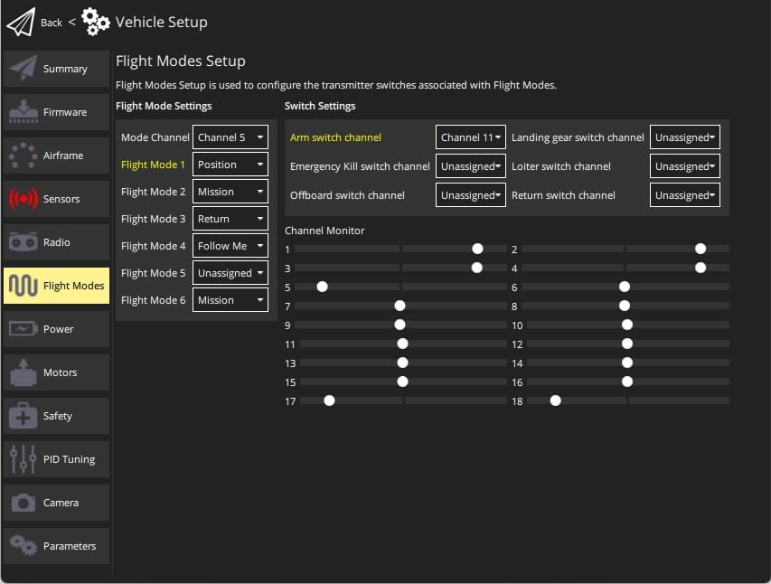

# 비행 모드 설정

[비행 모드](../flight_modes/README.md)는 임무 또는 기내 (보조 컴퓨터) 제어를 통해 다양한 유형의 *자동 조종 장치 지원 비행*과 *완전 자율 비행*을 제공합니다. 다양한 비행 모드를 통해 사용자는 기본 RC 비행 보다 더욱 편리한 플랫폼에서의 비행법을 배울 수 있습니다. 또한, 이륙, 착륙 및 출발지 복귀와 같은 작업을 자동화할 수 있습니다.

PX4를 사용하면 지상국(태블릿 또는 데스크톱) 프로그램이나 무선 조종기에서 비행 모드를 선택할 수 있습니다. 무선 조종기와 태블릿이 모두 연결된 경우 두 시스템 중 하나가 모드를 변경하여 이전 설정을 변경하게 됩니다.

무선 제어 송신기의 스위치에서 비행 모드를 매핑하는 방법을 설명합니다.

:::tip
비행 모드를 설정하려면 이전에 [무선 조종기 설정](../config/radio.md)을 하여야 합니다.
:::

## 어떤 비행 모드를 설정해야 합니까?

[여기에 설명된](../flight_modes/README.md) 비행 모드를 설정하거나 설정하지 않을 수 있습니다.

초보 사용자는 편리한 비행을 위하여 다음 모드 중 하나를 설정하는 것이 좋습니다.

* **Stabilized** - 뒤집히기 어려운 기체에서 스틱이 풀린 상태에서도 수평을 유지합니다 (그러나 위치를 고정할 수는 없습니다).
* **포지션** - 스틱을 놓으면 기체가 그 위치에서 멈춥니다(그리고 부는 바람에 대한 위치를 유지함).
* **고도** - 상승 및 하강이 최대 속도로 제어됩니다.

스위치를 아래와 같이 일반적으로 매핑합니다.

* [복귀](../flight_modes/return.md) - 차량을 안전한 높이로 상승한 다음에 이륙 위치로 되돌아갑니다.
* [미션](../flight_modes/mission.md) - 지상관제소에서 보낸 사전 프로그래밍된 미션을 실행합니다.
*  [킬 스위치](../config/safety.md#kill_switch) - 모든 모터 출력을 즉시 중지합니다. 기체가 충돌하는 상황에서는 계속 비행하는 것보다 사고를 방지할 수 있습니다.

## 다중 채널과 단일 채널 모드 선택

*PX4* (*QGroundControl*)은 비행 모드를 송신기 스위치/다이얼에 매핑하는 두 가지 모드를 지원합니다.

* **단일 채널 모드 선택 :** 최대 6 개의 비행 모드를 할당하여 단일 채널에 인코딩 된 위치를 전환합니다.
* **다중 채널 모드 선택 :** 하나 이상의 채널에서 인코딩된 위치를 전환하는 모드를 할당합니다. 일부 모드는 채널을 공유하도록 하드 코딩되거나 다른 모드 선택에 따라 자동으로 설정됩니다 (다중 채널 모드 선택의 동작이 때때로 혼동 될 수 있음). 

:::tip
권장되는 접근 방식은 이해와 구성이 쉽기 때문에 *단일 채널 모드 선택*입니다.
:::

## 단일 채널 비행 모드 선택

단일 채널 선택 모드를 사용하면 "모드"채널을 지정하고 채널의 PWM 값에 따라 활성화되는 최대 6 개의 비행 모드를 선택할 수 있습니다. 킬 스위치 매핑, 시작 모드로 돌아 가기 및 오프 보드 모드를위한 채널을 별도로 지정할 수도 있습니다.

:::note
이 접근 방식을 사용하려면 먼저 모드 스위치의 물리적 위치를 단일 채널로 인코딩하도록 *송신기*를 구성하여야 합니다. 많이 사용하는 *Taranis* 송신기에 대한 비디오 가이드를 [아래](#taranis_setup)에서 제공합니다 (다른 송신기를 사용하는 경우 문서를 확인하십시오).
:::

단일 채널 비행 모드 선택을 구성 방법

1. *QGroundControl*을 시작하고 기체를 연결합니다.
2. RC 송신기를 켭니다.
3. 상단 도구 모음에서 **톱니 바퀴** 아이콘(기체 설정)을 선택한 다음 가장자리 표시줄에서 **비행 모드**를 선택하십시오.
    
    
    
:::tip
화면이 *다중 채널 모드*로 열리면 **단일 채널 모드 선택 사용** 버튼을 클릭하여 화면을 변경합니다.
:::

4. *비행 모드 설정* 지정
    
    * **모드 채널**을 선택합니다 (위에 채널 5로 표시되지만 송신기 구성에 따라 다름). 
    * 최대 6 개의 **비행 모드**를 선택합니다.
5. *스위치 설정* 지정 
    * 특정 작업에 매핑 할 채널을 선택합니다 (예 : *복귀(Return)* 모드, *Kill 스위치*, *오프 보드* 모드 등). (송신기에 여분의 스위치와 채널이있는 경우).
6. 모드가 올바른 송신기 스위치에 매핑되었는 지 테스트합니다. 
    * *채널 모니터*를 확인하여 예상 채널이 각 스위치에 의해 변경되는 지 확인하십시오.
    * 송신기의 각 모드 스위치를 차례로 선택하고 원하는 비행 모드가 활성화되었는 지 확인합니다 (활성 모드의 *QGroundControl*에서 텍스트가 노란색으로 바뀜).

모든 값은 변경시에 자동으로 저장됩니다.

### 단일 채널 설정 비디오 예 (송신기 설정 포함)

일반적으로 송신기의 2 및 3 위치 스위치 위치를 사용하여 6 개의 비행 모드를 나타내고 각 스위치 조합을 단일 채널에서 전송되는 모드에 대한 특정 PWM 값으로 인코딩합니다.

아래 비디오는 *FrSky Taranis* 송신기 (매우 인기 있고 강력하게 권장되는 RC 송신기)로 어떻게 수행되는지 보여줍니다. 이 프로세스에는 두 개의 실제 스위치 위치의 각 조합에 "논리적 스위치"를 할당하는 작업이 포함됩니다. 그런 다음 각 논리적 스위치는 동일한 채널에서 다른 PWM 값에 할당됩니다.

그런 다음 비디오는 <0 QGroundControl</em>을 사용하여 모드 채널을 지정하고 모드를 6 개의 "슬롯"에 각각 매핑하는 방법을 보여줍니다.

@[유투브](https://youtu.be/scqO7vbH2jo)

### 단일 채널 설정 지침 예

이 예는 무선 송신기와 PX4를 설정법을 보여줍니다.

* 단일 채널 모드 설정 방식 (수동, 고도, 아크로)을 사용하여 비행 모드를 선택할 수있는 3 방향 스위치.
* 일부 기능 (시동/시동 해제)을 호출하는 양방향 스위치 ([무선조종기 스위치](../advanced_config/parameter_reference.md#radio-switches) 매개 변수를 통해).

:::note
이 예는 인기있는 *FrSky Taranis* 송신기 설정법을 보여줍니다. 다른 송신기의 구성은 약간씩 다를 수 있습니다.
:::

먼저 송신기를 설정하십시오. 아래에서는 Taranis "SD"스위치를 채널 5에 매핑하는 방법을 보여줍니다. 아래와 같이 Taranis UI '믹서' 페이지에서 수행됩니다.

그런 다음 *QGroundControl*의 단일 채널 모드 선택 옵션에서 채널과 비행 모드를 선택할 수 있습니다.

[라디오 스위치](../advanced_config/parameter_reference.md#radio-switches) 매개 변수는 특정 기능을 채널에 매핑합니다. 송신기에서 이미 채널을 매핑하였으면, [파라미터를 설정](../advanced_config/parameters.md)하여 채널을 할당 할 수 있습니다.

예를 들어 아래에서 채널 6을 *QGroundControl*의 [RC_MAP_ARM_SW](../advanced_config/parameter_reference.md#RC_MAP_ARM_SW) 매개 변수에 매핑합니다.

## 다중 채널 비행 모드 선택

:::tip
다중 채널 선택 사용자 인터페이스가 어렵기 때문에, [단일 채널 비행 모드](#single_channel) 선택을 사용하는 것이 좋습니다. 이 방법을 선택한 경우 가장 좋은 방법은 채널 할당한 다음에 *QGroundControl*에서 표시하는 정보를 기록하는 것입니다.
:::

다중 채널 선택 사용자 인터페이스를 사용하면 하나 이상의 모드를 하나 이상의 채널에 매핑할 수 있습니다. 항상 정의해야하는 일부 모드 (따라서 스위치)와 이를 할당해야하는 채널이 있습니다.

다중 채널 UI를 사용하여 비행 모드 설정 방법

1. RC 송신기를 켭니다.
2. *QGroundControl*을 시작하고 기체를 연결합니다.
3. 상단 도구 모음에서 **톱니 바퀴** 아이콘(기체 설정)을 선택한 다음 가장자리 표시줄에서 **비행 모드**를 선택하십시오.
    
    
    
:::tip
화면이 *단일 채널 모드*로 열리면 **다중 채널 모드 선택** 버튼을 클릭하여 화면을 변경합니다.
:::

4. 스위치에 할당할 모드를 선택하고 관련 채널을 선택합니다 (선택된 모드는 사용자 인터페이스에서 *이동*되어 채널별로 그룹화됩니다). 채널 할당 모드에는 여러 가지 복잡한 문제가 있습니다.
    
    * 일부 모드는 다른 모드 설정 값에 따라 채널 및 임계 값 레벨이 자동으로 정의되기 때문에 수동으로 편집할 수 없습니다 (회색으로 표시됨). 예: 
        * *미션* 모드 - *보류*와 동일한 채널 번호가 자동으로 할당됩니다 (*보류*에 대한 채널이 사용자에 의해 정의 된 경우). *Hold*에 대한 채널이 정의되어 있지 않으면, *Mission* 모드는 *Stabilized/Main* 모드와 동일한 채널이 자동으로 할당됩니다. 예를 들어 사용자가 다른 채널에서 *Stabilized/Main* 및 *Mission* 모드를 정의하지 못하도록하여 사용자가 동시에 두 모드를 모두 켤 수 없도록합니다. 
        * *고도* 모드 - *위치 제어* (정의 된 경우)와 동일한 채널 번호가 자동으로 할당되거나 그렇지 않으면, *안정화/메인*과 동일한 채널이 자동으로 할당됩니다.
    * *Assist* 모드 - 이 모드는 *위치 제어*가 활성화되고 정의 된 경우 *안정화/메인* 모드와 동일한 채널에 추가됩니다. *안정화/기본*과 다른 채널입니다.
5. **임계치 생성** 버튼을 클릭합니다. 
    * 모든 모드에 대한 임계 값이 자동으로 생성되고 할당 모드에 대해 각 채널에 균등하게 분배됩니다. 예를 들어, 위에 표시된 모드 할당에서 대부분의 모드는 모드 5에 할당되며 각 모드의 채널 임계 값이 채널 전체에 고르게 분포되어 있음을 알 수 있습니다. 

이 모드에 대한 시연은 [자동 조종 장치 설정 동영상](https://youtu.be/91VGmdSlbo4?t=6m53s) (유투브)에서 볼 수 있습니다.

:::note
이 비행 모드 선택 메커니즘은 PX4가 어떤 모드를 선택해야하는지 결정하는 방식으로 인해 비교적 복잡합니다. 이 [순서도](../concept/flight_modes.md#flight-mode-evaluation-diagram)를 참고하십시오.
:::

## 추가 정보

* [PX4 비행 모드 개요](../flight_modes/README.md)
* [QGroundControl > 비행 모드](https://docs.qgroundcontrol.com/en/SetupView/FlightModes.html#px4-pro-flight-mode-setup)
* [PX4 설정 비디오 - @6m53s](https://youtu.be/91VGmdSlbo4?t=6m53s) (유튜브)