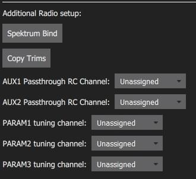
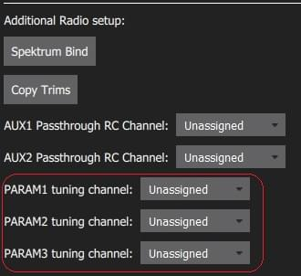

# Radio Control (RC) Setup

The *Radio Setup* screen is used to configure the mapping of your RC controller's main attitude control sticks (roll, pitch, yaw, throttle) to channels, and to calibrate the minimum, maximum, trim and reverse settings for all other transmitter controls/RC channels.

:::note
A [Joystick](../config/joystick.md) can be used instead of RC for manual control. The [COM_RC_IN_MODE](../advanced_config/parameter_reference.md#COM_RC_IN_MODE) parameter [can be set](../advanced_config/parameters.md) to define what kind of manual controller(s) are enabled. :::

## 수신기 바인딩

무선 시스템을 보정을 하기 위하여 우선 수신기와 송신기를 바인딩하여야 합니다. 송신기와 수신기를 바인딩 프로세스는 하드웨어에 따라 조금씩 차이가 날 수 있습니다 (자세한 지침은 설명서 참조).

:::note
*Spektrum* 수신기를 사용하는 경우 [아래에 표시된 ](#spectrum-bind)과 같이 *QGroundControl*을 사용하여 바인딩 모드로 전환 가능합니다. :::

:::note
*FrSky* 수신기를 사용하는 경우 [이 지침](https://www.youtube.com/watch?v=1IYg5mQdLVI)에 따라 송신기를 바인딩할 수 있습니다. :::

## RC 손실 감지

PX4 needs to be able to detect when the signal from the RC controller has been lost in order to be able to take [appropriate safety measures](../config/safety.md#manual-control-loss-failsafe).

RC 수신기에는 신호 손실을 나타내는 여러가지 방법이 있습니다.
- 아무것도 출력하지 않음 (PX4에서 자동으로 감지 됨)
- 낮은 스로틀 값을 출력합니다 (이를 감지하도록 PX4를 구성 할 수 있음).
- 마지막으로 수신된 신호를 출력합니다 (유효한 입력처럼 보이므로 *PX4에서 감지 할 수 없음*).

RC 수신기가 RC 손실시 신호 출력을 지원하지 않는 경우 대신 스로틀을 낮게 설정하도록 구성하고, [RC_FAILS_THR](../advanced_config/parameter_reference.md#RC_FAILS_THR)에 해당 값을 설정하여야 합니다.

이를 수행하는 방법은 RC 컨트롤러 트림 및 스로틀 스틱을 가능한 낮게 설정하고 결과 출력 PWM 값을 PX4와 수신기 모두에서 사용하는 것입니다 (RC 손실 값을 설정하는 방법을 결정하려면 수신기 설명서를 참조하십시오). 그런 다음 스로틀 스틱을 원래 위치로 가져다 놓으십시오. 이 프로세스는 RC 손실 값이 정상 작동에서 수신기가 출력하는 최소값 미만이되도록 합니다.

:::note
지원되는 두 가지 RC 손실 감지 방법을 지원하지 않는 수신기를 사용하지 마십시오!
:::

## 보정 작업

보정 과정는 간단합니다. 화면 오른쪽 상단의 송신기 다이어그램에 표시된 특정 패턴으로 스틱을 이동하라는 메시지가 표시됩니다.

무선 조종기 보정 절차

1. RC 송신기를 켭니다.
1. *QGroundControl*을 시작하고 드론에 연결합니다.
1. 상단 도구 모음에서 **톱니 바퀴** 아이콘(기체 설정)을 선택한 다음 가장자리 표시줄에서 **무선 조종기**를 선택하십시오.
1. **확인**을 눌러 보정작업을 시작하십시오.

   

1. 트랜스미터와 일치하는 [송신기 모드](../getting_started/rc_transmitter_receiver.md#transmitter_modes) 라디오 버튼을 설정합니다 (이렇게하면 *QGroundControl*이 교정 중에 따라야 할 올바른 스틱 위치를 표시함).

   

1. 스틱을 텍스트(및 송신기 이미지)에 표시된 위치로 이동합니다. 스틱이 제자리에 있으면 **다음**을 누르십시오. 모든 위치에 대해 반복하십시오.
1. 메시지가 표시되면 다른 모든 스위치와 다이얼을 전체 범위로 이동합니다 (*채널 모니터*에서 움직이는 것을 관찰 할 수 있습니다).

1. **Next(다음)**를 클릭하여 설정을 시작합니다.

무선 조종기 보정은 [자동 조종 장치 설정 동영상](https://youtu.be/91VGmdSlbo4?t=4m30s) (youtube)에 자세히 설명되어 있습니다.

## 추가 무선 조종기 설정:

조종 스틱 및 기타 송신기 컨트롤을 보정하는 것 외에도이 화면에서 유용 할 수있는 여러 추가 무선 설정 옵션이 있습니다.

### Spektrum 바인드

무선 시스템을 보정을 하기 위하여 우선 수신기와 송신기를 바인딩하여야 합니다. *Spektrum* 수신기가있는 경우 아래와 같이 *QGroundControl*을 사용하여 *바인드 모드*로 설정할 수 있습니다. 차량의 수신기에 쉽게 물리적으로 접근할 수 있습니다.)

Spektrum 송신기/수신기 바인딩 절차

1. **Spektrum Bind** 버튼을 선택합니다
1. 수신기의 라디오 버튼을 선택하십시오.
1. **확인**을 누릅니다

   

1. 바인드 버튼을 누른 상태에서 Spektrum 송신기의 전원을 켭니다.

### 트림 복사

이 설정은 자동 조종 장치 내에서 자동으로 적용될 수 있도록 무선 송신기에서 수동 트림 설정을 복사합니다. 이 작업이 끝나면 수동으로 설정한 트림을 제거하여야 합니다.

:::note
트림 설정은 롤, 피치, 요를 조정하는 데 사용됩니다. 따라서 스틱을 리모컨의 중앙에 놓을 때 안정된 비행 또는 수평 비행을 얻을 수 있습니다 (안정화 비행 모드에서). 일부 RC 컨트롤러는 각 스틱 위치에 대해 RC 컨트롤러에서 전송 한 값에 오프셋을 제공할 수있는 트림 노브를 제공합니다. 여기서 **트림 복사** 설정은 오프셋을 자동 조종 장치로 이동합니다. :::

트림 복사 절차

1. **트림 복사**를 선택하십시오.
1. 스틱을 중앙에 놓고 스로틀을 끝까지 내립니다.
1. **확인**을 누릅니다.

   

1. 송신기의 트림을 다시 0으로 재설정하십시오.

### AUX 패스 스루 채널

AUX 패스 스루 채널을 사용하면 송신기에서 임의의 옵션 하드웨어 (예 : 그리퍼)를 제어 할 수 있습니다.

AUX 패스 스루 채널 설정 절차

1. 최대 2 개의 송신기 컨트롤을 별도의 채널에 매핑합니다.
1. 아래에 표시된 것처럼 이러한 채널을 지정하여 AUX1 및 AUX2 포트에 각각 매핑합니다. 값은 설정되는 즉시 차량에 저장됩니다.

   

비행 컨트롤러는 AUX1/AUX2의 지정된 채널에서 수정되지 않은 값을 통해 하드웨어를 구동하는 연결된 서보/릴레이로 전달합니다.

### 매개변수 튜닝 채널

튜닝 채널을 사용하면 송신기 튜닝 노브를 매개변수에 매핑할 수 있습니다 (트랜스미터에서 매개변수를 동적으로 수정할 수 있음).

:::tip
This feature is provided to enable manual in-flight tuning: [Multicopter PID Tuning Guide](../config_mc/pid_tuning_guide_multicopter.md), [Fixed-wing PID Tuning Guide](../config_fw/pid_tuning_guide_fixedwing.md). :::

매개 변수 튜닝에 사용되는 채널은 *라디오* 설정 (여기!)에서 할당되며 각 튜닝 채널에서 관련 매개변수로의 매핑은 *매개변수 편집기*에서 정의됩니다.

채널 튜닝 절차

1. 최대 3 개의 송신기 컨트롤 (다이얼 또는 슬라이더)을 개별 채널에 매핑합니다.
1. 선택 목록을 사용하여 라디오 채널에 대한 *PARAM Tuning Id* 매핑을 선택합니다. 값은 설정되는 즉시 차량에 저장됩니다.

   

PARAM 튜닝 채널을 매개 변수에 매핑 절차

1. **매개 변수** 사이드 바를 엽니 다.
1. 송신기에 매핑 할 매개 변수를 선택합니다 (이렇게하면 *매개 변수 편집기*가 열립니다).
1. **고급 설정** 확인란을 선택합니다.
1. **RC를 Param으로 설정 ...** 버튼을 클릭합니다 (아래에 표시된 전경 대화 상자가 팝업됩니다).

   
1. *Parameter Tuning ID* 선택 목록에서 매핑 할 튜닝 채널 (1, 2 또는 3)을 선택합니다.
1. 대화 상자를 닫으려면 **확인**을 누르십시오.
1. **저장**을 눌러 모든 변경 사항을 저장하고 *매개 변수 편집기*를 닫습니다.

:::tip
*Parameters* 화면의 오른쪽 상단에있는 메뉴 **Tools> Clear RC to Param**을 선택하여 모든 매개변수/튜닝 채널 매핑을 삭제할 수 있습니다. :::

## 추가 정보

* [QGroundControl > 무선 조종기](https://docs.qgroundcontrol.com/master/en/SetupView/Radio.html)
* [PX4 설정 비디오 - @4m30s](https://youtu.be/91VGmdSlbo4?t=4m30s) (유튜브)
* [RC 시스템 선택](../getting_started/rc_transmitter_receiver.md) -호환되는 RC 시스템을 선택합니다.
