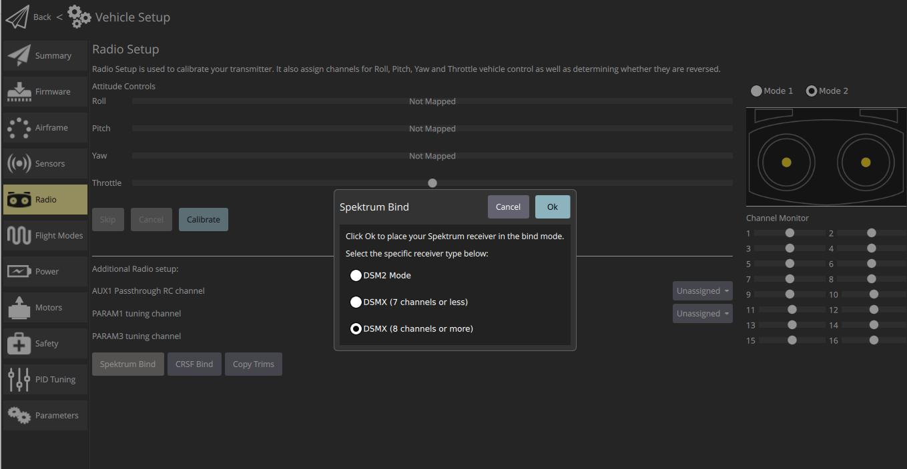

# 무선 조종기(RC) 설정

*무선 조종기 설정* 화면은 송신기 제어/RC 채널용 리모컨 장치의 기본 자세 제어 스틱 (롤, 피치, 요, 스로틀)을 채널에 매핑하고 최소, 최대, 트림 및 리버스 설정을 보정하는 데 사용됩니다. 

## 수신기 바인딩

무선 시스템을 보정하기 전에 수신기와 송신기를 연결하여 바인딩하여야 합니다. 송신기와 수신기 쌍을 바인딩하는 프로세스는 하드웨어에 따라 조금씩 다릅니다 (자세한 지침은 설명서 참조).

:::note
If you are using a *Spektrum* receiver, you can put it into bind mode using *QGroundControl*, as [shown below](#spectrum-bind).
:::

:::note
*FrSky* 수신기를 사용하는 경우 [이 지침](https://www.youtube.com/watch?v=1IYg5mQdLVI)에 따라 송신기와 바인딩할 수 있습니다.
:::

## RC 손실 감지

PX4 needs to be able to detect when the signal from the RC controller has been lost in order to be able to take [appropriate safety measures](../config/safety.md#rc-loss-failsafe).

RC receivers have different ways of indicating signal loss:

* 아무것도 출력하지 않음 (PX4에서 자동으로 감지 됨)
* 낮은 스로틀 값을 출력합니다 (이를 감지하도록 PX4를 구성 할 수 있음).
* 마지막으로 수신된 신호를 출력합니다 (유효한 입력처럼 보이므로 *PX4에서 감지 할 수 없음*).

If your RC receiver does not support outputting no signal on RC loss, you must configure it to set throttle low instead, and set the corresponding value in [RC_FAILS_THR](../advanced_config/parameter_reference.md#RC_FAILS_THR).

The way to do this is to set the RC controller trim and throttle stick as low as possible, and use the resulting output PWM value in both PX4 and the receiver (read your receiver manual to determine how to set the RC loss value). Then reset the throttle stick trim back to its normal position. This process ensures that the RC loss value is below the minimum value output by the receiver in normal operation.

:::note
Do not use a receiver that cannot support one of the two supported RC loss detection methods!
:::

## 보정 작업

The calibration process is straightforward - you will be asked to move the sticks in a specific pattern that is shown on the transmitter diagram on the top right of the screen.

To calibrate the radio:

1. RC 송신기를 켭니다.
2. *QGroundControl*을 시작하고 드론에 연결합니다.
3. 상단 도구 모음에서 **톱니 바퀴** 아이콘(기체 설정)을 선택한 다음 가장자리 표시줄에서 **무선 조종기**를 선택하십시오.
4. **확인**을 눌러 보정작업을 시작하십시오.
    
    

5. 트랜스미터와 일치하는 [송신기 모드](../getting_started/rc_transmitter_receiver.md#transmitter_modes) 라디오 버튼을 설정합니다 (이렇게하면 *QGroundControl*이 교정 중에 따라야 할 올바른 스틱 위치를 표시함).
    
    

6. 스틱을 텍스트(및 송신기 이미지)에 표시된 위치로 이동합니다. 스틱이 제자리에 있으면 **다음**을 누르십시오. 모든 위치에 대해 반복하십시오.

7. 메시지가 표시되면 다른 모든 스위치와 다이얼을 전체 범위로 이동합니다 (*채널 모니터*에서 움직이는 것을 관찰 할 수 있습니다).

8. **Next(다음)**를 클릭하여 설정을 시작합니다.

Radio calibration is demonstrated in the [autopilot setup video here](https://youtu.be/91VGmdSlbo4?t=4m30s) (youtube).

## 추가 무선 조종기 설정:

As well as calibrating your control sticks and other transmitter controls, there are a number of additional radio setup options that you may find useful on this screen.

### Spektrum 바인드

Before you can calibrate the radio system the receiver and transmitter must be connected/bound. If you have a *Spektrum* receiver you can put it in *bind mode* using *QGroundControl* as shown below (this can be particularly useful if you don't have easy physical access to the receiver on your vehicle).

To bind a Spektrum transmitter/receiver:

1. **Spektrum Bind** 버튼을 선택합니다
2. 수신기의 라디오 버튼을 선택하십시오.
3. **확인**을 누릅니다
    
    

4. 바인드 버튼을 누른 상태에서 Spektrum 송신기의 전원을 켭니다.

### 트림 복사

This setting is used to copy the manual trim settings from your radio transmitter so that they can be applied automatically within the autopilot. After this is done you will need to remove the manually set trims.

:::note
Trim settings are used to adjust the roll, pitch, yaw such that when you center the sticks on your remote control, you get stable or level flight (in Stabilized flight mode). Some RC controllers provide trim knobs that allow you to provide an offset to the value sent by the RC controller for each stick position. The **Copy Trims** setting here moves the offsets into the autopilot.
:::

To copy the trims:

1. **트림 복사**를 선택하십시오.
2. 스틱을 중앙에 놓고 스로틀을 끝까지 내립니다. 
3. **확인**을 누릅니다.
    
    

4. 송신기의 트림을 다시 0으로 재설정하십시오.

### AUX 패스 스루 채널

AUX passthrough channels allow you to control arbitrary optional hardware from your transmitter (for example, a gripper).

To use the AUX passthrough channels:

1. 최대 2 개의 송신기 컨트롤을 별도의 채널에 매핑합니다. 
2. 아래에 표시된 것처럼 이러한 채널을 지정하여 AUX1 및 AUX2 포트에 각각 매핑합니다. 값은 설정되는 즉시 차량에 저장됩니다.
    
    

The flight controller will pass through the unmodified values from the specified channels out of AUX1/AUX2 to the connected servos/relays that drive your hardware.

### Param 튜닝 채널

Tuning channels allow you to map a transmitter tuning knob to a parameter (so that you can dynamically modify a parameter from your transmitter).

:::tip
This feature is provided to enable manual in-flight tuning: [Multicopter PID Tuning Guide](../config_mc/pid_tuning_guide_multicopter.md), [Fixedwing PID Tuning Guide](../config_fw/pid_tuning_guide_fixedwing.md).
:::

The channels used for parameter tuning are assigned in the *Radio* setup (here!), while the mapping from each tuning channel to its associated parameter is defined in the *Parameter editor*.

To set up tuning channels:

1. 최대 3 개의 송신기 컨트롤 (다이얼 또는 슬라이더)을 개별 채널에 매핑합니다.
2. 선택 목록을 사용하여 라디오 채널에 대한 *PARAM Tuning Id* 매핑을 선택합니다. 값은 설정되는 즉시 차량에 저장됩니다.
    
    

To map a PARAM tuning channel to a parameter:

1. **매개 변수** 사이드 바를 엽니 다. 
2. 송신기에 매핑 할 매개 변수를 선택합니다 (이렇게하면 *매개 변수 편집기*가 열립니다).
3. **고급 설정** 확인란을 선택합니다.
4. **RC를 Param으로 설정 ...** 버튼을 클릭합니다 (아래에 표시된 전경 대화 상자가 팝업됩니다).
    
    

5. *Parameter Tuning ID* 선택 목록에서 매핑 할 튜닝 채널 (1, 2 또는 3)을 선택합니다.

6. 대화 상자를 닫으려면 **확인**을 누르십시오.
7. **저장**을 눌러 모든 변경 사항을 저장하고 *매개 변수 편집기*를 닫습니다.

:::tip
You can clear all parameter/tuning channel mappings by selecting menu **Tools > Clear RC to Param** at the top right of the *Parameters* screen.
:::

## 추가 정보

* [QGroundControl > 무선 조종기](https://docs.qgroundcontrol.com/en/SetupView/Radio.html)
* [PX4 설정 비디오 - @4m30s](https://youtu.be/91VGmdSlbo4?t=4m30s) (유튜브)
* [RC 시스템 선택](../getting_started/rc_transmitter_receiver.md) -호환되는 RC 시스템을 선택합니다.