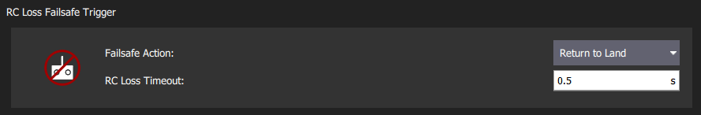

# 안전장치 설정(사고 방지)

PX4에는 문제 발생시 기체를 보호와 복구에 관련된 여러가지 안전 기능들이 있습니다.

* *안전장치* 기능을 통하여 안전 비행 지역, 사고 방지 조건 및 사고방지 기능 작동시 수행할 [작업](#failsafe-actions)(예: 착륙, 현 위치 유지)을 지정할 수 있습니다. 가장 중요한 안전장치는 *QGroundControl*의 [안전 설정](#qgroundcontrol-safety-setup) 화면에서 설정합니다. 기타는 [매개 변수](#other-safety-settings)를 통하여 설정합니다.
* 리모콘의 [안전 스위치](#emergency-switches)를 사용하여 문제 발생시 즉시 모터를 중지하거나 기체를 원위치로 복귀시킬 수 있습니다.

## 안전장치 기능

안전장치 기능들은 여러가지 동작들로 조합됩니다. 일반적인 안전장치 기능들은 아래와 같습니다.

| 동작                                                                         | 설명                                                                                                                                                                                                                                                                               |
| -------------------------------------------------------------------------- | -------------------------------------------------------------------------------------------------------------------------------------------------------------------------------------------------------------------------------------------------------------------------------- |
| 없음/비활성화                                           | 조치 없음(안전 장치는 무시됩니다).                                                                                                                                                                                                                                                             |
| 경고                                                | 경고 메시지가 *QGroundControl*으로 전송됩니다.                                                                                                                                                                                                                                                |
| [대기 모드](../flight_modes/hold.md)                  | 기체는 *대기 모드*로 들어갑니다. 멀티콥터는 제자리에서 호버링을 하고, 고정익은 원주 선회 비행을 하게 됩니다.                                                                                                                                                                                                                  |
| [복귀 모드](../flight_modes/return.md)                | 기체는 *복귀 모드*로 들어갑니다. Return behaviour can be set in the [Return Home Settings](#return-mode-settings) (below).                                                                                                                                                                    |
| [착륙 모드](../flight_modes/land.md)                  | 차량은 *착륙 모드*로 전환하여 즉시 착륙합니다.                                                                                                                                                                                                                                                      |
| [비행 종료](../advanced_config/flight_termination.md) | 모든 컨트롤러를 끄고 모든 PWM 출력을 안전 장치 값(예 : [PWM_MAIN_FAILn](../advanced_config/parameter_reference.md#PWM_MAIN_FAIL1), [PWM_AUX_FAILn](../advanced_config/parameter_reference.md#PWM_AUX_FAIL1))으로 설정합니다. 안전장치 출력은 낙하산, 랜딩 기어를 배치하거나 다른 작업을 수행하는 데 사용할 수 있습니다. 고정익은 안전하게 활공할 수 있습니다. |
| 봉쇄                                                | 모터를 정지합니다(시동을 껍니다). 이것은 [킬 스위치](#kill-switch)를 사용하는 것과 같습니다.                                                                                                                                                                                                                     |

:::note
모드를 전환하여 오류 방지 조치 (원인이 수정 된 경우)에서 복구 할 수 있습니다.
:::note
모드를 전환하여 오류 방지 조치 (원인이 수정 된 경우)에서 복구 할 수 있습니다.
:::

:::note
차량이 다른 안전 장치에 응답하는 동안 안전 장치가 발생하면 (예 : RC 손실로 인해 반환 모드에있는 동안 배터리 부족), 두 번째 트리거에 대해 지정된 안전 장치 동작이 무시됩니다.
대신 작업은 별도의 시스템 수준과 기체별 코드에 의해 결정됩니다.
이로 인하여 기체 비행은 수동 모드로 변경되어 사용자가 직접 복구할 수 있습니다.
:::

## QGroundControl 안전 설정

The *QGroundControl* Safety Setup page is accessed by clicking the *QGroundControl* icon, **Vehicle Setup**, and then **Safety** in the sidebar). This includes the most important failsafe settings (battery, RC loss etc.) and the settings for the triggered actions *Return* and *Land*.

### 배터리 부족 안전장치

배터리 용량이 하나 (또는 그 이상의 경고) 레벨값 아래로 떨어지면 배터리 부족 안전 장치가 작동합니다.

가장 일반적인 설정은 위와 같이 값과 작업을 설정하는 것입니다 (`경고 > 페일 세이프 > 긴급` 사용). 이 구성을 사용하면 안전 장치가 경고를 표시한 다음 원위치로 귀환하며, 용량이 일정 수준 아래로 떨어지면 최종적으로 착륙합니다.

[배터리 페일 세이프 레벨](#BAT_CRIT_THR) 안전장치 동작 레벨에 도달하면 경고, 귀환 또는 착륙하도록 *안전장치 조치*를 설정할 수 있습니다.

설정에 관련된 기본 매개 변수는 다음과 같습니다.

| 설정                                         | 매개변수                                                                           | 설명                                                                                           |
| ------------------------------------------ | ------------------------------------------------------------------------------ | -------------------------------------------------------------------------------------------- |
| 안전장치 기능                                    | [COM_LOW_BAT_ACT](../advanced_config/parameter_reference.md#COM_LOW_BAT_ACT) | 용량이 [배터리 안전장치 동작 수준](#BAT_CRIT_THR) 아래로 내려가면 경고, 귀환 또는 착륙, 또는 경고, 귀환, 아래의 각 수준 설정에 따라 착륙합니다. |
| 배터리 경고 수준                                  | [BAT_LOW_THR](../advanced_config/parameter_reference.md#BAT_LOW_THR)         | 경고 (또는 기타 조치)에 대한 백분율 용량입니다.                                                                 |
| 배터리 안정장치 수준 | [BAT_CRIT_THR](../advanced_config/parameter_reference.md#BAT_CRIT_THR)       | 귀환 조치 (또는 단일 조치가 선택된 경우 다른 조치)에 대한 용량 백분율.                                                   |
| 배터리 비상 수준                                  | [BAT_EMERGEN_THR](../advanced_config/parameter_reference.md#BAT_EMERGEN_THR) | 즉시 착륙시의 용량의 백분율.                                                                             |

### RC 손실 안전장치

The RC Loss failsafe may be triggered if the RC transmitter link is lost in manual modes (by default RC loss does not trigger the failsafe in missions, hold mode, or offboard mode).

Generally you will only want to set the _Failsafe_ action:

- The _RC Lost Timeout_ is the time after data stops updating before the link is considered lost. This must be kept short because the vehicle will continue to fly using the old RC data until the timeout triggers.
- You may need to modify the [COM_RCL_ACT_T](#COM_RCL_ACT_T) parameter. This is a delay after the link is lost and before the failsafe action is triggered in which the vehicle waits in hold mode for the RC system to reconnect. This might be longer for long-range flights so that intermittent connection loss doesn't immediately invoke the failsafe. It can be to zero so that the failsafe triggers immediately.

:::tip PX4는 여러 임의의 다각형 및 원형 포함 및 제외 영역 ([Flying > GeoFence](../flying/geofence.md))이 있는 GeoFence를 지원합니다.
:::

Additional (and underlying) parameter settings are shown below.

| 설정                                              | 매개변수                                                                         | 설명                                                                                                                                   |
| ----------------------------------------------- | ---------------------------------------------------------------------------- | ------------------------------------------------------------------------------------------------------------------------------------ |
|  RC 연결불량 시간 초과          | [COM_RC_LOSS_T](../advanced_config/parameter_reference.md#COM_RC_LOSS_T)   | Time after RC stops updating supplied data that the RC link is considered lost.                                                      |
| RC Loss Action Timeout | [COM_RCL_ACT_T](../advanced_config/parameter_reference.md#COM_RCL_ACT_T)   | Timeout after RC link loss waiting to recover RC before the failsafe action is triggered. In this stage the vehicle is in hold mode. |
| 안전장치 기능                | [NAV_RCL_ACT](../advanced_config/parameter_reference.md#NAV_RCL_ACT)       | 비활성화, 배회, 귀환, 착륙, 종료, 봉쇄.                                                                                                            |
| RC 손실 예외              | [COM_RCL_EXCEPT](../advanced_config/parameter_reference.md#COM_RCL_EXCEPT) | RC 손실이 무시되는 모드를 설정합니다: Mission(기본값), Hold, Offboard.                                                                                 |

### 데이터 연결불량 안전장치

데이터 연결불량 안전 장치는 [미션](../flying/missions.md) 비행시, 원격 측정 링크 (지상국에 연결)가 끊어지면 동작합니다.

설정에 관련된 기본 매개 변수는 다음과 같습니다.

| 설정             | 매개변수                                                                       | 설명                                    |
| -------------- | -------------------------------------------------------------------------- | ------------------------------------- |
| 데이터 연결불량 시간 초과 | [COM_DL_LOSS_T](../advanced_config/parameter_reference.md#COM_DL_LOSS_T) | 데이터 연결이 끊어진 후 안전 장치가 동작하기 전까지의 시간입니다. |
| 안전장치 기능        | [NAV_DLL_ACT](../advanced_config/parameter_reference.md#NAV_DLL_ACT)     | 비활성화, 배회 모드, 귀환 모드, 착륙 모드, 종료, 봉쇄.    |

### Geofence 안전장치

*Geofence 안전장치*는 홈 위치가 중심 좌표인 "가상" 실린더입니다. 차량이 반경을 벗어나거나 고도 이상으로 이동하면 지정된 *안전장치 조치*가 동작합니다.

:::note
쿼드슈트는 `param2`가 `1`로 설정된 MAVLINK [MAV_CMD_DO_VTOL_TRANSITION](https://mavlink.io/en/messages/common.html#MAV_CMD_DO_VTOL_TRANSITION) 메시지를 전송하여 실행할 수 있습니다.
:::

설정 및 기본 [Geofence 매개 변수](../advanced_config/parameter_reference.md#geofence)는 다음과 같습니다.

| 설정                  | 매개변수                                                                           | 설명                                     |
| ------------------- | ------------------------------------------------------------------------------ | -------------------------------------- |
| <nobr>위반시 조치</nobr> | [GF_ACTION](../advanced_config/parameter_reference.md#GF_ACTION)               | 없음, 경고, 보류 모드, 반환 모드, 종료, 착륙.          |
| 최대 반경               | [GF_MAX_HOR_DIST](../advanced_config/parameter_reference.md#GF_MAX_HOR_DIST) | 지오펜스 실린더의 수평 반경. 0 인 경우 지오펜스가 비활성화됩니다. |
| 최대 고도               | [GF_MAX_VER_DIST](../advanced_config/parameter_reference.md#GF_MAX_VER_DIST) | 지오펜스 실린더의 높이. 0 인 경우 지오펜스가 비활성화됩니다.    |

:::note
`GF_ACTION`을 종료하도록 설정하면 지오펜스 위반시 기체의 동작이 정지하게 됩니다. 이 기능은 위험성이 높으므로 [CBRK_FLIGHTTERM](#CBRK_FLIGHTTERM)을 사용하여 비활성화되며, 시스템을 실제로 종료하려면 0으로 재설정해야합니다.
:::

다음 설정도가능하지만 QGC UI에 표시되지 않습니다.

| 설정                                              | 매개변수                                                                         | 설명                                               |
| ----------------------------------------------- | ---------------------------------------------------------------------------- | ------------------------------------------------ |
| 지오펜스 고도 모드                                      | [GF_ALTMODE](../advanced_config/parameter_reference.md#GF_ALTMODE)           | 사용 된 고도 기준: 0 = WGS84, 1 = AMSL.                 |
| 지오펜스 카운터 제한                                     | [GF_COUNT](../advanced_config/parameter_reference.md#GF_COUNT)               | 지오펜스 위반이 트리거되기 전에 펜스 외부에서 필요한 후속 위치 측정 수를 설정합니다. |
| 지오펜스 소스                                         | [GF_SOURCE](../advanced_config/parameter_reference.md#GF_SOURCE)             | 위치 소스가 글로벌 위치인지 또는 GPS 장치에서 직접 가져 오는 지를 설정합니다.   |
| 비행 종료용 회로 차단기 | [CBRK_FLIGHTTERM](../advanced_config/parameter_reference.md#CBRK_FLIGHTTERM) | 비행 종료 작업을 활성화/비활성화합니다 (기본적으로 비활성화 됨).            |

### 귀환 설정

*귀환*는 [귀환 모드](../flight_modes/return.md)를 사용하여 차량을 홈 위치로 돌아오게하는 [안전장치](#failsafe-actions)입니다. 이 섹션에서는 귀환 후 착륙/배회 동작을 설정법을 설명합니다.

설정과 기본 매개 변수는 다음과 같습니다:

| 설정                   | 매개변수                                                                           | 설명                                        |
| -------------------- | ------------------------------------------------------------------------------ | ----------------------------------------- |
| 고도 상승                | [RTL_RETURN_ALT](../advanced_config/parameter_reference.md#RTL_RETURN_ALT)   | 기체은 귀환을 위해이 최소 높이 (아래에있는 경우)까지 상승합니다.     |
| 기본 동작                |                                                                                | *귀환*의 선택 목록 : 착륙, 배회, 미착륙 또는 배회, 일정시간후 착륙 |
| <nobr>정지비행 고도</nobr> | [RTL_DESCEND_ALT](../advanced_config/parameter_reference.md#RTL_DESCEND_ALT) | 귀환시 배회를 선택하면 차량이 유지하는 고도를 지정할 수 있습니다.     |
| <nobr>정지비행 시간</nobr> | [RTL_LAND_DELAY](../advanced_config/parameter_reference.md#RTL_LAND_DELAY)   | 배회후 착륙이 선택하면 기체의 정지 비행 시간을 설정합니다.         |

:::note
The return behaviour is defined by [RTL_LAND_DELAY](../advanced_config/parameter_reference.md#RTL_LAND_DELAY). 음수이면 즉시 착륙합니다. 더 자세한 정보는 [귀환 모드](../flight_modes/return.md)를 참고하십시오.
:::

### 착륙모드 설정

*현재 위치의 착륙*는 [착륙 모드](../flight_modes/land.md)를 실행하는 일반적인 [안전 조치](#failsafe-actions)입니다. 이 섹션에서는 착륙 후 차량이 자동으로 시동을 꺼는 방법과 시점을 설정법을 설명합니다. Multicopters에서만 하강 속도를 추가로 설정 가능합니다.

설정과 기본 매개 변수는 다음과 같습니다:

| 설정                     | 매개변수                                                                           | 설명                                                       |
| ---------------------- | ------------------------------------------------------------------------------ | -------------------------------------------------------- |
| <nobr>착륙후 시동 꺼기</nobr> | [COM_DISARM_LAND](../advanced_config/parameter_reference.md#COM_DISARM_LAND) | 착륙 후 시동을 끄려면 확인란을 선택합니다. 값은 0 이상으로 1초 미만의 값도 설정할 수 있습니다. |
| 착륙 하강률                 | [MPC_LAND_SPEED](../advanced_config/parameter_reference.md#MPC_LAND_SPEED)   | 착륙 하강율(멀티콥더에만 적용됨).                                      |

## 기타 안전장치 설정

이 섹션에는 *QGroundControl*의 [안전 설정](#qgroundcontrol-safety-setup) 페이지에서 설정할 수 없는 안전장치 설정에 관하여 설명합니다.

### 위치(GPS) 손실 안전장치

*위치 손실 안전장치*는 위치 추정이 필요한 모드에서 PX4 위치 추정 품질이 일정 수준(GPS 손실로 인해 발생할 수 있음) 이하가 되면 작동합니다.

실패 동작은 RC 제어가 사용 가능한지 여부 (및 고도 정보)에 따라 [COM_POSCTL_NAVL](../advanced_config/parameter_reference.md#COM_POSCTL_NAVL)에 의해 제어됩니다.
* `0` : 원격 제어 가능. 고도 추정치를 사용할 수 있으면 *고도 모드*로 전환하고, 그렇지 않으면 *안정 모드*로 전환됩니다.
* `1` : 원격 제어 *불가*. 고도값을 사용할 수있는 경우 *착륙 모드*로 전환하고, 그렇지 않으면 비행 종료를 입력합니다.

고정익에는 위치 손실시 착륙이전의 선회 비행 시간을 정의하는 매개 변수가 [NAV_GPSF_LT](../advanced_config/parameter_reference.md#NAV_GPSF_LT) 있습니다.

아래 표시된 모든 차량에 대한 관련 매개 변수 ([GPS 장애 내비게이션 매개 변수](../advanced_config/parameter_reference.md#gps-failure-navigation) 참조) :

| 매개변수                                                                             | 설명                                                   |
| -------------------------------------------------------------------------------- | ---------------------------------------------------- |
| [COM_POS_FS_DELAY](../advanced_config/parameter_reference.md#COM_POS_FS_DELAY) | 위치 손실 후 안전 장치 동작 지연 여부 설정                            |
| [COM_POSCTL_NAVL](../advanced_config/parameter_reference.md#COM_POSCTL_NAVL)   | 임무 중 위치 제어 탐색 손실 응답. 값 : 0 - RC 사용 가정, 1 - RC 없음 가정. |
| [CBRK_VELPOSERR](../advanced_config/parameter_reference.md#CBRK_VELPOSERR)       | 위치 오류 검사를위한 회로 차단기 (모든 모드에서 오류 검사 비활성화).             |

고정익 전용 매개 변수:

| 매개변수                                                                   | 설명                                                            |
| ---------------------------------------------------------------------- | ------------------------------------------------------------- |
| [NAV_GPSF_LT](../advanced_config/parameter_reference.md#NAV_GPSF_LT) | 선회 비행 시간 (비행 종료 전 GPS 복구 대기).  비활성화 하려면 0으로 설정하십시오. |
| [NAV_GPSF_P](../advanced_config/parameter_reference.md#NAV_GPSF_P)   | 선회 비행시 고정 피치 각도.                                              |
| [NAV_GPSF_R](../advanced_config/parameter_reference.md#NAV_GPSF_R)   | 선회 비행시 고정 롤/뱅크 각도.                                            |
| [NAV_GPSF_TR](../advanced_config/parameter_reference.md#NAV_GPSF_TR) | 선회 비행 추력                                                      |

### 오프 보드 안전장치

오프 보드 제어시에 오프 보드 링크가 손실되면 *오프 보드 안전장치*가 동작합니다. RC 연결을 사용할 수 있는지 여부에 따라 다른 안전장치 동작을 지정할 수 있습니다.

관련 매개 변수는 다음과 같습니다.

| 매개변수                                                                         | 설명                                                                 |
| ---------------------------------------------------------------------------- | ------------------------------------------------------------------ |
| [COM_OF_LOSS_T](../advanced_config/parameter_reference.md#COM_OF_LOSS_T)   | 오프 보드 단락이후 안전장치 동작 지연 여부 설정.                                       |
| [COM_OBL_ACT](../advanced_config/parameter_reference.md#COM_OBL_ACT)       | RC를 사용할 수 없는 경우 비상 안전조치 : 착륙 모드, 대기 모드, 귀환 모드.                     |
| [COM_OBL_RC_ACT](../advanced_config/parameter_reference.md#COM_OBL_RC_ACT) | RC를 사용할 수있는 경우 비상 안전조치 : 위치 모드, 고도 모드, 수동 모드, 귀환 모드, 착륙 모드, 대기 모드. |

### 임수 실패 안전 장치

임무 실패 안전 장치는 설정된 미션이 새로운 이륙 위치에서 시작되거나 웨이포인트 거리가 너무 큰 경우를 방지합니다. 안전조치는 임무가 실행되지 않는 것입니다.

관련 매개 변수는 다음과 같습니다.

| 매개변수                                                                     | 설명                                                            |
| ------------------------------------------------------------------------ | ------------------------------------------------------------- |
| [MIS_DIST_1WP](../advanced_config/parameter_reference.md#MIS_DIST_1WP) | 현재 웨이포인트가 홈 위치에서 멀리 떨어진 경우 임무가 시작되지 않습니다. 값이 0 이하이면 비활성화 됩니다. |
| [MIS_DIST_WPS](../advanced_config/parameter_reference.md#MIS_DIST_WPS) | 두 개의 웨이포인트 사이의 거리가 크면 임무가 시작되지 않습니다.                          |

### 교통 회피 안전장치

교통 회피 안전장치를 사용하면 PX4가 미션 중에 transponders 데이터 (예 : [ADSB transponder](../advanced_features/traffic_avoidance_adsb.md)에서)에 응답할 수 있습니다.

관련 매개 변수는 다음과 같습니다.

| 매개변수                                                                           | 설명                                       |
| ------------------------------------------------------------------------------ | ---------------------------------------- |
| [NAV_TRAFF_AVOID](../advanced_config/parameter_reference.md#NAV_TRAFF_AVOID) | 비상 안전조치를 설정합니다 : 비활성화, 경고, 귀환 모드, 착륙 모드. |

### QuadChute 안전 장치

VTOL 차량이 고정익 모드에서 더 이상 비행할 수 없는 경우를 위한 안전 장치입니다. 아마도 푸셔 모터, 속도 센서 또는 제어 표면이 고장났기 때문일 수 있습니다. 트리거되면 차량이 즉시 멀티콥터 모드로 전환됩니다. 차량이 [미션 모드](../flight_modes/mission.md)인 경우 안전 장치 [복귀 모드](../flight_modes/return.md)로 들어갑니다.

:::note
쿼드슈트는 `param2`가 `1`로 설정된 MAVLINK [MAV_CMD_DO_VTOL_TRANSITION](https://mavlink.io/en/messages/common.html#MAV_CMD_DO_VTOL_TRANSITION) 메시지를 전송하여 실행할 수 있습니다.
:::

쿼드슈트가 트리거되는 시기를 제어하는 매개변수는 아래 표에 나열되어 있습니다.

| 매개변수                                                                       | 설명                                                                               |
| -------------------------------------------------------------------------- | -------------------------------------------------------------------------------- |
| [VT_FW_ALT_ERR](../advanced_config/parameter_reference.md#VT_FW_ALT_ERR) | 고정익 비행에 대한 고도 오류 음수의 최대 절대값 고도가 설정치 이하가 되면, 기체는 MC 모드로 다시 전환되고 안전 장치 RTL로 전환됩니다. |
| [VT_FW_MIN_ALT](../advanced_config/parameter_reference.md#VT_FW_MIN_ALT) | 고정익 비행을 위한 최소 고도. 고정익 비행에서 고도가 이 값 아래로 떨어지면 차량은 MC 모드로 다시 전환되고 안전 장치 RTL로 들어갑니다. |
| [VT_FW_QC_P](../advanced_config/parameter_reference.md#VT_FW_QC_P)       | QuadChute가 작동하기 전의 최대 피치 각도. 이 이상에서 차량은 MC 모드로 다시 전환되고 안전 장치 RTL로 들어갑니다.         |
| [VT_FW_QC_R](../advanced_config/parameter_reference.md#VT_FW_QC_R)       | QuadChute가 맞물리기 전의 최대 롤 각도. 이 이상에서 차량은 MC 모드로 다시 전환되고 안전 장치 RTL로 들어갑니다.          |

## 고장 감지기

고장 감지기를 사용하면 차량이 예기치 않게 뒤집히거나 외부 고장 감지 시스템에서 알림을받은 경우 보호 조치를 취할 수 있습니다.

**비행**중에 실패 감지기를 사용하여 실패 조건이 충족되면 [비행 종료](../advanced_config/flight_termination.md)를 작동시켜서, [낙하산](../peripherals/parachute.md)을 펼치는 등의 작업을 수행할 수 있습니다.

:::note
비행 중 실패 감지는 기본적으로 비활성화되어 있습니다 (매개 변수 : [CBRK_FLIGHTTERM=0](#CBRK_FLIGHTTERM)을 설정하여 활성화).
:::

**이륙**중에 차량이 뒤집히면 고장 감지기 [자세 트리거](#attitude-trigger)가 [잠금 동작](#action_lockdown)을 호출합니다(잠금은 모터를 정지시키지만, 비행 종료와 달리 낙하산을 펼치거나 기타 실패 조치 수행하지 않음). 이 확인은 `CBRK_FLIGHTTERM` 매개 변수에 관계없이 *이륙시 항상 사용*합니다.

고장 감지기는 기체의 뒤집히는 것이 *예상*되는 경우를 제외하고, 모든 기체 유형 및 모드에서 활성화됩니다 (예 : [Acro 모드(MC), \[Acro 모드 (FW)\](../flight_modes/altitude_fw.md), \[Rattitude\](../flight_modes/manual_fw.md) 및 수동 (FW)](../flight_modes/altitude_mc.md)).

### 자세 감지기

차량 자세가 지정된 시간보다 오랫동안 사전 정의 된 피치 및 롤 값을 초과하는 경우 동작하도록 고장 감지기를 구성할 수 있습니다.

관련 매개 변수는 다음과 같습니다.

| 매개변수                                                                                                   | 설명                                                                       |
| ------------------------------------------------------------------------------------------------------ | ------------------------------------------------------------------------ |
| [CBRK_FLIGHTTERM](../advanced_config/parameter_reference.md#CBRK_FLIGHTTERM) | 비행 종료 회로 차단기. 실패감지기 또는 FMU 손실로 인한 비행 종료를 활성화하려면 121212 (기본값)에서 설정 해제합니다. |
| [FD_FAIL_P](../advanced_config/parameter_reference.md#FD_FAIL_P)           | 최대 허용 피치 (도 단위).                                                         |
| [FD_FAIL_R](../advanced_config/parameter_reference.md#FD_FAIL_R)           | 최대 허용 롤 (도 단위).                                                          |
| [FD_FAIL_P_TTRI](../advanced_config/parameter_reference.md#FD_FAIL_P_TTRI) | 실패 감지를 위해 [FD_FAIL_P](#FD_FAIL_P)를 초과하는 시간 (기본값 0.3 초).                |
| [FD_FAIL_R_TTRI](../advanced_config/parameter_reference.md#FD_FAIL_R_TTRI) | 실패 감지를 위해 [FD_FAIL_R](#FD_FAIL_R)을 초과하는 시간 (기본값 0.3 초).                |

### 외부 자동 동작 시스템 (ATS)

[활성화](#CBRK_FLIGHTTERM) 인 경우 [고장 감지기](#failure-detector)는 외부 ATS 시스템에 의해 작동될 수 있습니다. 외부 동작 시스템은 비행 컨트롤러 포트 AUX5 (또는 AUX 포트가없는 보드의 MAIN5)에 연결되어야 하며 아래 매개 변수를 사용하여 구성됩니다.

:::note
외부 ATS는 [ASTM F3322-18](https://webstore.ansi.org/Standards/ASTM/ASTMF332218)에 필요합니다. ATS 장치의 한가지 예는 [FruityChutes Sentinel 자동 트리거 시스템](https://fruitychutes.com/uav_rpv_drone_recovery_parachutes/sentinel-automatic-trigger-system.htm)입니다.
:::

| 매개변수                                                                                                     | 설명                                                                                          |
| -------------------------------------------------------------------------------------------------------- | ------------------------------------------------------------------------------------------- |
| [FD_EXT_ATS_EN](../advanced_config/parameter_reference.md#FD_EXT_ATS_EN)     | AUX5 또는 MAIN5 (보드에 따라 다름)에서 PWM 입력을 활성화하여 외부 자동 트리거 시스템 (ATS)에서 안전 장치를 연결합니다. 기본값 : 비활성화 됨. |
| [FD_EXT_ATS_TRIG](../advanced_config/parameter_reference.md#FD_EXT_ATS_TRIG) | 안전장치 연결을 위한 외부 자동 동작 시스템의 PWM 임계치입니다. 기본값: 1900 ms.                                         |

## 비상 스위치

리모콘의 [안전 스위치](#emergency-switches)를 사용하여 문제 발생시 즉시 모터를 중지하거나 기체를 원위치로 복귀시킬 수 있습니다.

이 섹션에는 사용 가능한 비상 스위치들을 설명합니다.

### 중지 스위치

중지 스위치는 즉시 모든 모터 출력을 중지합니다 (비행시 차량이 떨어지기 시작합니다)! 5초 이내에 스위치를 되돌리면 모터가 재작동합니다. 5초 후 기체의 시동은 꺼집니다. 모터를 재작동하려면 재시동하여야 합니다.

### 시동/비시동 스위치

시동/비소동 스위치는 기본 스틱 기반 무장/무장 해제 메커니즘의 *직접 교체*입니다 (동일한 목적 : 모터 시작/정지 전에 의도적 인 단계가 있는지 확인). 다음과 같은 이유로 기본 메커니즘보다 우선적으로 사용될 수 있습니다.
- 스틱 동작보다 스위치를 선호합니다.
- 특정 스틱 동작으로 공중에서 실수로 시동/비시동 하는 것을 방지합니다.
- 지연 시간이 없습니다 (즉시 동작합니다).

시동/비시동 스위치는 *비행중 비시동을 지원*하는 [비행 모드](../getting_started/flight_modes.md)의 모터를 즉시 해제 (정지)합니다. 여기에는 다음의 항목들이 포함됩니다.
- *수동 모드*
- *Acro 모드*
- *안정 모드*

비행중 비시동을 지원하지 않는 모드의 경우 비행 중 스위치가 무시되지만 착륙후에는 사용할 수 있습니다. 여기에는 *위치 모드* 및 자율 모드 (예 : *미션*, *착륙* 등)가 포함됩니다.

:::note
[자동 비시동 시간 제한](#auto-disarming-timeouts) (예 : [COM_DISARM_LAND](#COM_DISARM_LAND)을 통해)은 설정/해제 스위치와 독립적입니다. 즉, 스위치가 설정되어 있어도 시간 제한이 계속 작동합니다.
:::

<!--
**Note** This can also be done by [manually setting](../advanced_config/parameters.md) the [RC_MAP_ARM_SW](../advanced_config/parameter_reference.md#RC_MAP_ARM_SW) parameter to the corresponding switch RC channel.
  If the switch positions are reversed, change the sign of the parameter [RC_ARMSWITCH_TH](../advanced_config/parameter_reference.md#RC_ARMSWITCH_TH) (or also change its value to alter the threshold value).
-->

### 귀환 스위치

귀환 스위치를 사용하여 즉시 [귀환 모드](../flight_modes/return.md)를 활성화할 수 있습니다.

## 기타 안전 설정

### 자동 비시동 제한 시간

이륙 속도가 너무 느리거나 착륙 후 차량을 자동으로 시동을 꺼기 위하여 시간 제한을 설정할 수 있습니다 (기체의 시동을 꺼면 모터의 전원이 제거되므로 프로펠러가 회전하지 않습니다).

[관련 매개 변수](../advanced_config/parameters.md)는 다음과 같습니다.

| 매개변수                                                                                                       | 설명                               |
| ---------------------------------------------------------------------------------------------------------- | -------------------------------- |
| [COM_DISARM_LAND](../advanced_config/parameter_reference.md#COM_DISARM_LAND)   | 착륙후 자동 시동 꺼기를 위한 대기 시간           |
| [COM_DISARM_PRFLT](../advanced_config/parameter_reference.md#COM_DISARM_PRFLT) | 기체가 이륙하기에 너무 느린 경우 자동 시동꺼리 대기 시간 |

## 추가 정보

* [QGroundControl 사용 설명서 > 안전 설정](https://docs.qgroundcontrol.com/en/SetupView/Safety.html)
