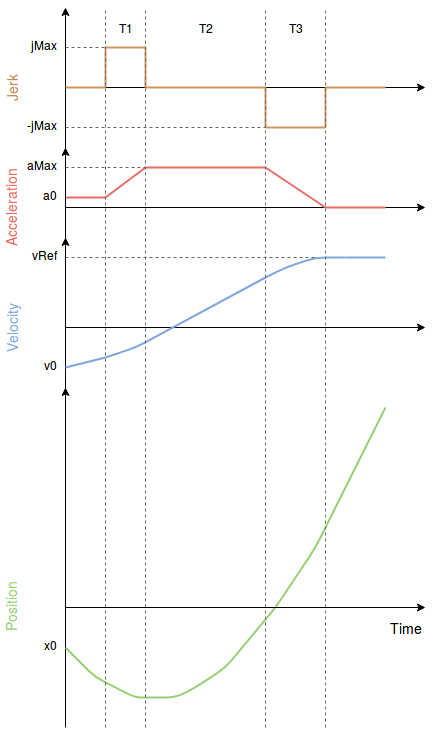

# 멀티콥터 저크 제한 유형 궤적

저크 제한 궤적 유형은 사용자 스틱 입력 또는 미션 변경 (예 : 촬영, 매핑,화물)에 응답하여 부드러운 동작을 제공합니다. 저크와 가속 제한이 항상 보장되는 부드러운 대칭 S-커브를 생성합니다.

이 궤적 유형은 항상 [임무 모드](../flight_modes/mission.md)에서 활성화됩니다. [위치 모드](../flight_modes/position_mc.md)에서 활성화하려면 매개변수를 설정하십시오 : [MPC_POS_MODE = 3](../advanced_config/parameter_reference.md#MPC_POS_MODE).

:::note
저크 제한 유형은 위치 모드에서 *기본적으로* 사용됩니다. 더 빠른 응답이 필요한 기체(예 : 레이서 쿼드)에는 적합하지 않을 수 있습니다.
:::

## 궤적 생성기

아래의 그래프는 다음과 같은 제약 조건을 가진 일반적인 저크 제한 프로필을 나타냅니다.

- `jMax`: 최대 저크
- `a0`: 초기 가속도 
- `aMax`: 최대 가속도
- `a3`: 마지막 가속도 (항상 0)
- `v0`: 초기 속도
- `vRef`: 목표 속도

제약 조건 `jMax`, `aMax`는 매개변수를 통하여 사용자가 설정할 수 있으며, 수동 위치 제어와 자동 모드에서 사용 가능합니다.

결과 속도 프로파일을 "S-Curve"라고 합니다.

## 수동 모드

수동 위치 모드에서 스틱은 전체 스틱 편향이 [MPC_VEL_MANUAL](../advanced_config/parameter_reference.md#MPC_VEL_MANUAL)에 해당하는 속도로 매핑됩니다.

### 제약 조건

XY 평면

- `jMax`: [MPC_JERK_MAX](../advanced_config/parameter_reference.md#MPC_JERK_MAX)
- `aMax`: [MPC_ACC_HOR_MAX](../advanced_config/parameter_reference.md#MPC_ACC_HOR_MAX)

Z축

- `jMax`: [MPC_JERK_MAX](../advanced_config/parameter_reference.md#MPC_JERK_MAX)
- `aMax` (상향 운동): [MPC_ACC_UP_MAX](../advanced_config/parameter_reference.md#MPC_ACC_UP_MAX)
- `aMax` (하향 운동): [MPC_ACC_DOWN_MAX](../advanced_config/parameter_reference.md#MPC_ACC_DOWN_MAX)

## 자동 모드

자동 모드에서 목표 속도는 [MPC_XY_CRUISE](../advanced_config/parameter_reference.md#MPC_XY_CRUISE)이지만, 다음 웨이포인트까지의 거리, 웨이포인트에서 가능한 최대 속도, 원하는 최대 가속도 및 저크에 따라 자동으로 조정됩니다.

### 제약 조건

XY 평면

- `jMax`: [MPC_JERK_AUTO](../advanced_config/parameter_reference.md#MPC_JERK_AUTO)
- `aMax`: [MPC_ACC_HOR](../advanced_config/parameter_reference.md#MPC_ACC_HOR)

Z축

- `jMax`: [MPC_JERK_AUTO](../advanced_config/parameter_reference.md#MPC_JERK_AUTO)
- `aMax` (상향 운동): [MPC_ACC_UP_MAX](../advanced_config/parameter_reference.md#MPC_ACC_UP_MAX)
- `aMax` (하향 운동): [MPC_ACC_DOWN_MAX](../advanced_config/parameter_reference.md#MPC_ACC_DOWN_MAX)

웨이 포인트에 근접시 속도 증가 거리 :

- [MPC_XY_TRAJ_P](../advanced_config/parameter_reference.md#MPC_XY_TRAJ_P)

### 관련 매개변수

- [MPC_XY_VEL_MAX](../advanced_config/parameter_reference.md#MPC_XY_VEL_MAX)
- [MPC_Z_VEL_MAX_UP](../advanced_config/parameter_reference.md#MPC_Z_VEL_MAX_UP)
- [MPC_Z_VEL_MAX_DN](../advanced_config/parameter_reference.md#MPC_Z_VEL_MAX_DN)
- [MPC_TKO_SPEED](../advanced_config/parameter_reference.md#MPC_TKO_SPEED)
- [MPC_LAND_SPEED](../advanced_config/parameter_reference.md#MPC_LAND_SPEED)
- [MPC_LAND_ALT1](../advanced_config/parameter_reference.md#MPC_LAND_ALT1)
- [MPC_LAND_ALT2](../advanced_config/parameter_reference.md#MPC_LAND_ALT2)