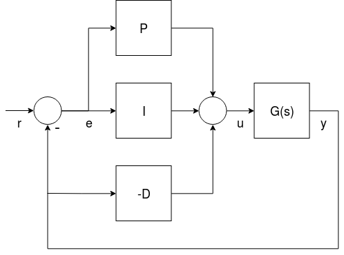

# 멀티콥터 PID 튜닝 가이드 (고급/상세) 

PX4 컨트롤러의 튜닝 방법에 대한 자세한 정보를 제공합니다.

:::tip
설명된 접근 방식이 직관적이므로 *호버 추력 지점 주변*의 기체을 튜닝시에는 [기본 PID 튜닝 가이드](pid_tuning_guide_multicopter_basic.md)를 따르는 것이 좋습니다. 이것은 대부분의 기체에 필요합니다.
:::

호버 추력 지점 주변의 튜닝이 충분하지 않을 때 이 가이드를 사용하십시오 (예 : 더 높은 추력에서 비선형성 및 진동이 방생하는 기체). 기본 튜닝을 충분히 이해하는 것이 [airmode](#airmode-mixer-saturation) 설정 사용법을 이해하는데 유용합니다.

## 튜닝 단계

:::note
안전상의 이유로 기본 게인은 낮은 값으로 설정됩니다. 적절한 제어 응답을 얻기 위해서는 게인 값을 적절하게 증가시켜야 합니다.
:::

튜닝시 준수할 일반적인 사항은 아래와 같습니다.

- 큰 이득은 위험한 진동을 발생시킬 수 있으므로, 모든 이득은 매우 천천히 증가시켜야합니다! 일반적으로 반복당 이득을 20~30%씩 증가시키고, 최종 미세 조정을 위해 5~10%로 줄입니다.
- 매개변수를 변경하기 전에 착륙시키십시오. 스로틀을 천천히 증가시키고 진동을 점검하십시오.
- 호버링 추력 지점을 중심으로 기체를 조정하고, [추력 곡선 매개 변수](#thrust-curve)를 사용하여 추력 비선형성 또는 높은 추력 진동을 설명합니다.
- 선택적으로 [SDLOG_PROFILE](../advanced_config/parameter_reference.md#SDLOG_PROFILE) 매개변수로 고속 로깅 프로필을 활성화하면 로그를 사용하여 비율과 태도 추적 성능을 평가할 수 있습니다 (이 옵션은 나중에 비활성화 할 수 있음).

:::warning
기체 튜닝시 항상 [MC_AIRMODE](../advanced_config/parameter_reference.md#MC_AIRMODE)를 비활성화 하십시오.
:::

### 속도 컨트롤러

속도 컨트롤러는 기체 속도(요, 피치, 롤)를 제어하는 3 개의 독립적인 PID 컨트롤러를 가지고 있는 가장 안쪽의 루프입니다.

:::note
훌륭하게 튜닝된 속도 컨트롤러는 *모든* 비행 모드에 영향을 미치므로 매우 중요합니다. 예를 들어, 잘못 튜닝한 속도 컨트롤러는 [위치 모드](../flight_modes/position_mc.md)에서 "twitches"로 표시됩니다 (기체가 공중에서 완벽하게 정지하지 않음).
:::

#### 속도 컨트롤러 아키텍처/양식

PX4는 단일 "혼합" 구현([병렬](#parallel-form) 및 [표준](#standard-form))에서 두 가지 (수학적으로 동등한) 형태의 PID 속도 컨트롤러를 지원합니다.

사용자는 다른 형식의 비례 이득을 "1"로 설정하여 사용되는 형식을 선택할 수 있습니다 (즉, 아래 다이어그램에서 병렬 형식의 경우 **K**을 1로 설정하거나 **P** 표준 형식의 경우 1로 설정하여 K 또는 P 블록을 한 줄로 바꿉니다).

 <!-- The drawing is on draw.io: https://drive.google.com/file/d/1hXnAJVRyqNAdcreqNa5W4PQFkYnzwgOO/view?usp=sharing -->

- *G(s)*는 기체의 각속도를 나타냅니다.
- *r*은 속도 설정점입니다.
- *y*는 신체 각속도 (자이로로 측정)입니다.
- *e*는 속도 설정값과 측정 속도 사이의 오류입니다.
- *u*는 PID 컨트롤러의 출력입니다.

두 가지 형식이 아래에 기술되어 있습니다.

:::note
미분항(**D**)은 [ 미분 킥](http://brettbeauregard.com/blog/2011/04/improving-the-beginner%E2%80%99s-pid-derivative-kick/)으로 알려진 효과를 피하기 위하여 피드백 경로에 있습니다.
:::

:::tip
자세한 내용은 아래의 내용을 참조하십시오.

- [모든 PID 컨트롤러가 같지 않습니다.](https://www.controleng.com/articles/not-all-pid-controllers-are-the-same/) (www.controleng.com) 
- [PID 컨트롤러 > 표준 대 병렬 (이상적인) PID 형식](https://en.wikipedia.org/wiki/PID_controller#Standard_versus_parallel_(ideal)_PID_form) (Wikipedia)
:::

##### 병렬 형식

*병렬 형식*은 가장 간단한 형식으로 교과서에서 많이 사용됩니다. 이 경우 컨트롤러의 출력은 간단한 비례, 적분 및 미분 동작의 합입니다.

##### 표준 형식

이 형식은 병렬 형식과 수학적으로 동일하지만 주요 이점은 (반 직관적으로 보일지라도) 비례 이득 튜닝을 적분과 미분 이득에서 분리하는 것입니다. 즉, 비슷한 크기와 관성을 가진 드론의 이득을 취하고 K 이득을 조정하여 적절하게 비행하는 방법으로 새로운 플랫폼을 쉽게 조정할 수 있습니다.

#### 속도 PID 튜닝

PID 속도 컨트롤러 튜닝 매개 변수는 다음과 같습니다.

- Roll 속도 제어 ([MC_ROLLRATE_P](../advanced_config/parameter_reference.md#MC_ROLLRATE_P), [MC_ROLLRATE_I](../advanced_config/parameter_reference.md#MC_ROLLRATE_I), [MC_ROLLRATE_D](../advanced_config/parameter_reference.md#MC_ROLLRATE_D), [MC_ROLLRATE_K](../advanced_config/parameter_reference.md#MC_ROLLRATE_K))
- Pitch 속도 제어 ([MC_PITCHRATE_P](../advanced_config/parameter_reference.md#MC_PITCHRATE_P), [MC_PITCHRATE_I](../advanced_config/parameter_reference.md#MC_PITCHRATE_I), [MC_PITCHRATE_D](../advanced_config/parameter_reference.md#MC_PITCHRATE_D), [MC_PITCHRATE_K](../advanced_config/parameter_reference.md#MC_PITCHRATE_K))
- Yaw 속도 제어 ([MC_YAWRATE_P](../advanced_config/parameter_reference.md#MC_YAWRATE_P), [MC_YAWRATE_I](../advanced_config/parameter_reference.md#MC_YAWRATE_I), [MC_YAWRATE_D](../advanced_config/parameter_reference.md#MC_YAWRATE_D), [MC_YAWRATE_K](../advanced_config/parameter_reference.md#MC_YAWRATE_K))

속도 콘트롤러는 [곡예 모드](../flight_modes/acro_mc.md)와 [수동/안정 모드](../flight_modes/manual_stabilized_mc.md)에서 튜닝할 수 있습니다.

- *곡예 모드* 는 선호되기는 하지만, 비행이 어렵습니다. 이 모드를 선택하는 경우 모든 스틱 엑스포를 비활성화하십시오. 
  - `MC_ACRO_EXPO` = 0, `MC_ACRO_EXPO_Y` = 0, `MC_ACRO_SUPEXPO` = 0, `MC_ACRO_SUPEXPOY` = 0
  - `MC_ACRO_P_MAX` = 200, `MC_ACRO_R_MAX` = 200
  - `MC_ACRO_Y_MAX` = 100
- *수동/안정 모드*는 비행이 용이하지만, 자세 또는 속도 컨트롤러에 어느 정도의 튜닝이 필요한지 확인하는 것이 어렵습니다.

기체이 비행이 전혀 되지 않는 경우:

- 처음 이륙 시도시 (비행하지 않는 지점까지) 강한 진동이 있으면, 이륙이 성공할 때 까지 **P** 및 **D** 게인을 줄입니다.
- RC 움직임에 대한 반응이 미미하면 **P** 게인을 높입니다.

실제 튜닝은 *수동 모드 * 또는 *곡예 모드*에서 거의 동일합니다. 롤 및 피치에 대해 **P**와 **D** 게인을 반복적으로 조정한 다음 **I** 게인을 조정합니다. 처음에는 롤과 피치에 동일한 값을 사용할 수 있으며, 좋은 값을 얻은 후에는 롤과 피치 응답을 개별적으로 확인하여 미세 조정할 수 있습니다 (기체가 대칭인 경우 필요하지 않음). yaw의 경우 **D**를 0으로 둘 수 있다는 점을 제외하면 매우 유사합니다.

##### 비례 이득 (P/K)

비례 이득은 추적 오류를 최소화하는 데 사용됩니다 (아래에서 **P** 또는 **K**를 참조하기 위하여 **P**를 사용합니다). 빠른 응답을 담당하므로 가능한 높게 설정하여야 하지만, 진동이 발생하지 않아야 합니다.

- **P** 게인이 너무 높은 경우, 고주파 진동이 나타납니다.
- **P** 게인이 너무 낮은 경우: 
  - 기체가 입력 변화에 느리게 반응합니다.
  - *곡예 모드*에서는 기체가 표류하므로, 레벨을 유지를 위하여 지속적으로 수정하여야 합니다.

##### 미분 이득 (D)

**D** 미분 게인은 속도 댐핑에 사용됩니다. 오버 슈트를 제거하기 위하여 적절하게 높은 값으로 설정합니다.

- **D** 게인이 너무 높은 경우 : **D** 항이 소음을 증폭하기 때문에, 모터가 경련을 일으키고 뜨거워집니다.
- **D** 게인이 너무 낮은 경우 : 스텝 입력 후 오버 슈트가 나타납니다.

일반적인 값은 다음과 같습니다.

- 표준 형식 (**P** = 1) : **K** 값에 대하여 0.01 (4 "레이서)에서 0.04 (500 크기) 사이 
- 병렬 형식 (**K** = 1) : **P** 값에 따라 0.0004에서 0.005 사이

##### 적분 이득 (I)

**I** (적분) 이득은 오류 메모리를 유지합니다. **I** 항은 원하는 비율에 얼마 동안 도달하지 않으면 증가합니다. 중요하지만 (특히 *곡예 모드*를 비행시) 너무 높게 설정해서는 안 됩니다.

- I 게인이 너무 높으면 느린 진동이 나타납니다.
- I 게인이 너무 낮은 경우 : 차량을 한쪽으로 약 45도 기울이고 그대로 유지하여 *곡예 모드*에서 테스트하는 것이 가장 좋습니다. 같은 각도를 유지하여야 합니다. 뒤로 드리프트하면 **I** 게인을 늘립니다. 더 긴 시간 동안 원하는 속도와 실제 속도 사이에 오프셋이 있을 때 낮은 **I** 게인도 로그에 표시됩니다.

일반적인 값은 다음과 같습니다.

- 표준 형식 (**P** = 1) : **K** 값에 대하여 0.5 (VTOL 평면), 1 (500 크기) 및 8 (4 "레이서) 사이,
- 평행 형식 (**K** = 1) : **P**가 약 0.15 인 경우 0.3에서 0.5 사이 피치 게인은 일반적으로 롤 게인보다 약간 높아야 합니다.

#### 테스트 절차

현재 이득을 테스트하려면 호버링시 빠른 **단계 입력**을 제공하고 기체의 반응을 관찰하십시오. 명령을 즉시 반등하여야 하며, 진동이나 오버슛이 발생하지 않아야 합니다 ( '고정'된 느낌).

예를 들어 롤용 스텝 입력을 만들 수 있습니다. 롤 스틱을 한쪽으로 빠르게 밀었다가 다시 빠르게 놓아줍니다 (스프링이므로 스틱을 놓으면 스틱도 진동합니다. 잘 튜닝된 기체는 이러한 진동에 반응합니다).

:::note
*곡예 모드*에서 잘 튜닝된 기체는 한쪽으로 기울지 않지만, 수정 없이도 수십 초 동안 같은 자세를 유지합니다.
:::

#### 로그

로그는 추적 성능 평가에 많은 도움이 됩니다. 다음은 롤과 요 속도 추적의 좋은 예입니다.

 

다음은 극단적인 스텝 입력을 생성하는 몇 번의 플립으로 롤 속도를 추적하는 좋은 예입니다. 기체에 아주 적은 양의 오버 슈트가 발생하는 것을 볼 수 있습니다. 

### 자세 컨트롤러

이것은 방향과 아래의 튜닝 매개변수를 사용하여 기체의 비율의 출력을 제어합니다.

- Roll 제어 ([MC_ROLL_P](../advanced_config/parameter_reference.md#MC_ROLL_P))
- Pitch 제어([MC_PITCH_P](../advanced_config/parameter_reference.md#MC_PITCH_P))
- Yaw 제어 ([MC_YAW_P](../advanced_config/parameter_reference.md#MC_YAW_P))

자세 컨트롤러의 튜닝은 비교적 간단합니다. 대부분 기본값을 변경할 필요가 없습니다.

자세 컨트롤러를 튜닝시에는 *수동/안정 모드*로 비행하고 **P** 게인을 점진적으로 증가시킵니다. 진동이나 오버슈트가 나타나는 것은 게인이 너무 높은 것입니다.

아래의 매개변수를 조정할 수 있습니다. 세 축의 최대 회전 속도를 결정합니다.

- 최대 롤 회전속도([MC_ROLLRATE_MAX](../advanced_config/parameter_reference.md#MC_ROLLRATE_MAX))
- 최대 피치 회전 속도 ([MC_PITCHRATE_MAX](../advanced_config/parameter_reference.md#MC_PITCHRATE_MAX))
- 최대 요 회전 속도 ([MC_YAWRATE_MAX](../advanced_config/parameter_reference.md#MC_YAWRATE_MAX))

### 추력 곡선

The tuning above optimises performance around the hover throttle. But you may start to see oscillations when going towards full throttle.

To counteract that, adjust the **thrust curve** with the [THR_MDL_FAC](../advanced_config/parameter_reference.md#THR_MDL_FAC) parameter.

:::note
The rate controller might need to be re-tuned if you change this parameter.
:::

The mapping from motor control signals (e.g. PWM) to expected thrust is linear by default — setting `THR_MDL_FAC` to 1 makes it quadratic. Values in between use a linear interpolation of the two. Typical values are between 0.3 and 0.5.

If you have a [thrust stand](https://www.rcbenchmark.com/pages/series-1580-thrust-stand-dynamometer) (or can otherwise *measure* thrust and motor commands simultaneously), you can determine the relationship between the motor control signal and the motor's actual thrust, and fit a function to the data. The motor command in PX4 called `actuator_output` can be PWM, Dshot, UAVCAN commands for the respective ESCs in use. [This Notebook](https://github.com/PX4/px4_user_guide/blob/master/assets/config/mc/ThrustCurve.ipynb) shows one way for how the thrust model factor `THR_MDL_FAC` may be calculated from previously measured thrust and PWM data. The curves shown in this plot are parametrized by both &alpha; and k, and also show thrust and PWM in real units (kgf and &mu;s). In order to simplify the curve fit problem, you can normalize the data between 0 and 1 to find `k` without having to estimate &alpha; (&alpha; = 1, when the data is normalized).

:::note
The mapping between PWM and static thrust depends highly on the battery voltage.
:::

An alternative way of performing this experiment is to make a scatter plot of the normalized motor command and thrust values, and iteratively tune the thrust curve by experimenting with the `THR_MDL_FAC` parameter. An example of that graph is shown here:

If raw motor command and thrust data is collected throughout the full-scale range in the experiment, you can normalize the data using the equation:

*normalized_value = ( raw_value - min (raw_value) ) / ( max ( raw_value ) - min ( raw_value ) )*

After you have a scatter plot of the normalized values, you can try and make the curve match by plotting the equation

*rel_thrust = ( `THR_MDL_FAC` ) * rel_signal^2 + ( 1 - `THR_MDL_FAC` ) * rel_signal*

over a linear range of normalized motor command values between 0 and 1. Note that this is the equation that is used in the firmware to map thrust and motor command, as shown in the [THR_MDL_FAC](../advanced_config/parameter_reference.md#THR_MDL_FAC) parameter reference. Here, *rel_thrust* is the normalized thrust value between 0 and 1, and *rel_signal* is the normalized motor command signal value between 0 and 1.

In this example above, the curve seemed to fit best when `THR_MDL_FAC` was set to 0.7.

If you don't have access to a thrust stand, you can also tune the modeling factor empirically. Start off with 0.3 and increase it by 0.1 at a time. If it is too high, you will start to notice oscillations at lower throttle values. If it is too low you'll notice oscillations at higher throttle values.

<!-- TODO
### Velocity & Position Controller
The PID-Gains should be chosen such that tracking is as tight as possible. Before doing any position/velocity control related tuning,
turn off all [higher-level position controller tuning gains](../config_mc/mc_trajectory_tuning.md).

- [MPC_ACC_HOR_MAX](../advanced_config/parameter_reference.md#MPC_ACC_HOR_MAX): 1000
- [MPC_ACC_HOR](../advanced_config/parameter_reference.md#MPC_ACC_HOR) : 1000
- [MPC_DEC_HOR_SLOW](../advanced_config/parameter_reference.md#MPC_DEC_HOR_SLOW) : 1000
- [MPC_ACC_UP_MAX](../advanced_config/parameter_reference.md#MPC_ACC_UP_MAX) : 1000
- [MPC_ACC_DOWN_MAX](../advanced_config/parameter_reference.md#MPC_ACC_DOWN_MAX) : 1000
- [MPC_JERK_MAX](../advanced_config/parameter_reference.md#MPC_JERK_MAX) : 0
- [MPC_JERK_MIN](../advanced_config/parameter_reference.md#MPC_JERK_MIN) : 1
 -->

### Airmode & Mixer Saturation

The rate controller outputs torque commands for all three axis (roll, pitch and yaw) and a scalar thrust value, which need to be converted into individual motor thrust commands. This step is called mixing.

It can happen that one of the motor commands becomes negative, for example for a low thrust and large roll command (and similarly it can go above 100%). This is a mixer saturation. It is physically impossible for the vehicle to execute these commands (except for reversible motors). PX4 has two modes to resolve this:

- Either by reducing the commanded torque for roll such that none of the motor commands is below zero (Airmode disabled). In the extreme case where the commanded thrust is zero, it means that no attitude correction is possible anymore, which is why a minimum thrust is always required for this mode.
- Or by increasing (boosting) the commanded thrust, such that none of the motor commands is negative (Airmode enabled). This has the big advantage that the attitude/rates can be tracked correctly even at low or zero throttle. It generally improves the flight performance.
  
  However it increases the total thrust which can lead to situations where the vehicle continues to ascend even though the throttle is reduced to zero. For a well-tuned, correctly functioning vehicle it is not the case, but for example it can happen when the vehicle strongly oscillates due to too high P tuning gains.

Both modes are shown below with a 2D illustration for two motors and a torque command for roll r. On the left motor r is added to the commanded thrust, while on the right motor it is subtracted from it. The motor thrusts are in green. With Airmode enabled, the commanded thrust is increased by b. When it is disabled, r is reduced.

 <!-- The drawing is on draw.io: https://drive.google.com/file/d/1N0qjbiJX6JuEk2I1-xFvigLEPKJRIjBP/view?usp=sharing
     On the first Tab
-->

If mixing becomes saturated towards the upper bound the commanded thrust is reduced to ensure that no motor is commanded to deliver more than 100% thrust. This behaviour is similar to the Airmode logic, and is applied whether Airmode is enabled or disabled.

Once your vehicle flies well you can enable Airmode via the [MC_AIRMODE](../advanced_config/parameter_reference.md#MC_AIRMODE) parameter.