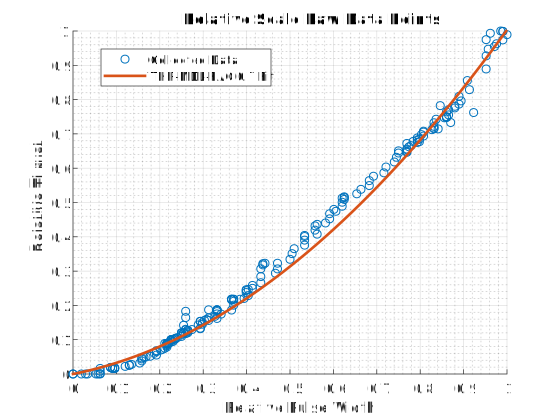

# 멀티콥터 PID 튜닝 가이드 (고급/상세) 

PX4 컨트롤러의 튜닝 방법에 대한 자세한 정보를 제공합니다.

:::tip
설명된 접근 방식이 직관적이므로 *호버 추력 지점 주변*의 기체을 튜닝시에는 [기본 PID 튜닝 가이드](pid_tuning_guide_multicopter_basic.md)를 따르는 것이 좋습니다. 이것은 대부분의 기체에 필요합니다.
:::

호버 추력 지점 주변의 튜닝이 충분하지 않을 때 이 가이드를 사용하십시오 (예 : 더 높은 추력에서 비선형성 및 진동이 방생하는 기체). 기본 튜닝을 충분히 이해하는 것이 [airmode](#airmode-mixer-saturation) 설정 사용법을 이해하는데 유용합니다.

## 튜닝 단계

:::note
안전상의 이유로 기본 게인은 낮은 값으로 설정됩니다. 적절한 제어 응답을 얻기 위해서는 게인 값을 적절하게 증가시켜야 합니다.
:::

튜닝시 준수할 일반적인 사항은 아래와 같습니다.

- 큰 이득은 위험한 진동을 발생시킬 수 있으므로, 모든 이득은 매우 천천히 증가시켜야합니다! 일반적으로 반복당 이득을 20~30%씩 증가시키고, 최종 미세 조정을 위해 5~10%로 줄입니다.
- 매개변수를 변경하기 전에 착륙시키십시오. 스로틀을 천천히 증가시키고 진동을 점검하십시오.
- 호버링 추력 지점을 중심으로 기체를 조정하고, [추력 곡선 매개 변수](#thrust-curve)를 사용하여 추력 비선형성 또는 높은 추력 진동을 설명합니다.
- 선택적으로 [SDLOG_PROFILE](../advanced_config/parameter_reference.md#SDLOG_PROFILE) 매개변수로 고속 로깅 프로필을 활성화하면 로그를 사용하여 비율과 태도 추적 성능을 평가할 수 있습니다 (이 옵션은 나중에 비활성화 할 수 있음).

:::warning
기체 튜닝시 항상 [MC_AIRMODE](../advanced_config/parameter_reference.md#MC_AIRMODE)를 비활성화 하십시오.
:::

### 속도 컨트롤러

속도 컨트롤러는 기체 속도(요, 피치, 롤)를 제어하는 3 개의 독립적인 PID 컨트롤러를 가지고 있는 가장 안쪽의 루프입니다.

:::note
훌륭하게 튜닝된 속도 컨트롤러는 *모든* 비행 모드에 영향을 미치므로 매우 중요합니다. 예를 들어, 잘못 튜닝한 속도 컨트롤러는 [위치 모드](../flight_modes/position_mc.md)에서 "twitches"로 표시됩니다 (기체가 공중에서 완벽하게 정지하지 않음).
:::

#### 속도 컨트롤러 아키텍처/양식

PX4는 단일 "혼합" 구현([병렬](#parallel-form) 및 [표준](#standard-form))에서 두 가지 (수학적으로 동등한) 형태의 PID 속도 컨트롤러를 지원합니다.

사용자는 다른 형식의 비례 이득을 "1"로 설정하여 사용되는 형식을 선택할 수 있습니다 (즉, 아래 다이어그램에서 병렬 형식의 경우 **K**을 1로 설정하거나 **P** 표준 형식의 경우 1로 설정하여 K 또는 P 블록을 한 줄로 바꿉니다).

 <!-- The drawing is on draw.io: https://drive.google.com/file/d/1hXnAJVRyqNAdcreqNa5W4PQFkYnzwgOO/view?usp=sharing -->

- *G(s)*는 기체의 각속도를 나타냅니다.
- *r*은 속도 설정점입니다.
- *y*는 신체 각속도 (자이로로 측정)입니다.
- *e*는 속도 설정값과 측정 속도 사이의 오류입니다.
- *u*는 PID 컨트롤러의 출력입니다.

두 가지 형식이 아래에 기술되어 있습니다.

:::note
미분항(**D**)은 [미분 킥](http://brettbeauregard.com/blog/2011/04/improving-the-beginner%E2%80%99s-pid-derivative-kick/) 효과를 회피하기 위하여 피드백 경로에 위치합니다.
:::

:::tip
자세한 내용은 아래의 내용을 참조하십시오.

- [모든 PID 컨트롤러가 같지 않습니다.](https://www.controleng.com/articles/not-all-pid-controllers-are-the-same/) (www.controleng.com) 
- [PID 컨트롤러 > 표준 대 병렬 (이상적인) PID 형식](https://en.wikipedia.org/wiki/PID_controller#Standard_versus_parallel_(ideal)_PID_form) (Wikipedia)
:::

##### 병렬 형식

*병렬 형식*은 가장 간단한 형식으로 교과서에서 많이 사용됩니다. 이 경우 컨트롤러의 출력은 간단한 비례, 적분 및 미분 동작의 합입니다.

##### 표준 형식

이 형식은 병렬 형식과 수학적으로 동일하지만 주요 이점은 (반 직관적으로 보일지라도) 비례 이득 튜닝을 적분과 미분 이득에서 분리하는 것입니다. 즉, 비슷한 크기와 관성을 가진 드론의 이득을 취하고 K 이득을 조정하여 적절하게 비행하는 방법으로 새로운 플랫폼을 쉽게 조정할 수 있습니다.

#### 속도 PID 튜닝

PID 속도 컨트롤러 튜닝 매개 변수는 다음과 같습니다.

- Roll 속도 제어 ([MC_ROLLRATE_P](../advanced_config/parameter_reference.md#MC_ROLLRATE_P), [MC_ROLLRATE_I](../advanced_config/parameter_reference.md#MC_ROLLRATE_I), [MC_ROLLRATE_D](../advanced_config/parameter_reference.md#MC_ROLLRATE_D), [MC_ROLLRATE_K](../advanced_config/parameter_reference.md#MC_ROLLRATE_K))
- Pitch 속도 제어 ([MC_PITCHRATE_P](../advanced_config/parameter_reference.md#MC_PITCHRATE_P), [MC_PITCHRATE_I](../advanced_config/parameter_reference.md#MC_PITCHRATE_I), [MC_PITCHRATE_D](../advanced_config/parameter_reference.md#MC_PITCHRATE_D), [MC_PITCHRATE_K](../advanced_config/parameter_reference.md#MC_PITCHRATE_K))
- Yaw 속도 제어 ([MC_YAWRATE_P](../advanced_config/parameter_reference.md#MC_YAWRATE_P), [MC_YAWRATE_I](../advanced_config/parameter_reference.md#MC_YAWRATE_I), [MC_YAWRATE_D](../advanced_config/parameter_reference.md#MC_YAWRATE_D), [MC_YAWRATE_K](../advanced_config/parameter_reference.md#MC_YAWRATE_K))

속도 콘트롤러는 [곡예 모드](../flight_modes/acro_mc.md)와 [수동/안정 모드](../flight_modes/manual_stabilized_mc.md)에서 튜닝할 수 있습니다.

- *곡예 모드* 는 비행 조종이 어렵습니다. 이 모드를 선택하는 경우 모든 스틱 엑스포를 비활성화하십시오. 
  - `MC_ACRO_EXPO` = 0, `MC_ACRO_EXPO_Y` = 0, `MC_ACRO_SUPEXPO` = 0, `MC_ACRO_SUPEXPOY` = 0
  - `MC_ACRO_P_MAX` = 200, `MC_ACRO_R_MAX` = 200
  - `MC_ACRO_Y_MAX` = 100
- *수동/안정 모드*는 비행이 용이하지만, 자세 또는 속도 컨트롤러에 어느 정도의 튜닝이 필요한지 확인하는 것이 어렵습니다.

기체 비행이 되지 않는 경우:

- 첫 이륙 시도시 (비행하지 않는 지점까지) 강한 진동이 있으면, 이륙이 성공할 때 까지 **P**와 **D** 게인을 줄입니다.
- RC 움직임에 대한 반응이 미미하면 **P** 게인을 높입니다.

실제 튜닝은 *수동 모드 * 또는 *곡예 모드*에서 거의 동일합니다. 롤 및 피치에 대해 **P**와 **D** 게인을 반복적으로 조정한 다음 **I** 게인을 조정합니다. 처음에는 롤과 피치에 동일한 값을 사용할 수 있으며, 좋은 값을 얻은 후에는 롤과 피치 응답을 개별적으로 확인하여 미세 조정할 수 있습니다 (기체가 대칭인 경우 필요하지 않음). yaw의 경우 **D**를 0으로 둘 수 있다는 점을 제외하면 매우 유사합니다.

##### 비례 이득 (P/K)

비례 이득은 추적 오류를 최소화하는 데 사용됩니다 (아래에서 **P** 또는 **K**를 참조하기 위하여 **P**를 사용합니다). 빠른 응답을 담당하므로 가능한 높게 설정하여야 하지만, 진동이 발생하지 않아야 합니다.

- **P** 게인이 너무 높은 경우, 고주파 진동이 나타납니다.
- **P** 게인이 너무 낮은 경우: 
  - 기체가 입력 변화에 느리게 반응합니다.
  - *곡예 모드*에서는 기체가 표류하므로, 레벨을 유지를 위하여 지속적으로 수정하여야 합니다.

##### 미분 이득 (D)

**D** 미분 게인은 속도 댐핑에 사용됩니다. 오버 슈트를 제거하기 위하여 적절하게 높은 값으로 설정합니다.

- **D** 게인이 너무 높은 경우 : **D** 항이 소음을 증폭하기 때문에, 모터가 경련을 일으키고 뜨거워집니다.
- **D** 게인이 너무 낮은 경우 : 스텝 입력 후 오버 슈트가 나타납니다.

일반적인 값은 다음과 같습니다.

- 표준 형식 (**P** = 1) : **K** 값에 대하여 0.01 (4 "레이서)에서 0.04 (500 크기) 사이 
- 병렬 형식 (**K** = 1) : **P** 값에 따라 0.0004에서 0.005 사이

##### 적분 이득 (I)

**I** (적분) 이득은 오류 메모리를 유지합니다. **I** 항은 원하는 비율에 얼마 동안 도달하지 않으면 증가합니다. 중요하지만 (특히 *곡예 모드*를 비행시) 너무 높게 설정해서는 안 됩니다.

- I 게인이 너무 높으면 느린 진동이 나타납니다.
- I 게인이 너무 낮은 경우 : 차량을 한쪽으로 약 45도 기울이고 그대로 유지하여 *곡예 모드*에서 테스트하는 것이 가장 좋습니다. 같은 각도를 유지하여야 합니다. 뒤로 드리프트하면 **I** 게인을 늘립니다. 더 긴 시간 동안 원하는 속도와 실제 속도 사이에 오프셋이 있을 때 낮은 **I** 게인도 로그에 표시됩니다.

일반적인 값은 다음과 같습니다.

- 표준 형식 (**P** = 1) : **K** 값에 대하여 0.5 (VTOL 평면), 1 (500 크기) 및 8 (4 "레이서) 사이,
- 평행 형식 (**K** = 1) : **P**가 약 0.15 인 경우 0.3에서 0.5 사이 피치 게인은 일반적으로 롤 게인보다 약간 높아야 합니다.

#### 테스트 절차

현재 이득을 테스트하려면 호버링시 빠른 **단계 입력**을 제공하고 기체의 반응을 관찰하십시오. 명령을 즉시 반등하여야 하며, 진동이나 오버슛이 발생하지 않아야 합니다 ( '고정'된 느낌).

예를 들어 롤용 스텝 입력을 만들 수 있습니다. 롤 스틱을 한쪽으로 빠르게 밀었다가 다시 빠르게 놓아줍니다 (스프링이므로 스틱을 놓으면 스틱도 진동합니다. 잘 튜닝된 기체는 이러한 진동에 반응합니다).

:::note
*곡예 모드*에서 잘 튜닝된 기체는 한쪽으로 기울지 않지만, 수정 없이도 수십 초 동안 같은 자세를 유지합니다.
:::

#### 로그

로그는 추적 성능 평가에 많은 도움이 됩니다. 다음은 롤과 요 속도 추적의 좋은 예입니다.

 

다음은 극단적인 스텝 입력을 생성하는 몇 번의 플립으로 롤 속도를 추적하는 좋은 예입니다. 기체에 아주 적은 양의 오버 슈트가 발생하는 것을 볼 수 있습니다. 

### 자세 컨트롤러

이것은 방향과 아래의 튜닝 매개변수를 사용하여 기체의 비율의 출력을 제어합니다.

- Roll 제어 ([MC_ROLL_P](../advanced_config/parameter_reference.md#MC_ROLL_P))
- Pitch 제어([MC_PITCH_P](../advanced_config/parameter_reference.md#MC_PITCH_P))
- Yaw 제어 ([MC_YAW_P](../advanced_config/parameter_reference.md#MC_YAW_P))

자세 컨트롤러의 튜닝은 비교적 간단합니다. 대부분 기본값을 변경할 필요가 없습니다.

자세 컨트롤러를 튜닝시에는 *수동/안정 모드*로 비행하고 **P** 게인을 점진적으로 증가시킵니다. 진동이나 오버슈트가 나타나는 것은 게인이 너무 높은 것입니다.

아래의 매개변수를 조정할 수 있습니다. 세 축의 최대 회전 속도를 결정합니다.

- 최대 롤 회전속도([MC_ROLLRATE_MAX](../advanced_config/parameter_reference.md#MC_ROLLRATE_MAX))
- 최대 피치 회전 속도 ([MC_PITCHRATE_MAX](../advanced_config/parameter_reference.md#MC_PITCHRATE_MAX))
- 최대 요 회전 속도 ([MC_YAWRATE_MAX](../advanced_config/parameter_reference.md#MC_YAWRATE_MAX))

### 추력 곡선

위의 튜닝은 호버 스로틀 주위의 성능을 최적화합니다. 그러나 풀 스로틀로 갈 때 진동이 시작될 수 있습니다.

이를 막으려면 [THR_MDL_FAC](../advanced_config/parameter_reference.md#THR_MDL_FAC) 매개 변수로 **추력 곡선**을 조정하십시오.

:::note
이 매개변수를 변경하면 속도 컨트롤러를 다시 조정하여야 할 수 있습니다.
:::

모터 제어 신호 (예 : PWM)에서 예상 추력으로의 매핑은 기본적으로 선형입니다. `THR_MDL_FAC`를 1로 설정하면 2 차가됩니다. 그 사이의 값은 둘의 선형 보간을 사용합니다. 일반적인 값은 0.3 ~ 0.5 입니다.

[스러스트 스탠드](https://www.rcbenchmark.com/pages/series-1580-thrust-stand-dynamometer)가 있는 (또는 추력 및 모터 명령을 동시에 *측정* 할 수 있는 경우) 경우 에는, 모터 제어 신호와 모터의 실제 추력 사이의 관계를 결정하고 기능을 데이터에 맞출 수 있습니다. `actuator_output`이라고하는 PX4의 모터 명령은 사용중인 각 ESC에 대한 PWM, Dshot, UAVCAN 명령 일 수 있습니다. [이 노트북](https://github.com/PX4/px4_user_guide/blob/master/assets/config/mc/ThrustCurve.ipynb)은 이전에 측정 된 추력과 PWM 데이터에서 추력 모델 계수 `THR_MDL_FAC`를 계산하는 방법을 설명합니다. 이 플롯에 표시된 곡선은 &alpha; k, 실제 단위 (kgf 및 &mu;s)로 추력과 PWM을 표시합니다. 곡선 맞춤 문제를 단순화하기 위해 &alpha;를 추정하지 않고도 `k`를 찾기 위해 0과 1 사이의 데이터를 정규화 할 수 있습니다(&alpha; = 1, 데이터가 정규화 될 때).

:::note PWM과 정적 추력간의 매핑은 배터리 전압에 따라 크게 달라집니다.
:::

이 실험의 또 다른 방법은 정규화된 모터 명령과 추력 값의 산점도를 만들고 `THR_MDL_FAC` 매개변수로 실험하여 추력 곡선을 반복적으로 조정하는 것입니다. 해당 그래프의 예는 아래와 같습니다.

원시 모터 명령 및 추력 데이터가 실험의 전체 범위에 걸쳐 수집되는 경우, 다음 방정식을 사용하여 데이터를 정규화할 수 있습니다.

*normalized_value = ( raw_value - min (raw_value) ) / ( max ( raw_value ) - min ( raw_value ) )*

정규화된 값의 산점도를 얻은 후 방정식을 플로팅하여 곡선을 일치시킬 수 있습니다.

*rel_thrust = ( `THR_MDL_FAC` ) * rel_signal^2 + ( 1 - `THR_MDL_FAC` ) * rel_signal*

0과 1 사이의 정규화된 모터 명령 값의 선형 범위. 이것은 [THR_MDL_FAC](../advanced_config/parameter_reference.md#THR_MDL_FAC) 매개변수 참조에 표시된 것처럼 추력과 모터 명령을 매핑하기 위해 펌웨어에서 사용되는 방정식입니다. 여기서 *rel_thrust*는 0과 1 사이의 정규화된 추력 값이고 *rel_signal*은 0과 1 사이의 정규화된 모터 명령 신호 값입니다.

위의 예에서 곡선은 `THR_MDL_FAC`가 0.7로 설정되었을 때 가장 좋은 결과를 나타내었습니다.

스러스트 스탠드에 접근할 수 없는 경우, 경험적으로 모델링 요소를 조정할 수 있습니다. 0.3부터 시작하여 한 번에 0.1 씩 늘립니다. 너무 높으면, 낮은 스로틀 값에서 진동이 감지되기 시작합니다. 너무 낮으면, 더 높은 스로틀 값에서 진동이 나타납니다.

<!-- TODO
### Velocity & Position Controller
The PID-Gains should be chosen such that tracking is as tight as possible. Before doing any position/velocity control related tuning,
turn off all [higher-level position controller tuning gains](../config_mc/mc_trajectory_tuning.md).

- [MPC_ACC_HOR_MAX](../advanced_config/parameter_reference.md#MPC_ACC_HOR_MAX): 1000
- [MPC_ACC_HOR](../advanced_config/parameter_reference.md#MPC_ACC_HOR) : 1000
- [MPC_DEC_HOR_SLOW](../advanced_config/parameter_reference.md#MPC_DEC_HOR_SLOW) : 1000
- [MPC_ACC_UP_MAX](../advanced_config/parameter_reference.md#MPC_ACC_UP_MAX) : 1000
- [MPC_ACC_DOWN_MAX](../advanced_config/parameter_reference.md#MPC_ACC_DOWN_MAX) : 1000
- [MPC_JERK_MAX](../advanced_config/parameter_reference.md#MPC_JERK_MAX) : 0
- [MPC_JERK_MIN](../advanced_config/parameter_reference.md#MPC_JERK_MIN) : 1
 -->

### 에어 모드 & 믹서 포화

속도 컨트롤러는 세 축 (roll, pitch 및 yaw)에 대한 토크 명령과 스칼라 추력값을 출력하며, 이는 개별 모터 추력 명령으로 변환하여야 합니다. 이 단계를 믹싱이라고 합니다.

예를 들어 낮은 추력과 큰 롤 명령의 경우 모터 명령 중 하나가 음수가 될 수 있습니다 (비슷하게 100 % 이상이 될 수 있음). 이것은 믹서 포화입니다. 기체가 이 명령을 실행하는 것은 물리적으로 불가능합니다 (가역 모터 제외). PX4에는 이 문제를 해결하기 위한 두 가지 모드가 있습니다.

- 롤에 대한 명령된 토크를 줄여 모터 명령이 0 미만이 되지 않도록합니다 (에어 모드 비활성화 됨). 명령된 추력이 0 인 극단적인 경우에는 더 이상 자세 보정이 가능하지 않으므로이 모드에 항상 최소 추력이 필요합니다.
- 또는 명령된 추력을 증가시켜 모터 명령이 음수값이 되지 않도록 합니다(에어 모드 활성화). 이것은 낮은 스로틀이나 제로 스로틀에서도 자세/속도를 정확하게 추적할 수 있는 큰 장점이 있습니다. 일반적으로 비행 성능을 향상시킵니다.
  
  그러나, 이는 스로틀이 0으로 감소하더라도 기체가 계속 상승하도록 총추력을 증가시킵니다. 잘 조정되고 올바르게 작동하는 기체에는 제외하고, 너무 높은 P 조정 이득으로 인하여 기체가 강하게 진동할 때 발생할 수 있습니다.

두 모드는 두 모터에 대한 2D 그림과 롤 r에 대한 토크 명령은 아래에 표시되어 있습니다. 왼쪽 모터에서는 r이 명령된 추력에 추가되고, 오른쪽 모터에서는 차감됩니다. 모터 추력은 녹색입니다. Airmode를 활성화하면 명령된 추력이 b 만큼 증가합니다. 비활성화되면, r이 감소합니다.

 <!-- The drawing is on draw.io: https://drive.google.com/file/d/1N0qjbiJX6JuEk2I1-xFvigLEPKJRIjBP/view?usp=sharing
     On the first Tab
-->

혼합이 상한선으로 포화되면, 명령된 추력이 감소되어 모터가 100 % 이상의 추력을 전달하지 않도록 합니다. 이 동작은 Airmode 로직과 유사하며 Airmode 활성화 여부에 관계없이 적용됩니다.

기체 비행이 성공적이면 [MC_AIRMODE](../advanced_config/parameter_reference.md#MC_AIRMODE) 매개변수를 통하여 에어 모드를 활성화 할 수 있습니다.