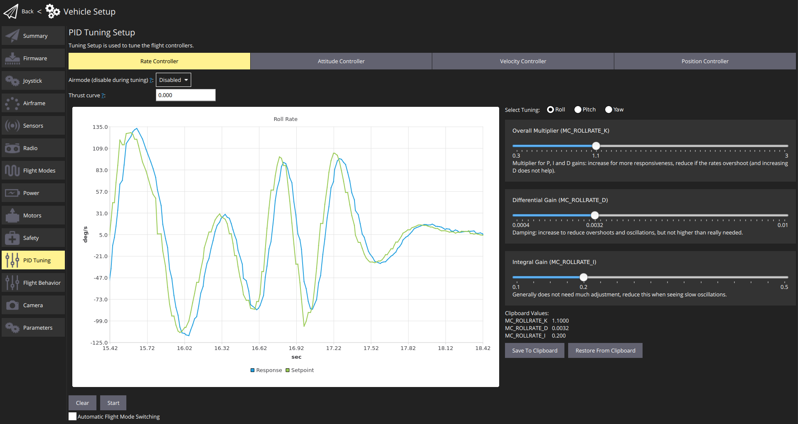

# 멀티콥터 PID 튜닝 가이드

이 튜토리얼은 모든 [멀티콥터 설정](../airframes/airframe_reference.md#copter) (Quads, Hexa, Octo 등)에 대해 PX4에서 PID 루프를 조정하는 방법을 설명합니다.

비교적 작은 하드웨어와 어셈블리 변경이 최적의 비행  튜닝 게인에 영향을 미치므로,  새로운 기체 설정에 튜닝이 권장됩니다. 예를 들어, 새로운 ESC 또는 모터에는 다른 튜닝 게인이 필요합니다.
:::

Generally if you're using an appropriate [supported frame configuration](../airframes/airframe_reference.md#copter), the default tuning should allow you to fly the vehicle safely. 모든 새 차량 설정이 _최고의_ 성능을 얻을 수 있도록 조정하는 것이 좋습니다. 상대적으로 작은 하드웨어와 조립품 변경이 최적의 비행을 위해 필요한 조정 이득에 영향을 줄 수 있기 때문입니다. For example, different ESCs or motors change the optimal tuning gains.

## 소개

PX4 uses **P**roportional, **I**ntegral, **D**erivative (PID) controllers (these are the most widespread control technique).

_QGroundControl_ **PID 튜닝** 설정은 기체 설정점과 응답 곡선의 실시간 플롯을 제공합니다. 튜닝의 목표는 _Response_ 곡선이 _Setpoint_ 곡선과 최대한 가깝게 일치하도록 P/I/D 값을 설정하는 것입니다 (예 : 오버슈트없는 빠른 응답).

컨트롤러는 계층화되어 있어 상위 수준의 컨트롤러 결과를 하위 수준의 컨트롤러로 전달합니다. 가장 낮은 수준의 컨트롤러는 **속도 컨트롤러**, **태도 컨트롤러**, 마지막으로 **속도 & 위치 컨트롤러** 입니다. PID 튜닝은 다른 모든 컨트롤러에 영향을 미치므로 속도 컨트롤러부터 시작하여 동일한 순서로 수행해야합니다.

컨트롤러는 계층화되어 있어 상위 수준의 컨트롤러 결과를 하위 수준의 컨트롤러로 전달합니다. 가장 낮은 수준의 컨트롤러는 **속도 컨트롤러**, **태도 컨트롤러**, 마지막으로 **속도 & 위치 컨트롤러** 입니다.

:::tip
- 속도 컨트롤러 조정이 가장 중요하며 잘 조정된 경우 다른 컨트롤러는 종종 약간의 조정만 필요하거나 필요하지 않습니다.
- 일반적으로 롤 및 피치에 동일한 튜닝 게인을 사용할 수 있습니다.
- 곡예/안정화/고도 모드를 사용하여 속도 컨트롤러 조정
- Use [Position mode](../flight_modes_mc/position.md) to tune the *Velocity Controller* and the *Position Controller*. 단계 입력을 생성할 수 있도록 *단순 위치 제어* 모드로 전환하여야 합니다. 
:::

## 전제 조건:

- You have selected the closest matching [default frame configuration](../config/airframe.md) for your vehicle. 이것은 이미 비행한 기체를 제공할 것입니다.
- [ESC 보정](../advanced_config/esc_calibration.md)을 완료하여야 합니다.
- If using PWM outputs their minimum values should be set correctly in the [Actuator Configuration](../config/actuators.md#actuator-configuration-and-testing). These need to be set low, but such that the **motors never stop** when the vehicle is armed.

  This can be tested in [Acro mode](../flight_modes_mc/acro.md) or in [Manual/Stabilized mode](../flight_modes_mc/manual_stabilized.md):
  - 프로펠러 제거
  - 기체에 시동을 걸고 스로틀을 최소로 내립니다.
  - 차량을 모든 방향으로 60도 정도 기울입니다.
  - 모터가 꺼져 있는 지 확인합니다.
- PWM 출력을 사용하는 경우 : [PWM_MIN](../advanced_config/parameter_reference.md#PWM_MIN)이 올바르게 설정되었습니다. 낮게 설정해야하지만 기체 시동시에는 **모터가 절대 멈추지 않도록**합니다.
- 기체 튜닝전에 [MC_AIRMODE](../advanced_config/parameter_reference.md#MC_AIRMODE)를 비활성화하십시오 (PID 튜닝 화면에 이에 대한 옵션이 있습니다).

:::warning
잘못 튜닝된 기체는 불안정하고 충돌 가능성이 높아집니다. [킬 스위치](../config/safety.md#emergency-switches)를 지정했는 지 확인하십시오.
:::

## 튜닝 절차

튜닝 절차는 다음과 같습니다.

1. Arm the vehicle, takeoff, and hover (typically in [Position mode](../flight_modes_mc/position.md)).
1. _QGroundControl_을 실행합니다. **차량 설정 > PID 튜닝** 
1. **Rate Controller** 탭을 선택하십시오.
1. 에어 모드 선택기가 **사용 안함**으로 설정되어 있는 지 확인합니다.
1. *추력 곡선* 값을 0.3 (PWM, 전력 기반 컨트롤러) 또는 1 (RPM 기반 ESC)로 설정합니다.

   :::note PWM, 전력 기반 및 (일부) UAVCAN 속도 컨트롤러의 경우 추력 관계에 대한 제어 신호가 선형이 아닐 수 있습니다. 그 결과 호버 추력에서 최적의 튜닝은 차량이 강한 추력으로 작동시 최적이 아닐 수 있습니다.

   추력 곡선 값을 사용하여 비선형성을 보상할 수 있습니다.
   - PWM 컨트롤러의 경우 0.3이 좋은 기본값입니다 ([추가 조정](../config_mc/pid_tuning_guide_multicopter.md#thrust-curve)의 이점을 누릴 수 있음).
   - RPM 기반 컨트롤러의 경우 1을 사용합니다 (2 차 추력 곡선이 있으므로 추가 튜닝이 필요하지 않음).

   자세한 내용은 [자세한 PID 튜닝 가이드](../config_mc/pid_tuning_guide_multicopter.md#thrust-curve)를 참조하십시오.
:::
1. *튜닝 선택* 라디오 버튼을 **롤**로 설정합니다.
1. (선택 사항) **자동 비행 모드 전환** 확인란을 선택합니다. This will _automatically_ switch from [Position mode](../flight_modes_mc/position.md) to [Stabilised mode](../flight_modes_mc/manual_stabilized.md) when you press the **Start** button
1. 속도 컨트롤러 튜닝의 경우 *곡예 모드*, *안정화 모드* 또는 *고도 모드*로 전환합니다 (자동 전환이 활성화되지 않은 경우).
1. 설정점과 응답 곡선 추적을 시작하려면 **시작** 버튼을 클릭합니다.
1. *롤 스틱* 전체 범위를 빠르게 이동하고 플롯에서 계단 응답을 관찰합니다. :::tip 플롯을 더 쉽게 검사 할 수 있도록 추적을 중지하십시오. 확대/축소/이동시 자동으로 발생합니다. 플롯을 다시 시작하려면 **시작** 버튼을 사용하고 재설정하려면 **지우기** 버튼을 사용합니다.
:::
1. 슬라이더를 사용하여 3 개의 PID 값을 수정하고 (롤 속도 조정을 위해 `MC_ROLLRATE_K`, `MC_ROLLRATE_I`, `MC_ROLLRATE_D`에 영향을 미칩니다) 단계 응답을 다시 관찰합니다. 슬라이더를 움직이면 값이 기체에 저장됩니다. :::note 목표는 _Response_ 곡선이 _Setpoint_ 곡선과 최대한 가깝게 일치하는 것입니다 (예 : 오버슈트없는 빠른 응답). ::: PID 값은 다음과 같이 조정할 수 있습니다.
   - P (비례) 또는 K 이득 :
     - 더 많은 응답을 위해 이것을 늘리십시오.
     - 응답이 오버 슈팅 및/또는 진동하는 경우 감소합니다 (특정 지점까지 D 게인 증가도 도움이 됨).
   - D (미분) 이득 :
     - 오버슈트 및 진동을 줄이기 위해이 값을 늘릴 수 있습니다.
     - 소음을 증폭하고 모터가 뜨거워 질 수 있으므로 필요한 만큼만 늘리십시오.
   - I (적분) 이득 :
     - 정상 상태 오류를 줄이는 데 사용
     - 너무 낮으면 응답이 설정 값에 도달하지 못할 수 있습니다 (예 : 바람)
     - 너무 높으면 느린 진동이 발생할 수 있습니다.
1. 피치와 요에 대해 위의 튜닝 프로세스를 반복합니다.
   - *튜닝 선택* 라디오 버튼을 사용하여 튜닝 축을 선택합니다.
   - 적절한 스틱을 이동합니다 (예 : 피치 스틱, 요 스틱).
   - 피치 튜닝의 경우 롤과 동일한 값으로 시작하십시오. :::tip 초기 피치 설정에 대한 롤 설정을 복사하려면 **클립 보드에 저장** 및 **클립 보드에서 재설정** 버튼을 사용합니다.
:::
1. 모든 축에서 자세 콘트롤러에 대하여 튜닝 프로세스를 반복하십시오.
1. 속도 및 위치 컨트롤러 (모든 축에서)에 대해 튜닝 프로세스를 반복합니다.
   - 이러한 컨트롤러를 조정할 때 위치 모드를 사용하십시오.
   - *위치 제어 모드 ... * 선택기에서 **간단한 위치 제어** 옵션을 선택합니다 (이렇게하면 단계 입력 생성을 직접 제어할 수 있음).

     

완료되었습니다 ! 설정을 종료하기 전에 에어 모드를 다시 활성화하여야 합니다.
