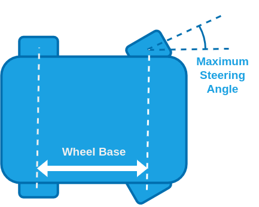

# Configuration/Tuning (Ackermann Rover)

This topic provides a step-by-step guide for setting up your [Ackermann rover](../frames_rover/ackermann.md).

Successive steps enable [drive modes](../flight_modes_rover/ackermann.md) with more autopilot support and features.

:::warning
Each step is dependent on the previous steps having been completed.
Modes will only work properly if the preceding modes have been configured.
:::

## Basic Setup

To configure the Ackermann rover frame and outputs:

1. Enable Rover support by flashing the [PX4 rover build](../frames_rover/index.md#flashing-the-rover-build) onto your flight controller.
   Note that this is a special build that contains rover-specific modules.

2. In the [Airframe](../config/airframe.md) configuration select the _Generic Rover Ackermann_:

   

   Select the **Apply and Restart** button.

   ::: info
   If this airframe is not displayed and you have checked that you are using rover firmware (not the default), you can alternatively enable this frame by setting the [SYS_AUTOSTART](../advanced_config/parameter_reference.md#SYS_AUTOSTART) parameter to `51000`.

:::

3. Open the [Actuators Configuration & Testing](../config/actuators.md) to map the steering and throttle functions to flight controller outputs.

## 수동 모드

:::warning
For this mode to work properly the [Basic Setup](#basic-setup) must've already been completed!
:::

The basic setup already covers the minimum setup required to use the rover in [Manual mode](../flight_modes_rover/ackermann.md#manual-mode).

However, this mode is also affected by the steering slew rate and acceleration/deceleration limits. This configuration becomes mandatory for subsequent modes, which is why we do this setup here.
Navigate to [Parameters](../advanced_config/parameters.md) in QGroundControl and set the following parameters:

1. [RA_WHEEL_BASE](#RA_WHEEL_BASE) [m]: Measure the distance from the back to the front wheels.

2. [RA_MAX_STR_ANG](#RA_MAX_STR_ANG) [deg]: Measure the maximum steering angle.

   

3. [RA_MAX_THR_SPEED](#RA_MAX_THR_SPEED) [m/s]: Drive the rover at full throttle and set this parameter to the observed value of the ground speed.

   :::info
   This parameter is also used for the feed-forward term of the speed control. It will be further tuned in the configuration of [Position mode](#position-mode).

:::

4. [RA_MAX_ACCEL](#RA_MAX_ACCEL) [m/s^2]: Maximum acceleration you want to allow for your rover.

   

   :::tip
   Your rover has a maximum possible acceleration which is determined by the maximum torque the motor can supply.
   This may or may not be appropriate for your vehicle and use case.

   One approach to determine an appropriate value is:

   1. From a standstill, give the rover full throttle until it reaches the maximum speed.
   2. Disarm the rover and plot the `measured_forward_speed` from [RoverAckermannStatus](../msg_docs/RoverAckermannStatus.md).
   3. Divide the maximum speed by the time it took to reach it and set this as the value for [RA_MAX_ACCEL](#RA_MAX_ACCEL).

   Some RC rovers have enough torque to lift up if the maximum acceleration is not limited.
   If that is the case:

   1. Set [RA_MAX_ACCEL](#RA_MAX_ACCEL) to a low value, give the rover full throttle from a standstill and observe its behaviour.
   2. Increase [RA_MAX_ACCEL](#RA_MAX_ACCEL) until the rover starts to lift up during the acceleration.
   3. Set [RA_MAX_ACCEL](#RA_MAX_ACCEL) to the highest value that does not cause the rover to lift up.

:::

5. [RA_MAX_DECEL](#RA_MAX_DECEL) [m/s^2]: Maximum deceleration you want to allow for your rover.

   :::tip
   The same [considerations](#RA_MAX_ACCEL_CONSIDERATIONS) as in the configuration of [RA_MAX_ACCEL](#RA_MAX_ACCEL) apply.

:::

   :::info
   This parameter is also used for the calculation of the speed setpoint during [Auto modes](#auto-modes).

:::

6. (Optional) [RA_MAX_STR_RATE](#RA_MAX_STR_RATE) [deg/s]: Maximum steering rate you want to allow for your rover.

   :::tip
   This value depends on your rover and use case.
   For bigger rovers there might be a mechanical limit that is easy to identify by steering the rover at a standstill and increasing
   [RA_MAX_STR_RATE](#RA_MAX_STR_RATE) until you observe the steering rate to no longer be limited by the parameter.
   For smaller rovers you might observe the steering to be too aggressive. Set [RA_MAX_STR_RATE](#RA_MAX_STR_RATE) to a low value and steer the rover at a standstill.
   Increase the parameter until you reach the maximum steering rate you are comfortable with.

:::

   :::warning
   A low maximum steering rate makes the rover worse at tracking steering setpoints, which can lead to a poor performance in the subsequent modes.

:::

## Acro Mode

:::warning
For this mode to work properly [Manual mode](#acro-mode) must've already been configured!
:::

To set up [Acro mode](../flight_modes_rover/ackermann.md#acro-mode) configure the following [parameters](../advanced_config/parameters.md) in QGroundControl:

1. [RA_MAX_LAT_ACCEL](#RA_MAX_LAT_ACCEL): Maximum lateral acceleration you want to allow for your rover.

   :::tip
   Limiting the lateral acceleration is necessary if the rover is prone rolling over, loosing traction at high speeds or if passenger comfort is important.
   Small rovers especially can be prone to rolling over when steering aggressively at high speeds.

   If this is the case:

   1. In [Acro mode](../flight_modes_rover/ackermann.md#acro-mode), set [RA_MAX_LAT_ACCEL](#RA_MAX_LAT_ACCEL) to a small value and drive the rover at full throttle and with the right stick all the way to the left or right.
   2. Increase [RA_MAX_LAT_ACCEL](#RA_MAX_LAT_ACCEL) until the wheels of the rover start to lift up.
   3. Set [RA_MAX_LAT_ACCEL](#RA_MAX_LAT_ACCEL) to the highest value that does not cause the rover to lift up.

   If you see no need to limit the lateral acceleration, set this parameter to the maximum lateral acceleration the rover can achieve:

   1. In [Manual mode](#manual-mode) drive the rover at full throttle and with the maximum steering angle.
   2. Plot the `measured_lateral_acceleration` from [RoverAckermannStatus](../msg_docs/RoverAckermannStatus.md) and enter the highest observed value for [RA_MAX_LAT_ACCEL](#RA_MAX_LAT_ACCEL).

:::

2. [RA_LAT_ACCEL_P](#RA_LAT_ACCEL_P) [-]: Proportional gain of the closed loop lateral acceleration controller.
   The closed loop acceleration control will compare the lateral acceleration setpoint with the measured lateral acceleration and adapt the motor commands based on the error between them.
   The proportional gain is multiplied with this error and that value is added to the motor command. This way disturbances like uneven grounds or external forces can be compensated.

   :::tip
   To tune this parameter:

   1. Put the rover in [Acro mode](../flight_modes_rover/ackermann.md#acro-mode) and hold the throttle stick and the right stick at a few different levels for a couple of seconds each.
   2. Disarm the rover and from the flight log plot the `lateral_acceleration_setpoint` from [RoverAckermannSetpoint](../msg_docs/RoverAckermannSetpoint.md) and the `measured_lateral_acceleration` from [RoverAckermannStatus](../msg_docs/RoverAckermannStatus.md) over each other.
   3. Increase [RA_LAT_ACCEL_P](#RA_LAT_ACCEL_P) if the measured value does not track the setpoint fast enough or decrease it if the measurement overshoots the setpoint by too much.
   4. Repeat until you are satisfied with the behaviour.

   Note that the lateral acceleration measurement is very noisy and therefore needs to be heavily filtered.
   This means that the measurement is slightly delayed, so if you observe a slight offset in time between the setpoint and measurement, that is not something that can be fixed with tuning.

:::

3. (Optional) [RA_LAT_ACCEL_I](#RA_LAT_ACCEL_I) [-]: Integral gain of the closed loop lateral acceleration controller.
   The integral gain accumulates the error between the desired and actual lateral acceleration scaled by the integral gain over time and that value is added to the motor command.

   ::: tip
   The integrator gain is usually not necessary for the lateral acceleration setpoint as this is usually a fast changing value.
   Leave this parameter at zero unless necessary, as it can have negative side effects such as overshooting or oscillating around the setpoint.

:::

The rover is now ready to drive in [Acro mode](../flight_modes_rover/ackermann.md#acro-mode).

## Position Mode

:::warning
For this mode to work properly [Acro mode](#acro-mode) must already be configured!
:::

[Position mode](../flight_modes_rover/ackermann.md#position-mode) is the most advanced manual mode, utilizing closed loop lateral acceleration and speed control and leveraging position estimates.

To configure set the following parameters:

1. [RA_MAX_SPEED](#RA_MAX_SPEED) [m/s]: This is the maximum speed you want to allow for your rover.
   This will define the stick-to-speed mapping for position mode and set an upper limit for the speed setpoint for all [auto modes](#auto-modes).

2. [RA_MAX_THR_SPEED](#RA_MAX_THR_SPEED) [m/s]: This parameter is used to calculate the feed-forward term of the closed loop speed control which linearly maps desired speeds to normalized motor commands.
   As mentioned in the [Manual mode](../flight_modes_rover/ackermann.md#manual-mode) configuration , a good starting point is the observed ground speed when the rover drives at maximum throttle in [Manual mode](../flight_modes_rover/ackermann.md#manual-mode).

   

   ::: tip
   To further tune this parameter:

   1. Set [RA_SPEED_P](#RA_SPEED_P) and [RA_SPEED_I](#RA_SPEED_I) to zero.
      This way the speed is only controlled by the feed-forward term, which makes it easier to tune.
   2. Put the rover in [Position mode](../flight_modes_rover/ackermann.md#position-mode) and then move the left stick of your controller up and/or down and hold it at a few different levels for a couple of seconds each.
   3. Disarm the rover and from the flight log plot the `adjusted_forward_speed_setpoint` and the `measured_forward_speed` from the [RoverAckermannStatus](../msg_docs/RoverAckermannStatus.md) message over each other.
   4. If the actual speed of the rover is higher than the speed setpoint, increase [RA_MAX_THR_SPEED](#RA_MAX_THR_SPEED).
      If it is the other way around decrease the parameter and repeat until you are satisfied with the setpoint tracking.

:::

   ::: info
   If your rover oscillates when driving a straight line in [Position mode](../flight_modes_rover/ackermann.md#position-mode), set this parameter to the observed ground speed at maximum throttle in [Manual mode](../flight_modes_rover/ackermann.md#manual-mode) and complete steps 5-7 first before continuing the tuning of the closed loop speed control (Steps 2-4).

:::

3. [RA_SPEED_P](#RA_SPEED_P) [-]: Proportional gain of the closed loop speed controller.

   ::: tip
   This parameter can be tuned the same way as [RA_MAX_THR_SPEED](#RA_SPEED_TUNING).
   If you tuned [RA_MAX_THR_SPEED](#RA_MAX_THR_SPEED) well, you might only need a very small value.

:::

4. [RA_SPEED_I](#RA_SPEED_I) [-]: Integral gain for the closed loop speed controller.

   ::: tip
   For the closed loop speed control an integrator gain is useful because this setpoint is often constant for a while and an integrator eliminates steady state errors that can cause the rover to never reach the setpoint.

:::

5. [PP_LOOKAHD_GAIN](#PP_LOOKAHD_GAIN): When driving in a straight line (right stick centered) position mode leverages the same path following algorithm used in [auto modes](#auto-modes) called [pure pursuit](#pure-pursuit-guidance-logic) to achieve the best possible straight line driving behaviour ([Illustration of control architecture](#pure_pursuit_controller)).
   This parameter determines how aggressive the controller will steer towards the path.

   ::: tip
   Decreasing the parameter makes it more aggressive but can lead to oscillations.

   To tune this:

   1. Start with a value of 1 for [PP_LOOKAHD_GAIN](#PP_LOOKAHD_GAIN)
   2. Put the rover in [Position mode](../flight_modes_rover/ackermann.md#position-mode) and while driving a straight line at approximately half the maximum speed observe its behaviour.
   3. If the rover does not drive in a straight line, reduce the value of the parameter, if it oscillates around the path increase the value.
   4. Repeat until you are satisfied with the behaviour.

:::

6. [PP_LOOKAHD_MIN](#PP_LOOKAHD_MIN): Minimum threshold for the lookahead distance used by the [pure pursuit algorithm](#pure-pursuit-guidance-logic).

   ::: tip
   Put the rover in [Position mode](../flight_modes_rover/ackermann.md#position-mode) and drive at very low speeds, if the rover starts to oscillate even though the tuning of [PP_LOOKAHD_GAIN](#PP_LOOKAHD_GAIN) was good for medium speeds, then increase the value of [PP_LOOKAHD_MIN](#PP_LOOKAHD_MIN).

:::

7. [PP_LOOKAHD_MAX](#PP_LOOKAHD_MAX): Maximum threshold for the lookahead distance used by [pure pursuit](#pure-pursuit-guidance-logic).

   ::: tip
   Put the rover in [Position mode](../flight_modes_rover/ackermann.md#position-mode) and drive at very high speeds, if the rover does not drive in a straight line even though the tuning of [PP_LOOKAHD_GAIN](#PP_LOOKAHD_GAIN) was good for medium speeds, then decrease the value of [PP_LOOKAHD_MAX](#PP_LOOKAHD_MAX).

:::

The rover is now ready to drive in [Position mode](../flight_modes_rover/ackermann.md#position-mode).

## Auto Modes

:::warning
For auto modes to work properly [Manual Mode](#manual-mode), [Acro mode](#acro-mode)and [Position mode](#position-mode) must already be configured!
:::

In [auto modes](../flight_modes_rover/ackermann.md#auto-modes) the autopilot takes over navigation tasks using the following control architecture:

The required parameter configuration is discussed in the following sections.

### Speed

1. [RA_MAX_DECEL](#RA_MAX_DECEL) [m/s^2] and [RA_MAX_JERK](#RA_MAX_JERK) [m/s^3] are used to calculate a speed trajectory such that the rover reaches the next waypoint with the correct [cornering speed](#cornering-speed).

   ::: tip
   Plan a mission for the rover to drive a square and observe how it slows down when approaching a waypoint.
   If the rover decelerates too quickly decrease the [RA_MAX_DECEL](#RA_MAX_DECEL) parameter, if it starts slowing down too early increase the parameter.
   If you observe a jerking motion as the rover slows down, decrease the [RA_MAX_JERK](#RA_MAX_JERK) parameter otherwise increase it as much as possible as it can interfere with the tuning of [RA_MAX_DECEL](#RA_MAX_DECEL).

   These two parameters have to be tuned as a pair, repeat until you are satisfied with the behaviour.

:::

2. Plot the `adjusted_forward_speed_setpoint` and `measured_forward_speed` from the [RoverAckermannStatus](../msg_docs/RoverAckermannStatus.md) message over each other.
   If the tracking of these setpoints is not satisfactory adjust the values for [RA_SPEED_P](#RA_SPEED_P) and [RA_SPEED_I](#RA_SPEED_I).

### Corner Cutting

The module employs a special cornering logic causing the rover to "cut corners" to achieve a smooth trajectory.
This is done by scaling the acceptance radius based on the corner the rover has to drive (for geometric explanation see [Cornering logic](#mission-cornering-logic-info-only)).

The degree to which corner cutting is allowed can be tuned, or disabled, with the following parameters:

:::info
The corner cutting effect is a tradeoff between how close you get to the waypoint and the smoothness of the trajectory.
:::

1. [NAV_ACC_RAD](#NAV_ACC_RAD) [m]: Default acceptance radius. This is also used as a lower bound for the acceptance radius scaling.
2. [RA_ACC_RAD_MAX](#RA_ACC_RAD_MAX) [m]: The maximum the acceptance radius can be scaled to. Set equal to [NAV_ACC_RAD](#NAV_ACC_RAD) to disable the corner cutting effect.
3. [RA_ACC_RAD_GAIN](#RA_ACC_RAD_GAIN) [-]: This tuning parameter is a multiplicand on the [calculated ideal acceptance radius](#corner-cutting-logic) to account for dynamic effects.

   :::tip
   Initially set this parameter to `1`.
   If you observe the rover overshooting the corner, increase this parameter until you are satisfied with the behaviour.
   Note that the scaling of the acceptance radius is limited by [RA_ACC_RAD_MAX](#RA_ACC_RAD_MAX).

:::

### Path Following

The [pure pursuit](#pure-pursuit-guidance-logic) algorithm is used to calculate a lateral acceleration setpoint for the vehicle that is then close loop controlled.
The close loop lateral acceleration was tuned in the configuration of the [Acro mode](#acro-mode), and the pure pursuit was tuned when setting up the [Position mode](#position-mode).
During any auto navigation task observe the behaviour of the rover.

If you are unsatisfied with the path following, there are 2 steps to take:

1. Plot the `lateral_acceleration_setpoint` from [RoverAckermannSetpoint](../msg_docs/RoverAckermannSetpoint.md) and the `measured_lateral_acceleration` from the [RoverAckermannStatus](../msg_docs/RoverAckermannStatus.md) over each other.
   If the tracking of these setpoints is not satisfactory adjust the values for [RA_LAT_ACCEL_P](#RA_LAT_ACCEL_P) and [RA_LAT_ACCEL_I](#RA_LAT_ACCEL_I).
2. Step 1 ensures accurate setpoint tracking, if the path following is still unsatisfactory you need to further tune the [pure pursuit](#pure-pursuit-guidance-logic) parameters.

## Pure Pursuit Guidance Logic

The desired yaw setpoints are generated using a pure pursuit algorithm.

The controller takes the intersection point between a circle around the vehicle and a line segment.
In mission mode this line is usually constructed by connecting the previous and current waypoint.

The radius of the circle around the vehicle is used to tune the controller and is often referred to as look-ahead distance.

The look-ahead distance sets how aggressive the controller behaves and is defined as $l_d = v \cdot k$.
It depends on the velocity $v$ of the rover and a tuning parameter $k$ that can be set with the parameter [PP_LOOKAHD_GAIN](#PP_LOOKAHD_GAIN).

:::info
A lower value of [PP_LOOKAHD_GAIN](#PP_LOOKAHD_GAIN) makes the controller more aggressive but can lead to oscillations!
:::

The lookahead is constrained between [PP_LOOKAHD_MAX](#PP_LOOKAHD_MAX) and [PP_LOOKAHD_MIN](#PP_LOOKAHD_MIN).

If the distance from the path to the rover is bigger than the lookahead distance, the rover will target the point on the path that is closest to the rover.

To summarize, the following parameters can be used to tune the controller:

| 매개변수                                                                                                                                               | 설명                                      | Unit |
| -------------------------------------------------------------------------------------------------------------------------------------------------- | --------------------------------------- | ---- |
| [PP_LOOKAHD_GAIN](../advanced_config/parameter_reference.md#PP_LOOKAHD_GAIN) | Main tuning parameter                   | -    |
| [PP_LOOKAHD_MAX](../advanced_config/parameter_reference.md#PP_LOOKAHD_MAX)    | Maximum value for the look ahead radius | m    |
| [PP_LOOKAHD_MIN](../advanced_config/parameter_reference.md#PP_LOOKAHD_MIN)    | Minimum value for the look ahead radius | m    |

## Mission Cornering Logic (Info only)

### Corner Cutting Logic

To enable a smooth trajectory, the acceptance radius of waypoints is scaled based on the angle between a line segment from the current-to-previous and current-to-next waypoints.
The ideal trajectory would be to arrive at the next line segment with the heading pointing towards the next waypoint.
For this purpose the minimum turning circle of the rover is inscribed tangentially to both line segments.

The acceptance radius of the waypoint is set to the distance from the waypoint to the tangential points between the circle and the line segments:

$$
\begin{align*}
r_{min} &= \frac{L}{\sin\left( \delta_{max}\right) } \\
\theta  &= \frac{1}{2}\arccos\left( \frac{\vec{a}*\vec{b}}{|\vec{a}||\vec{b}|}\right) \\
r_{acc} &= \frac{r_{min}}{\tan\left( \theta\right) }
\end{align*}
$$

| Symbol                              | 설명                                 | Unit |
| ----------------------------------- | ---------------------------------- | ---- |
| $\vec{a}$                           | Vector from current to previous WP | m    |
| $\vec{b}$                           | Vector from current to next WP     | m    |
| $r_{min}$      | Minimum turn radius                | m    |
| $\delta_{max}$ | Maximum steer angle                | m    |
| $r_{acc}$      | Acceptance radius                  | m    |

### Cornering Speed

To smoothen the trajectory further and reduce the risk of the rover rolling over, the rover speed is regulated as follows:

1. During cornering the rover drives at the following speed:

   <!-- prettier-ignore -->

   $$v_{cor, max} = \sqrt{r \cdot a_{lat, max}}$$

   with $r:$ Turning radius for the upcoming corner and $a_{lat, max}:$ Maximum lateral acceleration ([RA_MAX_LAT_ACCEL](#RA_MAX_LAT_ACCEL)).

2. In between waypoints (straight line) the rover speed is regulated such that it will arrive at the acceptance radius of the waypoint with the desired cornering speed.

The rover is constrained between the maximum speed [RA_MAX_SPEED](#RA_MAX_SPEED) and the speed where the maximum steering angle does not cause the rover to exceed the lateral acceleration limit:

<!-- prettier-ignore -->

$$v_{min} = \sqrt{\frac{w_b \cdot a_{lat, max}}{tan(\theta_{max})}}$$

with $w_b:$ Wheel base ([RA_WHEEL_BASE](#RA_WHEEL_BASE)), $a_{lat, max}:$ Maximum lateral acceleration ([RA_MAX_LAT_ACCEL](#RA_MAX_LAT_ACCEL)) and $\theta_{max}:$ Maximum steering angle ([RA_MAX_STR_ANG](#RA_MAX_STR_ANG)).

## Parameter Overview

List of all parameters of the ackermann rover module:

| 매개변수                                                                                                                                                                       | 설명                                                                    | Unit    |
| -------------------------------------------------------------------------------------------------------------------------------------------------------------------------- | --------------------------------------------------------------------- | ------- |
| [RA_WHEEL_BASE](../advanced_config/parameter_reference.md#RA_WHEEL_BASE)                               | Wheel base                                                            | m       |
| [RA_MAX_STR_ANG](../advanced_config/parameter_reference.md#RA_MAX_STR_ANG)       | Maximum steering angle                                                | deg     |
| [RA_MAX_THR_SPEED](../advanced_config/parameter_reference.md#RA_MAX_THR_SPEED) | Speed the rover drives at maximum throttle                            | m/s     |
| [RA_MAX_ACCEL](../advanced_config/parameter_reference.md#RA_MAX_ACCEL)                                  | Maximum allowed acceleration                                          | m/s^2   |
| [RA_MAX_DECEL](../advanced_config/parameter_reference.md#RA_MAX_DECEL)                                  | Maximum allowed deceleration                                          | m/s^2   |
| [RA_MAX_JERK](../advanced_config/parameter_reference.md#RA_MAX_JERK)                                     | Maximum allowed jerk for the rover                                    | $m/s^3$ |
| [RA_MAX_STR_RATE](../advanced_config/parameter_reference.md#RA_MAX_STR_RATE)    | Maximum allowed steering rate                                         | deg/s   |
| [RA_MAX_LAT_ACCEL](../advanced_config/parameter_reference.md#RA_MAX_LAT_ACCEL) | Maximum allowed lateral acceleration                                  | m/s^2   |
| [RA_LAT_ACCEL_P](../advanced_config/parameter_reference.md#RA_LAT_ACCEL_P)       | Proportional gain for lateral acceleration controller                 | -       |
| [RA_LAT_ACCEL_I](../advanced_config/parameter_reference.md#RA_LAT_ACCEL_I)       | Integral gain for lateral acceleration controller                     | -       |
| [RA_MAX_SPEED](../advanced_config/parameter_reference.md#RA_MAX_SPEED)                                  | Maximum allowed speed                                                 | m/s     |
| [RA_SPEED_P](../advanced_config/parameter_reference.md#RA_SPEED_P)                                        | Proportional gain for speed controller                                | -       |
| [RA_SPEED_I](../advanced_config/parameter_reference.md#RA_SPEED_I)                                        | Integral gain for speed controller                                    | -       |
| [PP_LOOKAHD_GAIN](../advanced_config/parameter_reference.md#PP_LOOKAHD_GAIN)                         | Main tuning parameter for pure pursuit                                | -       |
| [PP_LOOKAHD_MAX](../advanced_config/parameter_reference.md#PP_LOOKAHD_MAX)                            | Maximum value for the look ahead radius of the pure pursuit algorithm | m       |
| [PP_LOOKAHD_MIN](../advanced_config/parameter_reference.md#PP_LOOKAHD_MIN)                            | Minimum value for the look ahead radius of the pure pursuit algorithm | m       |
| [NAV_ACC_RAD](../advanced_config/parameter_reference.md#NAV_ACC_RAD)                                     | Default acceptance radius                                             | m       |
| [RA_ACC_RAD_MAX](../advanced_config/parameter_reference.md#RA_ACC_RAD_MAX)       | Maximum radius the acceptance radius can be scaled to                 | m       |
| [RA_ACC_RAD_GAIN](../advanced_config/parameter_reference.md#RA_ACC_RAD_GAIN)    | Tuning parameter                                                      | -       |

## See Also

- [Drive Modes (Ackermann Rover)](../flight_modes_rover/ackermann.md).
