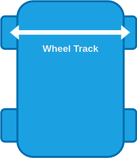

# Configuration/Tuning (Mecanum Rover)

This topic provides a step-by-step guide for setting up your [Mecanum rover](../frames_rover/mecanum.md).
Successive steps enable [drive modes](../flight_modes_rover/mecanum.md) with more autopilot support and features.

:::warning
Each step is dependent on the previous steps having been completed.
Modes will only work properly if the preceding modes have been configured.
:::

## Basic Setup

To start using the mecanum rover:

1. Enable Rover support by flashing the [PX4 rover build](../frames_rover/index.md#flashing-the-rover-build) onto your flight controller.
   Note that this is a special build that contains rover-specific modules.

2. In the [Airframe](../config/airframe.md) configuration select _Generic Rover Mecanum_ frame:

   

   Select the **Apply and Restart** button.

   ::: info
   If this airframe does not show up in the UI, it can alternatively be selected by setting the [SYS_AUTOSTART](../advanced_config/parameter_reference.md#SYS_AUTOSTART) parameter to `52000`.

:::

3. Use [Actuators Configuration & Testing](../config/actuators.md) to map the motor functions to flight controller outputs.

## 수동 모드

The basic setup (above) is all that is required to use the rover in [Manual mode](../flight_modes_rover/mecanum.md#manual-mode).

:::info
In manual mode the stick inputs are directly mapped to motor commands.
Especially moving the stick that controls the yaw rate all the way to one side will cause the wheels on the left and right to spin at full speed in opposite directions.
Depending on the rover this can lead to a very aggressive rotation.
The parameter [RM_MAN_YAW_SCALE](#RM_MAN_YAW_SCALE) can be used to scale the manual input for the yaw rate.
By reducing the parameter from the default value of 1 this behaviour can be tuned.
Note that this parameter only affects this mode, not any of the following ones.
:::

## Acro Mode

To set up [Acro mode](../flight_modes_rover/mecanum.md#acro-mode) navigate to [Parameters](../advanced_config/parameters.md) in QGroundControl and set the following parameters:

1. [RM_WHEEL_TRACK](#RM_WHEEL_TRACK) [m]: Measure the distance from the centre of the right wheel to the centre of the left wheel.

   

2. [RM_MAX_YAW_RATE](#RM_MAX_YAW_RATE) [deg/s]: This is the maximum yaw rate you want to allow for your rover.
   This will define the stick-to-yaw-rate mapping for all manual modes using closed loop yaw control and set an upper limit for the yaw rate setpoint for all [auto modes](#auto-modes).

   This value is set to your preference, there is no general rule of thumb since it depends entirely on your rover and use case.

   :::tip
   A rover has a maximum possible yaw rate which is determined by the rover geometry and the maximum torque the motors can supply.
   If you have no reason to limit the yaw rate of your rover, you can set this parameter equal to the highest yaw rate observed in testing:

   1. First make sure [RM_MAN_YAW_SCALE](#RM_MAN_YAW_SCALE) is set to 1 (you can set it back to the previous value after completing this tuning step).
   2. In [Manual Mode](../flight_modes_rover/mecanum.md#manual-mode) move the right-stick of your controller all the way to the left or right.
      Disarm the rover and from the flight log plot the `actual_yaw_rate` from the [RoverMecanumSetpoint](../msg_docs/RoverMecanumStatus.md).
   3. Set `RM_MAX_YAW_RATE` to the highest observed yaw rate.
      Note that in the log the yaw rate is given in rad/s but the parameter is in deg/s, so you need to transform the value first.

   If the rover turns are too aggressive for your use case:

   4. Switch to [Acro Mode](../flight_modes_rover/mecanum.md#acro-mode).
   5. Move the right-stick of your controller all the way to the left or right and observe the behaviour of the rover.
      Keep reducing the value of [RM_MAX_YAW_RATE](#RM_MAX_YAW_RATE) until you are satisfied with the maximum turn rate.

   Remember to reset [RM_MAN_YAW_SCALE](#RM_MAN_YAW_SCALE) back to its original value.

:::

3. [RM_MAX_THR_YAW_R](#RM_MAX_THR_YAW_R) [m/s]: This parameter is used to calculate the feed-forward term of the closed loop yaw rate control.
   The controller calculates the required speed difference between the left and right motor to achieve the desired yaw rate.
   This desired speed difference is then linearly mapped to normalized motor commands.

   To get a good starting value for this parameter drive the rover in manual mode forwards at full throttle and note the ground speed of the vehicle.
   Then enter _twice_ this value for the parameter.

   ::: tip
   To further tune this parameter, first make sure you set [RM_YAW_RATE_P](#RM_YAW_RATE_P) and [RM_YAW_RATE_I](#RM_YAW_RATE_I) to zero.
   This way the yaw rate is only controlled by the feed-forward term, which makes it easier to tune.
   Now put the rover in [Acro mode](../flight_modes_rover/mecanum.md#acro-mode) and then move the right-stick of your controller to the right and/or left and hold it at a few different levels for a couple of seconds each.
   Disarm the rover and from the flight log plot the _yaw_rate_setpoint_ and _actual_yaw_rate_ from the [RoverMecanumSetpoint](../msg_docs/RoverMecanumStatus.md) over each other.
   If the actual yaw rate of the rover is higher than the yaw rate setpoint, increase [RM_MAX_THR_YAW_R](#RM_MAX_YAW_RATE).
   If it is the other way around decrease the parameter and repeat until you are satisfied with the setpoint tracking.

:::

4. [RM_YAW_RATE_P](#RM_YAW_RATE_P) [-]: Proportional gain of the closed loop yaw rate controller.
   Unlike the feed-forward part of the controller, the closed loop yaw rate control will compare the yaw rate setpoint with the measured yaw rate and adapt to motor commands based on the error between them.
   The proportional gain is multiplied with this error and that value is added to the motor command.
   This compensates for disturbances such as uneven ground and external forces.

   ::: tip
   When tuning this parameter consider that increasing the value improves the disturbance rejection but can lead to an overshoot or oscillations around the setpoint.

   To tune the value:

   1. Set [RM_YAW_RATE_P](#RM_YAW_RATE_P) to `0.1`.
   2. Put the rover in [Acro mode](../flight_modes_rover/mecanum.md#acro-mode) and then move the right-stick of your controller to the right and/or left and hold it at a few different levels for a couple of seconds each.
   3. Disarm the rover and from the flight log plot the `yaw_rate_setpoint` and `actual_yaw_rate` from the [RoverMecanumSetpoint](../msg_docs/RoverMecanumStatus.md) over each other.
   4. If the `actual_yaw_rate` overshoots the `yaw_rate_setpoint` or oscillates around it, reduce the value of [RM_YAW_RATE_P](#RM_YAW_RATE_P). Otherwise you _can_ increase this value.

   Note that if you drive on flat ground you might not observe an improvement in setpoint tracking by increasing this value, since its main purpose is disturbance rejection (which is generally more effective with a higher value for [RM_YAW_RATE_P](#RM_YAW_RATE_P)).

:::

5. (Optional) [RM_YAW_RATE_I](#RM_YAW_RATE_I) [-]: Integral gain of the closed loop yaw controller.
   The integral gain accumulates the error between the desired and actual yaw rate over time and that value is added to the motor command.

   ::: tip
   The integrator gain is usually not necessary for the yaw rate setpoint as this is usually a fast changing value.
   Leave this parameter at zero unless necessary, as it can have negative side effects such as overshooting or oscillating around the setpoint.

:::

The rover is now ready to drive in [Acro mode](../flight_modes_rover/mecanum.md#acro-mode).

## Stabilized Mode

:::warning
For this mode to work properly [Acro mode](#acro-mode) must've already been configured!
:::

For [Stabilized mode](../flight_modes_rover/mecanum.md#stabilized-mode) the controller utilizes a closed loop yaw controller, which creates a yaw rate setpoint to control the yaw when driving in a straight line (no yaw rate input).

Unlike the closed loop yaw rate, this controller has no feed-forward term.
Therefore you only need to tune the closed loop gains:

1. [RM_YAW_P](#RM_YAW_P) and [RM_YAW_I](#RM_YAW_I) [-]: Proportional and integral gain for the closed loop yaw controller.

   ::: tip
   In stabilized mode the closed loop yaw control is only active when driving a straight line (no yaw rate input).
   To tune it set [RM_YAW_I](#RM_YAW_I) to zero and start with a value of 1 for [RM_YAW_P](#RM_YAW_P).
   Put the rover into stabilized mode and move the left stick of your controller up and/or down to drive forwards/backwards.
   Disarm the rover and from the flight log plot the _yaw_setpoint_ from the [RoverMecanumSetpoint](../msg_docs/RoverMecanumSetpoint.md) message and the _actual_yaw_ from the [RoverMecanumStatus](../msg_docs/RoverMecanumStatus.md) message over each other.
   Increase/Decrease [RM_YAW_P](#RM_YAW_P) until you are satisfied with the setpoint tracking.
   If you observe a constant offset between the _yaw_setpoint_ and _actual_yaw_ you might need the integrator term [RM_YAW_I](#RM_YAW_I). For the closed loop yaw control an integrator gain is useful because this setpoint is often constant for a while and an integrator eliminates steady state errors that can cause the rover to never reach the setpoint. First set [RM_YAW_I](#RM_YAW_I) to 0.01 and observe the setpoint tracking again. If the _actual_yaw_ starts to overshoot the setpoint, reduce the value of [RM_YAW_I](#RM_YAW_I). Otherwise you _can_ increase the value until you are satisfied with the setpoint tracking.

:::

The rover is now ready to drive in [Stabilized mode](../flight_modes_rover/mecanum.md#stabilized-mode).

## Position Mode

:::warning
For this mode to work properly [Acro mode](#acro-mode) and [Stabilized mode](#stabilized-mode) must already be configured!
:::

[Position mode](../flight_modes_rover/mecanum.md#position-mode) is the most advanced manual mode, utilizing closed loop yaw rate, yaw and speed control and leveraging position estimates.

To configure set the following parameters:

1. [RM_MAX_SPEED](#RM_MAX_SPEED) [m/s]: This is the maximum speed you want to allow for your rover.
   This will define the stick-to-speed mapping for position mode and set an upper limit for the speed setpoint for all [auto modes](#auto-modes).

   :::tip
   This value is set to your preference, there is no general rule of thumb since it depends entirely on your rover and use case.
   The most straightforward approach is the following: Your rover has a maximum possible speed which is determined by the maximum torque the motors can supply.
   In [Manual Mode](../flight_modes_rover/mecanum.md#manual-mode) move the left-stick of your controller all the way up or down. Disarm the rover and from the flight log plot the _forward_speed_setpoint_ from the [RoverMecanumSetpoint](../msg_docs/RoverMecanumSetpoint.md) message and the _measured_forward_speed_ from the [RoverMecanumStatus](../msg_docs/RoverMecanumStatus.md) message over each other.
   If you have no reason to limit the speed of your rover, simply set this parameter equal to the highest observed speed.
   In case you want to limit the maximum speed, you need to first complete Step 2. After that in [Position Mode](../flight_modes_rover/mecanum.md#position-mode) move the left-stick of your controller all the way up or down and observe the behaviour of the rover. Keep reducing the value of [RM_MAX_SPEED](#RM_MAX_SPEED) until you are satisfied with the maximum speed.

:::

2. [RM_MAX_THR_SPD](#RM_MAX_THR_SPD) [m/s]: This parameter is used to calculate the feed-forward term of the closed loop speed control which linearly maps desired speeds to normalized motor commands.
   A good starting point is the observed ground speed when the rover drives at maximum throttle in [Manual mode](../flight_modes_rover/mecanum.md#manual-mode).

   

   ::: tip
   To further tune this parameter, first make sure you set [RM_SPEED_P](#RM_YAW_RATE_P) and [RM_SPEED_I](#RM_SPEED_I) to zero.
   This way the speed is only controlled by the feed-forward term, which makes it easier to tune.
   Now put the rover in [Position mode](../flight_modes_rover/mecanum.md#position-mode) and then move the left stick of your controller up and/or down and hold it at a few different levels for a couple of seconds each.
   Disarm the rover and from the flight log plot the _forward_speed_setpoint_ from the [RoverMecanumSetpoint](../msg_docs/RoverMecanumSetpoint.md) message and the _measured_forward_speed_ from the [RoverMecanumStatus](../msg_docs/RoverMecanumStatus.md) message over each other.
   If the actual speed of the rover is higher than the speed setpoint, increase [RM_MAX_THR_SPD](#RM_MAX_THR_SPD).
   If it is the other way around decrease the parameter and repeat until you are satisfied with the setpoint tracking.

:::

   ::: info
   If your rover oscillates when driving a straight line in [Position mode](../flight_modes_rover/mecanum.md#position-mode) just set this parameter to the observed ground speed at maximum throttle in [Manual mode](../flight_modes_rover/mecanum.md#manual-mode) and complete steps 5-7 first before continuing the tuning of the closed loop speed control (Steps 2-4).

:::

3. [RM_SPEED_P](#RM_SPEED_P) and [RM_SPEED_I](#RM_SPEED_I) [-]: Proportional and integral gain of the closed loop speed controller.

   ::: tip
   When tuning this parameter we need to consider the following trade-off: Increasing the value of this parameter improves the disturbance rejection but can lead to an overshoot or oscillations around the setpoint.
   To tune start with a value of 0.1 for [RM_SPEED_P](#RM_SPEED_P). Put the rover in [Position mode](../flight_modes_rover/mecanum.md#position-mode) and then move the left-stick of your controller up/down and hold it at a few different levels for a couple of seconds each.
   Disarm the rover and from the flight log plot the _forward_speed_setpoint_ from the [RoverMecanumSetpoint](../msg_docs/RoverMecanumSetpoint.md) message and the _measured_forward_speed_ from the [RoverMecanumStatus](../msg_docs/RoverMecanumStatus.md) message over each other.
   If the _measured_forward_speed_ overshoots the _forward_speed_setpoint_ or oscillates around it, reduce the value of [RM_SPEED_P](#RM_SPEED_P). Otherwise you _can_ increase this value.
   Note that if you drive on flat ground you might not observe an improvement in setpoint tracking by increasing this value, since its main purpose is disturbance rejection (which is generally more effective with a higher value for [RM_SPEED_P](#RM_SPEED_P)).

   If you observe a constant offset between the _measured_forward_speed_ and _forward_speed_setpoint_ you might need the integrator term [RM_SPEED_I](#RM_SPEED_I). For the closed loop speed control an integrator gain is useful because this setpoint is often constant for a while and an integrator eliminates steady state errors that can cause the rover to never reach the setpoint. First set [RM_SPEED_I](#RM_SPEED_I) to 0.01 and observe the setpoint tracking again. If the _measured_forward_speed_ starts to overshoot the setpoint, reduce the value of [RM_SPEED_I](#RM_SPEED_I). Otherwise you _can_ increase the value until you are satisfied with the setpoint tracking.

:::

4. [PP_LOOKAHD_GAIN](#PP_LOOKAHD_GAIN): When driving in a straight line (no yaw rate input) position mode leverages the same path following algorithm used in [auto modes](#auto-modes) called [pure pursuit](#pure-pursuit-guidance-logic) to achieve the best possible straight line driving behaviour ([Illustration of control architecture](#pure_pursuit_controller)).
   This parameter determines how aggressive the controller will steer towards the path.

   ::: tip
   Decreasing the parameter makes it more aggressive but can lead to oscillations.
   Start with a value of 1 for [PP_LOOKAHD_GAIN](#PP_LOOKAHD_GAIN), put the rover in [Position mode](../flight_modes_rover/mecanum.md#position-mode) and while driving a straight line at approximately half the maximum speed observe its behaviour.
   If the rover does not drive in a straight line, reduce the value of the parameter, if it oscillates around the path increase the value.
   Repeat until you are satisfied with the behaviour.
   Note that by increasing/decreasing the value of this parameter you change the _yaw_setpoint_ the control system attempts to track. Make sure you check whether the system is actually able to track that setpoint, otherwise you need to further tune the closed loop yaw controller (this was initially done in the setup of [Stabilized Mode](#RM_YAW_TUNING)).

:::

5. [PP_LOOKAHD_MIN](#PP_LOOKAHD_MIN): Minimum threshold for the lookahead distance used by the [pure pursuit algorithm](#pure-pursuit-guidance-logic).

   ::: tip
   Put the rover in [Position mode](../flight_modes_rover/mecanum.md#position-mode) and drive at very low speeds, if the rover starts to oscillate even though the tuning of [PP_LOOKAHD_GAIN](#PP_LOOKAHD_GAIN) was good for medium speeds, then increase the value of [PP_LOOKAHD_MIN](#PP_LOOKAHD_MIN).

:::

6. [PP_LOOKAHD_MAX](#PP_LOOKAHD_MAX): Maximum threshold for the lookahead distance used by [pure pursuit](#pure-pursuit-guidance-logic).

   ::: tip
   Put the rover in [Position mode](../flight_modes_rover/mecanum.md#position-mode) and drive at very high speeds, if the rover does not drive in a straight line even though the tuning of [PP_LOOKAHD_GAIN](#PP_LOOKAHD_GAIN) was good for medium speeds, then decrease the value of [PP_LOOKAHD_MAX](#PP_LOOKAHD_MAX).

:::

The rover is now ready to drive in [Position mode](../flight_modes_rover/mecanum.md#position-mode).

## Auto Modes

:::warning
For this mode to work properly [Acro mode](#acro-mode), [Stabilized mode](#stabilized-mode) and [Position mode](#position-mode) must already be configured!
:::

In [auto modes](../flight_modes_rover/mecanum.md#auto-modes) the autopilot takes over navigation tasks using the following control architecture:

The mecanum module fully leverages the omnidirectionality of this type of rover by maintaining the initial heading of the rover during the entire mission (see [Pure Pursuit Guidance Logic](#pure-pursuit-guidance-logic)).

The required parameters are separated into the following sections:

### Velocity

These parameters are used to calculate the velocity setpoint in auto modes:

1. [RM_MISS_SPD_DEF](#RM_MISS_SPD_DEF): Sets the default speed ($m/s$) for the rover during the mission. For mecanum rovers the speed is defined in the direction of travel (magnitude of the velocity vector consisting of the forward and lateral speed).

2. [RM_MAX_ACCEL](#RM_MAX_ACCEL) ($m/s^2$) and [RM_MAX_JERK](#RM_MAX_JERK) ($m/s^3$) are used to calculate a velocity trajectory such that the rover comes to a smooth stop as it reaches a waypoint.

   ::: tip
   Plan a mission for the rover to drive a square and observe how it slows down when approaching a waypoint.
   If the rover decelerates too quickly decrease the [RM_MAX_ACCEL](#RM_MAX_ACCEL) parameter, if it starts slowing down too early increase the parameter.
   If you observe a jerking motion as the rover slows down, decrease the [RM_MAX_JERK](#RM_MAX_JERK) parameter otherwise increase it as much as possible as it can interfere with the tuning of [RM_MAX_ACCEL](#RM_MAX_ACCEL).
   These two parameters have to be tuned as a pair, repeat until you are satisfied with the behaviour.

:::

3. [RM_MISS_VEL_GAIN](#RM_MISS_VEL_GAIN): The rover slows down when approaching a waypoint based on the angle between the line segment from the previous to current waypoint and current to next waypoint. How much the rover slows down can be tuned with this parameter:

   $$
    v_{transition} = v_{max} \cdot (1 - \theta_{normalized} * k)
   $$

   with

   - $v_{transition}:$ Transition speed
   - $v_{max}:$ Maximum speed ([RM_MISS_SPD_DEF](#RM_MISS_SPD_DEF))
   - $\theta_{normalized}:$ Angle between the linesegment of prev-curr and curr-next waypoints normalized from $[0\degree, 180\degree]$ to $[0, 1]$
   - $k:$ Tuning parameter ([RM_MISS_VEL_GAIN](#RM_MISS_VEL_GAIN)).

4. Plot the _forward_speed_setpoint_ from the [RoverMecanumSetpoint](../msg_docs/RoverMecanumSetpoint.md) message and the _measured_forward_speed_ from the [RoverMecanumStatus](../msg_docs/RoverMecanumStatus.md) message over each other.
   If the tracking of these setpoints is not satisfactory adjust the values for [RM_SPEED_P](#RM_SPEED_P) and [RM_SPEED_I](#RM_SPEED_I).

### Path Following

The [pure pursuit](#pure-pursuit-guidance-logic) algorithm is used to calculate a desired yaw for the vehicle that is then close loop controlled.
The close loop yaw rate was tuned in the configuration of the [Stabilized mode](#stabilized-mode) and the pure pursuit was tuned when setting up the [Position mode](#position-mode).
During any auto navigation task observe the behaviour of the rover.
If you are unsatisfied with the path following, there are 3 steps to take:

1. Plot the _yaw_rate_setpoint_ and _actual_yaw_rate_ from the [RoverMecanumSetpoint](../msg_docs/RoverMecanumStatus.md) over each other.
   If the tracking of these setpoints is not satisfactory adjust the values for [RM_YAW_RATE_P](#RM_YAW_RATE_P) and [RM_YAW_RATE_I](#RM_YAW_RATE_I).
2. Plot the _yaw_setpoint_ from the [RoverMecanumSetpoint](../msg_docs/RoverMecanumSetpoint.md) message and the _actual_yaw_ from the [RoverMecanumStatus](../msg_docs/RoverMecanumStatus.md) message over each other.
   If the tracking of these setpoints is not satisfactory adjust the values for [RM_YAW_P](#RM_YAW_P) and [RM_YAW_I](#RM_YAW_P).
3. Steps 1 and 2 ensure accurate setpoint tracking, if the path following is still unsatisfactory you need to further tune the [pure pursuit](#pure-pursuit-guidance-logic) parameters.

## Pure Pursuit Guidance Logic

The desired yaw setpoints are generated using a pure pursuit algorithm:
The controller takes the intersection point between a circle around the vehicle and a line segment.
In mission mode this line is usually constructed by connecting the previous and current waypoint:

The radius of the circle around the vehicle is used to tune the controller and is often referred to as look-ahead distance.

The look ahead distance sets how aggressive the controller behaves and is defined as $l_d = v \cdot k$.
It depends on the velocity $v$ of the rover and a tuning parameter $k$ that can be set with the parameter [PP_LOOKAHD_GAIN](#PP_LOOKAHD_GAIN).

:::info
A lower value of [PP_LOOKAHD_GAIN](#PP_LOOKAHD_GAIN) makes the controller more aggressive but can lead to oscillations!
:::

The lookahead is constrained between [PP_LOOKAHD_MAX](#PP_LOOKAHD_MAX) and [PP_LOOKAHD_MIN](#PP_LOOKAHD_MIN).

If the distance from the path to the rover is bigger than the lookahead distance, the rover will target the point on the path that is closest to the rover.

To summarize, the following parameters can be used to tune the controller:

| 매개변수                                                                                                                                               | 설명                                      | Unit |
| -------------------------------------------------------------------------------------------------------------------------------------------------- | --------------------------------------- | ---- |
| [PP_LOOKAHD_GAIN](../advanced_config/parameter_reference.md#PP_LOOKAHD_GAIN) | Main tuning parameter                   | -    |
| [PP_LOOKAHD_MAX](../advanced_config/parameter_reference.md#PP_LOOKAHD_MAX)    | Maximum value for the look ahead radius | m    |
| [PP_LOOKAHD_MIN](../advanced_config/parameter_reference.md#PP_LOOKAHD_MIN)    | Minimum value for the look ahead radius | m    |

## Parameter Overview

List of all parameters of the mecanum rover module:

| 매개변수                                                                                                                                                                                            | 설명                                                                     | Unit    |
| ----------------------------------------------------------------------------------------------------------------------------------------------------------------------------------------------- | ---------------------------------------------------------------------- | ------- |
| [RM_WHEEL_TRACK](../advanced_config/parameter_reference.md#RM_WHEEL_TRACK)                                                 | Wheel track                                                            | m       |
| [RM_MAN_YAW_SCALE](../advanced_config/parameter_reference.md#RM_MAN_YAW_SCALE)                      | Manual yaw rate scale                                                  | -       |
| [RM_MAX_THR_YAW_R](../advanced_config/parameter_reference.md#RM_MAX_THR_YAW_R) | Yaw rate turning left/right wheels at max speed in opposite directions | m/s     |
| [RM_MAX_YAW_RATE](../advanced_config/parameter_reference.md#RM_MAX_YAW_RATE)                         | Maximum allowed yaw rate for the rover                                 | deg/s   |
| [RM_YAW_RATE_P](../advanced_config/parameter_reference.md#RM_YAW_RATE_P)                               | Proportional gain for yaw rate controller                              | -       |
| [RM_YAW_RATE_I](../advanced_config/parameter_reference.md#RM_YAW_RATE_I)                               | Integral gain for yaw rate controller                                  | -       |
| [RM_YAW_P](../advanced_config/parameter_reference.md#RM_YAW_P)                                                                   | Proportional gain for yaw controller                                   | -       |
| [RM_YAW_I](../advanced_config/parameter_reference.md#RM_YAW_I)                                                                   | Integral gain for yaw controller                                       | -       |
| [RM_MAX_SPEED](../advanced_config/parameter_reference.md#RM_MAX_SPEED)                                                       | Maximum allowed speed for the rover                                    | m/s     |
| [RM_MAX_THR_SPD](../advanced_config/parameter_reference.md#RM_MAX_THR_SPD)                            | Speed the rover drives at maximum throttle                             | m/s     |
| [RM_SPEED_P](../advanced_config/parameter_reference.md#RM_SPEED_P)                                                             | Proportional gain for speed controller                                 | -       |
| [RM_SPEED_I](../advanced_config/parameter_reference.md#RM_SPEED_I)                                                             | Integral gain for speed controller                                     | -       |
| [PP_LOOKAHD_GAIN](../advanced_config/parameter_reference.md#PP_LOOKAHD_GAIN)                                              | Main tuning parameter for pure pursuit                                 | -       |
| [PP_LOOKAHD_MAX](../advanced_config/parameter_reference.md#PP_LOOKAHD_MAX)                                                 | Maximum value for the look ahead radius of the pure pursuit algorithm  | m       |
| [PP_LOOKAHD_MIN](../advanced_config/parameter_reference.md#PP_LOOKAHD_MIN)                                                 | Minimum value for the look ahead radius of the pure pursuit algorithm  | m       |
| [RM_MISS_SPD_DEF](../advanced_config/parameter_reference.md#RM_MISS_SPD_DEF)                         | Mission speed for the rover                                            | $m/s$   |
| [RM_MAX_ACCEL](../advanced_config/parameter_reference.md#RM_MAX_ACCEL)                                                       | Maximum acceleration for the rover                                     | $m/s^2$ |
| [RM_MAX_JERK](../advanced_config/parameter_reference.md#RM_MAX_JERK)                                                          | Maximum jerk for the rover                                             | $m/s^3$ |
| [RM_MISS_VEL_GAIN](../advanced_config/parameter_reference.md#RM_MISS_VEL_GAIN)                      | Tuning parameter for the velocity reduction during waypoint transition | -       |

## See Also

- [Drive Modes (Mecanum Rover)](../flight_modes_rover/differential.md).
