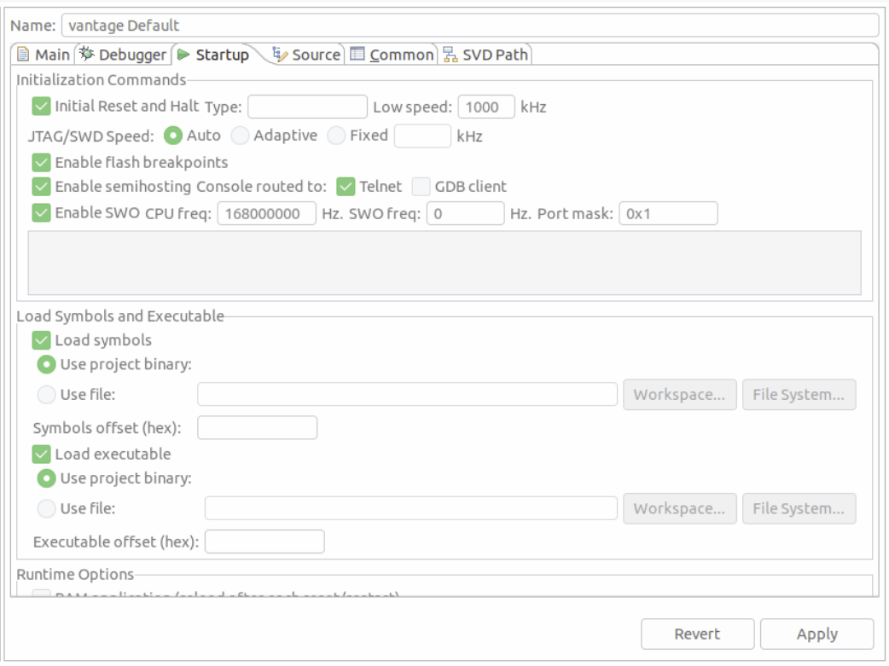

# PX4용 MCU Eclipse/J-Link 디버깅

NuttX(예: Pixhawk 시리즈 보드)에서 실행되는 PX4를 디버그하기 위하여 *Segger Jlink 어댑터*와 함께 [MCU Eclipse](https://gnu-mcu-eclipse.github.io/)를 설정하고 사용하는 방법을 설명합니다.

## 필요한 하드웨어

- [J-Link EDU Mini](https://www.segger.com/products/debug-probes/j-link/models/j-link-edu-mini/)
- Segger JLink를 Flight Controller [SWD(JTAG) 하드웨어 디버깅 인터페이스](../debug/swd_debug.md)(디버그 포트) 연결용 어댑터입니다.
- Micro USB 케이블

## 설치

### PX4

일반 지침에 따라 PX4를 설정합니다.
- [Setup the PX4 Developer Environment/Toolchain](../dev_setup/dev_env.md) for your platform (e.g. for Linux see: [Development Environment on Ubuntu LTS / Debian Linux](../dev_setup/dev_env_linux_ubuntu.md)).
- [PX4를 다운로드](../dev_setup/building_px4.md)하고, 선택적으로 명령줄에서 빌드합니다.

### Eclipse

*Eclipse*를 설치하려면:
1. [C/C++ 개발자를 위한 Eclipse CDT](https://github.com/gnu-mcu-eclipse/org.eclipse.epp.packages/releases/)(MCU GitHub)를 다운로드하십시오.
1. Eclipse 폴더의 압축을 풀고 적당한 폴더에 복사합니다(설치 스크립트를 실행할 필요가 없음).
1. *Eclipse*를 실행하고, 초기 워크벤치의 위치를 선택하십시오.

### Segger Jlink 도구

*Segger Jlink* 도구를 설치하려면:
1. [J-Link Software and Documentation Pack](https://www.segger.com/downloads/jlink/#J-LinkSoftwareAndDocumentationPack)을 운영체제에 해당(윈도우와 리눅스용이 있음)하는 버전으로 다운로드하고 설치하십시오.
   - Linux에서 **/usr/bin**에 설치됩니다.

자세한 내용은 [https://gnu-mcu-eclipse.github.io/debug/jlink/install/](https://gnu-mcu-eclipse.github.io/debug/jlink/install/)을 참고하십시오.

## 첫 사용

1. *Segger JLink*를 어댑터를 통하여 호스트 컴퓨터와 [비행 컨트롤러 디버그 포트](../debug/swd_debug.md)에 연결합니다.
1. 비행 콘트롤러에 전원을 공급합니다.
1. *Eclipse*를 실행합니다.
1. **파일 > 가져오기 C/C++ > 기존 코드를 Makefile 프로젝트**로 만들고 **다음**을 클릭합니다.
1. **PX4-Autopilot** 폴더를 가리키고 이름을 지정한 다음 *인덱서 설정용 도구 모음*에서 *ARM Cross GCC*를 선택하고 <0 >마침</strong>을 클릭합니다. 가져오기는 시간이 걸리며, 완료될 때까지 기다립니다.
1. MCU 설정: 프로젝트 탐색기에서 최상위 프로젝트를 마우스 오른쪽 버튼으로 클릭하고 *속성*을 선택한 다음 MCU에서 *SEGGER J-Link 경로*를 선택합니다. 아래 스크린샷과 같이 설정합니다. 
1. 패키지를 업데이트합니다.
   - 우상단의 *Open Perspective*라는 작은 아이콘을 클릭하고, *Packs* Perspective를 엽니다. 
   - **모두 업데이트** 버튼을 클릭합니다.

     :::tip
이것은 10분정도의 시간이 소요됩니다.
누락된 패키지에 대한 오류를 무시하십시오.
:::

     
   - STM32Fxx 장치는 Keil 폴더에 있습니다. 마우스 오른쪽 버튼을 클릭한 다음, F4 및 F7에 해당하는 장치에서 **설치**를 선택하여 설치합니다.
1. 대상에 대한 디버깅 설정을 진행하십시오:
   - 프로젝트를 마우스 오른쪽 버튼으로 클릭하고, *설정*을 엽니다(메뉴: **C/C++ 빌드 > 설정**).
   - *기기* 탭, *기기* 섹션(*보드* 아님)을 선택합니다.
   - 디버그하려는 FMU 칩을 찾으십시오.

   
1. 버그 기호 옆에 있는 작은 드롭다운으로 디버그 설정을 선택합니다.
1. 그런 다음, *GDB SEGGER J-Link 디버깅*을 선택한 다음, 왼쪽 상단의 **새 구성** 버튼을 선택합니다. 
1. 빌드 구성을 설정합니다.
   - 이름을 지정하고 *C/C++ 애플리케이션*을 해당 **.elf** 파일로 설정합니다.
   - *자동 빌드 비활성화* 선택합니다. :::note
디버그 세션을 시작하기 전에, 명령줄에서 대상을 빌드하여야 합니다.
:::

   
1. *디버거* 및 *시작* 탭은 수정할 필요가 없습니다(아래 스크린샷으로 설정을 확인하기만 하면 됩니다).

    

## 문제 해결

### 패키지 관리자에 없는 대상 CPU

대상 CPU가 패키지 관리자에 표시되지 않으면, 레지스터 보기가 작동하도록 하려면 다음 단계가 필요할 수 있습니다.

:::tip
이것은 일반적으로 발생하지 않아야 합니다(그러나 STM F7 컨트롤러에 연결할 때 일화적으로 보고되었습니다).
:::

*Peripheral View*에 대해 누락된 SVD 파일 추가:
1. MCU Eclipse가 패키지를 저장하는 위치를 찾으십시오(**환경 설정 > C/C++ > MCU 패키지**). 
2. http://www.keil.com/dd2/Pack/ 에서 누락된 패키지를 다운로드하십시오
3. 압축 해제 도구로 다운로드한 팩을 열고 **/CMSIS/SVD**에서 **.SVD** 파일의 압축을 풉니다.
4. **디버그 옵션 > GDB SEGGER JLink 디버깅 > SVD 경로**에서 원하는 **.SVD** 파일을 선택하십시오. 
