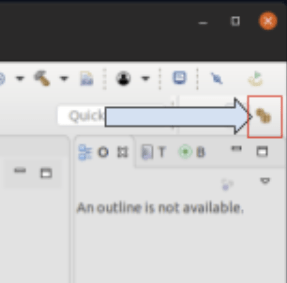
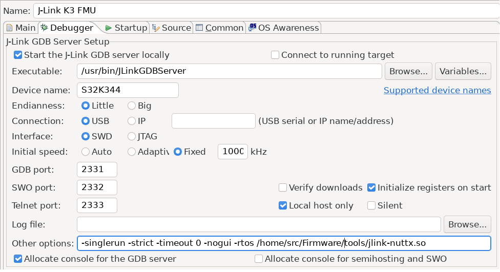

# Debugging with Eclipse and J-Link

This topic explains how to setup and use [MCU Eclipse](https://gnu-mcu-eclipse.github.io/) with a _Segger Jlink adapter_ to debug PX4 running on NuttX (e.g. Pixhawk series boards).

## 필요한 하드웨어

- [J-Link EDU Mini](https://www.segger.com/products/debug-probes/j-link/models/j-link-edu-mini/)
- Adapter to connect Segger JLink to Flight Controller [SWD Debug Port](../debug/swd_debug.md) (debug port).
- Micro USB 케이블

## 설치

### PX4

일반 지침에 따라 PX4를 설정합니다.

- [Setup the PX4 Developer Environment/Toolchain](../dev_setup/dev_env.md) for your platform (e.g. for Linux see: [Development Environment on Ubuntu LTS / Debian Linux](../dev_setup/dev_env_linux_ubuntu.md)).
- [PX4를 다운로드](../dev_setup/building_px4.md)하고, 선택적으로 명령줄에서 빌드합니다.

### Eclipse

To install _Eclipse_:

1. [C/C++ 개발자를 위한 Eclipse CDT](https://github.com/gnu-mcu-eclipse/org.eclipse.epp.packages/releases/)(MCU GitHub)를 다운로드하십시오.
1. Eclipse 폴더의 압축을 풀고 적당한 폴더에 복사합니다(설치 스크립트를 실행할 필요가 없음).
1. Run _Eclipse_ and choose a location for your initial workbench.

### Segger Jlink 도구

To install the _Segger Jlink_ tools:

1. [J-Link Software and Documentation Pack](https://www.segger.com/downloads/jlink/#J-LinkSoftwareAndDocumentationPack)을 운영체제에 해당(윈도우와 리눅스용이 있음)하는 버전으로 다운로드하고 설치하십시오.
   - Linux에서 **/usr/bin**에 설치됩니다.

자세한 내용은 [https://gnu-mcu-eclipse.github.io/debug/jlink/install/](https://gnu-mcu-eclipse.github.io/debug/jlink/install/)을 참고하십시오.

## 첫 사용

1. Connect the _Segger JLink_ to the host computer and the [flight controller debug port](../debug/swd_debug.md) (via an adapter).
1. 비행 콘트롤러에 전원을 공급합니다.
1. Run _Eclipse_.
1. **파일 > 가져오기 C/C++ > 기존 코드를 Makefile 프로젝트**로 만들고 **다음**을 클릭합니다.
1. Point it to the **PX4-Autopilot** folder and give it a name, then select _ARM Cross GCC_ in the _Toolchain for Indexer Settings_ and click **Finish**. 가져오기는 시간이 걸리며, 완료될 때까지 기다립니다.
1. Set the MCU settings: right-click on the top-level project in the Project Explorer, select _Properties_ then under MCU choose _SEGGER J-Link Path_. 아래 스크린샷과 같이 설정합니다. 
1. 패키지를 업데이트합니다.

   - Click the small icon on the top right called _Open Perspective_ and open the _Packs_ perspective. 
   - **모두 업데이트** 버튼을 클릭합니다.

     :::tip
이것은 10분정도의 시간이 소요됩니다.
누락된 패키지에 대한 오류를 무시하십시오.
:::

     

   - STM32Fxx 장치는 Keil 폴더에 있습니다. 마우스 오른쪽 버튼을 클릭한 다음, F4 및 F7에 해당하는 장치에서 **설치**를 선택하여 설치합니다.

1. 대상에 대한 디버깅 설정을 진행하십시오:

   - Right click project and open the _Settings_ (menu: **C/C++ Build > Settings**)
   - Choose the _Devices_ Tab, _Devices_ section (Not _Boards_).
   - 디버그하려는 FMU 칩을 찾으십시오.

   

1. 버그 기호 옆에 있는 작은 드롭다운으로 디버그 설정을 선택합니다.
1. Then select _GDB SEGGER J-Link Debugging_ and then the **New config** button on the top left. 
1. 빌드 구성을 설정합니다.

   - Give it a name and set the _C/C++ Application_ to the corresponding **.elf** file.
   - Choose _Disable Auto build_ :::note
Remember that you must build the target from the command line before starting a debug session.
:::

   

1. The _Debugger_ and _Startup_ tabs shouldn’t need any modifications (just verify your settings with the screenshots below)

    

## SEGGER Task-aware debugging

Task-aware debugging (also known as [thread-aware debugging](https://www.segger.com/products/debug-probes/j-link/tools/j-link-gdb-server/thread-aware-debugging/)) allows you to show the context of all running threads/tasks instead of just the stack current task. This is quite useful since PX4 tends to run many different tasks.

To enable this feature for use in Eclipse:

1. You first need to enable `CONFIG_DEBUG_TCBINFO` in the NuttX configuration for your build (to expose the TCB offsets).
   - Open a terminal in the root of your PX4-Autopilot source code
   - In the terminal, open `menuconfig` using the appropriate make target for the build. This will be something like:
     ```
     make px4_fmu-v5_default boardguiconfig
     ```
     (See [PX4 Menuconfig Setup](../hardware/porting_guide_config.md#px4-menuconfig-setup) for more information) on using the config tools).
   - Ensure that the _Enable TCBinfo struct for debug_ is selected as shown: 
1. Compile the **jlink-nuttx.so** library in the terminal by running the following command in the terminal: `make jlink-nuttx`
1. Modify Eclipse to use this libary. In the _J-Link GDB Server Setup_ configuration, update **Other options** to include `-rtos /home/<PX4 path>/Tools/jlink-nuttx.so`, as shown in the image below.

   

1. When running the debugger you should see now multiple threads instead of just one:

   

## 문제 해결

### 패키지 관리자에 없는 대상 CPU

대상 CPU가 패키지 관리자에 표시되지 않으면, 레지스터 보기가 작동하도록 하려면 다음 단계가 필요할 수 있습니다.

:::tip
이것은 일반적으로 발생하지 않아야 합니다(그러나 STM F7 컨트롤러에 연결할 때 일화적으로 보고되었습니다).
:::

Adding missing SVD files for the _Peripheral View_:

1. MCU Eclipse가 패키지를 저장하는 위치를 찾으십시오(**환경 설정 > C/C++ > MCU 패키지**). 
2. http://www.keil.com/dd2/Pack/ 에서 누락된 패키지를 다운로드하십시오
3. 압축 해제 도구로 다운로드한 팩을 열고 **/CMSIS/SVD**에서 **.SVD** 파일의 압축을 풉니다.
4. **디버그 옵션 > GDB SEGGER JLink 디버깅 > SVD 경로**에서 원하는 **.SVD** 파일을 선택하십시오. 
