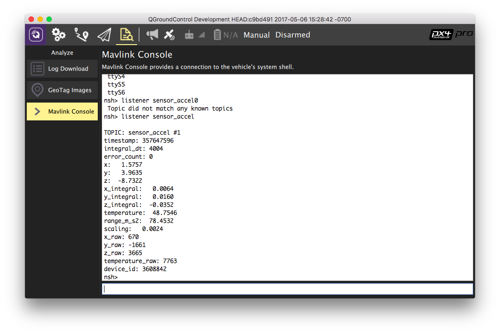

# Listener 명령을 사용한 센서/토픽 디버깅

uORB는 스레드간/프로세스간 통신에 사용되는 비동기식 `publish()` / `subscribe()` 메시징 API입니다. `listener` 명령은 *QGroundControl MAVLink 콘솔*에서 센서에 의해 게시된 현재 값을 포함하여 주제(메시지) 값을 검사할 수 있습니다.

:::tip
 QGC가 무선으로 연결(예: 차량이 비행 중일 때)시에도 사용할 수 있기 때문에 강력한 디버깅 도구입니다.
:::

:::note
`listener` 명령은 [시스템 콘솔](../debug/system_console.md) 및 [MAVLink Shell](../debug/mavlink_shell.md)을 통해서도 사용할 수 있습니다.
:::

:::tip
어떤 주제가 어떤 비율로 제공되는지 확인하려면 `uorb top` 명령을 사용합니다.
:::

아래 이미지는 가속도 센서의 값을 가져오는 데 사용되는 *QGroundControl*을 보여줍니다.

사용 가능한 주제를 결정하는 방법과 `listener`를 호출하는 방법에 대한 자세한 내용은 [uORB Messaging > 주제 나열 및 듣기](../middleware/uorb.md#listing-topics-and-listening-in)를 참고하십시오.
