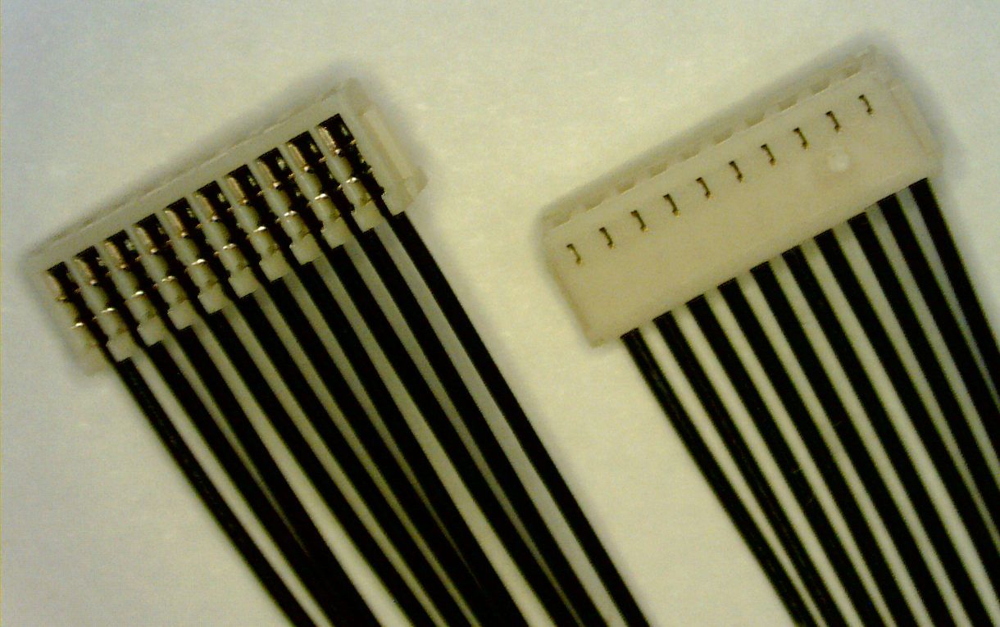

# SWD (JTAG) 하드웨어 디버깅 인터페이스

PX4는 일반적으로 ARM *직렬 와이어 디버그(SWD)* 인터페이스를 제공하는 자동조종장치 컨트롤러에서 실행됩니다. SWD는 ARM 프로세서에서 JTAG 디버깅을 위한 핀 수가 적은 물리적 인터페이스입니다. SWD 호환 디버그 프로브(예: [Segger J-Link EDU Mini](#segger_jlink_edu_mini), [Dronecode Probe](#dronecode_probe) 등)와 함께 사용하여 PX4에서 중단점을 설정하고, 실제 장치에서 실행중인 코드를 단계별로 실행할 수 있습니다.

SWD 인터페이스를 사용하여 완전히 비어 있는 보드(USB 부트로더가 설치되지 않은 보드)에 새 부트로더나 펌웨어를 추가할 수 있습니다.

다른 보드에 SWD 인터페이스를 연결하는 방법을 설명합니다(실제로 디버깅을 수행하는 방법은 [디버깅 주제](#debugging_topics)에서 다룹니다).

## SWD 인터페이스 정의

SWD 인터페이스는 다음과 같은 핀으로 구성됩니다.

| 핀       | 신호 형식 | 설명                                                                                                                                              |
| ------- | ----- | ----------------------------------------------------------------------------------------------------------------------------------------------- |
| `Vref`  | 출력    | 목표 기준 전압:  일부 JTAG 어댑터는 SWD 라인의 전압을 설정하기 위하여 `Vref` 전압이 필요합니다. 예를 들어, [SEGGER J-Link 디버그 프로브](#segger_jlink_edu_mini)에는 `Vref`가 필요합니다. |
| `SWDIO` | 입출력   | 단일 양방향 데이터 핀.                                                                                                                                   |
| `SWCLK` | 출력    | 클록 신호                                                                                                                                           |
| `GND`   | -     | 접지 핀                                                                                                                                            |

SWD의 "일부"는 아니지만, 자동조종장치에는 *직렬 와이어 출력(SWO)* 추적 출력 핀이 있을 수 있습니다. 이 핀이 있는 경우에는 이것을 연결하여야 합니다.

| 핀     | 신호 형식 | 설명                                                          |
| ----- | ----- | ----------------------------------------------------------- |
| `SWO` | 출력    | 직렬 와이어 출력 트레이스 출력 핀. 실시간 추적 데이터를 내보내는 *SWD*와 함께 사용할 수 있습니다. |

## SWD 디버거를 PX4 하드웨어에 연결

디버그 프로브의 `SWDIO`, `SWCLK` 및 `GND` 핀을 자동조종장치의 해당 핀에 연결합니다.

추가로:
- 사용 중인 디버그 어댑터에 필요한 경우에는 `VRef` 핀을 연결합니다.
- `SWO` 핀이 있으면, 연결합니다.

일부 SWD [디버그 프로브](#debug_probes)는 일반적인 Pixhawk [디버그 포트](#debug_ports)에 연결용 어댑터/케이블과 함께 제공됩니다. 다른 보드나 프로브에 연결용 맞춤형 케이블을 제작할 수도 있습니다.

:::note
일부 제조업체에서는 SWD 인터페이스와 [시스템 콘솔](../debug/system_console.md)을 쉽게 연결하는 케이블을 제공합니다. 예를 들어, [CUAV V5nano](../flight_controller/cuav_v5_nano.md#debug_port)와 [CUAV V5+](../flight_controller/cuav_v5_plus.md#debug-port)에는 다음 디버그 케이블이 포함됩니다.

:::

:::tip
가능한 경우 SWD/JTAG 디버거 및 컴퓨터에 연결용 케이블 직접 만드는 것보다, 어댑터 보드를 만들거나 구매하는 것이 좋습니다. 이것은 디버깅 문제의 위험이나 잘못된 배선을 줄이고, 어댑터가 인기 있는 비행 콘트롤러에 연결하기 위한 공통 인터페이스를 제공하는 이점이 있습니다.
:::

## 자동비행장치 디버그 포트

비행 컨트롤러는 일반적으로 [SWD 인터페이스](#swd_interface)와 [시스템 콘솔](../debug/system_console.md)을 모두 노출하는 디버그 포트를 제공합니다.

[Pixhawk 커넥터 표준](#pixhawk_standard_debug_ports)은 이 포트를 표준화하하고 있습니다. 그러나, 여러 보드가 서로 다른 핀 배치 또는 커넥터를 사용하므로, 자동조종장치 설명서에서 포트 위치와 핀 배치를 확인하는 것이 좋습니다.

자동조종장치의 작은 하위 집합에 대한 디버그 포트 위치 및 핀아웃은 아래에 링크되어 있습니다.

| 자동조종장치                                                                     | 커넥터                                                                                                                                                                                                                          |
| -------------------------------------------------------------------------- | ---------------------------------------------------------------------------------------------------------------------------------------------------------------------------------------------------------------------------- |
| [3DR Pixhawk](../flight_controller/pixhawk.md#swd-port)                    | ARM 10핀 JTAG 커넥터(*mRo Pixhawk*, *HobbyKing HKPilot32*를 포함한 FMUv2 보드에도 사용됨).                                                                                                                                                  |
| [CUAV V5nano](../flight_controller/cuav_v5_nano.md#debug_port)             | 6핀 JST GH Digikey: [BM06B-GHS-TBT(LF)(SN)(N)](https://www.digikey.com/products/en?keywords=455-1582-1-ND)(수직 장착), [SM06B-GHS-TBT(LF)(SN) (N)](https://www.digikey.com/products/en?keywords=455-1568-1-ND) (사이드 마운트) |
| [CUAV V5+](../flight_controller/cuav_v5_plus.md#debug-port)                | 6핀 JST GH Digikey: [BM06B-GHS-TBT(LF)(SN)(N)](https://www.digikey.com/products/en?keywords=455-1582-1-ND)(수직 장착), [SM06B-GHS-TBT(LF)(SN) (N)](https://www.digikey.com/products/en?keywords=455-1568-1-ND) (사이드 마운트) |
| [Drotek Pixhawk 3 Pro](../flight_controller/pixhawk3_pro.md#debug-port)    | [Pixhawk 6핀 SH 디버그](#pixhawk_debug_port_6_pin_sh)                                                                                                                                                                            |
| [Holybro Pixhawk 4](../flight_controller/pixhawk4.md#debug_port)           | [Pixhawk 6핀 SH 디버그](#pixhawk_debug_port_6_pin_sh)                                                                                                                                                                            |
| [Holybro Pixhawk 4 Mini](../flight_controller/pixhawk4_mini.md#debug-port) | [Pixhawk 6핀 SH 디버그](#pixhawk_debug_port_6_pin_sh)                                                                                                                                                                            |
| [Holybro Kakute F7](../flight_controller/kakutef7.md#debug-port)           | 납땜 판                                                                                                                                                                                                                         |
| [Holybro Durandal](../flight_controller/durandal.md#debug-port)            | [Pixhawk 6핀 SH 디버그](#pixhawk_debug_port_6_pin_sh)                                                                                                                                                                            |

:::tip
비행 콘트롤러가 목록에 없으면 [자동 조종 장치 항목](../flight_controller/README.md)을 참고하십시오.
:::

## Pixhawk 표준 디버그 포트

Pixhawk 프로젝트에는 다양한 Pixhawk FMU 릴리스에 대한 표준 핀배열 및 커넥터 유형이 정의되어 있습니다.

:::tip
[특정 보드](#port_information)에서 사용된 포트를 확인하십시오.
:::

| FMU 버전 | Pixhawk Ver.                                                    | Debug Interface                                  |
| ------ | --------------------------------------------------------------- | ------------------------------------------------ |
| FMUv2  | [Pixhawk / Pixhawk 1](../flight_controller/pixhawk.md#swd-port) | 10 pin ARM Debug                                 |
| FMUv3  | Pixhawk 2                                                       | 6 pin SUR Debug                                  |
| FMUv4  | Pixhawk 3                                                       | [6 pin SH Debug](#pixhawk_debug_port_6_pin_sh)   |
| FMUv5  | Pixhawk 4 FMUv5                                                 | [6 pin SH Debug](#pixhawk_debug_port_6_pin_sh)   |
| FMUv5X | Pixhawk 5X                                                      | [10 pin SH Debug](#pixhawk_debug_port_10_pin_sh) |
| FMUv6  | Pixhawk 6                                                       | [10 pin SH Debug](#pixhawk_debug_port_10_pin_sh) |
| FMUv6X | Pixhawk 6                                                       | [10 pin SH Debug](#pixhawk_debug_port_10_pin_sh) |

:::note
There FMU and Pixhawk versions are (only) consistent after FMUv5X.
:::

### Pixhawk Debug Mini (6-Pin SH Debug Port)

The [Pixhawk Connector Standard](https://github.com/pixhawk/Pixhawk-Standards/blob/master/DS-009%20Pixhawk%20Connector%20Standard.pdf) defines a *6-Pin SH Debug Port* that provides access to both SWD pins and the [System Console](../debug/system_console.md).

:::note
This debug port is used in FMUv4 and FMUv5.
:::

The pinout is as shown below (SWD pins highlighted):

| Debug Port | Pin        |
| ---------- | ---------- |
| 1          | `Vtref`    |
| 2          | Console TX |
| 3          | Console RX |
| 4          | `SWDIO`    |
| 5          | `SWDCLK`   |
| 6          | `GND`      |

The debug port definition includes the following solder pads (on board next to connector):

| Debug Port | Pin               | Voltage |
| ---------- | ----------------- | ------- |
| Pad        | Signal            | Volt    |
| 1          | NRST (reset)      | +3.3V   |
| 2          | GPIO1 (free GPIO) | +3.3V   |
| 3          | GPIO2 (free GPIO) | +3.3V   |

The socket is a *6-pin JST SH* - Digikey number: [BM06B-SRSS-TBT(LF)(SN)](https://www.digikey.com/products/en?keywords=455-2875-1-ND) (vertical mount), [SM06B-SRSS-TBT(LF)(SN)](https://www.digikey.com/products/en?keywords=455-1806-1-ND)(side mount).

You can connect to the debug port using a [cable like this one](https://www.digikey.com/products/en?keywords=A06SR06SR30K152A).

### Pixhawk Debug Full (10-Pin SH Debug Port)

The [Pixhawk Connector Standard](https://github.com/pixhawk/Pixhawk-Standards/blob/master/DS-009%20Pixhawk%20Connector%20Standard.pdf)  defines a *10-Pin SH Debug Port* that provides access to both SWD pins and the [System Console](../debug/system_console.md). This essentially moves the solder pads from beside the [Pixhawk 6-Pin SH Debug Port](#pixhawk_debug_port_6_pin_sh) into the connector, and also adds an SWO pin.

:::note
This port is specified for use in FMUv5x, FMUv6, FMUv6x.
:::

The pinout is as shown below (SWD pins highlighted):

| Debug Port | Pin        |
| ---------- | ---------- |
| 1          | `Vtref`    |
| 2          | Console TX |
| 3          | Console RX |
| 4          | `SWDIO`    |
| 5          | `SWDCLK`   |
| 6          | *SWO*      |
| 7          | NFC GPIO   |
| 8          | PH11       |
| 9          | nRST       |
| 10         | `GND`      |

The socket is a *10-pin JST SH* - Digikey number: [BM10B-SRSS-TB(LF)(SN)](https://www.digikey.com/products/en?keywords=455-1796-2-ND) (vertical mount) or [SM10B-SRSS-TB(LF)(SN)](https://www.digikey.com/products/en?keywords=455-1810-2-ND) (side mount).

You can connect to the debug port using a [cable like this one](https://www.digikey.com/products/en?keywords=A10SR10SR30K203A).

 <!-- better to have image showing proper connections for SWD+SWO -->

## Debug Probes

The following section outlines some popular debug probes and adaptors for connecting them to autopilots running PX4.

### Segger JLink EDU Mini Debug Probe

The [Segger JLink EDU Mini](https://www.segger.com/products/debug-probes/j-link/models/j-link-edu-mini/) is an inexpensive and popular SWD debug probe. The probe's connector pinout looks like the image below (connect to this using an ARM 10-pin mini connector like [FTSH-105-01-F-DV-K](https://www.digikey.com/products/en?keywords=SAM8796-ND)).

The pin mapping to connect the J-Link Edu Mini to [Pixhawk 6-Pin SH Debug Port](#pixhawk_debug_port_6_pin_sh) is shown below (note, the `-` indicates a pin that is not required for SWD).

| Debug Port     | J-Link Mini |
| -------------- | ----------- |
| 1 (Vtref)      | 1           |
| 2 (Console TX) | -           |
| 3 (Console RX) | -           |
| 4 (SWDIO)      | 2           |
| 5 (SWDCLK)     | 4           |
| 6 (GND)        | 3 or 5      |

:::tip
From the table above you can infer the connections for autopilots that do not use the standard port.
:::

<!-- Image of SWD cable and connector to debug port? --> 

### Dronecode Probe

The [Dronecode Probe](https://kb.zubax.com/display/MAINKB/Dronecode+Probe+documentation) is a generic JTAG/SWD + UART console adapter compatible with most ARM Cortex based designs, and in particular with Pixhawk series flight controllers (and other hardware that PX4 supports).

The probe's USB interface exposes two separate virtual serial port interfaces: one for connecting to the [System Console](../debug/system_console.md) (UART) and the other for an embedded GDB server (SWD interface).

The probe provides a DCD-M connector cable for attaching to the [Pixhawk 6-Pin SH Debug Port](#pixhawk_debug_port_6_pin_sh).

:::note
The *6-pos DF13* connector that comes with the probe cannot be used for SWD debugging (it is for using the System Console).
:::

:::note
The *Dronecode Probe* is based on the [Black Magic Probe](#black_magic_probe).
:::

### Black Magic Probe

The [Black Magic Probe](https://github.com/blacksphere/blackmagic/wiki) is much like the [Dronecode probe](#dronecode_probe) but does not come with the same adapters for directly connecting to Pixhawk series flight controllers.

Adapters can be purchased separately:
- [Drone Code Debug Adapter](https://1bitsquared.com/products/drone-code-debug-adapter) (1 BIT SQUARED).

## Next Steps

You've now connected the flight controller to an SWD debug probe!

The following topics explain how to start on-target debugging:

- [MCU Eclipse/J-Link Debugging for PX4](../debug/eclipse_jlink.md)
- [Visual Studio Code IDE (VSCode)](../dev_setup/vscode.md)

