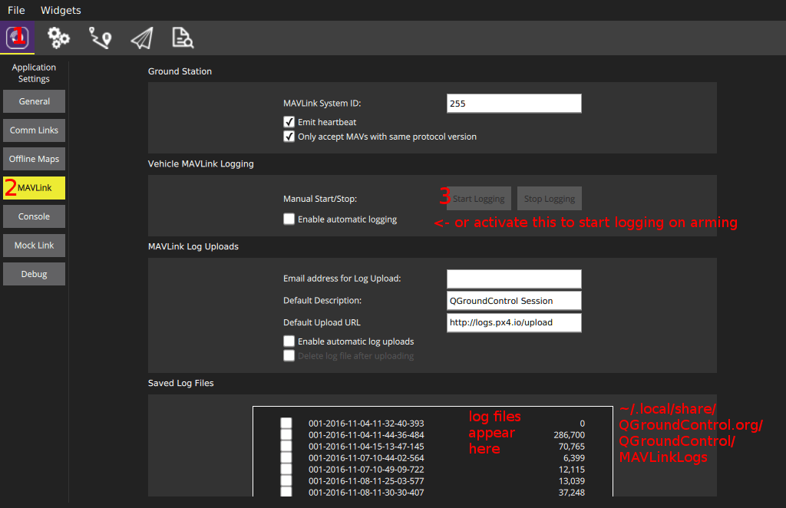

# 로깅

로거 프로그램은 어떤 ORB 주제에 대해서든 모든 내용을 넣어 기록할 수 있습니다. 필요한 모든 내용은 `.msg` 파일에서 만들기에, 토픽 이름만 정하면 됩니다. 추가 주기 매개변수에는 각 토픽별 최대 기록 주기를 지정합니다. 모든 토픽의 실존 인스턴스를 기록합니다.

출력 로그 형식은 [ULog](../dev_log/ulog_file_format.md) 입니다.

## 사용법
기본적으로, 로깅은 시동을 걸었을 때 시작하며, 제동 후 멈춥니다. 새 로그 파일은 시동을 걸 때마다 SD 카드에 만듭니다. 현재 상태를 표시하려면 콘솔에서 `logger status`명령을 활용하십시오. 로깅을 바로 시작하고 싶다면 `logger on` 명령을 내리십시오. 이 명령은 시동을 걸었을 때, 시동 동작보다 우선합니다. `logger off` 명령은 그 반대입니다.

다음 명령
```
logger help
```
을 활용하면 모든 지원 로거 명령과 매개변수 목록을 확인할 수 있습니다.


## 구성

The logging system is configured by default to collect sensible logs for use with [Flight Review](http://logs.px4.io).

`<interval>` 항목은 선택 사항이나, 밀리초 단위로 이 토픽을 기록할 두 기록 내용 사이의 최소 간격 시간을 지정합니다. 지정하지 않으면, 토픽을 최대 기록율로 기록합니다.

| SD 카드                                                                    | Description                                                                                                                                                          |
| ------------------------------------------------------------------------ | -------------------------------------------------------------------------------------------------------------------------------------------------------------------- |
| [SDLOG_MODE](../advanced_config/parameter_reference.md#SDLOG_MODE)       | 461                                                                                                                                                                  |
| [SDLOG_PROFILE](../advanced_config/parameter_reference.md#SDLOG_PROFILE) | Logging profile. Use this to enable less common logging/analysis (e.g. for EKF2 replay, high rate logging for PID & filter tuning, thermal temperature calibration). |
| [SDLOG_MISSION](../advanced_config/parameter_reference.md#SDLOG_MISSION) | 212                                                                                                                                                                  |

`<instance>` 항목 역시 선택사항이나, 이 항목은 로그를 진행할 인스턴스를 지정합니다. 지정하지 않으면, 토픽의 모든 인스턴스를 로깅합니다. `<instance>`를 지정하려면, `<interval>`을 반드시 지정해야합니다.

### 진단

Seperately, the list of logged topics can also be customized with a file on the SD card. Create a file `etc/logging/logger_topics.txt` on the card with a list of topics (For SITL, it's `build/px4_sitl_default/tmp/rootfs/fs/microsd/etc/logging/logger_topics.txt`):
```
<topic_name> <interval> <instance>
```
The `<interval>` is optional, and if specified, defines the minimum interval in ms between two logged messages of this topic. If not specified, the topic is logged at full rate.

The `<instance>` is optional, and if specified, defines the instance to log. If not specified, all instances of the topic are logged. To specify `<instance>`, `<interval>` must be specified. It can be set to 0 to log at full rate

[pyulog](https://github.com/PX4/pyulog) 저장소에 로깅 파일을 분석하고 변환하는 다양한 스크립트가 있습니다.

로깅 손실은 그다지 반갑지 않은 상황이며, 이에 영향을 주는 몇가지 요인이 있습니다:
```
sensor_accel 0 0
sensor_accel 100 1
sensor_gyro 200
sensor_mag 200 1
```
This configuration will log sensor_accel 0 at full rate, sensor_accel 1 at 10Hz, all sensor_gyro instances at 5Hz and sensor_mag 1 at 5Hz.


## 스크립트
There are several scripts to analyze and convert logging files in the [pyulog](https://github.com/PX4/pyulog) repository.


## 손실
Logging dropouts are undesired and there are a few factors that influence the amount of dropouts:
- 대부분 우리가 시험해본 SD 카드는 1분 단위로 관찰 했을 때 여러번 멈추었습니다. 이는 기록 명령을 처리함에 있어 수 100ms 정도의 지연이 있음을 보여줍니다. 이런 현상으로 인해 그동안 기록 버퍼가 차면 손실을 유발합니다. (아래와 같이) SD 카드에 따라 영향을 받습니다.
- SD 카드를 포맷하면 손실을 어느정도 예방할 수 있습니다.
- 로그 버퍼 크기를 늘리면 도움이 됩니다.
- 선택한 토픽에 대한 로깅 율을 줄이거나 필요없는 토픽을 로깅 목록에서 제거해보십시오(`info.py`가 이 문제 해결에 도움됨).

## SD 카드

무엇보다도 우리가 가장 좋다고 알게된 카드의 모델은 **SanDisk Extreme U3 32GB**입니다. 순간적으로 증가하는 기록 시간이 없(어 패킷 손실이 없을거라고 생각할 수 있)기에 이 카드를 추천합니다.

:::note
The maximum supported SD card size for NuttX is 32GB (SD Memory Card Specifications Version 2.0).
:::

| SD Card                                                       | Mean Seq. Write Speed [KB/s] | Max Write Time / Block (average) [ms] |
| ------------------------------------------------------------- | ---------------------------- | ------------------------------------- |
| SanDisk Extreme U3 32GB                                       | 461                          | **15**                                |
| Sandisk Ultra Class 10 8GB                                    | 348                          | 40                                    |
| Sandisk Class 4 8GB                                           | 212                          | 60                                    |
| SanDisk Class 10 32 GB (High Endurance Video Monitoring Card) | 331                          | 220                                   |
| Lexar U1 (Class 10), 16GB High-Performance                    | 209                          | 150                                   |
| Sandisk Ultra PLUS Class 10 16GB                              | 196                          | 500                                   |
| Sandisk Pixtor Class 10 16GB                                  | 334                          | 250                                   |
| Sandisk Extreme PLUS Class 10 32GB                            | 332                          | 150                                   |

태초로부터 지금까지 제대로 지원하는 로그 스트리밍 방법은 FMU에서 SD 카드를 활용하는 방법입니다. 그러나, 이 대안책으로, MAVLink로 동일한 로깅 데이터를 전송하는 로깅 스트리밍 방식이 있습니다. 이 방식은 FMU에 SD 카드 슬롯이 없을 경우(예: Intel® Aero Ready to Fly 드론)에 활용하거나, 단순히 SD 카드의 취급을 피하려 하고자 할 경우 진행할 수 있습니다.

필요 요소는 무선랜 연결처럼 초당 50KB를 제공할 수 있는 통신 수단입니다. 단일 클라이언트만 동시에 로그 스트리밍을 요청할 수 있습니다. 프로토콜에서 손실 패킷을 관리하기에 연결은 굳이 안정적이지 않아도 좋습니다.

ulog 스트리밍을 지원하는 클라이언트는 여러가지가 있습니다.:

## 로그 스트리밍

The traditional and still fully supported way to do logging is using an SD card on the FMU. However there is an alternative, log streaming, which sends the same logging data via MAVLink. This method can be used for example in cases where the FMU does not have an SD card slot (e.g. Intel® Aero Ready to Fly Drone) or simply to avoid having to deal with SD cards. Both methods can be used independently and at the same time.

The requirement is that the link provides at least ~50KB/s, so for example a WiFi link. And only one client can request log streaming at the same time. The connection does not need to be reliable, the protocol is designed to handle drops.

There are different clients that support ulog streaming:
- `mavlink_ulog_streaming.py` script in Firmware/Tools.
- QGroundControl: 
- [MAVGCL](https://github.com/ecmnet/MAVGCL)

### Diagnostics
- 로그 실시간 전송을 시작하지 않았다면, `logger`를 실행 중인지(위 참고) 확인하고, 시작하는 동안 콘솔 출력을 살펴보십시오.
- If it still does not work, make sure that Mavlink 2 is used. `MAV_PROTO_VER` 매개변수 값을 2로 강제 설정하십시오.
- Log streaming uses a maximum of 70% of the configured mavlink rate (`-r` parameter). 더 큰 전송율이 필요하다면, 메세지가 사라집니다. 현재 MAVLink 패킷에서 로그가 차지하는 백분율은 `mavlink status` 명령으로 확인할 수 있습니다(이 예제에서는 1.8%).
  ```
  instance #0:
          GCS heartbeat:  160955 us ago
          mavlink chan: #0
          type:           GENERIC LINK OR RADIO
          flow control:   OFF
          rates:
          tx: 95.781 kB/s
          txerr: 0.000 kB/s
          rx: 0.021 kB/s
          rate mult: 1.000
          ULog rate: 1.8% of max 70.0%
          accepting commands: YES
          MAVLink version: 2
          transport protocol: UDP (14556)
  ```
  또한 `txerr` 값이 0에 머물러있는지 확인하십시오. 만약 이 값이 올라간다면, NuttX 전송 버퍼가 너무 작거나, 물리 링크 대역폭이 포화 상태이거나, 하드웨어가 데이터를 처리하기에 너무 느린 상황임을 의미합니다.
