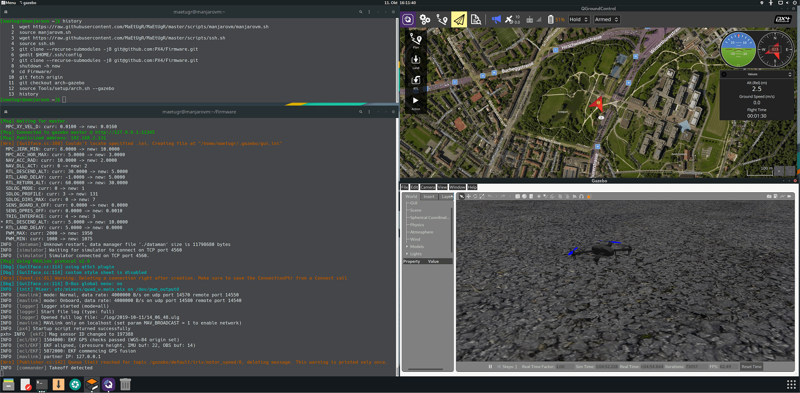

# Arch Linux 개발 환경

:::warning
이 개발 환경은 [지원되지 않습니다](../advanced/dev_env_unsupported.md). 지원되는 환경과 도구에 대한 정보는 [도구 모음 설치](../dev_setup/dev_env.md)를 참고하십시오!
:::

PX4-Autopilot 저장소는 PX4 개발을 위하여 Arch Linux 설치 스크립트를 제공합니다: [Tools/setup/arch.sh](https://github.com/PX4/PX4-Autopilot/blob/master/Tools/setup/arch.sh). <!-- NEED px4_version -->

The script installs (by default) all tools to build PX4 for NuttX targets and run simulation with *jMAVsim*. You can additionally install the *Gazebo-Classic* simulator by specifying the command line argument: `--gazebo`.



:::note
이 설명서는 Arch Linux 보다 설정하기 편리하여, [Manjaro](https://manjaro.org/)(Arch 기반 배포)에서 테스트하였습니다.
:::

스크립트를 가져와 실행하려면 다음 중 하나를 실행합니다.
* [PX4 소스 코드를 다운로드](../dev_setup/building_px4.md)하고 스크립트를 실행합니다.
  ```
  git clone https://github.com/PX4/PX4-Autopilot.git
  bash PX4-Autopilot/Tools/setup/arch.sh
  ```
* 필요한 스크립트만 다운로드하여 실행합니다.
  ```sh
  wget https://raw.githubusercontent.com/PX4/PX4-Autopilot/master/Tools/setup/arch.sh
  wget https://raw.githubusercontent.com/PX4/PX4-Autopilot/master/Tools/setup/requirements.txt
  bash arch.sh
  ```

스크립트는 다음의 매개변수를 사용합니다.
- `--gazebo`: 이 매개변수를 추가하여 [AUR](https://aur.archlinux.org/packages/gazebo/)에서 Gazebo를 설치합니다. :::note Gazebo는 소스에서 컴파일됩니다. 설치에 시간이 걸리고, `sudo` 비밀번호를 여러 번 입력하여야 합니다(종속성의 경우).
:::

- `--no-nuttx`: NuttX/Pixhawk 도구 모음을 설치하지 않습니다(즉, 시뮬레이션만 사용하는 경우).
- `--no-sim-tools`: jMAVSim/Gazebo를 설치하지 않습니다(예: Pixhawk/NuttX 대상만 대상으로 하는 경우).
