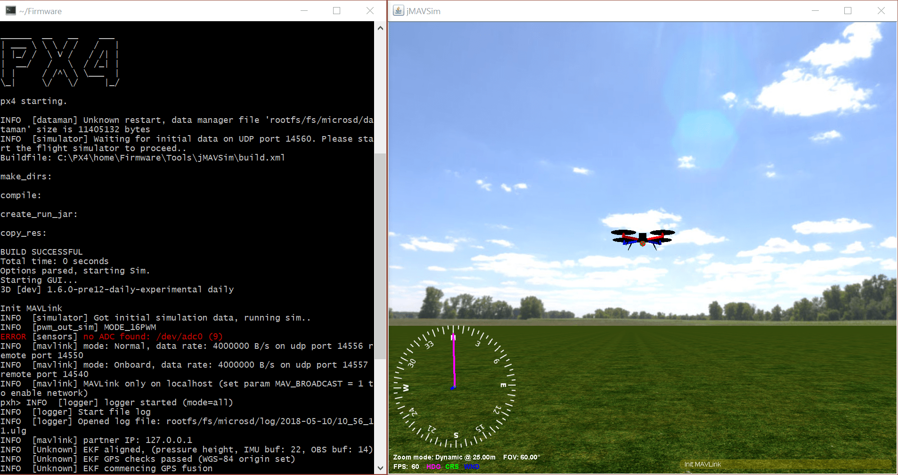

# Windows Development Environment (Cygwin-based)

다음 지침은 Windows 10에서 (Cygwin 기반) PX4 개발 환경 설정 방법을 설명합니다. 이 환경은 다음을 위한 PX4를 구축하는 데 사용합니다.
* Pixhawk와 기타 NuttX 기반 하드웨어
* [jMAVSim 시뮬레이션](../simulation/jmavsim.md)

:::warning
This setup is an [unsupported windows development environment](../advanced/dev_env_unsupported.md).

The toolchain was previously recommended, but does not work with PX4 v1.12 and later due to packaging issues. The [Windows WSL2-Based Development Environment](../dev_setup/dev_env_windows_wsl.md) should be used by preference.
:::


<a id="installation"></a>

## 설치 방법

1. [Github 릴리스](https://github.com/PX4/windows-toolchain/releases) 또는 [Amazon S3](https://s3-us-west-2.amazonaws.com/px4-tools/PX4+Windows+Cygwin+Toolchain/PX4+Windows+Cygwin+Toolchain+0.9.msi)(빠른 다운로드)에서 바로 사용할 수 있는 MSI 설치 프로그램의 최신 버전을 다운로드합니다.
1. 실행후, 설치 위치를 지정하고 설치하십시오:
1. 설치가 끝날 때 상자를 선택하여 *PX4 리포지토리를 복제하고, jMAVSim으로 시뮬레이션을 빌드 및 실행*합니다(이렇게 하면 시작 프로세스가 간소화됨). :::note 이 단계를 놓친 경우 [PX4-Autopilot 저장소를 수동으로 복제](#getting_started)하여야 합니다.
:::

:::warning
At time of writing the installer is missing some dependencies (and cannot yet be rebuilt to add them - see [PX4-windows-toolchain#31](https://github.com/PX4/PX4-windows-toolchain/issues/31)).

To add these yourself:
1. 도구 모음 설치 디렉터리로 이동합니다(기본값 **C:\\PX4\\**).
1. Run **run-console.bat** (double click) to start the linux-like Cygwin bash console
1. Enter the following command in the console:
   ```
   pip3 install --user kconfiglib jsonschema future
   ```

:::

<a id="getting_started"></a>

## 시작하기

The toolchain uses a specially configured console window (started by running the **run-console.bat** script) from which you can call the normal PX4 build commands:

1. 도구 모음 설치 디렉터리로 이동합니다(기본값 **C:\\PX4\\**).
1. Run **run-console.bat** (double click) to start the linux-like Cygwin bash console (you must use this console to build PX4).
1. Clone the PX4 PX4-Autopilot repository from within the console:

:::note
Skip this step if you ticked the installer option to *clone the PX4 repository, build and run simulation with jMAVSim*. Cloning only needs to be done once!
:::

   ```bash
   # Clone the PX4-Autopilot repository into the home folder & loads submodules in parallel
   git clone --recursive -j8 https://github.com/PX4/PX4-Autopilot.git
   ```

   You can now use the console/PX4-Autopilot repository to build PX4.

1. For example, to run JMAVSim:
   ```bash
   # Navigate to PX4-Autopilot repo
   cd Firmware
   # Build and runs SITL simulation with jMAVSim to test the setup
   make px4_sitl jmavsim
   ```
   The console will then display:

   


## 다음 단계

Once you have finished setting up the command-line toolchain:

- Install the [QGroundControl Daily Build](https://docs.qgroundcontrol.com/master/en/releases/daily_builds.html)
- [빌드 지침](../dev_setup/building_px4.md)을 계속 진행합니다.


<a id="usage_instructions"></a>

## 문제 해결

### 파일 모니터링 도구와 툴체인 속도

Antivirus and other background file monitoring tools can significantly slow down both installation of the toolchain and PX4 build times.

You may wish to halt them temporarily during builds (at your own risk).

### 윈도우와 Git 특수 사례

#### Windows CR+LF 대 Unix LF 줄 끝

We recommend that you force Unix style LF endings for every repository you're working with using this toolchain (and use an editor which preserves them when saving your changes - e.g. Eclipse or VS Code). Compilation of source files also works with CR+LF endings checked out locally, but there are cases in Cygwin (e.g. execution of shell scripts) that require Unix line endings (otherwise you get errors like `$'\r': Command not found.`). Luckily git can do this for you when you execute the two commands in the root directory of your repo:
```
git config core.autocrlf false
git config core.eol lf
```

If you work with this toolchain on multiple repositories you can also set these two configurations globally for your machine:
```
git config --global ...
```
This is not recommended because it may affect any other (unrelated) git use on your Windows machine.

#### 유닉스 권한 실행 비트

Under Unix there's a flag in the permissions of each file that tells the OS whether or not the file is allowed to be executed. *git* under Cygwin supports and cares about that bit (even though the Windows NTFS file system does not use it). This often results in *git* finding "false-positive" differences in permissions. The resulting diff might look like this:
```
diff --git ...
old mode 100644
new mode 100755
```

We recommend globally disabling the permission check on Windows to avoid the problem:
```sh
# 머신에 대해 전역적으로 실행 비트 검사를 비활성화합니다.
git config --global core.fileMode false 
```

For existing repositories that have this problem caused by a local configuration, additionally:
```sh
# 전역 옵션을 적용하려면 이 저장소에 대한 로컬 옵션을 제거합니다.
git config --unset core.filemode

# 모든 하위 모듈에 대한 로컬 옵션 제거
git submodule foreach --recursive git config --unset core.filemode 
```


<!--
Instructions for building/updating this toolchain are covered in [Windows Cygwin Development Environment (Maintenance Instructions)](../advanced/windows_cygwin_toolchain_setup.md)
-->