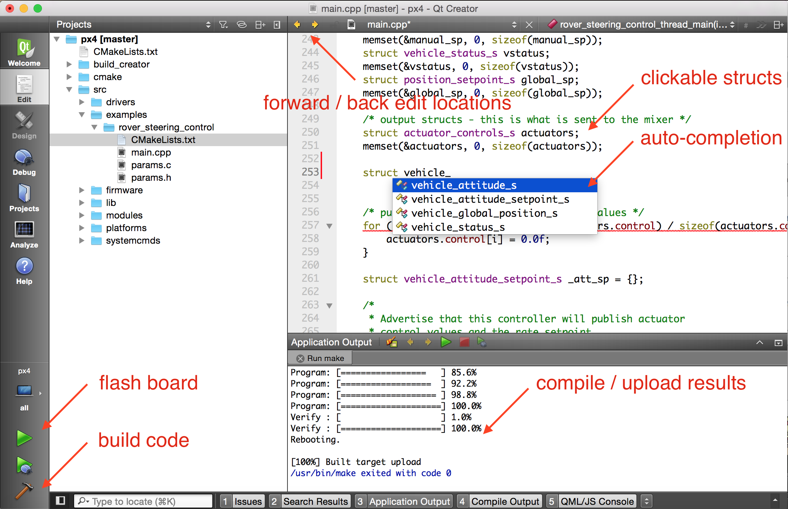

# Qt Creator IDE

:::warning
Qt Creator는 PX4 개발에서 공식적으로 지원되고 권장되는 IDE인 [VSCode](../dev_setup/vscode.md)로 대체되었습니다.
:::

[Qt Creator](https://www.qt.io/download-open-source)는 PX4를 컴파일하고 디버그하는 데 사용할 수 있는 널리 사용되는 크로스 플랫폼 오픈 소스 IDE입니다.

## Qt Creator 기능

Qt Creator는 클릭 가능한 기호, 전체 코드베이스의 자동 완성, 펌웨어 빌드 및 플래싱을 제공합니다.



아래 비디오는 사용 방법을 보여줍니다.

@[유투브](https://www.youtube.com/watch?v=Bkk8zttWxEI&rel=0&vq=hd720)

## IDE 설정

### 리눅스용 Qt Creator

Before starting Qt Creator, the [project file](https://gitlab.kitware.com/cmake/community/-/wikis/doc/cmake/Generator-Specific-Information#codeblocks-generator) needs to be created:

```sh
cd ~/src/PX4-Autopilot
mkdir ../Firmware-build
cd ../Firmware-build
cmake ../PX4-Autopilot -G "CodeBlocks - Unix Makefiles"
```

그런 다음 루트 PX4-Autopilot 폴더에 CMakeLists.txt를 로드합니다. **파일 > 파일 또는 프로젝트 열기**(CMakeLists.txt 파일 선택).

로드 후 **재생** 버튼은 실행 대상 구성에서 '사용자 정의 실행 파일'을 선택하고, 실행 파일로 'make'를, 인수로 '업로드'를 입력하여 프로젝트를 실행하도록 설정할 수 있습니다.

### Windows용 Qt Creator

:::note
Windows는 Qt Creator를 사용한 PX4 개발에 대해 테스트되지 않았습니다.
:::

### Mac OS용 Qt Creator

Before starting Qt Creator, the [project file](https://gitlab.kitware.com/cmake/community/-/wikis/doc/cmake/Generator-Specific-Information#codeblocks-generator) needs to be created:

```sh
cd ~/src/PX4-Autopilot
mkdir -p build/creator
cd build/creator
cmake ../.. -G "CodeBlocks - Unix Makefiles"
```

설정이 종료되었습니다. *Qt Creator* 실행 후, 아래 비디오의 단계를 완료하여 빌드할 프로젝트를 설정하십시오.

@[유투브](https://www.youtube.com/watch?v=0pa0gS30zNw&rel=0&vq=hd720)
