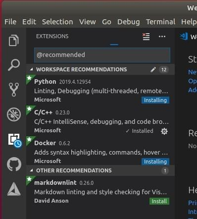

# 비주얼 스튜디오 코드 IDE(VSCode)

[Visual Studio Code](https://code.visualstudio.com/) is a powerful cross-platform source code editor/IDE that can be used for PX4 development on Ubuntu, Windows, and macOS.

PX4 개발에 VSCode를 사용하는 데에는 많은 이유가 있습니다.

- Getting setup _really_ only takes a few minutes.
- A rich extension ecosystem that enables a huge range of tools needed for PX4 development: C/C++ (with solid _cmake_ integration), _Python_, _Jinja2_, ROS messages, and even DroneCAN dsdl.
- 뛰어난 Github 통합 기능

IDE를 설정과 개발 방법에 대하여 설명합니다.

:::note
다른 강력한 IDE가 있지만, 일반적으로 PX4와 통합에는 많은 어려움이 있습니다. With _VScode_, configuration is stored in the PX4/PX4-Autopilot tree ([PX4-Autopilot/.vscode](https://github.com/PX4/PX4-Autopilot/tree/release/1.15/.vscode)) so the setup process is as simple as adding the project folder.
:::

## 선행 조건

You must already have installed the command line [PX4 developer environment](../dev_setup/dev_env.md) for your platform and downloaded the _Firmware_ source code repo.

## 설치 및 설정

1. [VSCode 다운로드 및 설치](https://code.visualstudio.com/)(사용자의 OS에 맞는 버전이 제공됨).
1. Open VSCode and add the PX4 source code:

   - Select _Open folder ..._ option on the welcome page (or using the menu: **File > Open Folder**): 
   - A file selection dialog will appear. Select the **PX4-Autopilot** directory and then press **OK**.

   The project files and configuration will then load into _VSCode_.

1. Press **Install All** on the _This workspace has extension recommendations_ prompt (this will appear on the bottom right of the IDE). 

   VSCode will open the _Extensions_ panel on the left hand side so you can watch the progress of installation.

   

1. 오른쪽 하단에 여러 알림/프롬프트가 나타날 수 있습니다.

   :::tip
메시지가 사라지면, 하단 파란색 막대 오른쪽에 있는 작은 "알람" 아이콘을 클릭합니다.
:::

   - If prompted to install a new version of _cmake_:
     - **아니요**라고 말합니다([PX4 개발자 환경](../dev_setup/dev_env.md)과 함께 올바른 버전이 설치됨).
   - If prompted to sign into _github.com_ and add your credentials:
     - 이것은 당신에게 달려 있습니다! Github와 IDE 간의 긴밀한 통합을 제공하여 워크플로를 단순화할 수 있습니다.
   - 다른 프롬프트는 선택 사항이며 유용하다고 생각되면 설치할 수 있습니다. <!-- perhaps add screenshot of these prompts -->

## PX4 빌드

빌드를 진행하려면:

1. Select your build target ("cmake build config"):

   - The current _cmake build target_ is shown on the blue _config_ bar at the bottom (if this is already your desired target, skip to next step). 

     ::: info The cmake target you select affects the targets offered for when [building/debugging](#debugging) (i.e. for hardware debugging you must select a hardware target like `px4_fmu-v6`).
:::

   - Click the target on the config bar to display other options, and select the one you want (this will replace any selected target).
   - _Cmake_ will then configure your project (see notification in bottom right). 
   - Wait until configuration completes. When this is done the notification will disappear and you'll be shown the build location: .

1. 그런 다음 구성 표시줄에서 빌드를 시작할 수 있습니다(**빌드** 또는 **디버그** 선택). 

After building at least once you can now use \[code completion\](#code completion) and other _VSCode_ features.

## 디버깅

### SITL 디버깅

SITL에서 PX4를 디버깅하려면:

1. 사이드바에서 디버그 아이콘(빨간색으로 표시)을 선택하여 디버그 패널을 표시합니다.

1. Then choose your debug target (e.g. _Debug SITL (Gazebo Iris)_) from the top bar debug dropdown (purple box).

   :::note
제공되는 디버그 대상(보라색 상자)은 빌드 대상(하단 막대의 노란색 상자)과 일치합니다.
예를 들어, SITL 대상을 디버그하려면 빌드 대상에 SITL이 포함되어야 합니다.
:::

1. 디버그 "재생" 화살표(상단 막대의 디버그 대상 옆 - 분홍색 상자)를 클릭하여 디버깅을 시작합니다.

디버깅하는 동안 중단점을 설정하고, 코드를 건너뛰고, 그렇지 않으면 정상적으로 개발할 수 있습니다.

### 하드웨어 디버깅

The instructions in [SWD Debug Port](../debug/swd_debug.md) explain how to connect to the SWD interface on common flight controllers (for example, using the Dronecode or Blackmagic probes).

SWD 인터페이스에 연결한 후 VSCode의 하드웨어 디버깅은 디버거 유형(및 펌웨어)(예: `jlink (px4_fmu-v5)`)에 적합한 디버그 대상을 선택한다는 점을 제외하고 [SITL 디버깅](#debugging_sitl)과 동일합니다.

:::tip
`jlink` 옵션을 보려면 [펌웨어 빌드를 위한 cmake 대상](#building-px4)을 선택하여야 합니다.
:::

## 코드 완성

코드 완성(및 기타 IntelliSense 마법)이 작동하려면 활성화 설정후, [코드를 빌드](#building)하여야 합니다.

이 작업이 완료되면 다른 작업을 수행할 필요가 없습니다. 툴체인은 입력시 자동으로 기호를 제공합니다.

## 문제 해결

이 섹션에는 설정 및 빌드 오류에 대한 지침이 포함되어 있습니다.

### Ubuntu 18.04: "Visual Studio Code는 이 큰 작업 영역에서 파일 변경 사항을 감시할 수 없습니다."

이 오류는 시작시에 나타납니다. 일부 시스템에서는 애플리케이션에 적용되는 파일 핸들의 상한선이 8192개이므로 VSCode가 `/PX4-Autopilot`에서 파일 수정 사항을 감지하지 못할 수 있습니다.

메모리 소비를 희생시키면서 오류를 방지하기 위해 이 제한을 늘릴 수 있습니다. [여기에 있는 지침](https://code.visualstudio.com/docs/setup/linux#_visual-studio-code-is-unable-to-watch-for-file-changes-in-this-large-workspace-error-enospc)을 따르십시오. 값 65536이면 충분합니다.
