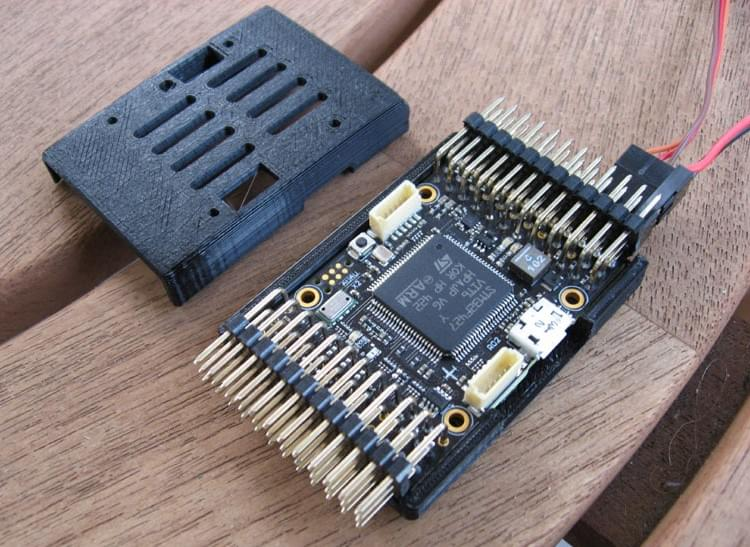
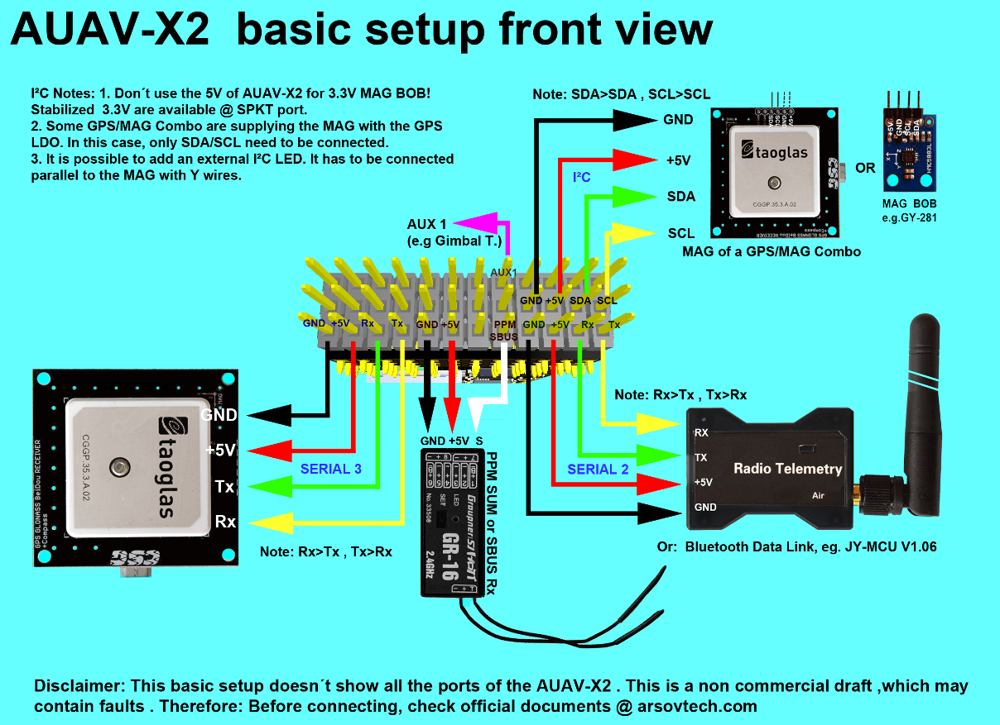
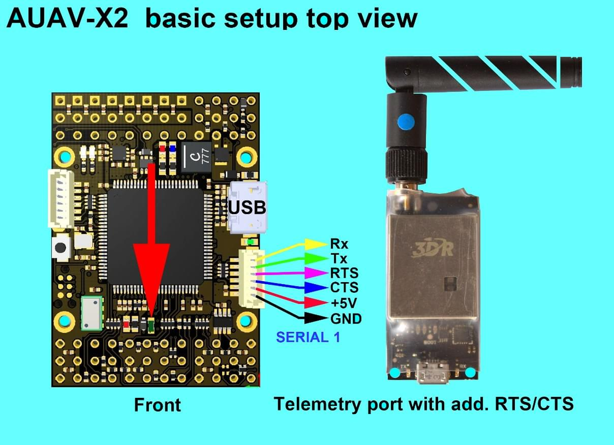
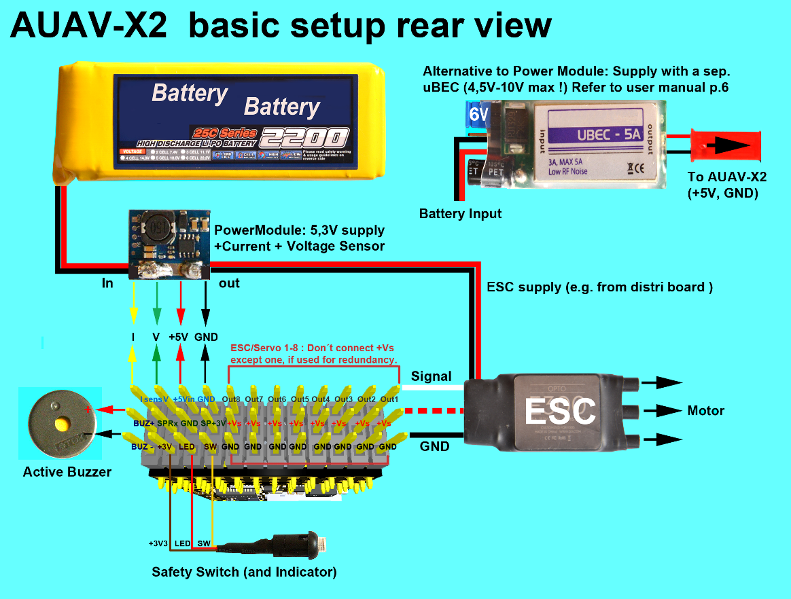
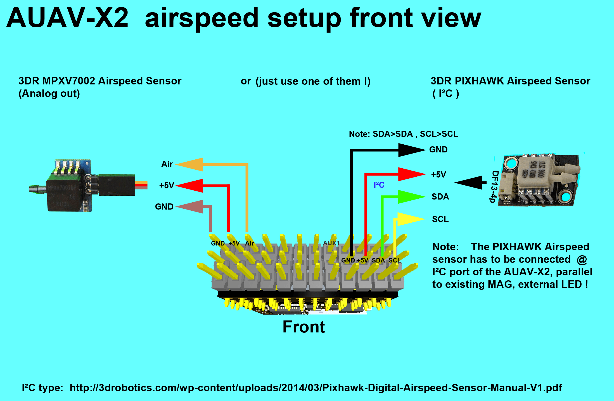

# AUAV-X2 자동조종장치 (단종됨)

:::warning
This flight controller has been [discontinued](../flight_controller/autopilot_experimental.md) and is no longer commercially available.
:::

:::warning PX4 does not manufacture this (or any) autopilot. Contact the [manufacturer](https://store.mrobotics.io/) for hardware support or compliance issues.
:::

The [AUAV&reg;](http://www.auav.com/) _AUAV-X2 autopilot_ is based on the [Pixhawk&reg;-project](https://pixhawk.org/) **FMUv2** open hardware design.  PX4는 [NuttX](https://nuttx.apache.org/) OS에서 실행됩니다.

## 요약

- 메인 시스템 온칩: [STM32F427](http://www.st.com/web/en/catalog/mmc/FM141/SC1169/SS1577/LN1789)
  - CPU : STM32F427VIT6 ARM 마이크로 컨트롤러 - 개정판 3
  - IO: STM32F100C8T6 ARM 마이크로 컨트롤러
- 센서:
  - 인벤센스 MPU9250 9DOF
  - 인벤센스 ICM-20608 6DOF
  - MEAS MS5611 기압계
- 크기/중량
  - 크기: 36mm x 50mm
  - 장착 위치: 직경 30.5mm x 30.5mm 3.2mm
  - 중량: 10.9g
- 역전압 보호 기능의 전원 OR-ing 회로도. 5V 전원 모듈이 필요합니다.

## 연결성

- 2.54mm 헤더 :
- GPS (USART4)
- i2c
- RC 입력
- PPM 입력
- Spektrum 입력
- RSSI 입력
- sBus 입력
- sBus 출력
- 전원 입력
- 부저 출력
- LED 출력
- Servo 출력 8개
- Aux 출력 6개
- USART7 (콘솔)
- USART8 (OSD)

## 구매처

더 이상 생산되지 않습니다. This has been superseded by the [mRo X2.1](mro_x2.1.md). mRobotics는 2017년 8월부터 AUAV 유통 업체입니다.

## 주요 링크

- [사용자 매뉴얼](http://arsovtech.com/wp-content/uploads/2015/08/AUAV-X2-user-manual-EN.pdf)
- [자작 드론 포스트](http://diydrones.com/profiles/blogs/introducing-the-auav-x2-1-flight-controller)

## 배선 가이드

## 회로도

이 보드는 [Pixhawk 프로젝트](https://pixhawk.org/) **FMUv2** 개방형 하드웨어 설계에 기반합니다.

- [FMUv2 + IOv2 회로도](https://raw.githubusercontent.com/PX4/Hardware/master/FMUv2/PX4FMUv2.4.5.pdf) - 회로도 및 레이아웃

:::note CC-BY-SA 3.0 라이센스 오픈 하드웨어 설계로 모든 회로도와 설계 파일을 [사용할 수 있습니다](https://github.com/PX4/Hardware).
:::

## 시리얼 포트 매핑

| UART   | 장치         | 포트             |
| ------ | ---------- | -------------- |
| UART1  | /dev/ttyS0 | IO 디버그         |
| USART2 | /dev/ttyS1 | TELEM1 (흐름 제어) |
| USART3 | /dev/ttyS2 | TELEM2 (흐름 제어) |
| UART4  |            |                |
| UART7  | 콘솔         |                |
| UART8  | SERIAL4    |                |
