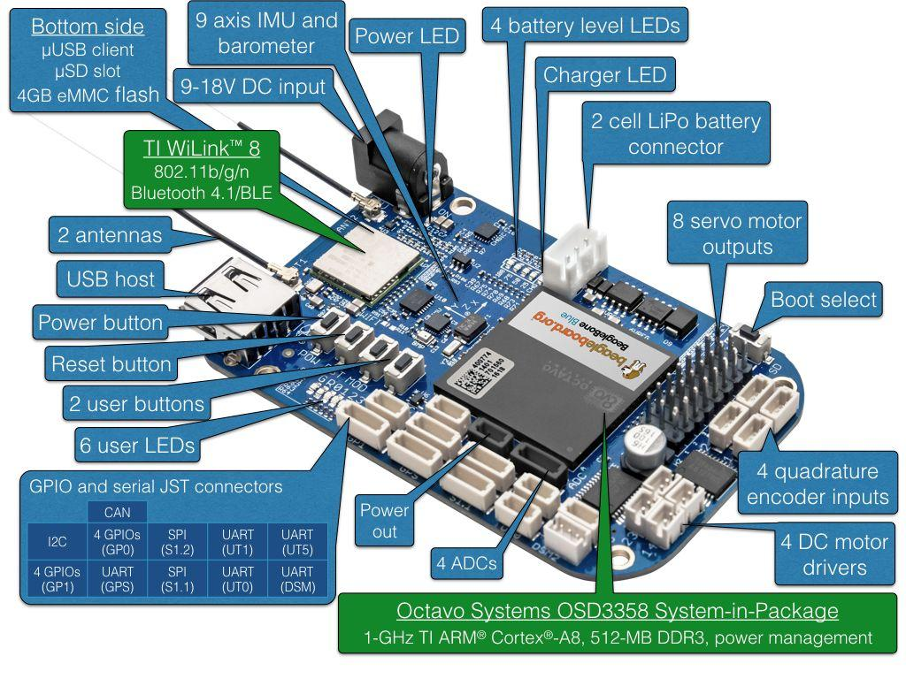

# 비글본 블루

:::warning PX4에서는 이 제품을 제조하지 않습니다. 하드웨어 지원과 호환 문제는 [제조사](https://beagleboard.org/blue)에 문의하십시오.
:::

:::warning
이 비행 컨트롤러에 대한 PX4 지원은 [테스트 단계](../flight_controller/autopilot_experimental.md)입니다.
:::

[BeagleBone Blue](https://beagleboard.org/blue)는 올인원 리눅스 기반 컴퓨터입니다. 로봇 공학에 최적화되어 있지만, 이 작고 저렴한 보드에는 비행 콘트롤러에 필요한 모든 센서와 주변 장치가 있습니다. 이 항목에서는 [librobotcontrol](https://github.com/StrawsonDesign/librobotcontrol) 로봇 패키지로 PX4를 실행하기 위한 보드 설정 방법을 설명합니다.



## OS 이미지

_BeagleBone Blue_ images can be found here:

- [가장 안정적인 OS 이미지](https://beagleboard.org/latest-images).
- [ 테스트 OS 이미지](https://rcn-ee.net/rootfs/bb.org/testing/)(자주 업데이트됨).

플래시 OS 이미지에 대한 정보는 [이 페이지](https://github.com/beagleboard/beaglebone-blue/wiki/Flashing-firmware)를 참고하십시오. Other useful information can be found in the [FAQ](https://github.com/beagleboard/beaglebone-blue/wiki/Frequently-Asked-Questions-(FAQ)).

:::tip
Optionally you can update to a realtime kernel, and if you do, re-check if _librobotcontrol_ works properly with the realtime kernel.
:::

The latest OS images at time of updating this document is [bone-debian-10.3-iot-armhf-2020-04-06-4gb.img.xz](https://debian.beagle.cc/images/bone-debian-10.3-iot-armhf-2020-04-06-4gb.img.xz).

## 크로스 컴파일러 빌드 (권장)

The recommended way to build PX4 for _BeagleBone Blue_ is to compile on a development computer and upload the PX4 executable binary directly to the BeagleBone Blue.

:::tip
이 접근 방식은 배포 속도와 사용 편의성 때문에 [네이티브 빌드](#native_builds) 보다 권장됩니다.
:::

:::note PX4 빌드에는 빌드에 자동으로 포함되는 [librobotcontrol](http://strawsondesign.com/docs/librobotcontrol/)이 필요합니다. 그러나, 필요한 경우 독립적으로 설치하고 테스트할 수 있습니다.
:::

### Beaglebone Blue WIFI 설정

보드에 쉽게 액세스하려면 Wi-Fi를 통해 네트워크에 연결할 수 있습니다.

절차는 다음과 같습니다 (보드에서 실행).

```sh
sudo su
connmanctl
connmanctl>scan wifi
connmanctl>services
#(at this point you should see your network SSID appear.)
connmanctl>agent on
connmanctl>connect <SSID>
    Enter Passphrase
connmanctl>quit
```

:::note
The format of the `<SSID>` above is normally the text 'wifi' followed by a string of other characters. After entering the command you will be prompted to enter the wifi password.
:::

### Beaglebone에서 SSH 루트 로그인

Root login can be enabled on the board with:

```sh
sudo su
echo "PermitRootLogin yes" >>  /etc/ssh/sshd_config && systemctl restart sshd
```

### 크로스 컴파일러 설정

1. First set up _rsync_ (this is used to transfer files from the development computer to the target board over a network - WiFi or Ethernet). For _rsync_ over SSH with key authentication, follow the steps here (on the development machine):

   1. 이전에 생성하지 않은 경우 SSH 키를 생성합니다.

      ```
      ssh-keygen -t rsa
      ```

      1. ENTER //no passphrase
      1. ENTER
      1. ENTER

   1. **/etc/hosts**에서 BeagleBone Blue 보드를 `beaglebone`으로 정의하고 암호없는 SSH 액세스를 위해 공개 SSH 키를 보드에 복사합니다.

      ```
      ssh-copy-id debian@beaglebone
      ```

   1. 또는 beaglebone의 IP를 직접 사용할 수 있습니다.

      ```
      ssh-copy-id debian@<IP>
      ```

   1. 확인 메시지가 표시되면 : yes
   1. 루트 비밀번호 입력

1. 크로스 컴파일러 설정

   1. 툴체인 다운로드

      1. First install the toolchain into _/opt/bbblue_toolchain/gcc-arm-linux-gnueabihf_. Here is an example of using soft link to select which version of the toolchain you want to use:

         ```sh
         mkdir -p /opt/bbblue_toolchain/gcc-arm-linux-gnueabihf
            chmod -R 777 /opt/bbblue_toolchain
            cd /opt/bbblue_toolchain/gcc-arm-linux-gnueabihf
         ```

         The ARM Cross Compiler for _BeagleBone Blue_ can be found at [Linaro Toolchain Binaries site](https://www.linaro.org/downloads/#gnu_and_llvm).

:::tip GCC
in the toolchain should be compatible with kernel in _BeagleBone Blue_. General rule of thumb is to choose a toolchain where version of GCC is not higher than version of GCC which comes with the OS image on _BeagleBone Blue_.
:::

         Download and unpack [gcc-linaro-13.0.0-2022.06-x86_64_arm-linux-gnueabihf.tar.xz](https://snapshots.linaro.org/gnu-toolchain/13.0-2022.06-1/arm-linux-gnueabihf/gcc-linaro-13.0.0-2022.06-x86_64_arm-linux-gnueabihf.tar.xz) to the bbblue_toolchain folder.

         Different ARM Cross Compiler versions for _BeagleBone Blue_ can be found at [Linaro Toolchain Binaries site](http://www.linaro.org/downloads/).

         ```sh
         wget https://snapshots.linaro.org/gnu-toolchain/13.0-2022.06-1/arm-linux-gnueabihf/gcc-linaro-13.0.0-2022.06-x86_64_arm-linux-gnueabihf.tar.xz
         tar -xf gcc-linaro-13.0.0-2022.06-x86_64_arm-linux-gnueabihf.tar.xz
         ```

:::tip
The GCC version of the toolchain should be compatible with kernel in _BeagleBone Blue_.
:::

         As a general rule of thumb is to choose a toolchain where the version of GCC is not higher than the version of GCC which comes with the OS image on _BeagleBone Blue_.

      1. Add it to the PATH in ~/.profile as shown below

         ```sh
         export PATH=$PATH:/opt/bbblue_toolchain/gcc-arm-linux-gnueabihf/gcc-linaro-13.0.0-2022.06-x86_64_arm-linux-gnueabihf/bin
         ```

         :::note
Logout and Login to apply the change, or execute the same line on your current shell.
:::

      1. Setup other dependencies by downloading the PX4 source code and then running the setup scripts:

         ````
         git clone https://github.com/PX4/PX4-Autopilot.git --recursive
         ols
         ```

         You may have to edit the upload target to match with your setup:

         ```sh
         nano PX4-Autopilot/boards/beaglebone/blue/cmake/upload.cmake

         # in row 37 change debian@beaglebone.lan TO root@beaglebone (or root@<IP>)
         ````

         See the [Development Environment Setup](../dev_setup/dev_env_linux_ubuntu.md) instructions for additional information.

### 교차 컴파일 및 업로드

Compile and Upload

```
make beaglebone_blue_default upload
```

:::note
Without upload, files stored local in build folder.
:::

To test the uploaded files, run the following commands on the _BeagleBone Blue_ board:

```sh
cd /home/debian/px4
sudo ./bin/px4 -s px4.config
```

:::note
Currently _librobotcontrol_ requires root access.
:::

<a id="native_builds"></a>

## 네이티브 빌드(선택 사항)

You can also natively build PX4 builds directly on the BeagleBone Blue.

After acquiring the pre-built library,

1. Select the _librobotcontrol_ installation directory, and set it in the `LIBROBOTCONTROL_INSTALL_DIR` environment variable so that other unwanted headers will not be included
1. Install **robotcontrol.h** and **rc/\*** into `$LIBROBOTCONTROL_INSTALL_DIR/include`
1. 사전 빌드된 기본 (ARM) 버전의 librobotcontrol.\ *을 `$LIBROBOTCONTROL_INSTALL_DIR/lib` 폴더에 설치합니다.

Run the following commands on the BeagleBone Blue (i.e. via SSH):

1. 종속성 설치:
   ```sh
   종속성 설치: 
     sh
     sudo apt-get update
     sudo apt-get install cmake python-empy
   ```
2. PX4 펌웨어를 BeagleBone Blue에 복제합니다.
3. [표준 빌드 시스템 설치](../dev_setup/dev_env_linux.md)를 계속 진행합니다.

## Changes in config

All changes can be made in de px4.config file directly on beaglebone. For example, you can change the WIFI to wlan.

:::note
If you want to change permanently, you have to change **PX4-Autopilot/posix-configs/bbblue/px4.config** on the Build Machine before build.
:::

## 부팅 중 자동 시작

Here is an example [/etc/rc.local]:

```sh
#!/bin/sh -e
#
# rc.local
#
# This script is executed at the end of each multiuser runlevel.
# Make sure that the script will "exit 0" on success or any other
# value on error.
#
# In order to enable or disable this script just change the execution
# bits.
#
# By default this script does nothing.

# wait for services to start up
/bin/sleep 25

cd /home/debian/px4

/home/debian/px4/bin/px4 -d -s /home/debian/px4/px4.config > /home/debian/px4/PX4.log &

exit 0
```

Below is a _systemd_ service example [/lib/systemd/system/px4-quad-copter.service]:

```sh
[Unit]
Description=PX4 Quadcopter Service
After=networking.service network-online.target
StartLimitIntervalSec=0
Conflicts=px4-fixed-wing.service

[Service]
WorkingDirectory=/home/debian/px4
User=root
ExecStart=/home/debian/px4/bin/px4 -d -s /home/debian/px4/px4.config

Restart=on-failure
RestartSec=1

[Install]
WantedBy=multi-user.target
```

### 기타

#### 파워 서보 레일

When PX4 starts, it automatically applies power to servos.

#### 독특한 기능

BeagleBone Blue has some unique features such as multiple choices of WiFi interfaces and power sources. Refer to comments in **/home/debian/px4/px4.config** for usage of these features.

#### SBUS 신호 변환기

SBUS signal from receiver (e.g., FrSky X8R) is an inverted signal. UARTs on BeagleBone Blue can only work with non-inverted 3.3V level signal. [This tutorial](../tutorials/linux_sbus.md) contains a SBUS signal inverter circuit.

#### 일반적인 연결

For a quadcopter with GPS and an SBUS receiver, here are typical connections:

1. 비글본 블루에서 모터 1, 2, 3 및 4의 ESC를 서보 출력의 채널 1, 2, 3 및 4에 연결합니다. 비글본 블루에서 ESC 커넥터에 전원 출력이 포함되어 있는 경우 핀, 제거 및 서보 채널의 전원 출력 핀에 연결하지 마십시오.

1. dsm2와 일치하는 커넥터가있는 경우 위에서 언급한 변환된 SBUS 신호를 dsm2 포트에 연결하고, 그렇지 않으면 사용 가능한 다른 UART 포트에 연결하고 **/home/debian/px4/px4.config**에서 해당 포트를 변경합니다.

1. GPS 모듈의 신호를 비글본 블루의 GPS 포트에 연결합니다 BeagleBone Blue에있는 GPS 포트의 신호 핀은 3.3V만 허용하므로 이에 적합한 GPS 모듈을 선택하십시오.
