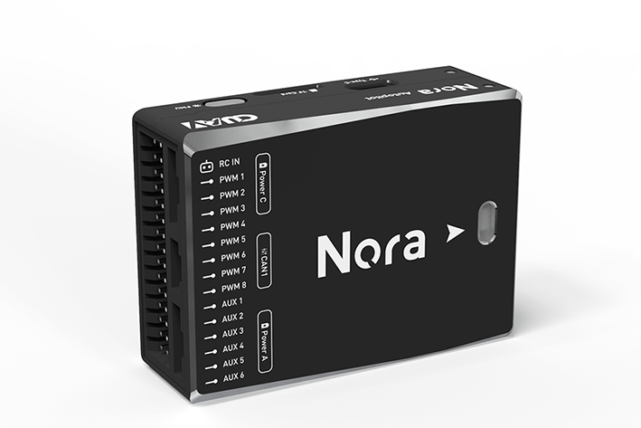
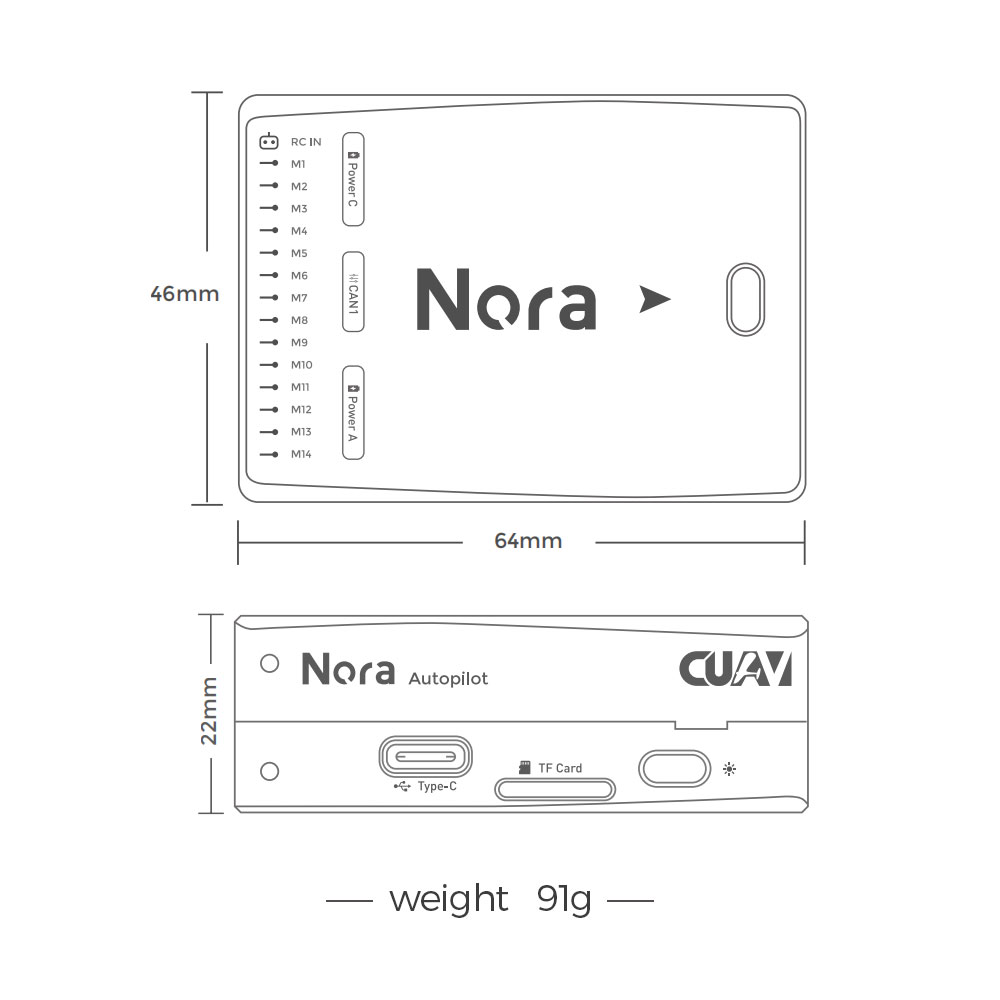
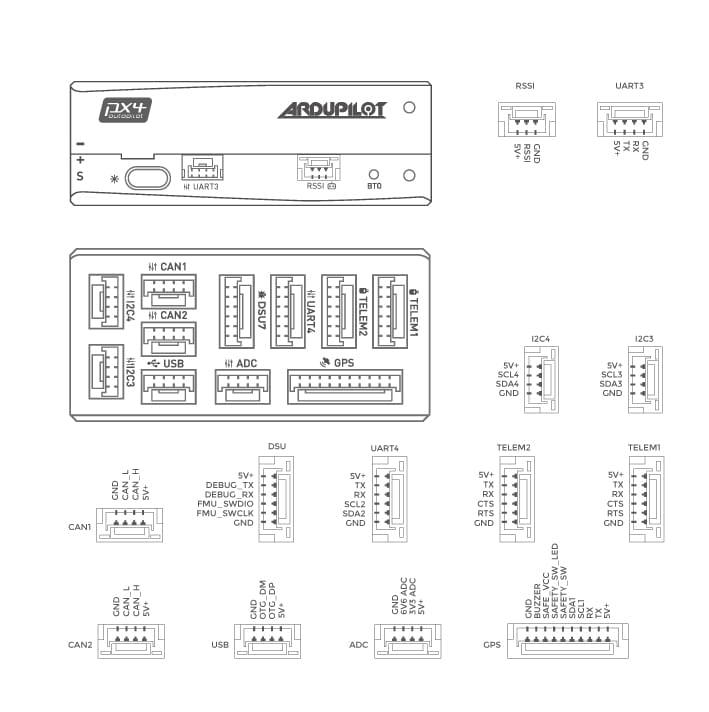

# CUAV Nora 비행 컨트롤러

:::warning PX4에서는 이 제품을 제조하지 않습니다. 하드웨어 지원과 호환 문제는 [제조사](https://www.cuav.net)에 문의하십시오.
:::

The [Nora](https://doc.cuav.net/flight-controller/x7/en/nora.html)<sup>&reg;</sup> flight controller is a high-performance autopilot. 산업용 드론과 대형 대형 드론에 적합합니다. 주로 상용 제조업체에 공급됩니다.



Nora는 CUAV X7의 변종입니다. 통합 마더 보드(소프트와 하드 보드)를 채택하여 비행 컨트롤러의 내부 커넥터를 줄이고 안정성을 높이며 모든 인터페이스를 측면에 배치하여 배선이 더 간결하여졌습니다.

:::note
이 비행 컨트롤러는 [제조업체의 지원](../flight_controller/autopilot_manufacturer_supported.md)을 받을 수 있습니다.
:::

## 특징

- 내부 충격 흡수
- 통합 프로세스는 인터페이스 손상으로 인한 오류를 줄입니다.
- USB_HS 지원, 로그 다운로드 속도 향상(PX4는 아직 지원되지 않음)
- 더 많은 dshot 출력 지원
- IMU 가열 지원, 센서 작동 개선
- Dedicated CAN battery port
- IMU 센서 3 세트
- 자동차 등급 RM3100 나침반
- 고성능 프로세서

:::tip
The manufacturer [CUAV Docs](https://doc.cuav.net/flight-controller/x7/en/nora.html) are the canonical reference for Nora. 가장 정확한 최신 정보를 포함하고 있습니다.
:::

## 요약

- 메인 FMU 프로세서: STM32H743
- 내장 센서 :

  - 가속도계/자이로스코프 : ICM-20689
  - 가속도계/자이로스코프 : ICM-20649
  - 가속도계/자이로스코프 : BMI088
  - 자력계 : RM3100
  - Barometer: MS5611\*2

- 인터페이스:
  - PWM 출력 14개 (12개 Dshot 지원)
  - 다중 RC 입력 지원(SBU/CPPM/DSM)
  - 아날로그/PWM RSSI 입력
  - 2 개의 GPS 포트(GPS 및 UART4 포트)
  - i2c 버스 4 개(i2c 전용 포트 2 개)
  - CAN 버스 포트 2 개
  - 2 Power ports(Power A is common adc interface, Power C is DroneCAN battery interface)
  - 2 ADC input
  - USB 포트 1 개
- 전원시스템
  - 전원: 4.3~5.4V
  - USB 입력: 4.75~5.25V
  - 서보 레일 입력: 0~36V
- 중량과 크기
  - 무게 : 101g
- 기타 특성:
  - 작동 온도: -20 ~ 80°c (측정 값)
  - 3개의 imus
  - 온도 보상 지원
  - 내부 충격 흡수

:::note
PX4 펌웨어를 실행하면, 8개의 PWM 출력만 작동합니다.
나머지 6 개의 PWM 포트는 여전히 조정중입니다(따라서 작성시 VOLT와 호환되지 않음).
:::

## Where to Buy

- [CUAV 상점](https://store.cuav.net)<\br>
- [CUAV 알리익스프레스](https://www.aliexpress.com/item/4001042501927.html?gps-id=8041884&scm=1007.14677.110221.0&scm_id=1007.14677.110221.0&scm-url=1007.14677.110221.0&pvid=3dc0a3ba-fa82-43d2-b0b3-6280e4329cef&spm=a2g0o.store_home.promoteRecommendProducts_7913969.58)

## 배선

[CUAV Nora 배선 퀵 스타트](https://doc.cuav.net/flight-controller/x7/en/quick-start/quick-start-nora.html)

## 크기와 핀배열





:::warning
`RCIN` 포트는 RC 수신기의 전원 공급으로 제한되며, 전원에 연결할 수 없습니다.
:::

## 정격 전압

Nora AutoPilot\* can be triple-redundant on the power supply if three power sources are supplied. 전원 레일은 **POWERA**, **POWERC**와 **USB** 입니다.

:::note
출력 전원 레일인 **PWM OUT**(0V to 36V) 은 비행제어보드에 전원을 공급하지 않습니다(공급받지도 않습니다). **POWERA**, **POWERC** 또는 **USB** 중 하나에 전원을 공급하여야합니다. 그렇지 않으면 보드에 전원이 공급되지 않습니다.
:::

**정상 작동 최대 정격 전압**

이러한 조건에서 전원은 아래의 순서대로 시스템에 전원을 공급하여야합니다.

1. **POWER** 및 **POWER** 입력(4.3V ~ 5.4V)
2. **USB** 입력(4.75V ~ 5.25V)

## 펌웨어 빌드

::::tip 대부분의 사용자들은 펌웨어를 빌드할 필요는 없습니다. It is pre-built and automatically installed by _QGroundControl_ when appropriate hardware is connected.
:::

이 대상에 대한 [PX4 빌드](../dev_setup/building_px4.md) 방법 :

```
make cuav_nora_default
```

## 과전류 보호

The _Nora_ has over-current protection on the 5 Volt Peripheral and 5 Volt high power, which limits the current to 2.5A. The _Nora_ has short circuit protection.

:::warning
핀 1로 나열된 커넥터에 최대 2.5A를 전달할 수 있습니다(단, 정격은 1A에 불과함).
:::

## 디버그 포트

시스템의 직렬 콘솔과 SWD 인터페이스는 **DSU7** 포트에서 작동합니다. FTDI 케이블을 DSU7 커넥터에 연결하기만 하면됩니다. 제품 목록에는 CUAV FTDI 케이블이 포함되어 있습니다.

[PX4 시스템 콘솔](../debug/system_console.md)과 [SWD 인터페이스](../debug/swd_debug.md)는 **FMU 디버그** 포트에서 실행됩니다.

디버그 포트(`DSU7`)는 [JST BM06B](https://www.digikey.com.au/product-detail/en/jst-sales-america-inc/BM06B-GHS-TBT-LF-SN-N/455-1582-1-ND/807850) 커넥터를 사용하며 다음과 같은 핀배열을 가집니다.

| 핀     | 신호           | 전압    |
| ----- | ------------ | ----- |
| 1 (적) | 5V+          | +5V   |
| 2 (흑) | DEBUG TX(출력) | +3.3V |
| 3 (흑) | DEBUG TX(입력) | +3.3V |
| 4 (흑) | FMU_SWDIO    | +3.3V |
| 5 (흑) | FMU_SWCLK    | +3.3V |
| 6 (흑) | GND          | GND   |

CUAV는 `DSU7` 포트에 연결할 수 있는 전용 디버깅 케이블을 제공합니다. 이렇게하면 [PX4 시스템 콘솔](../debug/system_console.md)을 컴퓨터 USB 포트에 연결하기위한 FTDI 케이블과 SWD/JTAG 디버깅에 사용되는 SWD 핀이 분리됩니다. 제공된 디버그 케이블이 SWD 포트 `Vref` 핀 (1)에 연결되지 않습니다.


:::warning SWD
Vref 핀 (1)은 Vref로 5V를 사용하지만, CPU는 3.3V에서 실행됩니다!

일부 JTAG 어댑터 (SEGGER J-Link)는 Vref 전압을 사용하여 SWD 라인의 전압을 설정합니다. For direct connection to _Segger Jlink_ we recommended you use the 3.3 Volts from pin 4 of the connector marked `DSM`/`SBUS`/`RSSI` to provide `Vtref` to the JTAG (i.e. providing 3.3V and _NOT_ 5V).
:::

## 지원 플랫폼 및 기체

일반 RC 서보 또는 Futaba S-Bus 서보로 제어 가능한 모든 멀티콥터/비행기/로버 또는 보트. The complete set of supported configurations can be seen in the [Airframes Reference](../airframes/airframe_reference.md).

## 추가 정보

- [빠른 시작](https://doc.cuav.net/flight-controller/x7/en/quick-start/quick-start-nora.html)
- [CUAV 문서](http://doc.cuav.net)
- [nora 회로도](https://github.com/cuav/hardware/tree/master/X7_Autopilot)
