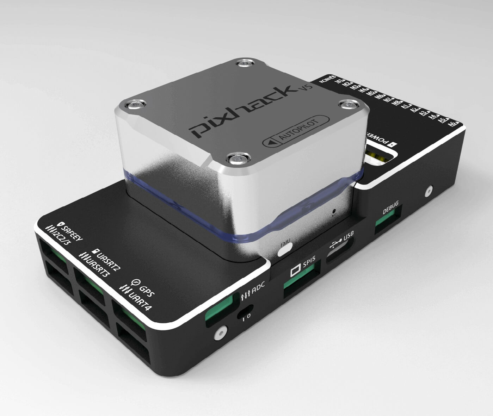
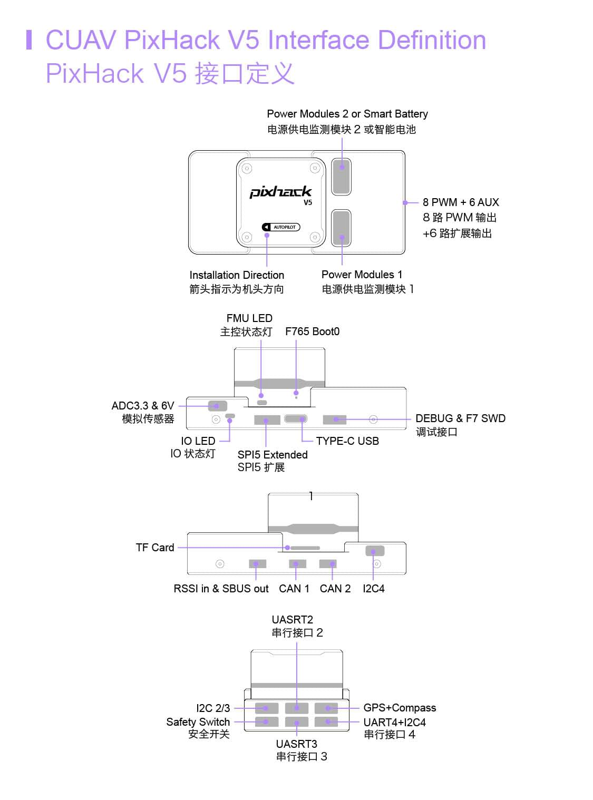

# CUAV v5 (단종)

:::warning
This flight controller has been [discontinued](../flight_controller/autopilot_experimental.md) and is no longer commercially available.
:::

:::warning PX4 does not manufacture this (or any) autopilot. Contact the [manufacturer](https://store.cuav.net/) for hardware support or compliance issues.
:::

_CUAV v5_<sup>&reg;</sup> (previously "Pixhack v5") is an advanced autopilot designed and made by CUAV<sup>&reg;</sup>. 이 보드는 [Pixhawk 프로젝트](https://pixhawk.org/) **FMUv5** 개방형 하드웨어 설계에 기반합니다. [NuttX](https://nuttx.apache.org/) OS에서 PX4를 실행하며, PX4 펌웨어와 호환됩니다. 주로 학술 및 상업 개발자를 대상으로합니다.



## 요약

- 메인 FMU 프로세서: STM32F765
  - 32 비트 Arm® Cortex®-M7, 216MHz, 2MB 메모리, 512KB RAM
- IO 프로세서: STM32F100
  - 32 비트 Arm® Cortex®-M3, 24MHz, 8KB SRAM
- 내장 센서 :

  - 가속도계/자이로스코프 : ICM-20689
  - 가속도계/자이로스코프 : BMI055
  - 자력계 : IST8310
  - 기압계: MS5611

- 인터페이스:
  - PWM 출력 8-14개(IO 6개, FMU 8개)
  - FMU의 전용 PWM/캡처 입력 3 개
  - CPPM 전용 RC 입력
  - PPM 및 S.Bus 전용 RC 입력
  - 아날로그/PWM RSSI 입력
  - PWM Servo 출력
  - 범용 시리얼 포트 5개
  - I2C 포트 4개
  - SPI 버스 4개
  - 2 CANBuses with serial ESC
  - 배터리 2 개의 전압 및 전류에 대한 아날로그 입력
- 전원 시스템 :
  - 전원: 4.3~5.4V
  - USB 입력: 4.75~5.25V
  - 서보 전원 입력: 0~36V
- 중량 및 크기:
  - 중량: 90g
  - 크기: 44x84x12mm
- 기타 특징:
  - 작동 온도: -20 ~ 80°c (측정치)

## Where to Buy

[CUAV](https://cuav.taobao.com/index.htm?spm=2013.1.w5002-16371268426.2.411f26d9E18eAz)에서 주문하십시오.

## 연결



:::warning
RCIN 포트는 RC 수신기의 전원 공급으로 제한되며, 전원에 연결할 수 없습니다.
:::

## 정격 전압

_CUAV v5_ can be triple-redundant on the power supply if three power sources are supplied. 이 세개의 파워 레일은: **POWER1**, **POWER2** 그리고 **USB** 입니다.

:::note
출력 전원 레일인 **FMU PWM OUT**과 **I/O PWM OUT** (0V to 36V) 은 비행제어보드에 전원을 공급하지 않습니다.(공급받지도 않습니다). **POWER1**, **POWER2** 또는 **USB**중 하나에서 전원을 공급하여야 합니다.
:::

**정상 작동 최대 정격 전압**

이러한 조건에서 전원은 아래의 순서대로 시스템에 전원을 공급하여야 합니다.

1. **POWER1**과 **POWER2** 입력 (4.3V ~ 5.4V)
1. **USB** 입력 (4.75V ~ 5.25V)

## 펌웨어 빌드

::::tip 대부분의 사용자들은 펌웨어를 빌드할 필요는 없습니다. It is pre-built and automatically installed by _QGroundControl_ when appropriate hardware is connected.
:::

이 대상에 대한 [PX4 빌드](../dev_setup/building_px4.md) 방법 :

```
make px4_fmu-v5_default
```

## 디버그 포트

[PX4 시스템 콘솔](../debug/system_console.md)과 [SWD 인터페이스](../debug/swd_debug.md)는 **FMU 디버그** 포트에서 동작합니다. FTDI 케이블을 디버그나 F7 SWD 커넥터에 연결하면 됩니다. I/O 디버그 포트에 액세스하려면 사용자는 CUAV v5 셸을 제거하여야 합니다. 두 포트 모두 표준 직렬 핀이 있으며, 표준 FTDI 케이블 (3.3V, 5V 허용)에 연결할 수 있습니다.

핀배열은 그림과 같습니다.


| 핀 | CUAV v5 디버그 |
| - | ----------- |
| 1 | GND         |
| 2 | FMU-SWCLK   |
| 3 | FMU-SWDIO   |
| 4 | UART7_RX    |
| 5 | UART7_TX    |
| 6 | VCC         |

## 시리얼 포트 매핑

| UART   | 장치         | 포트                         |
| ------ | ---------- | -------------------------- |
| UART1  | /dev/ttyS0 | GPS                        |
| USART2 | /dev/ttyS1 | TELEM1 (흐름 제어)             |
| USART3 | /dev/ttyS2 | TELEM2 (흐름 제어)             |
| UART4  | /dev/ttyS3 | TELEM4                     |
| USART6 | /dev/ttyS4 | TX는 SBUS_RC 커넥터의 RC 입력입니다. |
| UART7  | /dev/ttyS5 | 디버깅 콘솔                     |
| UART8  | /dev/ttyS6 | PX4IO                      |

<!-- Note: Got ports using https://github.com/PX4/PX4-user_guide/pull/672#issuecomment-598198434 -->

## 주변 장치

- [디지털 대기속도 센서](https://item.taobao.com/item.htm?spm=a1z10.3-c-s.w4002-16371268452.37.6d9f48afsFgGZI&id=9512463037)
- [텔레메트리 라디오 모듈](https://cuav.taobao.com/category-158480951.htm?spm=2013.1.w5002-16371268426.4.410b7a821qYbBq&search=y&catName=%CA%FD%B4%AB%B5%E7%CC%A8)
- [거리계/거리 센서](../sensor/rangefinders.md)

## 지원 플랫폼 및 기체

일반 RC 서보 또는 Futaba S-Bus 서보로 제어 가능한 모든 멀티콥터/비행기/로버 또는 보트. 지원되는 운송체의 설정은 [기체 정의서](../airframes/airframe_reference.md)를 참고하십시오.

## 추가 정보

- [FMUv5 참조 설계 핀배열](https://docs.google.com/spreadsheets/d/1-n0__BYDedQrc_2NHqBenG1DNepAgnHpSGglke-QQwY/edit#gid=912976165).
- [CUAV V5 문서](http://doc.cuav.net/flight-controller/v5-autopilot/en/v5.html)
- [CUAV Github](https://github.com/cuav)
