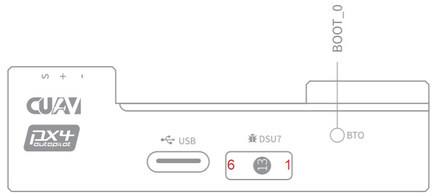
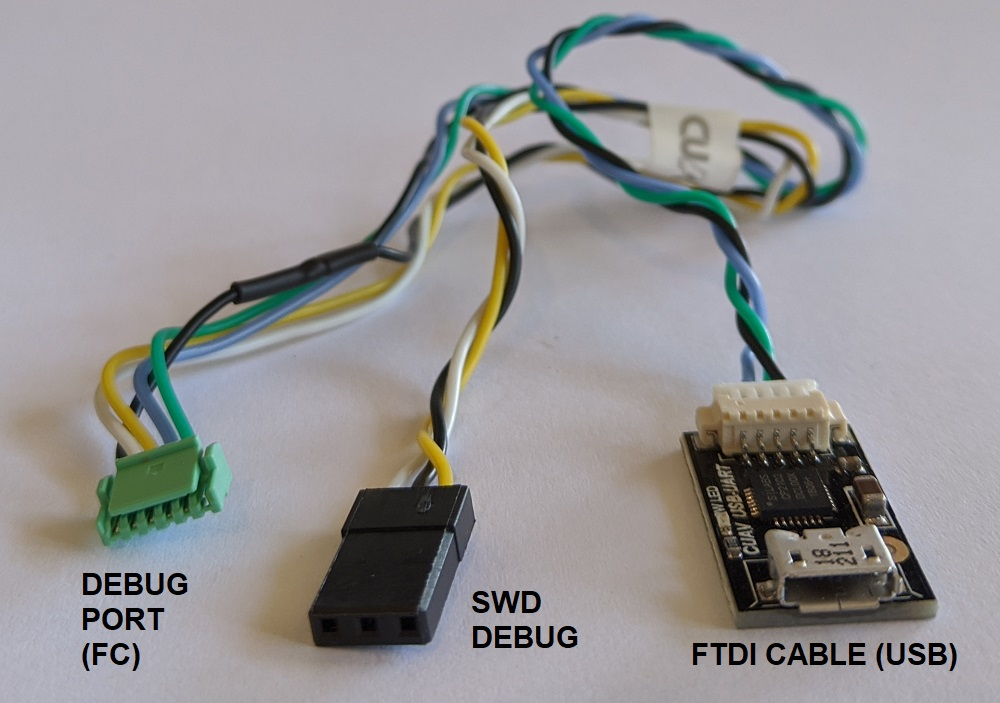

# CUAV V5 nano 자동조종장치

:::warning PX4에서는 이 제품을 제조하지 않습니다. 하드웨어 지원과 호환 문제는 [제조사](https://store.cuav.net/)에 문의하십시오.
:::

**V5 nano**<sup>&reg;</sup>는 CUAV<sup>&reg;</sup>와 PX4팀이 공동으로 설계한 공간 제약 애플리케이션용 자동조종장치입니다.

이 자동조종장치는 220mm 레이싱 드론에서 사용할 수 정도로 소형이지만, 대부분의 드론에도 충분히 사용할 수 있습니다.


:::note
V5 nano는 [CUAV V5+](../flight_controller/cuav_v5_plus.md)와 유사하지만 올인원 폼 팩터가 있고 PWM 포트가 더 적으며(AUX 포트를 사용하는 [기체](../airframes/airframe_reference.md)에는 사용할 수 없음), 내부 댐핑이 없습니다.
:::

주요 기능은 다음과 같습니다.

- [Pixhawk 프로젝트](https://pixhawk.org/) **FMUv5** 설계 표준과 호환되며, 외부 인터페이스에 [Pixhawk 커넥터 표준](https://pixhawk.org/pixhawk-connector-standard/)을 적용합니다.
- 더 안정적이고 신뢰할 수 있는 센서와 함께 FMU v3보다 고급 프로세서, RAM 및 플래시 메모리.
- PX4와 펌웨어 호환.
- I/O 핀을 위한 넉넉한 2.6mm 간격으로 모든 인터페이스를 더 쉽게 사용할 수 있습니다.

:::note
이 비행 컨트롤러는 [제조업체의 지원](../flight_controller/autopilot_manufacturer_supported.md)을 받을 수 있습니다.
:::

### 요약

메인 FMU 프로세서: STM32F765◦32 비트 Arm® Cortex®-M7, 216MHz, 2MB 메모리, 512KB RAM

- 내장 센서 :

  - 가속도/자이로: ICM-20689
  - 가속도/자이로: ICM-20602
  - 가속/자이로: BMI055
  - 자력계 : IST8310
  - 기압계: MS5611

- 인터페이스 : 8개의 PWM 출력

  - FMU의 전용 PWM/캡처 입력 3 개
  - CPPM 전용 RC 입력
  - Spektrum/DSM 및 S.Bus 전용 R/C 입력
  - 아날로그/PWM RSSI 입력
  - 범용 시리얼 포트 4개
  - I2C 포트 3개
  - SPI 버스 4개
  - 2개의 CAN 버스
  - 배터리 전압/전류에 대한 아날로그 입력
  - 2개의 추가 아날로그 입력
  - nARMED 지원

- 전원 시스템: 파워 브릭 입력: 4.75 ~ 5.5V
- USB 전원 입력: 4.75~5.25V

- 중량과 크기
  - 크기: 60*40*14mm
- 기타 특성:
  - 작동 온도: -20 ~ 85°c (측정치)

## Where to Buy<!-- \[CUAV Store\](https://store.cuav.net/index.php?id_product=95&id_product_attribute=0&rewrite=cuav-new-pixhack-v5-autopilot-m8n-gps-for-fpv-rc-drone-quadcopter-helicopter-flight-simulator-free-shipping-whole-sale&controller=product&id_lang=1) -->[CUAV 알리익스프레스](https://www.aliexpress.com/item/33050770314.html?storeId=3257035&spm=2114.12010612.8148356.9.dbe6790bjW2hpH)(국제 사용자)

[CUAV Taobao](https://item.taobao.com/item.htm?spm=a230r.1.14.8.26ab5258veQJRu&id=569404317857&ns=1&abbucket=13#detail) (중국 본토 사용자)

:::note
Neo GPS 모듈과 함께 자동조종장치를 구매할 수 있습니다.
:::

<a id="connection"></a>

## 배선

[V5 nano 배선 퀵 스타트](../assembly/quick_start_cuav_v5_nano.md)

## 핀배열

[여기](http://manual.cuav.net/V5-Plus.pdf)에서 **V5 nano** 핀아웃을 다운로드하세요.

## 펌웨어 빌드

::::tip 대부분의 사용자들은 펌웨어를 빌드할 필요는 없습니다. It is pre-built and automatically installed by _QGroundControl_ when appropriate hardware is connected.
:::

이 대상에 대한 [PX4 빌드](../dev_setup/building_px4.md) 방법 :

```
make px4_fmu-v5_default
```

<a id="debug_port"></a>

## 디버그 포트

[PX4 시스템 콘솔](../debug/system_console.md)과 [SWD 인터페이스](../debug/swd_debug.md)는 **FMU 디버그** 포트에서 실행됩니다. 보드에는 I/O 디버그 인터페이스가 없습니다.



디버그 포트(`DSU7`)는 [JST BM06B](https://www.digikey.com.au/product-detail/en/jst-sales-america-inc/BM06B-GHS-TBT-LF-SN-N/455-1582-1-ND/807850) 커넥터를 사용하며 다음과 같은 핀배열을 가집니다.

| 핀     | 신호           | 전압    |
| ----- | ------------ | ----- |
| 1 (적) | 5V+          | +5V   |
| 2 (흑) | DEBUG TX(출력) | +3.3V |
| 3 (흑) | DEBUG TX(입력) | +3.3V |
| 4 (흑) | FMU_SWDIO    | +3.3V |
| 5 (흑) | FMU_SWCLK    | +3.3V |
| 6 (흑) | GND          | GND   |

제품 패키지에는 `DSU7` 포트에 연결할 수 있는 편리한 디버그 케이블이 포함되어 있습니다. 이렇게 하면, [PX4 시스템 콘솔](../debug/system_console.md)을 컴퓨터 USB 포트에 연결하기 위한 FTDI 케이블과 SWD/JTAG 디버깅에 사용되는 SWD 핀이 분리됩니다. 제공된 디버그 케이블이 SWD 포트 `Vref` 핀 (1)에 연결되지 않습니다.



:::warning SWD
Vref 핀 (1)은 Vref로 5V를 사용하지만, CPU는 3.3V에서 실행됩니다!

일부 JTAG 어댑터(SEGGER J-Link)는 Vref 전압을 사용하여 SWD 라인의 전압을 설정합니다. For direct connection to _Segger Jlink_ we recommended you use the 3.3 Volts from pin 4 of the connector marked `DSM`/`SBUS`/`RSSI` to provide `Vtref` to the JTAG (i.e. providing 3.3V and _NOT_ 5V).

더 자세한 내용은 [하드웨어 디버깅에 JTAG 사용](#using-jtag-for-hardware-debugging)을 참고하십시오.
:::

## 시리얼 포트 매핑

| UART   | 장치         | 포트                         |
| ------ | ---------- | -------------------------- |
| UART1  | /dev/ttyS0 | GPS                        |
| USART2 | /dev/ttyS1 | TELEM1 (흐름 제어)             |
| USART3 | /dev/ttyS2 | TELEM2 (흐름 제어)             |
| UART4  | /dev/ttyS3 | TELEM4                     |
| USART6 | /dev/ttyS4 | TX는 SBUS_RC 커넥터의 RC 입력입니다. |
| UART7  | /dev/ttyS5 | 디버깅 콘솔                     |
| UART8  | /dev/ttyS6 | 연결되지 않음 (PX4IO 없음)         |

<!-- Note: Got ports using https://github.com/PX4/PX4-user_guide/pull/672#issuecomment-598198434 -->

## 정격 전압

_V5 nano_ must be powered from the `Power` connector during flight, and may also/alternatively be powered from `USB` for bench testing.

:::note
The `PM2` connector cannot not be used for powering the _V5 nano_ (see [this issue](#compatibility_pm2)).
:::

:::note
서보파워레일은 FMU에 의해 전원이 공급되지 않으며, 전원을 제공하지도 않습니다. 그러나, **+**로 표시된 핀은 모두 공통이며, BEC는 서보전원레일에 전원을 공급하기 위하여 모든 서보 핀 세트에 연결될 수 있습니다.
:::

## 과전류 보호

The _V5 nano_ has no over current protection.

<a id="Optional-hardware"></a>

## 주변 장치

- [디지털 대기속도 센서](https://item.taobao.com/item.htm?spm=a1z10.3-c-s.w4002-16371268452.37.6d9f48afsFgGZI&id=9512463037)
- [텔레메트리 라디오 모듈](https://cuav.taobao.com/category-158480951.htm?spm=2013.1.w5002-16371268426.4.410b7a821qYbBq&search=y&catName=%CA%FD%B4%AB%B5%E7%CC%A8)
- [거리계/거리 센서](../sensor/rangefinders.md)

## 지원 플랫폼 및 기체

일반 RC 서보 또는 Futaba S-Bus 서보로 제어 가능한 모든 멀티콥터/비행기/로버 또는 보트. 지원되는 운송체의 설정은 [기체 정의서](../airframes/airframe_reference.md)를 참고하십시오.

## 호환성

CUAV는 몇 가지 차별화된 디자인을 채택하고, 아래에서 설명하는 일부 하드웨어와 호환되지 않습니다.

<a id="compatibility_gps"></a>

#### Neo v2.0 GPS는 다른 장치와 호환되지 않습니다.

The _Neo v2.0 GPS_ that is recommended for use with _CUAV V5+_ and _CUAV V5 nano_ is not fully compatible with other Pixhawk flight controllers (specifically, the buzzer part is not compatible and there may be issues with the safety switch).

UAVCAN [NEO V2 PRO GNSS 수신기](http://doc.cuav.net/gps/neo-series-gnss/en/neo-v2-pro.html)도 사용할 수 있으며, 다른 비행 컨트롤러와 호환됩니다.

<a id="compatibility_jtag"></a>

#### 하드웨어 디버깅에 JTAG 사용

`DSU7` FMU 디버그 핀 1은 CPU의 3.3V가 아닌 5V입니다.

일부 JTAG 프로보는이 전압을 사용하여 타겟과 통신시 IO 레벨을 설정합니다.

For direct connection to _Segger Jlink_ we recommended you use the 3.3 Volts of DSM/SBUS/RSSI pin 4 as Pin 1 on the debug connector (`Vtref`).

<a id="compatibility_pm2"></a>

#### PM2는 비행 컨트롤러에 전원을 공급할 수 없습니다.

`PM2`는 배터리 전압과 전류만 측정 할 수 있고, 비행 컨트롤러에 전원을 공급할 수 **없습니다**.

:::warning
PX4는이 인터페이스를 지원하지 않습니다.
:::

## 알려진 문제

The issues below refer to the _batch number_ in which they first appear. 배치번호는 V01 뒤의 4 자리 생산날짜이며 비행 컨트롤러 측면의 스티커에 표시되어 있습니다. 예를 들어, 일련 번호 Batch V011904((V01은 V5의 번호, 1904는 생산날짜, 즉 배치번호)입니다.

<a id="pin1_unfused"></a>

#### SBUS/DSM/RSSI 인터페이스 Pin1 언퓨즈

:::warning
이것은 안전에 관련된 문제입니다.
:::

SBUS/DSM/RSSI 인터페이스에 다른 장비(RC 수신기 제외)를 연결하지 마십시오. 장비가 손상될 수 있습니다!

- _Found:_ Batches V01190904xxxx
- _Fixed:_ Batches later than V01190904xxxx

## 추가 정보

- [V5 nano manual](http://manual.cuav.net/V5-nano.pdf) (CUAV)
- [FMUv5 reference design pinout](https://docs.google.com/spreadsheets/d/1-n0__BYDedQrc_2NHqBenG1DNepAgnHpSGglke-QQwY/edit#gid=912976165) (CUAV)
- [CUAV Github](https://github.com/cuav) (CUAV)
- [DJI FlameWheel450에서 CUAV v5 nano를 사용하는 기체 빌드 로그](../frames_multicopter/dji_f450_cuav_5nano.md)
