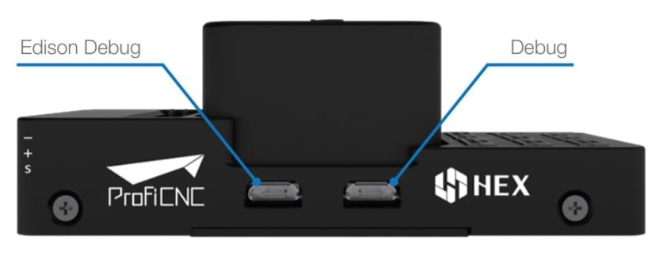

# Cube Yellow 비행 콘트롤러

:::warning PX4에서는 이 제품을 제조하지 않습니다. 하드웨어 지원과 호환 문제는 [제조사](https://cubepilot.org/#/home)에 문의하십시오.
:::

:::tip PX4 개발팀은이 비행 컨트롤러를 Cube Black의 풋프린트 호환 대체품으로 지원합니다. We recommend however to consider products built on industry standards, such as the [Pixhawk Standards](https://pixhawk.org). 이 비행 컨트롤러는 표준을 따르지 않으며, 특허받은 커넥터를 사용합니다.
:::

[Cube Yellow](http://www.proficnc.com/61-system-kits2) 비행 컨트롤러는 주로 상용 시스템 제조업체를 위한 자동조종장치입니다.


배선을 줄이고 신뢰성을 높이며 조립을 쉽게하기 위해 도메인별 캐리어 보드와 함께 사용하도록 설계되었습니다. 예를 들어, 상용 검사 기체 캐리어보드에는 보조 컴퓨터용 연결이 포함될 수 있는 반면, 레이서 용 캐리어보드는 기체 프레임을 형성하는 ESC를 포함할 수 있습니다.

Cube에는 2 개의 IMU에 진동 차단이 포함되어 있으며, 세 번째 고정 IMU는 참조 백업용으로 사용됩니다.

:::note
제조업체 [Cube 문서](https://docs.cubepilot.org/user-guides/autopilot/the-cube-module-overview)에는 [큐브 색상 간의 차이점](https://docs.cubepilot.org/user-guides/autopilot/the-cube-module-overview#differences-between-cube-colours) 뿐만 아니라 자세한 정보를 제공합니다.
:::


## 주요 특징

* 32 비트 STM32F777VI (32 비트 [ARM Cortex M7](https://en.wikipedia.org/wiki/ARM_Cortex-M#Cortex-M7), 400 MHz, Flash 2MB, RAM 512 KB).
* 32 비트 STM32F103 장애복구 코프로세서 <!-- check -->
* 14개 PWM/서보 출력(장애복구 및 수동 오버라이드 포함 8개, 보조, 고전력 호환 6개)
* 다양한 추가 주변 장치(UART, I2C, CAN) 연결 옵션
* 전용 프로세서와 독립형 전원 공급 장치(고정익 적용)로 비행중 복구 기능과 수동 오버라이드 통합 백업 시스템
* 백업 시스템은 믹싱을 통합하여 일관된 자동조종장치와 수동 오버라이드 믹싱 모드를 제공합니다(고정익 적용).
* 중복 전원공급장치 및 자동 장애 조치
* 외부 안전 스위치
* 다색 LED 주시각 표시기
* 고전력 멀티톤 피에조 오디오 표시기
* 장기간 고속 로깅용 microSD 카드

<span id="stores"></span>
## 구매처

* [The Cube](http://www.proficnc.com/61-system-kits) (ProfiCNC)

## 조립

[큐브 배선 개요](../assembly/quick_start_cube.md)

## 사양

* **프로세서:**
  * STM32F777VI (32 비트 [ARM Cortex M7](https://en.wikipedia.org/wiki/ARM_Cortex-M#Cortex-M7))
  * 400 MHz
  * 512 KB MB RAM
  * 2 MB Flash
* **장애복구 코프러세서:** <!-- inconsistent info on failsafe processor: 32 bit STM32F103 failsafe co-processor http://www.proficnc.com/all-products/191-pixhawk2-suite.html -->
  * STM32F100 (32 비트 *ARM Cortex-M3*)
  * 24 MHz
  * 8 KB SRAM
* **센서:** (모두 SPI를 통해 연결됨)
  * **가속도계:** (3) ICM20948, ICM20649, ICM20602
  * **자이로스코프:** (3) ICM20948, ICM20649, ICM20602
  * **나침반:** (1) ICM20948
  * **기압계:** (2) MS5611
* **작동 조건:**
  * **작동 온도:** -10C ~ 55C
  * **IP 등급/방수:** 방수 아님
  * **서보 레일 입력 전압:** 3.3V / 5V
  * **USB 포트 입력:**
    * 전압: 4V - 5.7V
    * 정격 전류: 250 mA
  * **전원:**
    * 입력 전압: 4.1V ~ 5.7V
    * 정격 입력 전류: 2.5A
    * 정격 입/출력 전력: 14W
* **크기:**
  - **Cube:** 38.25mm x 38.25mm x 22.3mm
  - **캐리어:** 94.5mm x 44.3mm x 17.3mm
* **인터페이스**
  * IO 포트: 14개의 PWM 서보 출력(IO에서 8개, FMU에서 6개)
  * UART (직렬 포트) 5개, 1 개의 고전력 지원, 2x (HW 흐름 제어 포함)
  * CAN 2개(하나는 내부 3.3V 트랜시버, 하나는 확장 커넥터에 있음)
  * **RC 입력:**
    - Spektrum DSM/DSM2/DSM-X® Satellite 호환 입력
    - Futaba S.BUS® 호환 입출력
    - PPM 합계 신호 입력
  * RSSI(PWM 또는 전압) 입력
  * I2C
  * SPI
  * 3.3v ADC 입력
  * 내부 microUSB 포트 및 외부 microUSB 포트 확장

## 핀배열과 회로도

보드 설계도와 문서는 [The Cube Project](https://github.com/proficnc/The-Cube)를 참고하십시오.


## 포트

### 상단(GPS, TELEM 등)


## 시리얼 포트 매핑

| UART   | 장치         | 포트                                       |
| ------ | ---------- | ---------------------------------------- |
| USART1 | /dev/ttyS0 | <!-- # IO DEBUG:/dev/ttyS0 -->
|
| USART2 | /dev/ttyS1 | TELEM1 (흐름 제어)                           |
| USART3 | /dev/ttyS2 | TELEM2 (흐름 제어)                           |
| UART4  | /dev/ttyS3 | GPS1                                     |
| USART6 | /dev/ttyS4 | PX4IO                                    |
| UART7  | /dev/ttyS5 | 콘솔                                       |
| UART8  | /dev/ttyS6 | GPS2                                     |
  
<!-- Note: Got ports using https://github.com/PX4/px4_user_guide/pull/672#issuecomment-598198434 -->
<!-- https://github.com/PX4/PX4-Autopilot/blob/master/boards/hex/cube-orange/default.cmake -->
<!-- https://github.com/PX4/PX4-Autopilot/blob/master/boards/hex/cube-orange/nuttx-config/nsh/defconfig#L194-L200 -->


### 디버그 포트



### USB/SDCard 포트


## 펌웨어 빌드

::::tip 대부분의 사용자들은 펌웨어를 빌드할 필요는 없습니다. 하드웨어가 연결되면 *QGroundControl*에 의해 사전 구축되고 자동으로 설치됩니다.
:::

이 대상에 대한 [PX4 빌드](../dev_setup/building_px4.md) 방법 :
```
make cubepilot_cubeyellow
```

## 문제점

Cube의 CAN1과 CAN2의 실크 스크린이 뒤집힙니다. CAN1은 CAN2이고 그 반대의 경우도 마찬가지입니다.

## 추가 정보 및 문서

- [큐브 배선 개요](../assembly/quick_start_cube.md)
- 큐브 문서 (제조사) :
  - [큐브 모듈 개요](https://docs.cubepilot.org/user-guides/autopilot/the-cube-module-overview)
  - [큐브 사용 설명서](https://docs.cubepilot.org/user-guides/autopilot/the-cube-user-manual)
  - [미니 캐리어 보드](https://docs.cubepilot.org/user-guides/carrier-boards/mini-carrier-board)
