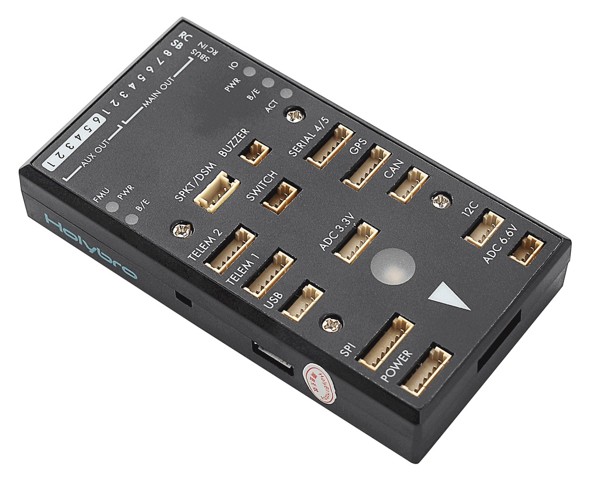

# Holybro pix32 비행 컨트롤러

:::warning PX4에서는 이 제품을 제조하지 않습니다. 하드웨어 지원과 호환 문제는 [제조사](https://shop.holybro.com/)에 문의하십시오.
:::

Holybro&reg; [pix32 자동조종장치](https://shop.holybro.com/c/pixhawk-2_0460)("Pixhawk 2"라고도하며 이전에 HKPilot32라고도 함)는 [Pixhawk&reg;-프로젝트](https://pixhawk.org/) **FMUv2** 개방형 하드웨어 디자인을 기반으로합니다. 이 보드는 하드웨어 버전 Pixhawk 2.4.6을 기반으로합니다. [NuttX](https://nuttx.apache.org/) OS에서 PX4를 실행합니다.

CC-BY-SA 3.0 라이센스 오픈 하드웨어 설계로 모든 회로도와 설계 파일을 [사용할 수 있습니다](https://github.com/PX4/Hardware).

:::tip
Holybro pix32는 [3DR Pixhawk 1](../flight_controller/pixhawk.md)와 호환되는 소프트웨어입니다. 커넥터와 호환되지는 않지만, 3DR Pixhawk 또는 mRo Pixhawk와 물리적으로 매우 유사합니다.
:::

:::note
이 비행 컨트롤러는 [제조업체의 지원](../flight_controller/autopilot_manufacturer_supported.md)을 받을 수 있습니다.
:::

## 주요 특징

* 메인 시스템 온칩: [STM32F427](http://www.st.com/web/en/catalog/mmc/FM141/SC1169/SS1577/LN1789) 
  * CPU: FPU가있는 32 비트 STM32F427 코어 텍스&reg; M4 코어
  * RAM: 168 MHz/256 KB
  * Flash: 2 MB
* 페일세이프 시스템 온칩 : STM32F103
* 센서: 
  * ST Micro L3GD20 3축 16비트 자이로스코프
  * ST Micro LSM303D 3축 14비트 가속도계/자력계
  * Invensense&reg; MPU 6000 3축 가속도계/자이로스코프
  * MEAS MS5611 기압계
* 크기/중량 
  * 크기: 81x44x15mm
  * 중량: 33.1g
* GPS : 나침반 내장 u-blox&reg; 초정밀 Neo-7M
* 입력 전압 : 2 ~ 10s (7.4 ~ 37V)

### 연결성

* I2C 1개
* CAN 2 개
* 3.3 및 6.6V ADC 입력
* UART (직렬 포트) 5개, 1 개의 고전력 지원, 2x (HW 흐름 제어 포함)
* 최대 DX8의 Spektrum DSM/DSM2/DSM-X® Satellite 호환 입력(DX9 이상은 지원되지 않음)
* Futaba&reg; S.BUS 호환 입력 및 출력
* PPM 합계 신호
* RSSI (PWM 또는 전압) 입력
* SPI
* 외부 microUSB 포트
* Molex PicoBlade 커넥터

## 구매처

[shop.holybro.com](https://shop.holybro.com/c/pixhawk-2_0460)

### 소품

* [디지털 풍속 센서](https://shop.holybro.com/c/digital-air-speed-sensor_0508)
* [Hobbyking&reg; Wifi 텔레메트리](https://hobbyking.com/en_us/apm-pixhawk-wireless-wifi-radio-module.html)
* [텔레메트리 Radio EU (433 MHz)](https://shop.holybro.com/c/433mhz_0470)
* [텔레메트리 Radio USA (915 MHz)](https://shop.holybro.com/c/915mhz_0471)

## 펌웨어 빌드

::::tip 대부분의 사용자들은 펌웨어를 빌드할 필요는 없습니다. 하드웨어가 연결되면 *QGroundControl*에 의해 사전 구축되고 자동으로 설치됩니다.
:::

이 대상에 대한 [PX4 빌드](../dev_setup/building_px4.md) 방법 :

    make px4_fmu-v2_default
    

## 디버그 포트

[3DR Pixhawk 1 &gt; 디버그 포트](../flight_controller/pixhawk.md#debug-ports)를 참고하십시오.

## 핀배열과 회로도

이 보드는 [Pixhawk 프로젝트](https://pixhawk.org/) **FMUv2** 개방형 하드웨어 설계에 기반합니다.

* [FMUv2 + IOv2 회로도](https://raw.githubusercontent.com/PX4/Hardware/master/FMUv2/PX4FMUv2.4.5.pdf) - 회로도 및 레이아웃

:::note CC-BY-SA 3.0 라이센스 오픈 하드웨어 설계로 모든 회로도와 설계 파일을 [사용할 수 있습니다](https://github.com/PX4/Hardware).
:::

## 시리얼 포트 매핑

| UART   | 장치         | 포트             |
| ------ | ---------- | -------------- |
| UART1  | /dev/ttyS0 | IO 디버그         |
| USART2 | /dev/ttyS1 | TELEM1 (흐름 제어) |
| USART3 | /dev/ttyS2 | TELEM2 (흐름 제어) |
| UART4  |            |                |
| UART7  | 콘솔         |                |
| UART8  | SERIAL4    |                |

<!-- Note: Got ports using https://github.com/PX4/px4_user_guide/pull/672#issuecomment-598198434 -->