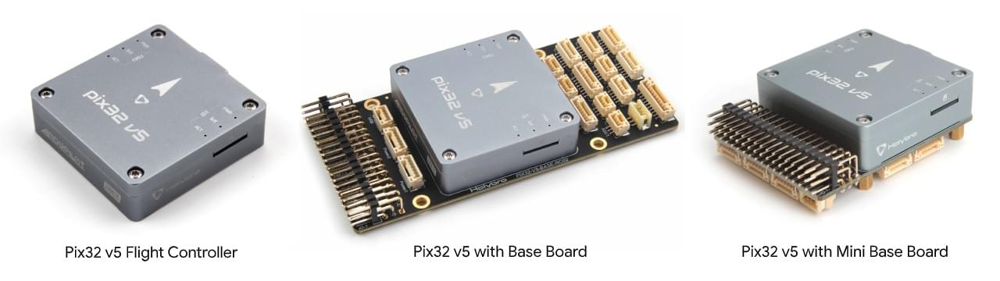
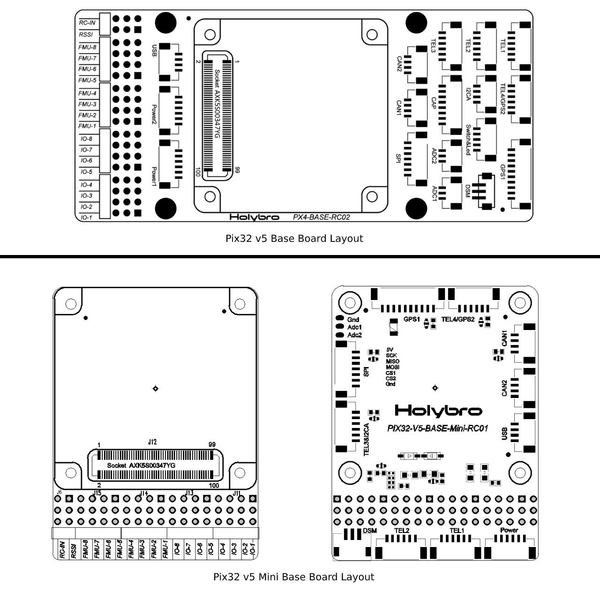
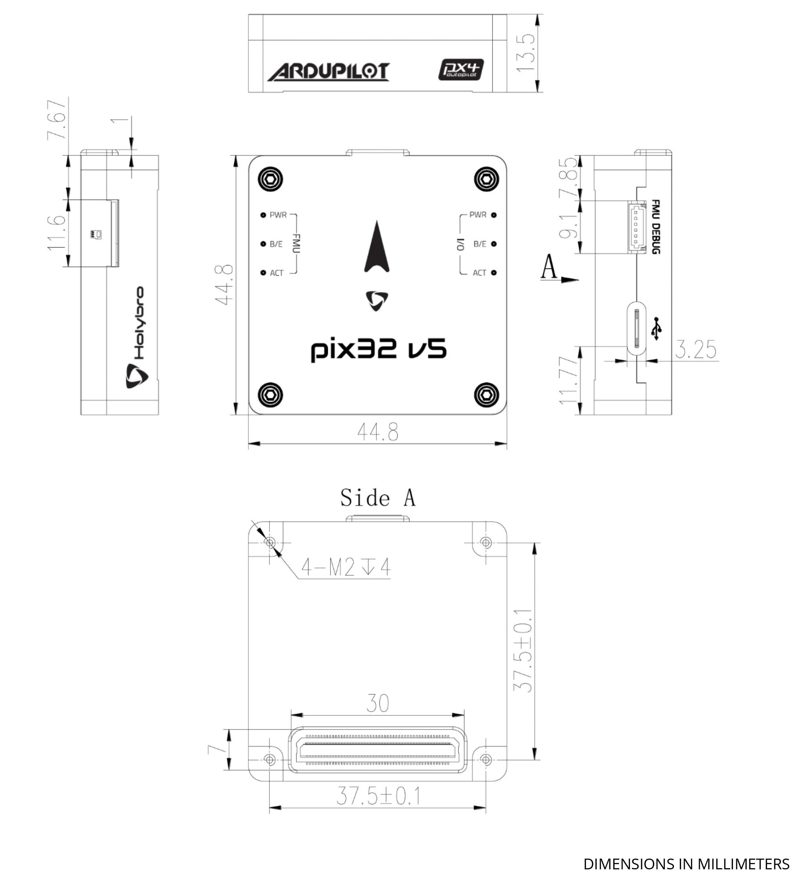
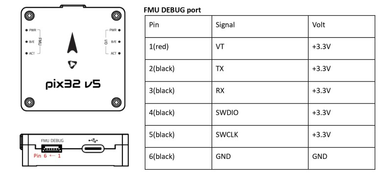

# Holybro Pix32 v5

:::warning PX4에서는 이 제품을 제조하지 않습니다. 하드웨어 지원과 호환 문제는 [제조사](https://shop.holybro.com/)에 문의하십시오.
:::

[Pix32 v5](https://shop.holybro.com/pix32-v5_p1218.html)<sup>&reg;</sup>는 Holybro<sup>&reg;</sup>에서 설계 제작한 고급 비행 컨트롤러입니다. PX4 펌웨어 실행에 최적화 되어 있으며, 연구와 상업용 개발자들에게 적합합니다. [Pixhawk-project](https://pixhawk.org/) **FMUv5** 개방형 하드웨어 설계를 기반으로 [NuttX](https://nuttx.apache.org/) OS에서 PX4를 실행합니다. Pixhawk4의 변형 버전으로 간주할 수 있습니다.

Pix32 v5는 고출력, 유연하고 사용자 정의 가능한 비행제어 시스템을 위하여 설계되었습니다. 별도의 비행 컨트롤러와 캐리어 보드로 구성되며 100핀 커넥터로 연결됩니다. 이 디자인은 사용자가 Holybro에서 만든베이스 보드를 선택하거나 사용자가 정의할 수 있습니다.



:::note
이 비행 컨트롤러는 [제조업체의 지원](../flight_controller/autopilot_manufacturer_supported.md)을 받을 수 있습니다.
:::

## 요약

* 메인 FMU 프로세서: STM32F765
  * 32 비트 Arm® Cortex®-M7, 216MHz, 2MB 메모리, 512KB RAM
* IO 프로세서: STM32F100
  * 32 비트 Arm® Cortex®-M3, 24MHz, 8KB SRAM
* 내장 센서 :
  * 가속도/자이로: ICM-20689
  * 가속/자이로: BMI055
  * 자력계 : IST8310
  * 기압계: MS5611
* GPS: u-blox Neo-M8N GPS/GLONASS 수신기; 통합 자력계 IST8310
* 인터페이스:
  * PWM 출력 8-16개(IO에서 8개, FMU에서 8개)
  * FMU의 전용 PWM/캡처 입력 3 개
  * CPPM 전용 RC 입력
  * Spektrum/DSM 및 S.Bus 전용 R/C 입력, 아날로그/PWM RSSI 입력
  * Dedicated S.Bus Servo 출력
  * 범용 시리얼 포트 5개
    * 전체 흐름 제어 2개
    * 1.5A 전류 제한이 있는 1 개
  * I2C 포트 3개
  * SPI 버스 4개
    * 4 개의 칩 선택 및 6 개의 DRDY가 있는 내부 고속 SPI 센서 버스 1 개
    * XXX 전용 내부 저잡음 SPI 버스 1 개
    * 2 개의 칩 선택이 있는 기압계, DRDY 없음
    * FRAM 전용 내부 SPI 버스 1 개
    * 센서 모듈에 위치한 전용 SPI 교정 EEPROM 지원
    * 외부 SPI 버스 1개
  * 직렬 ESC를 사용하는 듀얼 CAN에 최대 2 개의 CAN 버스
    * 각 CANBus에는 개별 무음 제어 또는 ESC RX-MUX 제어가 있습니다.
    * 배터리 2 개의 전압 및 전류에 대한 아날로그 입력
    * 추가 아날로그 입력 2개
* 전기 시스템 :
  * 전원 모듈 출력: 4.9~5.5V
  * 최대 입력 전압: 6V
  * 최대 전류 감지: 120A
  * USB 전원 입력: 4.75~5.25V
  * 서보 레일 입력: 0~36V
* 중량 및 크기:
  * 크기: 45x45x13.5mm
  * 중량: 33.9g
* 환경 데이터, 품질 및 신뢰성:
  * 작동 온도: -40 ~ 85°c
  * 보관 온도. -40~85℃
  * CE
  * FCC
  * RoHS 준수(무연)

추가적인 정보는 [Pix32 V5  기술 데이트시트](http://www.holybro.com/manual/Holybro_PIX32-V5_technical_data_sheet_v1.1.pdf)를 참고하십시오.

## 구매처

[Holybro](https://shop.holybro.com/pix32-v5_p1218.html)에서 주문 가능 합니다.

## 조립 및 설정

[Pix32 v5 배선 개요](../assembly/quick_start_holybro_pix32_v5.md)는 GPS, 전원관리보드 등을 포함한 필수 주변 장치 조립방법을 설명합니다.

## 베이스 보드 레이아웃


## 핀배열

핀배열 다운로드 :
- [*pix32 v5* 베이스보드](http://www.holybro.com/manual/Holybro_PIX32-V5_PINOUTS_V1.1.pdf)
- [*pix32 v5* 미니 베이스보드](http://www.holybro.com/manual/Holybro_Pix32-V5-Base-Mini-Pinouts.pdf)

## 크기



## 정격 전압

*Pix32 v5*은 세 개의 전원이 공급되는 경우, 전원 공급 장치에서 3중 중복이 가능합니다. 이 세개의 파워 레일은 **POWER1**, **POWER2** 그리고 **USB** 입니다.

:::note
출력 전원 레일인 **FMU PWM OUT**과 **I/O PWM OUT** (0V to 36V) 은 비행제어보드에 전원을 공급하지 않습니다.(공급받지도 않습니다). **POWER1**, **POWER2** 또는 **USB**중 하나에서 전원을 공급하여야 합니다.
:::

**정상 작동 최대 정격 전압**

이러한 조건에서 전원은 아래의 순서대로 시스템에 전원을 공급하여야합니다.
1. **POWER1**과 **POWER2** 입력 (4.9V ~ 5.5V)
1. **USB** 입력(4.75V ~ 5.25V)

**절대 최대 정격 전압**

아래의 조건에서 시스템은 전원을 사용하지 않지만(작동하지 않음), 그대로 유지됩니다.
1. **POWER1**과 **POWER2** 입력 (작동 범위 4.1V ~ 5.7V, 0V ~ 10V 손상되지 않음)
1. **USB** 입력(작동 범위: 4.1V ~ 5.7V, 비손상 범위: 0V ~ 6V)
1. 서보 입력 : **FMU PWM OUT** 및 **I/O PWM OUT**의 VDD_SERVO 핀 (0V ~ 42V 손상되지 않음)

## 펌웨어 빌드

::::tip 대부분의 사용자들은 펌웨어를 빌드할 필요는 없습니다. 하드웨어가 연결되면 *QGroundControl*에 의해 사전 구축되고 자동으로 설치됩니다.
:::

이 대상에 대한 [PX4 빌드](../dev_setup/building_px4.md) 방법:
```
make holybro_pix32v5_default
```

## 디버그 포트

시스템의 [직렬 콘솔](../debug/system_console.md)과 SWD 인터페이스는 **FMU 디버그** 포트에서 실행됩니다.

<!--while the I/O console and SWD interface can be accessed via **I/O Debug** port.-->



핀배열은 표준 [Pixhawk 디버그 커넥터 핀배열](https://pixhawk.org/pixhawk-connector-standard/#dronecode_debug)을 사용합니다. 배선 정보는 다음을 참조하십시오.
- [시스템 콘솔 > Pixhawk 디버그 포트](../debug/system_console.md#pixhawk_debug_port).


## 주변 장치

* [디지털 대기속도 센서](../sensor/airspeed.md)
* [텔레메트리 라디오 모듈](../telemetry/README.md)
* [거리계/거리 센서](../sensor/rangefinders.md)


## 지원 플랫폼 및 기체

일반 RC 서보 또는 Futaba S-Bus 서보로 제어 가능한 모든 멀티콥터/비행기/로버 또는 보트. 지원되는 운송체의 설정은 [기체 정의서](../airframes/airframe_reference.md)를 참고하십시오.


## 추가 정보

- [Pix32 v5  기술 데이터 시트](http://www.holybro.com/manual/Holybro_PIX32-V5_technical_data_sheet_v1.1.pdf)
- [Pix32 v5 핀아웃](http://www.holybro.com/manual/Holybro_PIX32-V5_PINOUTS_V1.1.pdf)
- [Pix32 v5 기본 보드 회로도](http://www.holybro.com/manual/Holybro_PIX32-V5-BASE-Schematic_diagram.pdf)
- [Pix32 v5 미니 기본 보드 회로도](http://www.holybro.com/manual/Holybro_PIX32-V5-Base-Mini-Board_Schematic_diagram.pdf)
- [FMUv5 참조 설계 핀배열](https://docs.google.com/spreadsheets/d/1-n0__BYDedQrc_2NHqBenG1DNepAgnHpSGglke-QQwY/edit#gid=912976165).
