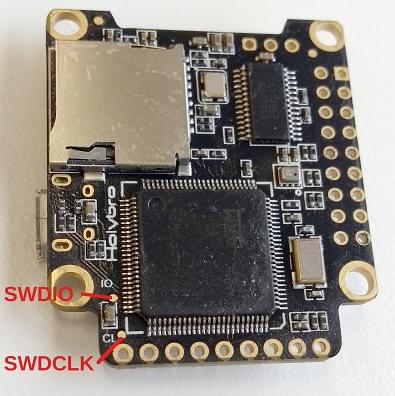

# Kakute F7

:::warning PX4에서는 이 제품을 제조하지 않습니다. 하드웨어 지원과 호환 문제는 [제조사](https://shop.holybro.com/)에 문의하십시오.
:::

Holybro의 *Kakute F7*은 레이서를 위해 설계된 비행 컨트롤러입니다.


:::note
이 비행 컨트롤러는 [제조업체의 지원](../flight_controller/autopilot_manufacturer_supported.md)을 받을 수 있습니다.
:::

## 주요 특징

* 메인 시스템 온칩: [STM32F745VGT6](https://www.st.com/en/microcontrollers-microprocessors/stm32f745vg.html) 
  * CPU : 단정밀도 FPU의 216MHz ARM Cortex M7
  * RAM : 320KB SRAM
  * FLASH: 1 MB
* 표준 레이서 폼 팩터 : 36x36mm, 표준 30.5mm 구멍 패턴
* ICM20689 가속/자이로 (소프트 장착)
* BMP280 기압계
* microSD (로깅)
* 6개의 UART
* I2C 버스 1 개
* 6 PWM 출력
* 내장 OSD 칩(SPI를 통한 AB7456)

## 구매처

보드는 아래의 상점들에서 구매할 수 있습니다.

- [Holybro](https://shop.holybro.com/kakute-f7_p1104.html) 
- [getfpv](https://www.getfpv.com/holybro-kakute-f7-tekko32-f3-metal-65a-4-in-1-esc-combo.html)

:::tip
*Kakute F7*은 *Tekko32* 4-in-1 ESC와 작동하도록 설계되었으며, 함께 구매할 수 있습니다.
:::

## 커넥터 및 핀

다음은 *Kakute F7*의 실크 스크린으로, 보드 상단을 보여줍니다.


| 핀        | 기능                                                                   | 기본값                 |
| -------- | -------------------------------------------------------------------- | ------------------- |
| B+       | 배터리 양극 전압 (2S-6S)                                                    |                     |
| 5V       | 5V 출력 (최대 2A)                                                        |                     |
| VO       | 비디오 송신기로 비디오 출력                                                      |                     |
| VI       | FPV 카메라의 비디오 입력                                                      |                     |
| G 또는 GND | 접지                                                                   |                     |
| SDA, SCL | I2C 연결(주변장치용)                                                        |                     |
| R1, T1   | UART1 RX 및 TX                                                        | TELEM1              |
| R2, T2   | UART2 RX 및 TX                                                        | TELEM2              |
| R3, T3   | UART3 RX and TX                                                      | NuttX debug console |
| R4, T4   | UART4 RX and TX                                                      | GPS1                |
| R6, T6   | UART6 RX and TX                                                      | RC port             |
| R7, T7   | UART7 RX and TX (RX is located in the plug for use with 4-in-1 ESCs) | DShot telemetry     |
| LED      | WS2182 addressable LED signal wire (not tested)                      |                     |
| Buz-     | Piezo buzzer negative leg (Connect buzzer positive leg to 5V pad)    |                     |
| 3V3      | 3.3V output (200 mA max)                                             |                     |
| M1 to M4 | Motor signal outputs (located in plug for use in 4-in-1 ESCs)        |                     |
| M5, M6   | Additional motor signal outputs (located on side of board)           |                     |
| RSI      | Analog RSSI (0-3.3V) input from receiver                             |                     |
| Boot     | Bootloader button                                                    |                     |

<span id="bootloader"></span>

## PX4 Bootloader Update

The board comes pre-installed with [Betaflight](https://github.com/betaflight/betaflight/wiki). Before PX4 firmware can be installed, the *PX4 bootloader* must be flashed. Download the [kakutef7_bl.hex](https://github.com/PX4/px4_user_guide/raw/master/assets/flight_controller/kakutef7/kakutef7_bl_0b3fbe2da0.hex) bootloader binary and read [this page](../advanced_config/bootloader_update_from_betaflight.md) for flashing instructions.

## Building Firmware

To [build PX4](../dev_setup/building_px4.md) for this target:

    make holybro_kakutef7_default
    

## Installing PX4 Firmware

The firmware can be installed in any of the normal ways:

- Build and upload the source ```make holybro_kakutef7_default upload```
- [Load the firmware](../config/firmware.md) using *QGroundControl*. You can use either pre-built firmware or your own custom firmware.

## Configuration

In addition to the [basic configuration](../config/README.md), the following parameters are important:

| Parameter                                                              | Setting                                                                                                                 |
| ---------------------------------------------------------------------- | ----------------------------------------------------------------------------------------------------------------------- |
| [SYS_HAS_MAG](../advanced_config/parameter_reference.md#SYS_HAS_MAG) | This should be disabled since the board does not have an internal mag. You can enable it if you attach an external mag. |
| [MOT_ORDERING](../advanced_config/parameter_reference.md#MOT_ORDERING) | If you use a 4-in-1 ESC with Betaflight/Cleanflight motor assignment, this parameter can be set accordingly.            |


## Serial Port Mapping

| UART   | Device     | Port                  |
| ------ | ---------- | --------------------- |
| USART1 | /dev/ttyS0 | TELEM1                |
| USART2 | /dev/ttyS1 | TELEM2                |
| USART3 | /dev/ttyS2 | Debug Console         |
| UART4  | /dev/ttyS3 | GPS1                  |
| USART6 | /dev/ttyS4 | RC SBUS               |
| UART7  | /dev/ttyS5 | ESC telemetry (DShot) |


<!-- Note: Got ports using https://github.com/PX4/px4_user_guide/pull/672#issuecomment-598198434 -->

## Debug Port

### System Console

UART3 RX and TX are configured for use as the [System Console](../debug/system_console.md).

### SWD

The [SWD interface](../debug/swd_debug.md) (JTAG) pins are:

- `SWCLK`: Test Point 2 (Pin 72 on the CPU)
- `SWDIO`: Test Point 3 (Pin 76 on CPU)
- `GND`: As marked on board
- `VDD_3V3`: As marked on board

These are shown below.

 