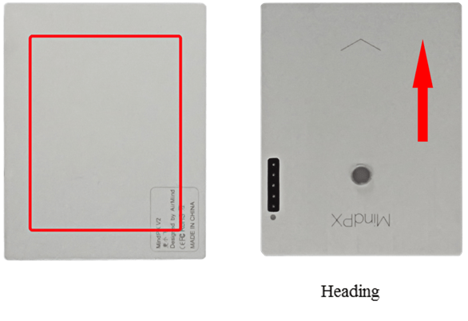
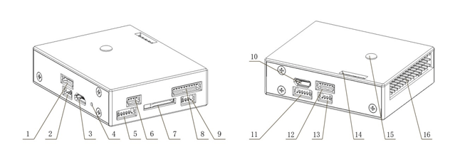

# MindPX 하드웨어

The AirMind&reg; [MindPX](http://mindpx.net) series is a new generation autopilot system branched from Pixhawk&reg;.

> **Note** These flight controllers are [manufacturer supported](../flight_controller/autopilot_manufacturer_supported.md).

## Quick Summary

> **Note** The main hardware documentation is [here](http://mindpx.net/assets/accessories/Specification9.18_3_pdf.pdf).

MindPX는 Pixhawk  & reg; </ 0>에서 분기 된 차세대 자동 조종 장치로 개략도와 구조가 수정되었으며 무인 기체를 더욱 스마트하고 사용하기 쉽게 만드는 새로운 기능으로 더욱 강화되었습니다.
 

  MindPX increases total PWM output channels to 16 (8 main outputs + 8 aux outputs).  This means that MindPX can support more complicated VTOL configurations and more fine control. It is especially meaningful for those FMU-V4 based flight controllers as MindPX implements main and aux output in one single FMU.

  

<ul>
  <li>
    

      메인 시스템 - 온 - 칩 : STM32F427
    

    <ul>
      <li>
        CPU : 32 비트, 168 MHz ARM 코어 텍스  & reg; </ 0> FPU 포함 M4</li> 
        
        <li>
          RAM : 256KB SRAM
        </li>
        
        <li>
          2MB 플래시
        </li>
        
        <li>
          ST 마이크로 LSM303D 14 비트 가속도계 / 자력계
        </li>
        
        <li>
          MEAS MS5611 barometer
        </li>
        
        <li>
          InvenSense  및 reg; </ 0> MPU6500 통합 6 축 센서 </li> </ul></li> 
          
          <li>
            

              강조 표시된 기능 :
            

            <ul>
              <li>
                CNC 가공 알루미늄 합금 케이스, 가볍고 견고한
              </li>
              <li>
                내장 IMU 이중화 내장
              </li>
              <li>
                총 16 개의 PWM 출력 채널 (8 main + 8 aux)
              </li>
              <li>
                플로우 연결을위한 여분의 I2C 포트 1 개.
              </li>
              <li>
                컴패니언 컴퓨터 연결 용 추가 USB 포트 1 개 (내장 UART-USB 변환기)
              </li>
              <li>
                개발 용으로 공개 된 디버그 포트
              </li>
            </ul>
          </li></ul> 
          
          <h2>
            퀵 스타트
          </h2>
          
          <h3>
            설치
          </h3>
          
          

            
          

          
          <h3>
            Wiring
          </h3>
          
          

            
          

          
          

            
          

          
          <h3>
            Pin
          </h3>
          
          

            
          

          
          <table>
            <tr>
              <th align="center">
                Num.
              </th>
              
              <th align="center">
                Description
              </th>
              
              <th align="center">
                Num.
              </th>
              
              <th align="center">
                Description
              </th>
            </tr>
            
            <tr>
              <td align="center">
                1
              </td>
              
              <td align="center">
                Power
              </td>
              
              <td align="center">
                9
              </td>
              
              <td align="center">
                I2C2 (MindFLow)
              </td>
            </tr>
            
            <tr>
              <td align="center">
                2
              </td>
              
              <td align="center">
                디버그 (부트 로더 새로 고침)
              </td>
              
              <td align="center">
                10
              </td>
              
              <td align="center">
                USB2 (직렬 2 - USB)
              </td>
            </tr>
            
            <tr>
              <td align="center">
                3
              </td>
              
              <td align="center">
                USB1 (펌웨어 새로 고침)
              </td>
              
              <td align="center">
                11
              </td>
              
              <td align="center">
                UART4,5
              </td>
            </tr>
            
            <tr>
              <td align="center">
                4
              </td>
              
              <td align="center">
                다시 놓기
              </td>
              
              <td align="center">
                12
              </td>
              
              <td align="center">
                UART1 (Telemetry) Context | Request Context
              </td>
            </tr>
            
            <tr>
              <td align="center">
                5
              </td>
              
              <td align="center">
                UART3 (GPS)
              </td>
              
              <td align="center">
                13
              </td>
              
              <td align="center">
                할수있다
              </td>
            </tr>
            
            <tr>
              <td align="center">
                6
              </td>
              
              <td align="center">
                I2C1 (외부 나침반)
              </td>
              
              <td align="center">
                14
              </td>
              
              <td align="center">
                ADC
              </td>
            </tr>
            
            <tr>
              <td align="center">
                7
              </td>
              
              <td align="center">
                TF 카드 슬롯
              </td>
              
              <td align="center">
                15
              </td>
              
              <td align="center">
                삼색 빛
              </td>
            </tr>
            
            <tr>
              <td align="center">
                8
              </td>
              
              <td align="center">
                NRF / SPI (원격 제어)
              </td>
              
              <td align="center">
                16
              </td>
              
              <td align="center">
                자벌레
              </td>
            </tr>
          </table>
          
          <h3>
            라디오 수신기
          </h3>
          
          

            MindPX는 PPM / SBUS / DSM / DSM2 / DSMX를 포함한 다양한 무선 수신기 (V2.6부터)를 지원합니다. MindPX는 FrSky  & reg; </ 0> 양방향 원격 측정 D 및 S.Port도 지원합니다.
 
            
            

              자세한 핀 다이어그램은 <a href="http://mindpx.net/assets/accessories/UserGuide9.18_2_pdf.pdf"> 사용 설명서 </ 0>를 참조하십시오
 
              
              <h3>
                Building Firmware
              </h3>
              
              <blockquote>
                

                  <strong>Tip</strong> Most users will not need to build this firmware! It is pre-built and automatically installed by <em>QGroundControl</em> when appropriate hardware is connected.
                

              </blockquote>
              
              

                To <a href="https://dev.px4.io/master/en/setup/building_px4.html">build PX4</a> for this target:
              

              
              <pre><code>make airmind_mindpx-v2_default
</code></pre>
              
              <h3>
                컴패니언 PC 연결
              </h3>
              
              

                Companion PC 연결 MindPX에는 보드에 USB-TO-UART 브리지 IC가 있습니다. 마이크로 USB 대 USB 유형 A 케이블이 연결에 사용됩니다 마이크로 USB 끝을 MindPX의 'OBC'포트에 연결하고 USB 유형 A 끝을 컴패니언 컴퓨터에 연결합니다.
              

              
              

                최대 BAUD 비율은 ​​px4 제품군과 동일하며 최대 921600입니다.
              

              
              <h2>
                User Guide
              </h2>
              
              <blockquote>
                

                  <strong>Note</strong> The user guide is <a href="http://mindpx.net/assets/accessories/UserGuide9.18_2_pdf.pdf">here</a>.
                

              </blockquote>
              
              <h2>
                Where to Buy
              </h2>
              
              

                MindRacer는 인터넷 <a href="http://drupal.xitronet.com/?q=catalog"> AirMind Store </ 0>에 있습니다. 아마존  & reg; </ 0> 또는 eBay  & reg; </ 0>에서 MindRacer를 찾을 수 있습니다.
 
                
                <h2>
                  Serial Port Mapping
                </h2>
                
                <table>
                  <tr>
                    <th>
                      UART
                    </th>
                    
                    <th>
                      Device
                    </th>
                    
                    <th>
                      Port
                    </th>
                  </tr>
                  
                  <tr>
                    <td>
                      USART1
                    </td>
                    
                    <td>
                      /dev/ttyS0
                    </td>
                    
                    <td>
                      RC
                    </td>
                  </tr>
                  
                  <tr>
                    <td>
                      USART2
                    </td>
                    
                    <td>
                      /dev/ttyS1
                    </td>
                    
                    <td>
                      TELEM1
                    </td>
                  </tr>
                  
                  <tr>
                    <td>
                      USART3
                    </td>
                    
                    <td>
                      /dev/ttyS2
                    </td>
                    
                    <td>
                      TELEM2
                    </td>
                  </tr>
                  
                  <tr>
                    <td>
                      UART4
                    </td>
                    
                    <td>
                      /dev/ttyS3
                    </td>
                    
                    <td>
                      GPS1
                    </td>
                  </tr>
                  
                  <tr>
                    <td>
                      USART6
                    </td>
                    
                    <td>
                      /dev/ttyS4
                    </td>
                    
                    <td>
                      ?
                    </td>
                  </tr>
                  
                  <tr>
                    <td>
                      UART7
                    </td>
                    
                    <td>
                      /dev/ttyS5
                    </td>
                    
                    <td>
                      Debug Console
                    </td>
                  </tr>
                  
                  <tr>
                    <td>
                      UART8
                    </td>
                    
                    <td>
                      /dev/ttyS6
                    </td>
                    
                    <td>
                      ?
                    </td>
                  </tr>
                </table>
                
                <h2>
                  Support
                </h2>
                
                

                  자세한 내용은 http://www.mindpx.org를 방문하십시오. 또는 <a href="mailto:support@mindpx.net"> support@mindpx.net </ 0>으로 전자 메일을 보내어 문의 사항이나 도움을 얻을 수 있습니다.
