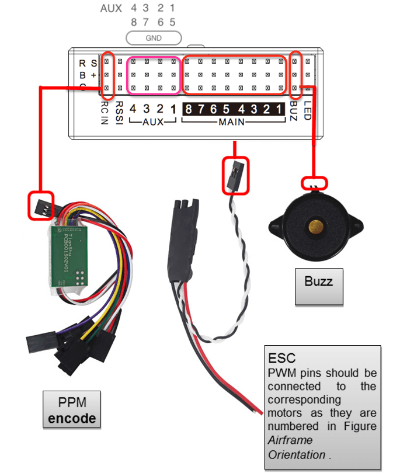

# MindPX 하드웨어

:::warning PX4에서는 이 제품을 제조하지 않습니다. 하드웨어 지원과 호환 문제는 [제조사](http://mindpx.net)에 문의하십시오.
:::

AirMind&reg; [MindPX](http://mindpx.net) 시리즈는 Pixhawk&reg;에서 분기된 차세대 자동조종장치입니다.

:::note
이 비행 컨트롤러는 [제조업체에서 지원](../flight_controller/autopilot_manufacturer_supported.md)합니다.
:::

## 요약

:::note
주요 하드웨어 문서는 [여기](http://mindpx.net/assets/accessories/Specification9.18_3_pdf.pdf)를 참고하십시오.
:::

MindPX는 Pixhawk&reg;에서 분기된 차세대 자동조종장치로, 회로도와 구조가 수정되었으며, 무인기체를 보다 스마트하고 사용하기 용이하도록 새로운 기능으로 더욱 강화되었습니다.

MindPX는 총 PWM 출력 채널을 16 (8개의 주출력 + 8 aux 출력)으로 증가시킵니다. MindPX는보다 복잡한 VTOL 구성과보다 정밀한 제어를 지원할 수 있습니다. MindPX는 하나의 단일 FMU에서 메인과 AUX 출력을 구현하여, FMU-V4 기반 비행 컨트롤러에 특히 유용합니다. 

* 메인시스템 온칩 : STM32F427
  
  * CPU : 32 비트, 168 MHz ARM 코어 텍스&reg; FPU 포함 M4
  * RAM : 256KB SRAM
  * 2MB 플래시
  * ST 마이크로 LSM303D 14 비트 가속도계/자력계
  * MEAS MS5611 기압계
  * InvenSense&reg; MPU6500 통합 6축 센서 

* 주요 기능 :
  
  * CNC 가공 가볍고 견고한 알루미늄 합금 케이스
  * 내장 IMU 이중화 내장
  * 총 16 개의 PWM 출력 채널 (8 main + 8 aux)
  * 플로우 연결을위한 여분의 I2C 포트 1 개.
  * 컴패니언 컴퓨터 연결 용 추가 USB 포트 1 개 (내장 UART-USB 변환기)
  * 개발 용으로 공개 된 디버그 포트 

## 퀵 스타트

### 설치

### Wiring

### Pin

| Num. |    Description    | Num. |                 Description                 |
|:----:|:-----------------:|:----:|:-------------------------------------------:|
|  1   |       Power       |  9   |               I2C2 (MindFLow)               |
|  2   | 디버그 (부트 로더 새로 고침) |  10  |              USB2 (직렬 2 - USB)              |
|  3   | USB1 (펌웨어 새로 고침)  |  11  |                   UART4,5                   |
|  4   |       다시 놓기       |  12  | UART1 (Telemetry) Context | Request Context |
|  5   |    UART3 (GPS)    |  13  |                    할수있다                     |
|  6   |   I2C1 (외부 나침반)   |  14  |                     ADC                     |
|  7   |     TF 카드 슬롯      |  15  |                    삼색 빛                     |
|  8   | NRF / SPI (원격 제어) |  16  |                     자벌레                     |

### 라디오 수신기

MindPX supports a wide variety of radio receivers (since V2.6) including: PPM/SBUS/DSM/DSM2/DSMX. MindPX also support FrSky&reg; bi-direction telemetry D and S.Port.

For detailed Pin diagram, please refer to the [User Guide](http://mindpx.net/assets/accessories/UserGuide9.18_2_pdf.pdf).

### Building Firmware

:::tip
Most users will not need to build this firmware! It is pre-built and automatically installed by *QGroundControl* when appropriate hardware is connected.
:::

To [build PX4](../dev_setup/building_px4.md) for this target:

    make airmind_mindpx-v2_default
    

### 컴패니언 PC 연결

MindPX has a USB-TO-UART Bridge IC on the board. A micro-USB to USB type A cable is used for the connection. Connect micro-USB end to the 'OBC' port of MindPX and USB type A end to companion computer.

And the max BAUD rate is the same with px4 family, which is up to 921600.

## User Guide

:::note
The user guide is [here](http://mindpx.net/assets/accessories/UserGuide9.18_2_pdf.pdf).
:::

## Where to Buy

MindRacer is available at [AirMind Store](http://drupal.xitronet.com/?q=catalog) on internet. You can also find MindRacer at Amazon&reg; or eBay&reg;.

## Serial Port Mapping

| UART   | Device     | Port          |
| ------ | ---------- | ------------- |
| USART1 | /dev/ttyS0 | RC            |
| USART2 | /dev/ttyS1 | TELEM1        |
| USART3 | /dev/ttyS2 | TELEM2        |
| UART4  | /dev/ttyS3 | GPS1          |
| USART6 | /dev/ttyS4 | ?             |
| UART7  | /dev/ttyS5 | Debug Console |
| UART8  | /dev/ttyS6 | ?             |

<!-- Note: Got ports using https://github.com/PX4/px4_user_guide/pull/672#issuecomment-598198434 -->

## Support

Please visit http://www.mindpx.org for more information. Or you can send email to <support@mindpx.net> for any inquiries or help.