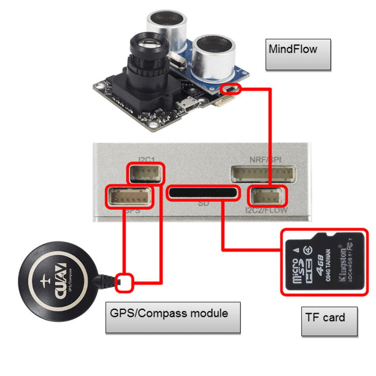

# MindPX 하드웨어

:::warning PX4 does not manufacture this (or any) autopilot. Contact the [manufacturer](http://mindpx.net) for hardware support or compliance issues.
:::

The AirMind&reg; [MindPX](http://mindpx.net) series is a new generation autopilot system branched from Pixhawk&reg;.

:::note
These flight controllers are [manufacturer supported](../flight_controller/autopilot_manufacturer_supported.md).
:::

## Quick Summary

:::note
The main hardware documentation is [here](http://mindpx.net/assets/accessories/Specification9.18_3_pdf.pdf).
:::

MindPX is a new generation autopilot system branched from Pixhawk&reg;, been revised in schematic and structure, and been further enhanced with new features to make un-manned vehicle more smart and more friendly to use.

MindPX increases total PWM output channels to 16 (8 main outputs + 8 aux outputs). This means that MindPX can support more complicated VTOL configurations and more fine control. It is especially meaningful for those FMU-V4 based flight controllers as MindPX implements main and aux output in one single FMU.

* 메인 시스템 - 온 - 칩 : STM32F427
  
  * CPU : 32 비트, 168 MHz ARM 코어 텍스  & reg; </ 0> FPU 포함 M4</li> 
    
    <li>
      RAM : 256KB SRAM
    </li>
    
    <li>
      2MB 플래시
    </li>
    
    <li>
      ST 마이크로 LSM303D 14 비트 가속도계 / 자력계
    </li>
    
    <li>
      MEAS MS5611 barometer
    </li>
    
    <li>
      InvenSense  및 reg; </ 0> MPU6500 통합 6 축 센서 </li> </ul></li> 
      
      <li>
        

          강조 표시된 기능 :
        

        <ul>
          <li>
            CNC 가공 알루미늄 합금 케이스, 가볍고 견고한
          </li>
          <li>
            내장 IMU 이중화 내장
          </li>
          <li>
            총 16 개의 PWM 출력 채널 (8 main + 8 aux)
          </li>
          <li>
            플로우 연결을위한 여분의 I2C 포트 1 개.
          </li>
          <li>
            컴패니언 컴퓨터 연결 용 추가 USB 포트 1 개 (내장 UART-USB 변환기)
          </li>
          <li>
            개발 용으로 공개 된 디버그 포트
          </li>
        </ul>
      </li></ul> 
      
      <h2>
        퀵 스타트
      </h2>
      
      <h3>
        설치
      </h3>
      
      

        
      

      
      <h3>
        Wiring
      </h3>
      
      

        
      

      
      

        
      

      
      <h3>
        Pin
      </h3>
      
      

        
      

      
      <table>
        <tr>
          <th align="center">
            Num.
          </th>
          
          <th align="center">
            Description
          </th>
          
          <th align="center">
            Num.
          </th>
          
          <th align="center">
            Description
          </th>
        </tr>
        
        <tr>
          <td align="center">
            1
          </td>
          
          <td align="center">
            Power
          </td>
          
          <td align="center">
            9
          </td>
          
          <td align="center">
            I2C2 (MindFLow)
          </td>
        </tr>
        
        <tr>
          <td align="center">
            2
          </td>
          
          <td align="center">
            디버그 (부트 로더 새로 고침)
          </td>
          
          <td align="center">
            10
          </td>
          
          <td align="center">
            USB2 (직렬 2 - USB)
          </td>
        </tr>
        
        <tr>
          <td align="center">
            3
          </td>
          
          <td align="center">
            USB1 (펌웨어 새로 고침)
          </td>
          
          <td align="center">
            11
          </td>
          
          <td align="center">
            UART4,5
          </td>
        </tr>
        
        <tr>
          <td align="center">
            4
          </td>
          
          <td align="center">
            다시 놓기
          </td>
          
          <td align="center">
            12
          </td>
          
          <td align="center">
            UART1 (Telemetry) Context | Request Context
          </td>
        </tr>
        
        <tr>
          <td align="center">
            5
          </td>
          
          <td align="center">
            UART3 (GPS)
          </td>
          
          <td align="center">
            13
          </td>
          
          <td align="center">
            할수있다
          </td>
        </tr>
        
        <tr>
          <td align="center">
            6
          </td>
          
          <td align="center">
            I2C1 (외부 나침반)
          </td>
          
          <td align="center">
            14
          </td>
          
          <td align="center">
            ADC
          </td>
        </tr>
        
        <tr>
          <td align="center">
            7
          </td>
          
          <td align="center">
            TF 카드 슬롯
          </td>
          
          <td align="center">
            15
          </td>
          
          <td align="center">
            삼색 빛
          </td>
        </tr>
        
        <tr>
          <td align="center">
            8
          </td>
          
          <td align="center">
            NRF / SPI (원격 제어)
          </td>
          
          <td align="center">
            16
          </td>
          
          <td align="center">
            자벌레
          </td>
        </tr>
      </table>
      
      <h3>
        라디오 수신기
      </h3>
      
      

        MindPX supports a wide variety of radio receivers (since V2.6) including: PPM/SBUS/DSM/DSM2/DSMX. MindPX also support FrSky&reg; bi-direction telemetry D and S.Port.
      

      
      

        For detailed Pin diagram, please refer to the <a href="http://mindpx.net/assets/accessories/UserGuide9.18_2_pdf.pdf">User Guide</a>.
      

      
      <h3>
        Building Firmware
      </h3>
      
      

:::tip
Most users will not need to build this firmware! It is pre-built and automatically installed by <em>QGroundControl</em> when appropriate hardware is connected.
:::
      

      
      

        To <a href="../dev_setup/building_px4.md">build PX4</a> for this target:
      

      
      <pre><code>make airmind_mindpx-v2_default
</code></pre>
      
      <h3>
        컴패니언 PC 연결
      </h3>
      
      

        MindPX has a USB-TO-UART Bridge IC on the board. A micro-USB to USB type A cable is used for the connection. Connect micro-USB end to the 'OBC' port of MindPX and USB type A end to companion computer.
      

      
      

        And the max BAUD rate is the same with px4 family, which is up to 921600.
      

      
      <h2>
        User Guide
      </h2>
      
      

:::note
The user guide is <a href="http://mindpx.net/assets/accessories/UserGuide9.18_2_pdf.pdf">here</a>.
:::
      

      
      <h2>
        Where to Buy
      </h2>
      
      

        MindRacer is available at <a href="http://drupal.xitronet.com/?q=catalog">AirMind Store</a> on internet. You can also find MindRacer at Amazon&reg; or eBay&reg;.
      

      
      <h2>
        Serial Port Mapping
      </h2>
      
      <table>
        <tr>
          <th>
            UART
          </th>
          
          <th>
            Device
          </th>
          
          <th>
            Port
          </th>
        </tr>
        
        <tr>
          <td>
            USART1
          </td>
          
          <td>
            /dev/ttyS0
          </td>
          
          <td>
            RC
          </td>
        </tr>
        
        <tr>
          <td>
            USART2
          </td>
          
          <td>
            /dev/ttyS1
          </td>
          
          <td>
            TELEM1
          </td>
        </tr>
        
        <tr>
          <td>
            USART3
          </td>
          
          <td>
            /dev/ttyS2
          </td>
          
          <td>
            TELEM2
          </td>
        </tr>
        
        <tr>
          <td>
            UART4
          </td>
          
          <td>
            /dev/ttyS3
          </td>
          
          <td>
            GPS1
          </td>
        </tr>
        
        <tr>
          <td>
            USART6
          </td>
          
          <td>
            /dev/ttyS4
          </td>
          
          <td>
            ?
          </td>
        </tr>
        
        <tr>
          <td>
            UART7
          </td>
          
          <td>
            /dev/ttyS5
          </td>
          
          <td>
            Debug Console
          </td>
        </tr>
        
        <tr>
          <td>
            UART8
          </td>
          
          <td>
            /dev/ttyS6
          </td>
          
          <td>
            ?
          </td>
        </tr>
      </table>
      
      <h2>
        Support
      </h2>
      
      

        Please visit http://www.mindpx.org for more information. Or you can send email to <a href="mailto:support@mindpx.net">support@mindpx.net</a> for any inquiries or help.
      
