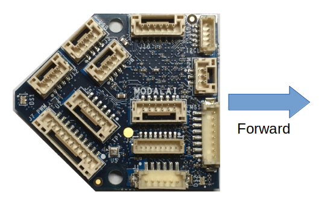
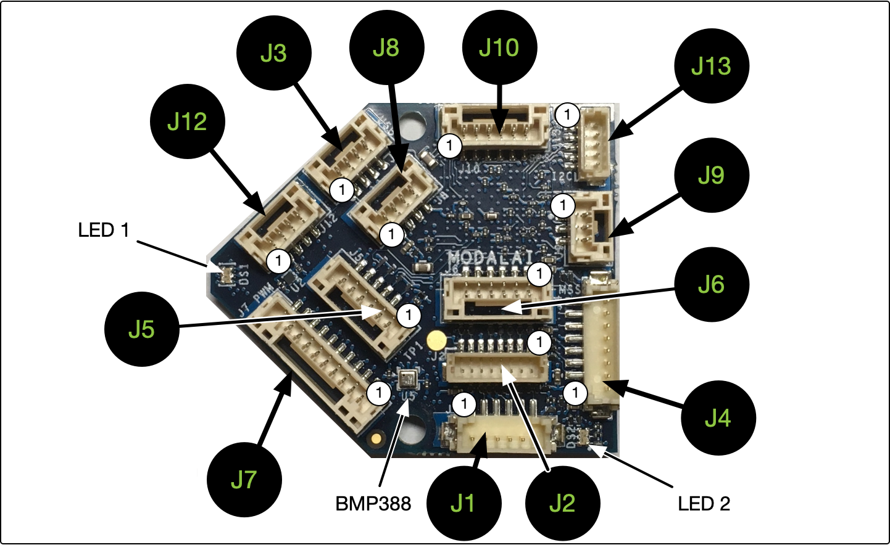
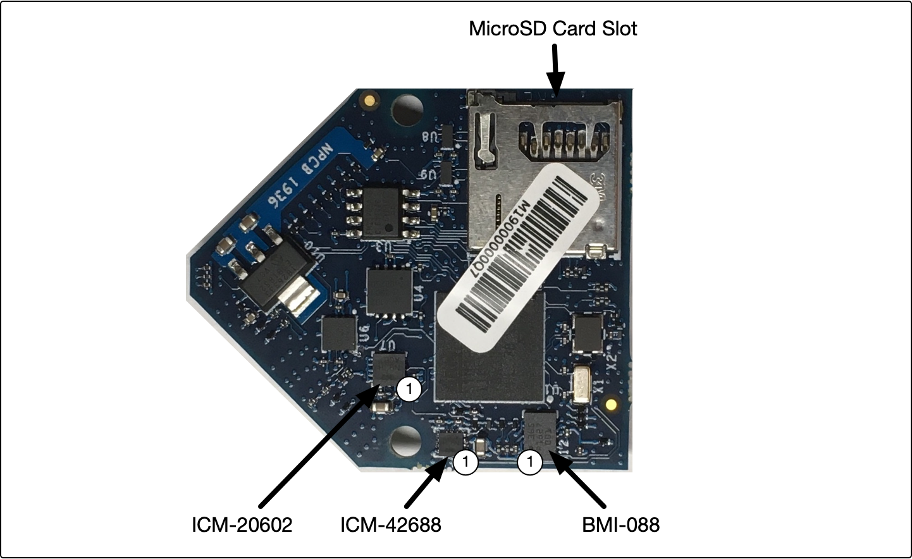

# ModalAI 플라이트 코어 v1

:::warning PX4에서는 이 제품을 제조하지 않습니다. 하드웨어 지원과 호환 문제는 [제조사](https://forum.modalai.com/)에 문의하십시오.<br/>
:::

ModalAI [Flight Core v1](https://modalai.com/flight-core) ([데이터시트](https://docs.modalai.com/flight-core-datasheet))은 미국에서 제작된 PX4 용 비행 콘트롤러입니다. Flight Core는 장애물 회피와 GPS 거부 내비게이션을 위해 ModalAI [VOXL](https://modalai.com/voxl)([데이터시트](https://docs.modalai.com/voxl-datasheet/))과 페어링하거나 독립형 비행 콘트롤러로 독립적으로 사용할 수 있습니다.


Flight Core는 VOXL Companion Computer와 Flight Core를 단일 PCB에 통합하는 [VOXL Flight](https://www.modalai.com/voxl-flight) ([데이터시트](https://docs.modalai.com/voxl-flight-datasheet/))의 PX4 비행 콘트롤러 부분과 동일합니다.

:::note
이 비행 컨트롤러는 [제조업체의 지원](../flight_controller/autopilot_manufacturer_supported.md)을 받을 수 있습니다.
:::


## 사양

| 기능         | 세부 정보                                                                                                                                                           |
|:---------- |:--------------------------------------------------------------------------------------------------------------------------------------------------------------- |
| 중량         | 6 g                                                                                                                                                             |
| MCU        | 216MHz, 32 비트 ARM M7 [STM32F765II](https://www.st.com/en/microcontrollers-microprocessors/stm32f765ii.html)                                                     |
| 메모리        | 256Kb FRAM                                                                                                                                                      |
|            | 2Mbit Flash                                                                                                                                                     |
|            | 512Kbit SRAM                                                                                                                                                    |
| 펌웨어        | [PX4](https://github.com/PX4/PX4-Autopilot/tree/master/boards/modalai/fc-v1)                                                                                    |
| 관성계        | [ICM-20602](https://www.invensense.com/products/motion-tracking/6-axis/icm-20602/) (SPI1)                                                                       |
|            | ICM-42688 (SPI2)                                                                                                                                                |
|            | [BMI088](https://www.bosch-sensortec.com/bst/products/all_products/bmi088_1) (SPI6)                                                                             |
| 기압계        | [BMP388](https://www.bosch-sensortec.com/products/environmental-sensors/pressure-sensors/bmp388/) (I2C4)                                                        |
| 보안 요소      | [A71CH](https://www.nxp.com/products/security-and-authentication/authentication/plug-and-trust-the-fast-easy-way-to-deploy-secure-iot-connections:A71CH) (I2C4) |
| microSD 카드 | [지원되는 카드 정보](../dev_log/logging.md#sd-cards)                                                                                                                    |
| 입력         | GPS/자력계                                                                                                                                                         |
|            | Spektrum                                                                                                                                                        |
|            | 텔레메트리                                                                                                                                                           |
|            | CAN 버스                                                                                                                                                          |
|            | PPM                                                                                                                                                             |
| 출력         | LED 6 개 (2xRGB)                                                                                                                                                 |
|            | PWM 채널 8개                                                                                                                                                       |
| 추가 인터페이스   | 시리얼포트 3개                                                                                                                                                        |
|            | I2C                                                                                                                                                             |
|            | GPIO                                                                                                                                                            |

:::note
자세한 하드웨어 문서는 [여기](https://docs.modalai.com/flight-core-datasheet/)를 참고하십시오.
:::

## 크기


## PX4 펌웨어 호환성

*Flight Core v1*은 PX4 v1.11의 펌웨어와 완벽하게 호환됩니다.

ModalAI는 PX4 v1.11용 [분기 PX4 버전](https://github.com/modalai/px4-firmware/tree/modalai-1.11)을 유지합니다. 여기에는 UART ESC 지원과 업스트림 예정인 VIO와 VOA의 개선 사항이 포함됩니다.

펌웨어에 관련된 더 많은 정보는 [여기](https://docs.modalai.com/flight-core-firmware/)를 참고하십시오.

## QGroundControl 지원

이 보드는 QGroundControl 4.0 이상에서 지원됩니다.

## 구매처

- [Flight Core Complete Kit](https://modalai.com/flight-core)
- [Flight Core Board](https://shop.modalai.com/products/flight-core-pcb-only) (전용)
- [단일 PCB에서 VOXL Companion Computer와 통합 Flight Core](https://modalai.com/flight-core)
- [VOXL 보조 컴퓨터 및 장애물 회피 카메라(VOXL Flight Deck)와 통합 플라이트 코어](https://modalai.com/flight-deck) ([데이터시트](https://docs.modalai.com/voxl-flight-deck-platform-datasheet/))
- [VOXL와 카메라로 조립된 Flight Core](https://shop.modalai.com/products/voxl-flight-deck-r1)

## 빠른 시작

### 방향

아래 다이어그램은 PX4 v1.11(및 [ModalAI가 유지하는 PX4 v1.10 브랜치](https://github.com/modalai/px4-firmware/tree/modalai-1.10))부터 `ROTATION_NONE` 권장 방향을 나타냅니다.



:::warning
*QGroundControl*의 *PX4 v1.10* 안정 릴리스의 경우에는 위 방향으로 `ROTATION_YAW_180`을 사용합니다.
:::

### 커넥터

핀배열에 관련된 더 많은 정보는 [여기](https://docs.modalai.com/flight-core-datasheet-connectors)을 참고하십시오.



| 커넥터 | 요약                            |
| --- | ----------------------------- |
| J1  | VOXL 통신 인터페이스 커넥터 (TELEM2)    |
| J2  | 프로그래밍 및 디버그 커넥터               |
| J3  | USB 커넥터                       |
| J4  | UART2, UART ESC (TELEM3)      |
| J5  | 텔레메트리 커넥터 (TELEM1)            |
| J6  | VOXL - 전원 관리 입력/확장            |
| J7  | 8 채널 PWM 출력 커넥터               |
| J8  | CAN 버스 커넥터                    |
| J9  | PPM RC 입력                     |
| J10 | 외부 GPS 및 자력계 커넥터              |
| J12 | RC 입력, Spektrum/SBus/UART 커넥터 |
| J13 | I2C 디스플레이(예비 센서 커넥터)/안전 버튼 입력 |



### 사용자 가이드

전체 사용자 가이드는 [여기](https://docs.modalai.com/flight-core-manual/)를 참고하십시오.


### 빌드 방법

이 대상에 대한 [PX4 빌드](../dev_setup/building_px4.md) 방법:

```
make modalai_fc-v1
```

## 시리얼 포트 매핑

| UART   | 장치         | 포트                      |
| ------ | ---------- | ----------------------- |
| USART1 | /dev/ttyS0 | GPS1 (J10)              |
| USART2 | /dev/ttyS1 | TELEM3 (J4)             |
| USART3 | /dev/ttyS2 | 디버깅 콘솔(J2)              |
| UART4  | /dev/ttyS3 | 확장 UART (J6)            |
| UART5  | /dev/ttyS4 | TELEM2, 기본 VOXL 통신 (J1) |
| USART6 | /dev/ttyS5 | RC (J12)                |
| UART7  | /dev/ttyS6 | TELEM1 (J5)             |
| UART8  | /dev/ttyS7 | 해당없음                    |

<!-- Note: Got ports using https://github.com/PX4/px4_user_guide/pull/672#issuecomment-598198434 -->

## 지원

자세한 내용은 [ModalAI 포럼](https://forum.modalai.com/category/10/flight-core)을 참고하십시오.
