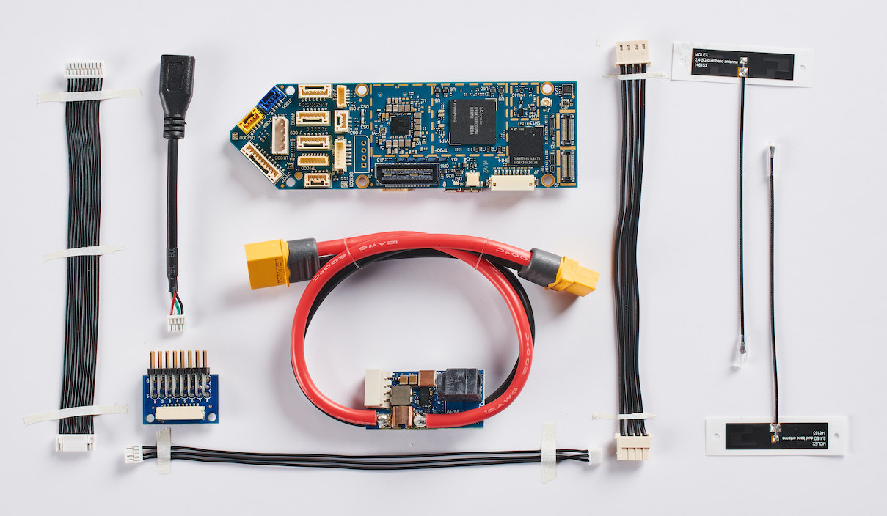
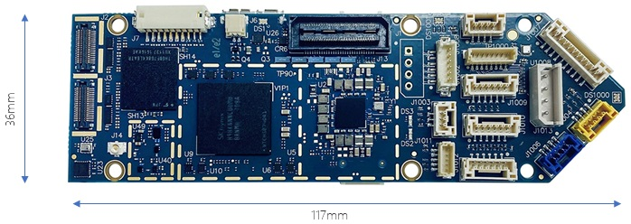

# ModalAI VOXL Flight

:::warning PX4에서는 이 제품을 제조하지 않습니다. 하드웨어 지원과 호환 문제는 [제조사](https://forum.modalai.com/)에 문의하십시오.<br/>
:::

ModalAI [VOXL Flight](https://modalai.com/voxl-flight) ([데이터시트](https://docs.modalai.com/voxl-flight-datasheet))는 Snapdragon의 강력함과 정교함을 STM32F7에서 PX4의 유연성과 사용자 용이성이 결합한 최초의 컴퓨팅 플랫폼중 하나입니다. 미국에서 제작된 VOXL Flight는 단일 PCB에서 PX4 비행 컨트롤러와 결합된 장애물 회피와 GPS 거부 (실내) 내비게이션을 지원합니다.



:::note
이 비행 컨트롤러는 [제조업체의 지원](../flight_controller/autopilot_manufacturer_supported.md)을 받을 수 있습니다.
:::


## 사양

### 시스템

| 항목 | 세부 정보 |
|:-- |:----- |
| 중량 | 26 g  |

### 보조 컴퓨터

| 항목             | 세부 정보                                                                                                                                                                                                                                                         |
|:-------------- |:------------------------------------------------------------------------------------------------------------------------------------------------------------------------------------------------------------------------------------------------------------- |
| 기본 운영 시스템      | 3.18 커널을 사용하는 Linux Yocto Jethro. 추가 Linux 운영체제는 VOXL에서 Docker를 실행하여 사용할 수 있습니다. 자세한 내용은 [여기](https://docs.modalai.com/docker-on-voxl/)를 참조하십시오.                                                                                                              |
| 계산             | Qualcomm Snapdragon 821(4GB LPDDR4 1866MHz 포함), Snapdragon 821 [데이터시트](https://developer.qualcomm.com/download/sd820e/qualcomm-snapdragon-820e-processor-apq8096sge-device-specification.pdf), [문서](https://developer.qualcomm.com/hardware/apq-8096sg/tools) |
| CPU            | 최대 2.15GHz의 쿼드 코어 CPU                                                                                                                                                                                                                                         |
| GPU            | 624MHz의 Adreno 530 GPU                                                                                                                                                                                                                                        |
| DSP 컴퓨팅        | Hexagon compute DSP (cDSP) 825MHz                                                                                                                                                                                                                             |
| 센서 DSP         | Hexagon 센서 DSP (sDSP) 700MHz                                                                                                                                                                                                                                  |
| 비디오            | 4k30 비디오 캡처 h.264/5 w/ 720p FPV                                                                                                                                                                                                                               |
| 카메라 인터페이스      | MIPI-CSI2, USB UVC, HDMI 지원                                                                                                                                                                                                                                   |
| Wi-Fi          | 사전 인증된 Wi-Fi 모듈 [QCNFA324 FCC ID : PPD-QCNFA324](https://fccid.io/PPD-QCNFA324), QCA6174A 모뎀, 802.11ac 2x2 듀얼 밴드, Bluetooth 4.2(듀얼 모드)                                                                                                                        |
| 4G LTE         | [옵션 추가 모듈](https://www.modalai.com/collections/voxl-add-ons/products/voxl-lte)                                                                                                                                                                                |
| Microhard pDDL | [옵션 추가 모듈](https://www.modalai.com/collections/voxl-add-ons/products/voxl-microhard-modem-usb-hub)                                                                                                                                                            |
| GNSS           | WGR7640 10Hz                                                                                                                                                                                                                                                  |
| I/O            | 1x USB3.0 OTG (ADB 포트), 1x USB2.0 (확장 포트), 2x UART, 3x I2C, 추가 GPIO 및 SPI 설정 가능                                                                                                                                                                               |
| 저장 장치          | 32GB (UFS 2.0), Micro SD 카드                                                                                                                                                                                                                                   |
| 소프트웨어          | Docker, OpenCV 2.4.11, 3.4.6, 4.2, ROS Indigo, Qualcomm Machine Vision SDK, 많은 오픈 소스 예제는 [GitLab](https://gitlab.com/voxl-public)을 참조하십시오.                                                                                                                    |
| 관성계            | ICM-42688 (SPI10),  ICM-20948 (SPI1)                                                                                                                                                                                                                          |
| 기압계            | BMP280                                                                                                                                                                                                                                                        |

### 비행 콘트롤러

| 항목         | 세부 정보                                                                                                                                                           |
|:---------- |:--------------------------------------------------------------------------------------------------------------------------------------------------------------- |
| MCU        | 216MHz, 32 비트 ARM M7 [STM32F765II](https://www.st.com/en/microcontrollers-microprocessors/stm32f765ii.html)                                                     |
| 메모리        | 256Kb FRAM                                                                                                                                                      |
|            | 2Mbit Flash                                                                                                                                                     |
|            | 512Kbit SRAM                                                                                                                                                    |
| 펌웨어        | [PX4](https://github.com/PX4/PX4-Autopilot/tree/master/boards/modalai/fc-v1)                                                                                    |
| 관성계        | [ICM-20602](https://www.invensense.com/products/motion-tracking/6-axis/icm-20602/) (SPI1)                                                                       |
|            | ICM-42688 (SPI2)                                                                                                                                                |
|            | [BMI088](https://www.bosch-sensortec.com/bst/products/all_products/bmi088_1) (SPI6)                                                                             |
| 기압계        | [BMP388](https://www.bosch-sensortec.com/products/environmental-sensors/pressure-sensors/bmp388/) (I2C4)                                                        |
| 보안 요소      | [A71CH](https://www.nxp.com/products/security-and-authentication/authentication/plug-and-trust-the-fast-easy-way-to-deploy-secure-iot-connections:A71CH) (I2C4) |
| microSD 카드 | [지원되는 카드 정보](../dev_log/logging.md#sd-cards)                                                                                                                    |
| 입력         | GPS/자력계                                                                                                                                                         |
|            | Spektrum                                                                                                                                                        |
|            | 텔레메트리                                                                                                                                                           |
|            | CAN 버스                                                                                                                                                          |
|            | PPM                                                                                                                                                             |
| 출력         | LED 6 개 (2xRGB)                                                                                                                                                 |
|            | PWM 채널 8개                                                                                                                                                       |
| 추가 인터페이스   | 시리얼포트 3개                                                                                                                                                        |
|            | I2C                                                                                                                                                             |
|            | GPIO                                                                                                                                                            |

:::note
자세한 하드웨어 문서는 [여기](https://docs.modalai.com/voxl-flight-datasheet/)를 참고하십시오.
:::


## 크기



[3D STEP 파일](https://storage.googleapis.com/modalai_public/modal_drawings/M0019_VOXL-Flight.zip)


## PX4 펌웨어 호환성

*VOXL Flight* is fully compatible with the official PX4 Firmware from PX4 v1.11.

ModalAI maintains a [branched PX4 version](https://github.com/modalai/px4-firmware/tree/modalai-1.11) for PX4 v1.11. This includes UART ESC support and improvements in VIO and VOA that are planned to be upstreamed.

More information about the firmware can be found [here](https://docs.modalai.com/flight-core-firmware/).


## QGroundControl Support

This board supported in QGroundControl 4.0 and later.


## Availability

- [VOXL Flight Complete Kit](https://modalai.com/voxl-flight)
- [VOXL Flight Board](https://www.modalai.com/products/voxl-flight?variant=31707275362355) (only)
- [VOXL Flight integrated with Obstacle Avoidance Cameras (VOXL Flight Deck)](https://modalai.com/flight-deck) ([Datasheet](https://docs.modalai.com/voxl-flight-deck-platform-datasheet/))
- [VOXL Flight in a ready to fly VOXL m500 Development Drone](https://www.modalai.com/collections/development-drones/products/voxl-m500) ([Datasheet](https://docs.modalai.com/voxl-m500-reference-drone-datasheet/))


## Quick Start

A quickstart from the vendor is located [here](https://docs.modalai.com/voxl-flight-quickstart/).

### voxl-vision-px4

The VOXL Flight runs [voxl-vision-px4](https://gitlab.com/voxl-public/modal-pipe-architecture/voxl-vision-px4) on the  companion computer portion of the hardware serving as a sort of MAVLink proxy. For details, the source code is available [here](https://gitlab.com/voxl-public/modal-pipe-architecture/voxl-vision-px4)

### Connectors

Detailed information about the pinouts can be found [here](https://docs.modalai.com/voxl-flight-datasheet-connectors/).

#### Top


*Note: 1000 Series connectors accessible from the STM32/PX4*

| Connector | Summary                                | Used By                            |
| --------- | -------------------------------------- | ---------------------------------- |
| J2        | Hires 4k Image Sensor (CSI0)           | Snapdragon - Linux                 |
| J3        | Stereo Image Sensor (CSI1)             | Snapdragon - Linux                 |
| J6        | Cooling Fan Connector                  | Snapdragon - Linux                 |
| J7        | BLSP6 (GPIO) and BLSP9 (UART)          | Snapdragon - Linux                 |
| J13       | Expansion B2B                          | Snapdragon - Linux                 |
| J14       | Integrated GNSS Antenna Connection     | Snapdragon - Linux                 |
| J1001     | Programming and Debug/UART3            | STM32 - PX4                        |
| J1002     | UART ESC, UART2/TELEM3                 | STM32 - PX4                        |
| J1003     | PPM RC In                              | STM32 - PX4                        |
| J1004     | RC Input, Spektrum/SBus/UART6          | STM32 - PX4                        |
| J1006     | USB 2.0 Connector (PX4/QGroundControl) | STM32 - PX4                        |
| J1007     | 8-Channel PWM/DShot Output             | STM32 - PX4                        |
| J1008     | CAN Bus                                | STM32 - PX4                        |
| J1009     | I2C3, UART4                            | STM32 - PX4                        |
| J1010     | Telemetry (TELEM1)                     | STM32 - PX4                        |
| J1011     | I2C2, Safety Button Input              | STM32 - PX4                        |
| J1012     | External GPS & Mag, UART1, I2C1        | STM32 - PX4                        |
| J1013     | Power Input, I2C3                      | STM32 - PX4 (powers whole  system) |

#### Bottom


*Note: 1000 Series connectors accessible from the STM32/PX4*

| Connector      | Summary                                 | Used By                     |
| -------------- | --------------------------------------- | --------------------------- |
| J4             | Tracking/Optic Flow Image Sensor (CSI2) | Snapdragon - Linux          |
| J8             | USB 3.0 OTG                             | Snapdragon - Linux, **adb** |
| J10            | BLSP7 UART and I2C off-board            | Snapdragon - Linux          |
| J11            | BLSP12 UART and I2C off-board           | Snapdragon - Linux          |
| VOXL microSD   |                                         | Snapdragon - Linux          |
| PX4 microSD    | 32Gb Max                                | STM32 - PX4                 |
| Wi-Fi Antennas | Included                                | Snapdragon - Linux          |

### User Guide

The full user guide is available [here](https://docs.modalai.com/voxl-flight-quickstart).


### How to Build

To [build PX4](../dev_setup/building_px4.md) for this target:

```
make modalai_fc-v1
```

## Serial Port Mapping

*Note: mappings shown are for the PX4 controlled interfaces only*

| UART   | Device     | Port                                    |
| ------ | ---------- | --------------------------------------- |
| USART1 | /dev/ttyS0 | GPS1 (J1012)                            |
| USART2 | /dev/ttyS1 | TELEM3 (J1002)                          |
| USART3 | /dev/ttyS2 | Debug Console (J1001)                   |
| UART4  | /dev/ttyS3 | Expansion UART (J6)                     |
| UART5  | /dev/ttyS4 | UART between PX4 and Companion Computer |
| USART6 | /dev/ttyS5 | RC (J1004)                              |
| UART7  | /dev/ttyS6 | TELEM1 (J1010)                          |
| UART8  | /dev/ttyS7 | N/A                                     |

<!-- Note: Got ports using https://github.com/PX4/px4_user_guide/pull/672#issuecomment-598198434 -->

## Support

Please visit the [ModalAI Forum](https://forum.modalai.com/category/8/voxl-flight) for more information.
