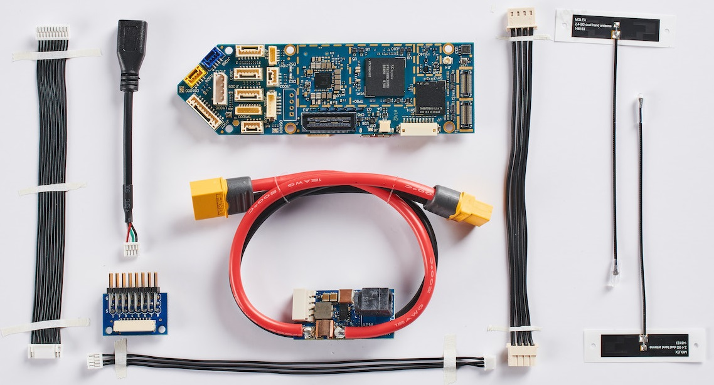
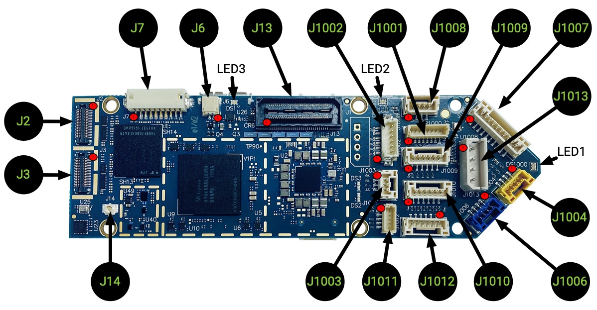
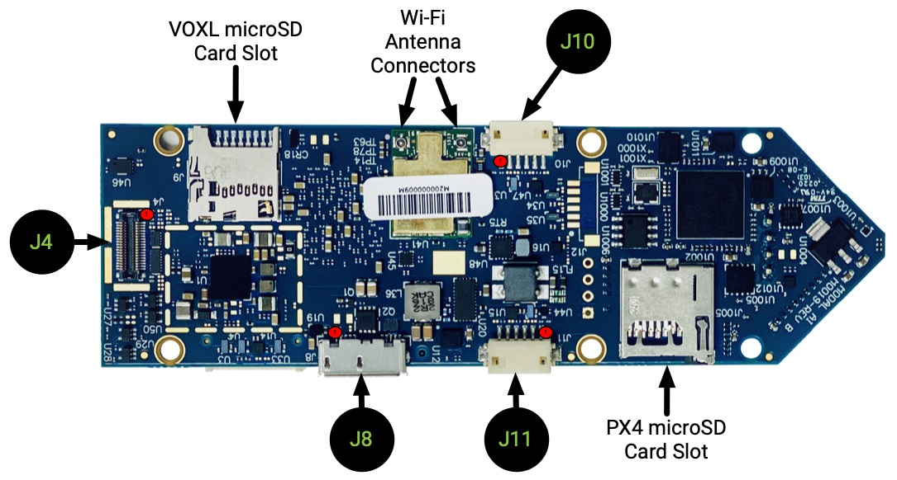

# ModalAI VOXL Flight

:::warning PX4에서는 이 제품을 제조하지 않습니다. 하드웨어 지원과 호환 문제는 [제조사](https://forum.modalai.com/)에 문의하십시오.<br/>
:::

ModalAI [VOXL Flight](https://modalai.com/voxl-flight) ([데이터시트](https://docs.modalai.com/voxl-flight-datasheet))는 Snapdragon의 강력함과 정교함을 STM32F7에서 PX4의 유연성과 사용자 용이성이 결합한 최초의 컴퓨팅 플랫폼중 하나입니다. 미국에서 제작된 VOXL Flight는 단일 PCB에서 PX4 비행 컨트롤러와 결합된 장애물 회피와 GPS 거부 (실내) 내비게이션을 지원합니다.



:::note
이 비행 컨트롤러는 [제조업체의 지원](../flight_controller/autopilot_manufacturer_supported.md)을 받을 수 있습니다.
:::


## 사양

### 시스템

| 항목 | 세부 정보 |
|:-- |:----- |
| 중량 | 26 g  |

### 보조 컴퓨터

| 항목             | 세부 정보                                                                                                                                                                                                                                                         |
|:-------------- |:------------------------------------------------------------------------------------------------------------------------------------------------------------------------------------------------------------------------------------------------------------- |
| 기본 운영 시스템      | 3.18 커널을 사용하는 Linux Yocto Jethro. 추가 Linux 운영체제는 VOXL에서 Docker를 실행하여 사용할 수 있습니다. 자세한 내용은 [여기](https://docs.modalai.com/docker-on-voxl/)를 참조하십시오.                                                                                                              |
| 계산             | Qualcomm Snapdragon 821(4GB LPDDR4 1866MHz 포함), Snapdragon 821 [데이터시트](https://developer.qualcomm.com/download/sd820e/qualcomm-snapdragon-820e-processor-apq8096sge-device-specification.pdf), [문서](https://developer.qualcomm.com/hardware/apq-8096sg/tools) |
| CPU            | 최대 2.15GHz의 쿼드 코어 CPU                                                                                                                                                                                                                                         |
| GPU            | 624MHz의 Adreno 530 GPU                                                                                                                                                                                                                                        |
| DSP 컴퓨팅        | Hexagon compute DSP (cDSP) 825MHz                                                                                                                                                                                                                             |
| 센서 DSP         | Hexagon 센서 DSP (sDSP) 700MHz                                                                                                                                                                                                                                  |
| 비디오            | 4k30 비디오 캡처 h.264/5 w/ 720p FPV                                                                                                                                                                                                                               |
| 카메라 인터페이스      | MIPI-CSI2, USB UVC, HDMI 지원                                                                                                                                                                                                                                   |
| Wi-Fi          | 사전 인증된 Wi-Fi 모듈 [QCNFA324 FCC ID : PPD-QCNFA324](https://fccid.io/PPD-QCNFA324), QCA6174A 모뎀, 802.11ac 2x2 듀얼 밴드, Bluetooth 4.2(듀얼 모드)                                                                                                                        |
| 4G LTE         | [옵션 추가 모듈](https://www.modalai.com/collections/voxl-add-ons/products/voxl-lte)                                                                                                                                                                                |
| Microhard pDDL | [옵션 추가 모듈](https://www.modalai.com/collections/voxl-add-ons/products/voxl-microhard-modem-usb-hub)                                                                                                                                                            |
| GNSS           | WGR7640 10Hz                                                                                                                                                                                                                                                  |
| I/O            | 1x USB3.0 OTG (ADB 포트), 1x USB2.0 (확장 포트), 2x UART, 3x I2C, 추가 GPIO 및 SPI 설정 가능                                                                                                                                                                               |
| 저장 장치          | 32GB (UFS 2.0), Micro SD 카드                                                                                                                                                                                                                                   |
| 소프트웨어          | Docker, OpenCV 2.4.11, 3.4.6, 4.2, ROS Indigo, Qualcomm Machine Vision SDK, 많은 오픈 소스 예제는 [GitLab](https://gitlab.com/voxl-public)을 참조하십시오.                                                                                                                    |
| 관성계            | ICM-42688 (SPI10),  ICM-20948 (SPI1)                                                                                                                                                                                                                          |
| 기압계            | BMP280                                                                                                                                                                                                                                                        |

### 비행 콘트롤러

| 항목         | 세부 정보                                                                                                                                                           |
|:---------- |:--------------------------------------------------------------------------------------------------------------------------------------------------------------- |
| MCU        | 216MHz, 32 비트 ARM M7 [STM32F765II](https://www.st.com/en/microcontrollers-microprocessors/stm32f765ii.html)                                                     |
| 메모리        | 256Kb FRAM                                                                                                                                                      |
|            | 2Mbit Flash                                                                                                                                                     |
|            | 512Kbit SRAM                                                                                                                                                    |
| 펌웨어        | [PX4](https://github.com/PX4/PX4-Autopilot/tree/master/boards/modalai/fc-v1)                                                                                    |
| 관성계        | [ICM-20602](https://www.invensense.com/products/motion-tracking/6-axis/icm-20602/) (SPI1)                                                                       |
|            | ICM-42688 (SPI2)                                                                                                                                                |
|            | [BMI088](https://www.bosch-sensortec.com/bst/products/all_products/bmi088_1) (SPI6)                                                                             |
| 기압계        | [BMP388](https://www.bosch-sensortec.com/products/environmental-sensors/pressure-sensors/bmp388/) (I2C4)                                                        |
| 보안 요소      | [A71CH](https://www.nxp.com/products/security-and-authentication/authentication/plug-and-trust-the-fast-easy-way-to-deploy-secure-iot-connections:A71CH) (I2C4) |
| microSD 카드 | [지원되는 카드 정보](../dev_log/logging.md#sd-cards)                                                                                                                    |
| 입력         | GPS/자력계                                                                                                                                                         |
|            | Spektrum                                                                                                                                                        |
|            | 텔레메트리                                                                                                                                                           |
|            | CAN 버스                                                                                                                                                          |
|            | PPM                                                                                                                                                             |
| 출력         | LED 6 개 (2xRGB)                                                                                                                                                 |
|            | PWM 채널 8개                                                                                                                                                       |
| 추가 인터페이스   | 시리얼포트 3개                                                                                                                                                        |
|            | I2C                                                                                                                                                             |
|            | GPIO                                                                                                                                                            |

:::note
자세한 하드웨어 문서는 [여기](https://docs.modalai.com/voxl-flight-datasheet/)를 참고하십시오.
:::


## 크기


[3D STEP 파일](https://storage.googleapis.com/modalai_public/modal_drawings/M0019_VOXL-Flight.zip)


## PX4 펌웨어 호환성

*VOXL Flight*은 PX4 v1.11 펌웨어와 호환됩니다.

ModalAI는 PX4 v1.11용 [분기 PX4 버전](https://github.com/modalai/px4-firmware/tree/modalai-1.11)을 유지합니다. 여기에는 UART ESC 지원과 업스트림 예정인 VIO와 VOA의 개선 사항이 포함됩니다.

펌웨어에 관련된 더 많은 정보는 [여기](https://docs.modalai.com/flight-core-firmware/)를 참고하십시오.


## QGroundControl 지원

이 보드는 QGroundControl 4.0 이상에서 지원됩니다.


## 구매처

- [VOXL Flight Complete 키트](https://modalai.com/voxl-flight)
- [VOXL Flight 보드](https://www.modalai.com/products/voxl-flight?variant=31707275362355) (전용)
- [장애물 회피 카메라와 통합된 VOXL Flight(VOXL Flight Deck)](https://modalai.com/flight-deck) ([데이터시트](https://docs.modalai.com/voxl-flight-deck-platform-datasheet/))
- [VOXL Flight in a ready to fly VOXL m500 Development Drone](https://www.modalai.com/collections/development-drones/products/voxl-m500)  ([데이터시트](https://docs.modalai.com/voxl-m500-reference-drone-datasheet/))


## 빠른 시작

공급 업체의 빠른 시작 가이드는 [여기](https://docs.modalai.com/voxl-flight-quickstart/)를 참고하십시오.

### voxl-vision-px4

VOXL Flight는 일종의 MAVLink 프록시 역할을하는 하드웨어의 보조 컴퓨터에서 [voxl-vision-px4](https://gitlab.com/voxl-public/modal-pipe-architecture/voxl-vision-px4)를 실행합니다. 자세한 내용은 [여기](https://gitlab.com/voxl-public/modal-pipe-architecture/voxl-vision-px4)에서 소스 코드를 참고할 수 있습니다.

### 커넥터

핀배열에 관련된 더 많은 정보는 [여기](https://docs.modalai.com/voxl-flight-datasheet-connectors/)을 참고하십시오.

#### 상단



*참고 : STM32/PX4에서 액세스 가능한 1000 시리즈 커넥터*

| 커넥터   | 요약                              | 사용처                        |
| ----- | ------------------------------- | -------------------------- |
| J2    | 4k 이미지 센서 (CSI0) 고용             | Snapdragon - 리눅스           |
| J3    | 스테레오 이미지 센서 (CSI1)              | Snapdragon - 리눅스           |
| J6    | 냉각 팬 커넥터                        | Snapdragon - 리눅스           |
| J7    | BLSP6 (GPIO) and BLSP9 (UART)   | Snapdragon - 리눅스           |
| J13   | 확장 B2B                          | Snapdragon - 리눅스           |
| J14   | 통합 GNSS 안테나 연결                  | Snapdragon - 리눅스           |
| J1001 | 프로그래밍 및 디버그/UART3               | STM32 - PX4                |
| J1002 | UART ESC, UART2/TELEM3          | STM32 - PX4                |
| J1003 | PPM RC 입력                       | STM32 - PX4                |
| J1004 | RC 입력, Spektrum/SBus/UART6      | STM32 - PX4                |
| J1006 | USB 2.0 커넥터(PX4/QGroundControl) | STM32 - PX4                |
| J1007 | 8 채널 PWM/DShot 출력               | STM32 - PX4                |
| J1008 | CAN 버스                          | STM32 - PX4                |
| J1009 | I2C3, UART4                     | STM32 - PX4                |
| J1010 | 텔레메트리 (TELEM1)                  | STM32 - PX4                |
| J1011 | I2C2, 안전 버튼 입력                  | STM32 - PX4                |
| J1012 | 외부 GPS 및 자력계, UART1, I2C1       | STM32 - PX4                |
| J1013 | 전원 입력, I2C3                     | STM32 - PX4 (전체 시스템 전원 공급) |

#### 하단



*참고 : STM32/PX4에서 액세스 가능한 1000 시리즈 커넥터*

| 커넥터          | 요약                     | 사용처                       |
| ------------ | ---------------------- | ------------------------- |
| J4           | 추적/광류 이미지 센서 (CSI2)    | Snapdragon - 리눅스          |
| J8           | USB 3.0 OTG            | Snapdragon - 리눅스, **adb** |
| J10          | BLSP7 UART 및 I2C 오프보드  | Snapdragon - 리눅스          |
| J11          | BLSP12 UART 및 I2C 오프보드 | Snapdragon - 리눅스          |
| VOXL microSD |                        | Snapdragon - 리눅스          |
| PX4 microSD  | 32Gb Max               | STM32 - PX4               |
| Wi-Fi 안테나    | 포함됨.                   | Snapdragon - 리눅스          |

### 사용자 가이드

전체 사용자 가이드는 [여기](https://docs.modalai.com/voxl-flight-quickstart)를 참고하십시오.


### 빌드 방법

이 대상에 대한 [PX4 빌드](../dev_setup/building_px4.md) 방법 :

```
make modalai_fc-v1
```

## 시리얼 포트 매핑

*참고: 표시된 매핑은 PX4 제어 인터페이스 전용입니다.*

| UART   | 장치         | 포트                 |
| ------ | ---------- | ------------------ |
| USART1 | /dev/ttyS0 | GPS1 (J1012)       |
| USART2 | /dev/ttyS1 | TELEM3 (J1002)     |
| USART3 | /dev/ttyS2 | 디버그 콘솔(J1001)      |
| UART4  | /dev/ttyS3 | 확장 UART (J6)       |
| UART5  | /dev/ttyS4 | PX4와 보조 컴퓨터간의 UART |
| USART6 | /dev/ttyS5 | RC (J1004)         |
| UART7  | /dev/ttyS6 | TELEM1 (J1010)     |
| UART8  | /dev/ttyS7 | 해당 없음              |

<!-- Note: Got ports using https://github.com/PX4/px4_user_guide/pull/672#issuecomment-598198434 -->

## 지원

자세한 내용은 [ModalAI 포럼](https://forum.modalai.com/category/8/voxl-flight)을 참고하십시오.
