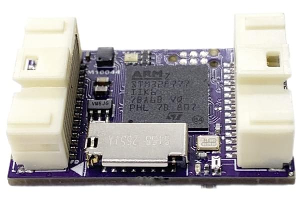
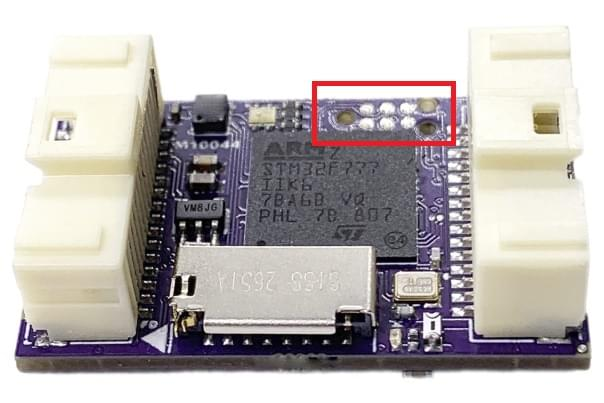
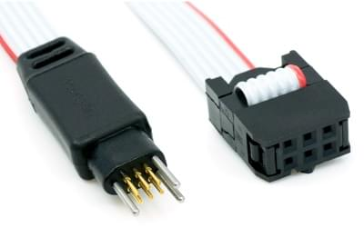
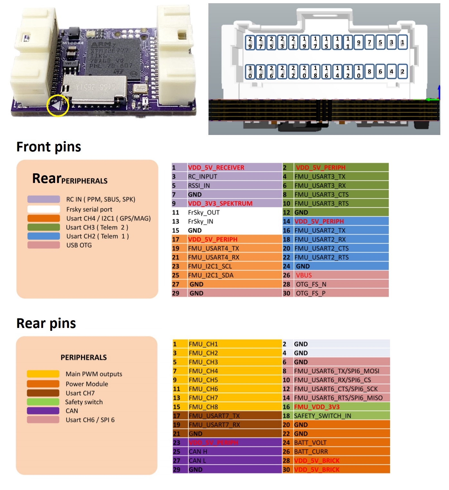

# mRo Control Zero F7 비행 콘트롤러

:::warning PX4에서는 이 제품을 제조하지 않습니다. 하드웨어 지원과 호환 문제는 [제조사](https://store.mrobotics.io/)에 문의하십시오.
:::

*mRo Control Zero F7<sup>&reg;</sup>*는 mRo의 새로운 비행 컨트롤러입니다.



매우 우수한 트리플 IMU 상용 등급 비행 컨트롤러입니다. 8x PWM 출력(DShot 가능), 3x IMU, 1x 자력계, 1x 기압 센서 (고도계), 6x UART 및 SD 카드가 모두 32mm x 20mm PCB에 포장되어 있습니다. PWM은 양방향이고 EMI로 보호되며 레벨이 5V 로직 레벨로 이동합니다. 모두 전면 및 후면 30 핀 Molex Pico Clasp 커넥터를 사용하여 액세스합니다. 내구성이 강한 플라스틱 케이스, 컨 포멀 보드 코팅, 온도 보정 옵션이 포함되어 있습니다.


:::note
이 비행 컨트롤러는 [제조업체의 지원](../flight_controller/autopilot_manufacturer_supported.md)을 받을 수 있습니다.
:::


## 주요 특징

- 마이크로 프로세서:
  - FPU가있는 32 비트 STM32F777 코어 텍스<sup>&reg;</sup> M4 코어. 3
  - 216 MHz/512 KB RAM/2 MB 플래시
  - F-RAM Cypress MF25V02-G 256Kbit 비휘발성 메모리(RAM만큼 빠른 플래시 메모리)
- 센서:
  - [Bosch BMI088](https://www.bosch-sensortec.com/bst/products/all_products/bmi088_1) 3 축 가속도계/자이로스코프 (내부 진동 감쇠)
  - [Invensense ICM-20602](https://www.invensense.com/products/motion-tracking/6-axis/icm-20602/) 3 축 가속도계/자이로스코프
  - [Invensense ICM-20948](https://www.invensense.com/products/motion-tracking/9-axis/icm-20948/) 3 축 가속도계/자이로스코프/자력계
  - [Infineon DPS310 기압계](https://www.infineon.com/cms/en/product/sensor/pressure-sensors/pressure-sensors-for-iot/dps310/)(부드럽고 감광성이 없음)

- 인터페이스:
  - 6x UART(총 직렬 포트), 3x(HW 흐름 제어 포함), 1x FRSky Telemetry(D 또는 X 유형), 1x 콘솔 및 1x GPS + I2C
  - PWM 출력(모든 DShot 가능) 8개
  - CAN 1개
  - I2C 1개
  - SPI 1개
  - Spektrum DSM/DSM2/DSM-X® Satellite 호환 입력 및 바인딩
  - Futaba S.BUS® 및 S.BUS2® 호환 입력
  - FRSky 텔레메트리 포트 출력
  - Graupner SUMD
  - Yuneec ST24
  - PPM 합계 입력 신호
  - JTAG(TC2030 커넥터) 1개
  - RSSI(PWM 또는 전압) 입력 1개
  - 삼색 LED

- 중량 및 크기(케이스 없음):
  - 중량: 5.3g (0.19oz)
  - 넓이: 20mm (0.79")
  - 길이: 32mm (1.26")

- 전원 시스템 :
  - 초저잡음 LDO 전압 조정기 3개


## 구매처

* [mRo Control Zero](https://store.mrobotics.io/mRo-Control-Zero-F7-p/mro-ctrl-zero-f7.htm)


## 펌웨어 빌드

::::tip 대부분의 사용자들은 펌웨어를 빌드할 필요는 없습니다. 하드웨어가 연결되면 *QGroundControl*에 의해 사전 구축되고 자동으로 설치됩니다.
:::

이 대상에 대한 [PX4 빌드](../dev_setup/building_px4.md) 방법 :
```
make mro_ctrl-zero-f7
```


## 디버그 포트

### 콘솔 포트

[PX4 시스템 콘솔](../debug/system_console.md)은 아래에 나열된 핀을 사용하여 `USART7`에서 실행됩니다. This is a standard serial pinout, designed to connect to a [3.3V FTDI](https://www.digikey.com/en/products/detail/TTL-232R-3V3/768-1015-ND/1836393) cable (5V tolerant).

| mRo control zero f7 |             | FTDI              |
| ------------------- | ----------- | ----------------- |
| 17                  | USART7 Tx   | 5 | FTDI RX (노랑)  |
| 19                  | USART7 Rx   | 4 | FTDI TX (오렌지) |
| 6                   | USART21 GND | 1 | FTDI GND (검정) |


### SWD 포트

FMU 디버깅 [SWD 포트](../debug/swd_debug.md)(JTAG)는 아래와 같은 TC2030 디버그 커넥터입니다.



아래의 [Tag Connect](https://www.tag-connect.com/) 케이블 [TC2030 IDC NL](https://www.tag-connect.com/product/tc2030-idc-nl) (관련 [고정 클립](https://www.tag-connect.com/product/tc2030-clip-retaining-clip-board-for-tc2030-nl-cables) 포함)을 사용하여 BlackMagic 프로브 또는 ST-LINK에 연결할 수 있습니다.



다른 디버그 프로브와 함께 사용할 수있는 [ARM20-CTX 20 핀-TC2030-IDC 어댑터](https://www.tag-connect.com/product/arm20-ctx-20-pin-to-tc2030-idc-adapter-for-cortex)도 있습니다.

## 핀배열




## 시리얼 포트 매핑

| UART   | 장치         | 포트                                         |
| ------ | ---------- | ------------------------------------------ |
| USART2 | /dev/ttyS0 | TELEM1 (흐름 제어)                             |
| USART3 | /dev/ttyS1 | TELEM2 (흐름 제어)                             |
| UART4  | /dev/ttyS2 | GPS1                                       |
| USART6 | /dev/ttyS3 | 플렉스 포트(흐름 제어를 사용하여 SPI 또는 UART로 구성할 수 있음). |
| UART7  | /dev/ttyS4 | 콘솔                                         |
| UART8  | /dev/ttyS5 | 직렬 포트 여분(일반적으로 FrSky 원격 측정용)               |


<!-- Note: Got ports using https://github.com/PX4/PX4-user_guide/pull/672#issuecomment-598198434 -->
<!-- https://github.com/PX4/PX4-Autopilot/blob/release/1.13/boards/mro/ctrl-zero-f7/nuttx-config/nsh/defconfig#L202-L207 -->


## 추가 정보

- [새로운 mRo Control Zero Autopilot 소개](https://mrobotics.io/introducing-the-new-mro-control-zero-autopilot/) (블로그)
- [빠른 시작 가이드](https://mrobotics.io/mrocontrolzero/)

