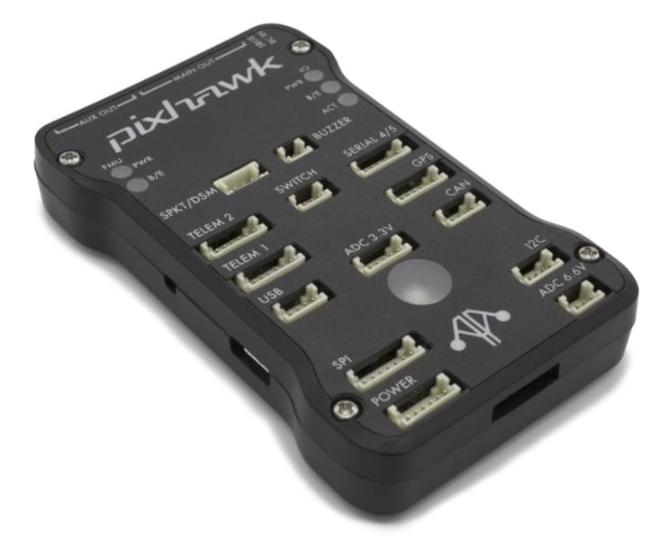

# mRo Pixhawk 비행 컨트롤러 (Pixhawk 1)

:::warning PX4에서는 이 제품을 제조하지 않습니다. 하드웨어 지원과 호환 문제는 [제조사](https://store.mrobotics.io/)에 문의하십시오.
:::

*mRo Pixhawk&reg;*는 원래 [Pixhawk 1](../flight_controller/pixhawk.md)의 하드웨어 호환 버전입니다. PX4를 [NuttX](https://nuttx.apache.org/) OS에서 실행합니다.

:::tip
컨트롤러는 3DR&reg; [Pixhawk 1](../flight_controller/pixhawk.md)의 드롭인 교체로 사용할 수 있습니다. 가장 큰 차이점은 [Pixhawk-project](https://pixhawk.org/) **FMUv3** 개방형 하드웨어 설계를 기반인 것입니다. 이는 원래 Pixhawk 1을 1MB의 플래시로 제한 버그를 수정합니다.
:::

PX4 실행을 위한 조립 설정 방법은 [Pixhawk 배선 개요](../assembly/quick_start_pixhawk.md)를 참고하십시오.

:::tip
이 자동조종장치는 PX4 유지관리 및 테스트 팀에서 [지원](../flight_controller/autopilot_pixhawk_standard.md)합니다.
:::

## 주요 특징

* 마이크로 프로세서: 
  * FPU가있는 32 비트 STM32F427 코어 텍스&reg; M4 코어
  * 168 MHz / 256 KB RAM / 2 MB 플래시
  * 32 비트 STM32F100 failsafe 코프로세서
  * 24 MHz/8 KB RAM/64 KB 플래시
* 센서: 
  * ST Micro L3GD20 3축 16비트 자이로스코프
  * ST Micro LSM303D 3축 14비트 가속도계/ 력계
  * Invensense&reg; MPU 6000 3축 가속도계/자이로스코프
  * MEAS MS5611 기압계
* 인터페이스: 
  * UART (직렬 포트) 5개, 1 개의 고전력 지원, 2x (HW 흐름 제어 포함)
  * CAN 2 개
  * 최대 DX8의 Spektrum DSM/DSM2/DSM-X® Satellite 호환 입력(DX9 이상은 지원되지 않음)
  * Futaba&reg; S.BUS 호환 입력 및 출력
  * PPM 합계 신호
  * RSSI (PWM 또는 전압) 입력
  * I2C 
  * SPI
  * 3.3 및 6.6V ADC 입력
  * 외부 microUSB 포트

* 전원 시스템 :
  
  * 자동 복구 기능의 이상적인 다이오드 컨트롤러
  * 서보 레일 고전력 (7V) 및 고전류 준비
  * 모든 주변 장치 출력 과전류 보호, 모든 입력 ESD 보호

* 무게와 크기 :
  
  * 무게 : 38g (1.31oz)
  * 너비 : 50mm (1.96 ")
  * 두께 : 15.5mm (.613 ")
  * 길이 : 81.5mm (3.21")

## 유효성

* [베어본 (Bare Bones)](https://store.mrobotics.io/Genuine-PixHawk-1-Barebones-p/mro-pixhawk1-bb-mr.htm) - 보드만(3DR Pixhawk 대체품으로 유용합니다)
* [mRo Pixhawk 2.4.6 필수 키트](https://store.mrobotics.io/Genuine-PixHawk-Flight-Controller-p/mro-pixhawk1-minkit-mr.htm) - 텔레메트리 무선 통신을 제외한 모든 것
*  mRo Pixhawk 2.4.6 쿨 키트 (한정판)</0> - 텔레 메 트리 라디오를 포함하여 필요한 모든 것</li> </ul> 
  
  ## 펌웨어 빌드
  
  ::::tip 대부분의 사용자들은 펌웨어를 빌드할 필요는 없습니다. 하드웨어가 연결되면 *QGroundControl*에 의해 사전 구축되고 자동으로 설치됩니다.
:::
  
  이 대상에 대한 [PX4 빌드](../dev_setup/building_px4.md) 방법 :
  
      make px4_fmu-v3_default
      
  
  ## 디버그 포트
  
  [3DR Pixhawk 1 &gt; 디버그 포트](../flight_controller/pixhawk.md#debug-ports)를 참고하십시오.
  
  ## 핀배열
  
  [3DR Pixhawk 1 &gt; 핀배열](../flight_controller/pixhawk.md#pinouts)을 참고하십시오.
  
  ## 시리얼 포트 매핑
  
  | UART   | 장치         | 포트             |
  | ------ | ---------- | -------------- |
  | UART1  | /dev/ttyS0 | IO 디버그         |
  | USART2 | /dev/ttyS1 | TELEM1 (흐름 제어) |
  | USART3 | /dev/ttyS2 | TELEM2 (흐름 제어) |
  | UART4  |            |                |
  | UART7  | 콘솔         |                |
  | UART8  | SERIAL4    |                |
  
  <!-- Note: Got ports using https://github.com/PX4/px4_user_guide/pull/672#issuecomment-598198434 -->
  
  ## 회로도
  
  이 보드는 [ Pixhawk-project](https://pixhawk.org/) **FMUv3** 오픈 하드웨어 디자인을 기반으로합니다.
  
  * [FMUv3 schematic](https://github.com/PX4/Hardware/raw/master/FMUv3_REV_D/Schematic%20Print/Schematic%20Prints.PDF) - 회로도 및 레이아웃
  
  :::note CC-BY-SA 3.0 라이센스 오픈 하드웨어 설계로 모든 회로도와 설계 파일을 [사용할 수 있습니다](https://github.com/PX4/Hardware).
:::