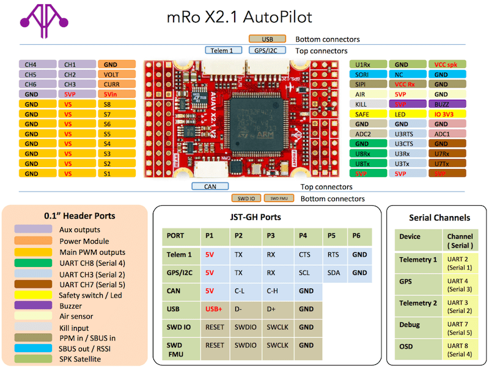

# mRo-X2.1 자동조종장치

:::warning PX4에서는 이 제품을 제조하지 않습니다. 하드웨어 지원과 호환 문제는 [제조사](https://store.mrobotics.io/)에 문의하십시오.
:::

[ mRo-X2.1 자동 조종 장치](http://www.mRobotics.io/)는  Pixhawk&reg; - 프로젝트 **FMUv2** 오픈 하드웨어 디자인을 기반으로합니다. PX4를 [NuttX](https://nuttx.apache.org/) OS에서 실행합니다.
 

:::note
이 비행 컨트롤러는 [제조업체의 지원](../flight_controller/autopilot_manufacturer_supported.md)을 받을 수 있습니다.
:::

## 요약

* 메인 시스템 온칩: [STM32F427](http://www.st.com/web/en/catalog/mmc/FM141/SC1169/SS1577/LN1789) 
  * CPU : STM32F427VIT6 ARM&reg; 마이크로 컨트롤러 - 개정판 3
  * IO: STM32F100C8T6 ARM&reg; 마이크로 컨트롤러
* 센서: 
  * Invensense&reg; MPU9250 9DOF
  * Invensense ICM-20602 6DOF
  * MEAS MS5611 기압계
* 크기/중량 
  * 크기: 36mm x 50mm (수직, 수평 또는 헤더가 설치되지 않은 상태로 주문 가능)
  * 장착 지점 : 직경 30.5mm x 30.5mm 3.2mm
  * 중량: 10.9g

The diagram below provides a side-by-side comparison with a Pixhawk 1. The mRo features almost identical hardware and connectivity but has a much smaller footprint. Major differences are updated sensors and Rev 3 FMU.

## Connectivity

* 2.54mm headers:
* GPS (UART4) with I2C
* CAN Bus
* RC input
* PPM input
* Spektrum input
* RSSI input
* sBus input
* sBus output
* Power input
* Buzzer output
* LED output
* 8 x Servo outputs
* 6 x Aux outputs
* 오프 보드 microUSB 커넥터
* 강제 종료 핀 출력 * (현재 펌웨어에서 지원되지 않음) </ 0></li> 
  
  * AirSpeed 센서
  * USART2 (Telem 1)
  * USART3 (Telem 2)
  * UART7 (Console)
  * UART8 (OSD)</ul> 
  
  ## PX4 부트 로더 문제
  
  By default a mRo X2.1 might come preconfigured for ArduPilot&reg; rather than PX4. This can be seen during firmware update when the board is recognized as FMUv2 instead of X2.1.
  
  In this case you must update the BootLoader using [BL_Update_X21.zip](https://github.com/PX4/px4_user_guide/raw/master/assets/hardware/BL_Update_X21.zip). If this correction is not carried out your compass direction will be wrong and the secondary IMU will not be detected.
  
  The update steps are:
  
  1.  BL_Update_X21.zip </ 0>을 다운로드하고 추출하십시오.</li> 
    
    * * BL_Update_X21 </ 0> 폴더를 찾으십시오. 여기에는 ** rc.txt </ 0> 파일이 들어있는 ** bin </ 0> 파일과 ** / etc </ 0>이라는 하위 폴더가 있습니다</li> 
      
      * 이 파일을 마이크로 SD 카드의 루트 디렉토리에 복사 한 다음 mRO x2.1에 삽입하십시오.
      * Mro x2.1의 전원을 켜십시오. 부팅 할 때까지 기다렸다가 한 번 재부팅하십시오.</ol> 
      
      ## Availability
      
      This product can be ordered at the [mRobotics&reg; Store](https://store.mrobotics.io/mRo-X2-1-Rev-2-p/m10021a.htm).
      
      ## Wiring Guide
      
      
      
      ## Building Firmware
      
:::tip
Most users will not need to build this firmware! It is pre-built and automatically installed by *QGroundControl* when appropriate hardware is connected.
:::
      
      To [build PX4](../dev_setup/building_px4.md) for this target:
      
          make mro_x21_default
          
      
      ## Schematics
      
      The board is documented on the mRo hardware repo: [x21_V2_schematic.pdf](https://github.com/mRoboticsIO/Hardware/blob/master/X2.1/Docs/x21_V2_schematic.pdf).
      
      ## Serial Port Mapping
      
      | UART   | Device     | Port            |
      | ------ | ---------- | --------------- |
      | USART1 | /dev/ttyS0 | IO debug        |
      | USART2 | /dev/ttyS1 | SERIAL1         |
      | USART3 | /dev/ttyS2 | TELEM2          |
      | UART4  | /dev/ttyS3 | GPS/I2C         |
      | USART6 | /dev/ttyS4 | PX4IO           |
      | UART7  | /dev/ttyS5 | SERIAL5 CONSOLE |
      | UART8  | /dev/ttyS6 | SERIAL4         |
      
      <!-- Note: Got ports using https://github.com/PX4/px4_user_guide/pull/672#issuecomment-598198434 -->