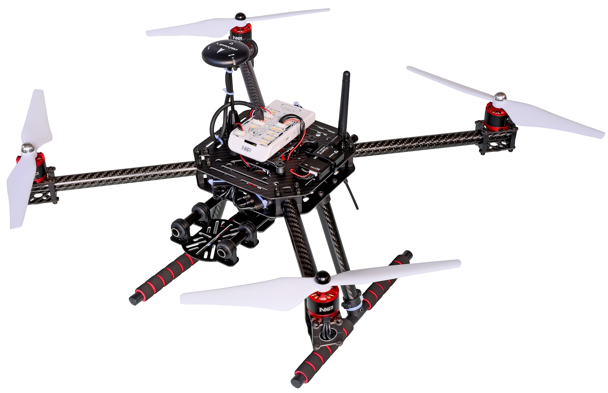

# NXP RDDRONE-FMUK66 FMU

:::warning PX4에서는 이 제품을 제조하지 않습니다. 하드웨어 지원과 호환 문제는 [제조사](https://www.nxp.com/)에 문의하십시오.
:::

RDDRONE-FMUK66 FMU는 2  자동차 이더넷 100BASET1 및 보안 요소 A71CH (RevC) 또는 SE050 (RevD)을 추가하여 Pixhawk FMUv4 사양을 준수하는 NXP Semiconductor 구성 요소를 사용하는 참조 설계입니다. NXP는 이 설계를 복제, 변경 또는 재활용 할 수 있도록 회로도, 거버, BOM 및 소스 파일을 제공합니다.

[HoverGames](https://www.hovergames.com/)와 함께 사용하기 위한 공식 FMU입니다.


NXP FMU와 포함된 주변 장치는 FCC/CE/RoHs/REACH 지침을 준수합니다.

:::note
이 비행 컨트롤러는 [제조업체에서 지원](../flight_controller/autopilot_manufacturer_supported.md)합니다.
:::


## 요약

- **메인 FMU 프로세서:**
  - 180MHz Cortex-M4F MCU, 2MB 플래시, 256KB SRAM, 듀얼 USB (FS + HS), 이더넷, 144-LQFP에서 실행되는 Kinetis K66 MK66FN2MOVLQ18 마이크로 컨트롤러.
- **내장 센서:**
  - 가속/자이로: BMI088/ICM42688 (RevD) ...
  - 가속/자력계: FXOS8700CQ
  - 자이로: FXAS21002CQ
  - 자력계: BMM150
  - 기압계: ML3115A2
  - 기압계: BMP280
- **GPS:**
  - u-blox Neo-M8N GPS/GLONASS 수신기; 통합 자력계 IST8310


이 FMU는 키트로만 제공되며 [Segger Jlink EDU 미니 디버거](https://www.segger.com/products/debug-probes/j-link/models/j-link-edu-mini/), DCD-LZ 디버거 어댑터, USB-TTL-3V3 콘솔 케이블, HolyBro GPS 모듈, 배터리 전원 모듈, SDCard 및 케이스, 나사와 스티커를 포함하고 있습니다. 텔레메트리 라디오([HGD-TELEM433](https://www.nxp.com/part/HGD-TELEM433) 및 [HGD-TELEM915](https://www.nxp.com/part/HGD-TELEM915))는 해당 국가에서 사용되는 ISM 대역 주파수와 일치하는 제품을 구매하여야 합니다.


전원 모듈, GPS, Jlink 또는 USB-TTL-3V3 콘솔 케이블 또는 SDCard를 포함하지 않는 "Lite" 버전 RDDRONE-FMUK66L도 사용할 수 있습니다. [아래로 스크롤하여 FMUK66 구매 페이지의 구매 섹션에서 FMUK66L을 확인하세요.](https://www.nxp.com/design/designs/px4-robotic-drone-fmu-rddrone-fmuk66:RDDRONE-FMUK66#buy)

추가적인 정보는 [기술 데이트시트](https://www.nxp.com/design/designs/px4-robotic-drone-fmu-rddrone-fmuk66:RDDRONE-FMUK66)를 참고하십시오. <!-- www.nxp.com/rddrone-fmuk66 -->


## 구매처

**RDDRONE-FMUK66** 참조 설계 키트는 NXP에서 직접 구매하거나 NXP의 공인 전세계 [전자 유통 업체](https://www.nxp.com/support/sample-and-buy/distributor-network:DISTRIBUTORS) 네트워크에서 구매할 수 있습니다.

- [구매 링크](https://www.nxp.com/design/designs/px4-robotic-drone-fmu-rddrone-fmuk66:RDDRONE-FMUK66#buy) (www.nxp.com)
- 원격 측정 라디오는 주파수 대역에 따라 별도로 구매하여야 합니다.
  - [HGD-TELEM433](https://www.nxp.com/part/HGD-TELEM433)
  - [HGD-TELEM915](https://www.nxp.com/part/HGD-TELEM915)

:::note
*RDDRONE-FMUK66* FMU는 전체 HoverGames 드론 키트에도 포함되어 있습니다. [KIT-HGDRONEK66](https://www.nxp.com/applications/solutions/industrial/aerospace-and-mobile-robotics/uavs-drones-and-rovers/nxp-hovergames-drone-kit-including-rddrone-fmuk66-and-peripherals:KIT-HGDRONEK66#buy)

<!--
## Connectors

[Connector Diagram]

## Pinouts

[Pinouts listing or link]

## Dimensions

[Dimensions]

-->

## 조립 및 설정

https://nxp.gitbook.io/hovergames

## 펌웨어 빌드

::::tip 대부분의 사용자들은 펌웨어를 빌드할 필요는 없습니다. 하드웨어가 연결되면 *QGroundControl*에 의해 사전 구축되고 자동으로 설치됩니다.
:::

이 대상에 대한 [PX4 빌드](../dev_setup/building_px4.md) 방법 :
```
make nxp_fmuk66-v3_default
```


## 디버그 포트

[PX4 시스템 콘솔](../debug/system_console.md)과 [SWD 인터페이스](../debug/swd_debug.md)는 [DEC-LZ FMU 디버그](https://nxp.gitbook.io/hovergames/rddrone-fmuk66/connectors/debug-interface-dcd-lz) 포트에서 실행됩니다.

NXP의 DCD-LZ는 7핀 JST-GH 커넥터이며 nRST/MCU_RESET 핀을 [Pixhawk 6 핀 표준 디버그 포트](https://pixhawk.org/pixhawk-connector-standard/#dronecode_debug)에 추가합니다.

The DCD-LZ breakout adapter permits the use of a standard 10 pin JTAG/SWD interface (i.e. using the Segger Jlink) and a standard 5 pin FTDI USB-TTL-3V3 type cable.

<!--

## Peripherals

* [List of anything people should use with this hardware]

-->

## Supported Platforms / Airframes

Any multicopter / airplane / rover or boat that can be controlled with normal RC servos or Futaba S-Bus servos. The complete set of supported configurations can be seen in the [Airframes Reference](../airframes/airframe_reference.md).



:::tip
The NXP [HoverGames Drone Kit](https://www.nxp.com/kit-hgdronek66) (shown above) is a complete drone development kit that includes everything needed to build a quadcopter. You only need to supply the 3S/4S LiPo battery.
:::

## Further info

- [HoverGames online documentation](https://nxp.gitbook.io/hovergames) PX4 user and programming guide, specific assembly, construction, debugging, programming instructions.

- 3DModels supporting HoverGames and RDDRONE-FMUK66 can be found on *Thingiverse* at these search links: [fmuk66](https://www.thingiverse.com/search?q=fmuk66&type=things&sort=relevant), [hovergames](https://www.thingiverse.com/search?q=hovergames&type=things&sort=relevant).

!\[HoverGamesDronelogo\](../../assets/flight_controller/nxp_rddrone_fmuk66/The HoverGames_Colored-small.png)

