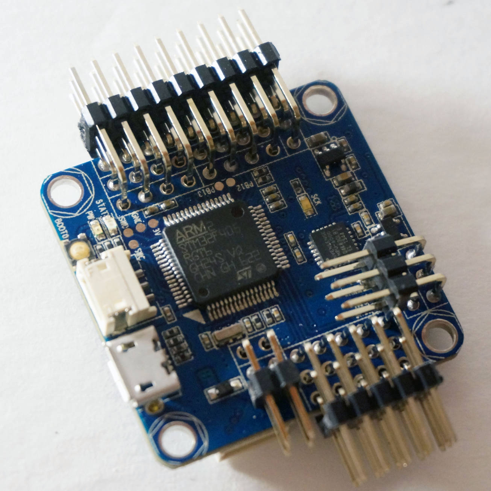
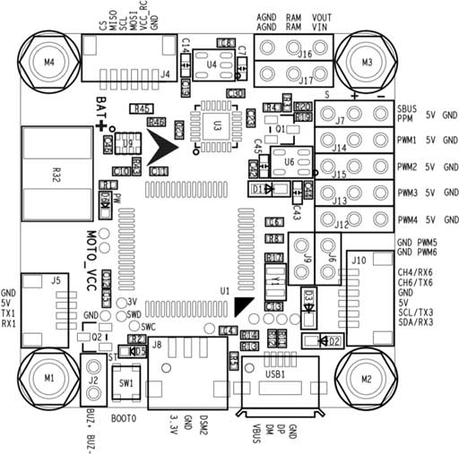
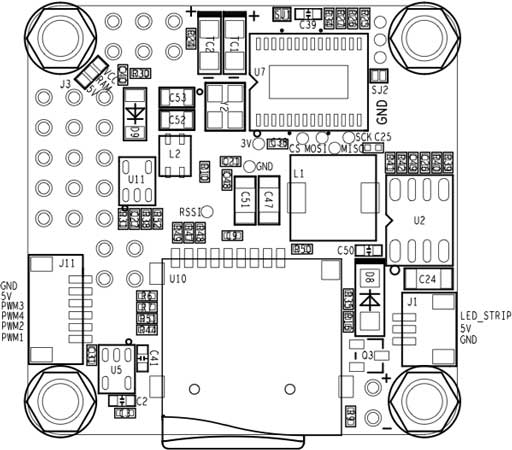
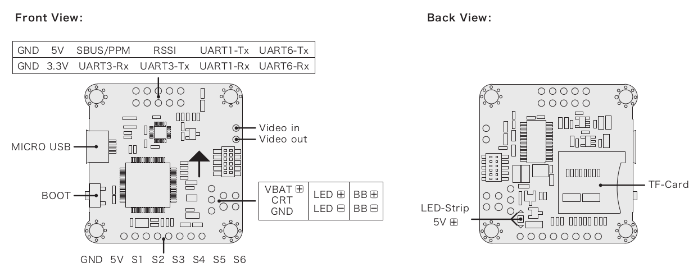
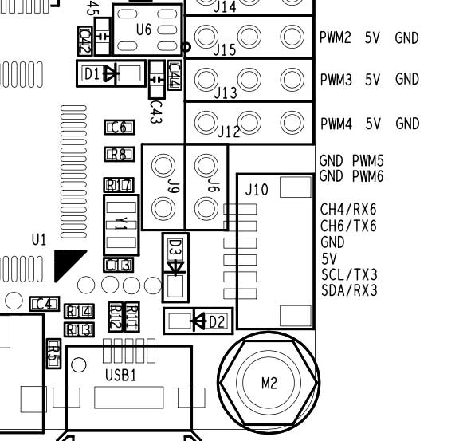
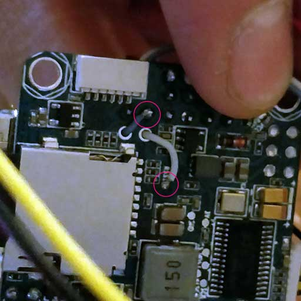
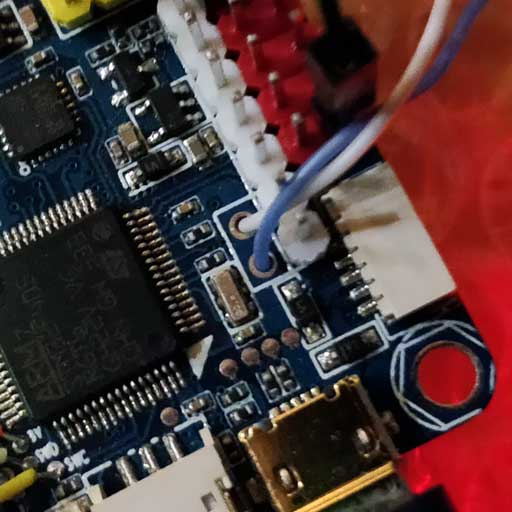
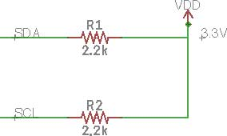
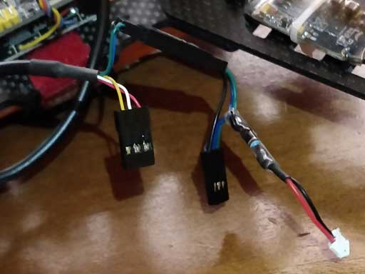

# Omnibus F4 SD

:::warning
PX4에서는 이 제품을 제조하지 않습니다.
지원 또는 규정준수 문제는 제조업체에 문의하십시오.
:::

*Omnibus F4 SD*는 레이서를 위해 설계된 컨트롤러입니다. 일반적인 레이서 보드와 달리 SD 카드와 고속 CPU 등이 추가되었습니다.



다음은 [Pixracer](../flight_controller/pixracer.md)와 주요 차이점은 다음과 같습니다.

- 저렴한 가격
- 더 적은 IO 포트(예 : GPS 또는 Flow 센서를 연결은 가능함)
- 외부 GPS용 I2C 버스에 외부 풀업 저항이 필요합니다. 아래 [I2C](#i2c)를 참조하십시오.
- 적은 RAM (192 KB vs. 256 KB) and FLASH (1 MB vs. 2 MB)
- *Pixracer*와 동일 보드 크기, 약간 더 작은 폼 팩터(커넥터가 적기 때문에)
- 통합 OSD(아직 소프트웨어에서 구현되지 않음)

:::tip
모든 일반적인 PX4 기능은 여전히 레이서에 사용할 수 있습니다!
:::

:::note
이 비행 컨트롤러는 [제조업체의 지원](../flight_controller/autopilot_manufacturer_supported.md)을 받을 수 있습니다.
:::


## 주요 기능

* 메인 시스템 온칩: [STM32F405RGT6](https://www.st.com/en/microcontrollers/stm32f405rg.html)
  * CPU : 단정밀도 FPU의 168MHz ARM Cortex M4
  * RAM : 192KB SRAM
  * FLASH: 1 MB
* 표준 레이서 폼 팩터 : 36x36mm, 표준 30.5mm 구멍 패턴
* MPU6000 가속/자이로
* BMP280 기압계(모든 보드에 마운트된 것은 아님)
* microSD(로깅)
* Futaba S.BUS 및 S.BUS2/Spektrum DSM2 및 DSMX/Graupner SUMD/PPM 입력/Yuneec ST24
* OneShot PWM 출력(설정 가능)
* 내장 전류 센서
* 내장 OSD 칩(SPI를 통한 AB7456)


## 구매처

보드는 몇 가지 변형된 형태(예 : 기압계 포함 또는 제외)로 여러 공급 업체에서 생산합니다.

:::tip PX4는 Betaflight OMNIBUSF4SD 대상을 지원하는 보드와 호환됩니다(제품 페이지에 *OMNIBUSF4SD*가 있는 경우, 보드는 PX4에서 작동해야 함).
:::

:::tip
모든 Omnibus F4 레이블 파생물(예 : 클론)도 작동합니다. 그러나, 이러한 보드의 배전은 품질이 다양합니다.
:::

아래의 보드들은 테스트되고 작동하는 것입니다.
- [Hobbywing XRotor 비행 콘트롤러 F4](http://www.hobbywing.com/goods.php?id=636) :::note 이 보드는 납땜이 필요없는 [Hobbywing XRotor Micro 40A 4in1 ESC](http://www.hobbywing.com/goods.php?id=588)에 적합합니다. 이 ESC 보드는 또한 Omnibus 보드에 전원을 제공합니다.
:::

   구매처:
  * [Hobbywing XRotor F4 비행 콘트롤러 w/OSD](https://www.getfpv.com/hobbywing-xrotor-f4-flight-controller-w-osd.html) (getfpv)

- 오리지널 Airbot Omnibus F4 SD

  구매처:
  * [Airbot (CN 제조업체)](https://store.myairbot.com/omnibusf4prov3.html)
  * [Ready To Fly Quads(미국 리셀러)](http://www.readytoflyquads.com/flip-32-f4-omnibus-v2-pro)

액세서리에는 아래의 내용물이 포함됩니다.
* MAVLink 텔레메트리 [ESP8266 WiFi 모듈](../telemetry/esp8266_wifi_module.md). 다음 핀을 연결하여야합니다: GND, RX, TX, VCC 및 CH-PD (CH-PD ~ 3.3V). 전송 속도는 921600입니다.


## 커넥터

이 설계를 기반으로 한 다른 공급 업체의 보드는 레이아웃이 상당히 다를 수 있습니다. 다양한 버전의 레이아웃/실크스크린이 아래와 같습니다.

### 에어 봇 옴니버스 F4 SD

아래는 상단과 하단을 모두 보여주는 Airbot Omnibus F4 SD (V1)의 실크 스크린입니다.

 

### Hobbywing XRotor 비행 콘트롤러 F4

아래는 Hobbywing XRotor 비행 콘트롤러 F4의 실크스크린입니다.




## 핀배열

### 무선 조종

RC는 다음 포트중 하나에 연결됩니다.
- UART1
- SBUS/PPM 포트(인버터를 통해 내부적으로 UART1로 이동)

:::note
일부 Omnibus F4 보드에는 MCU SBUS 및 PPM 중 하나 또는 둘 다를 단일 핀 헤더에 연결하는 점퍼가 있습니다. 사용하기 전에 점퍼 또는 솔더 브리지를 적절한 MCU 핀으로 설정하십시오.
:::

### UART

- UART6: GPS 포트
  - TX: MCU 핀 PC6
  - RX: MCU 핀 PC7

  - Airbot Omnibus F4 SD 핀아웃은 포트 J10(TX6 / RX6)에 있습니다.

  

- UART4
  - TX: MCU 핀 PA0
  - RX: MCU 핀 PA1
  - 초당 전송속도: 57600
  - 이것은 `TELEM 2` 포트로 설정할 수 있습니다.
  - 에어 봇 옴니버스 F4 SD 핀배열:
    - TX: RSSI 핀
    - RX: PWM 출력 5

  

  

### I2C

다음을 통해 사용 가능한 I2C 포트가 하나 있습니다.
- SCL: MCU 핀 PB10 (TX3로 표시 될 수 있음)
- SDA: MCU 핀 PB11 (RX3로 표시 될 수 있음)

:::note
두 신호(클럭 및 데이터) 모두에 외부 풀업이 필요합니다.
예를 들어, 2.2k 풀업을 사용하여 외부 매거진을 연결할 수 있습니다.
:::

  - Airbot Omnibus F4 SD 핀아웃은 포트 J10 (SCL [클럭] / SCA [데이터])에 있습니다.

다음은 구현의 예입니다. 저는 Spektrum 플러그를 사용하여 DSM 포트에서 3.3v를 얻었으며 2.2k 저항을 통해 각 라인에 3.3v+ 만 연결하였습니다.





## 시리얼 포트 매핑

| UART   | 장치         | 포트       |
| ------ | ---------- | -------- |
| USART1 | /dev/ttyS0 | SerialRX |
| USART4 | /dev/ttyS1 | TELEM1   |
| USART6 | /dev/ttyS2 | GPS      |

<!-- Note: Got ports using https://github.com/PX4/PX4-user_guide/pull/672#issuecomment-598198434 -->

## RC 텔레메트리

Omnibus는 [FrSky 텔레메트리](../peripherals/frsky_telemetry.md) 또는 [CRSF Crossfire 텔레메트리](#crsf_telemetry)를 사용하여 RC 전송기에 대한 원격측정을 지원합니다.


<span id="crsf_telemetry"></span>
### CRSF Crossfire 텔레메트리

TBS CRSF Crossfire 텔레메트리는 비행 콘트롤러(기체의 자세, 배터리, 비행 모드 및 GPS 데이터)에서 RC 송신기(Taranis)로 원격측정 데이터를 전송합니다.

FrSky 텔레메트리의 이점은 다음과 같습니다.
- RC와 텔레메트리에는 단일 UART 만 필요합니다.
- CRSF 프로토콜은 응답시간 느린 장치에 최적화되어 있습니다.
- 150Hz RC 업데이트 속도.
- 신호는 반전되지 않으므로 외부 인버터 로직이 필요하지 않습니다.

Omnibus는 소형 쿼드 용으로 특별히 설계되었으므로 [TBS Crossfire Nano RX](http://team-blacksheep.com/products/prod:crossfire_nano_rx) 사용을 권장합니다.

휴대용 컨트롤러(예 : Taranis)에서는 [송신기 모듈](http://team-blacksheep.com/shop/cat:rc_transmitters#product_listing)도 필요합니다. 이것은 RC 콘트롤러의 뒷면에 장착할 수 있습니다.

:::note
위의 참조 링크에는 TX/RX 모듈 문서가 포함되어 있습니다.
:::

#### 설정

다음과 같이 Nano RX와 Omnibus 핀을 연결합니다.

| Omnibus UART1 | Nano RX |
| ------------- | ------- |
| TX            | Ch2     |
| RX            | Ch1     |

PX4 비행 컨트롤러에서 다른 항목을 설정하지 않아도 됩니다. RC 프로토콜이 자동으로 감지됩니다.

다음으로 TX/RX 모듈을 업데이트하여 CRSF 프로토콜을 사용하고 텔레메트리를 설정합니다. 이에 대한 지침은 [TBS Crossfire 매뉴얼](https://www.team-blacksheep.com/tbs-crossfire-manual.pdf)( 'CRSF용 라디오 설정' 검색)에 나와 있습니다.

## 회로도

회로도는 [Airbot](https://myairbot.com/)에서 제공합니다: [OmnibusF4-Pro-Sch.pdf](http://bit.ly/obf4pro).

<span id="bootloader"></span>
## 부트로더 업데이트

보드에는 [Betaflight](https://github.com/betaflight/betaflight/wiki)가 사전 설치되어 있습니다. PX4 펌웨어를 설치하기 전에 *PX4 부트 로더*를 플래시하여야 합니다. [omnibusf4sd_bl.hex](https://github.com/PX4/px4_user_guide/raw/master/assets/flight_controller/omnibus_f4_sd/omnibusf4sd_bl_d52b70cb39.hex) 부트로더 바이너리를 다운로드하고 [이 페이지](../advanced_config/bootloader_update_from_betaflight.md)에서 플래시 방법을 참고하십시오.

## 펌웨어 빌드

이 대상에 대한 [PX4 빌드](../dev_setup/building_px4.md) 방법 :
```
make omnibus_f4sd_default
```

## 펌웨어 설치

펌웨어는 일반적인 방법으로 설치할 수 있습니다.
- 소스 빌드 및 업로드
  ```
  make omnibus_f4sd_default upload
  ```
- *QGroundControl*을 사용하여 [펌웨어를 로드](../config/firmware.md)합니다. 미리 빌드된 펌웨어나 사용자 지정 펌웨어를 사용할 수 있습니다.


## 설정

[기본 설정](../config/README.md) 외에도 아래의 매개변수가 중요합니다.

| 매개변수                                                                     | 설정                                                                            |
| ------------------------------------------------------------------------ | ----------------------------------------------------------------------------- |
| [SYS_HAS_MAG](../advanced_config/parameter_reference.md#SYS_HAS_MAG)   | 보드에 내부 자력계가 없기 때문에 비활성화하여야 합니다. 외부 자력계를 연결하여 활성화 할 수 있습니다.                    |
| [SYS_HAS_BARO](../advanced_config/parameter_reference.md#SYS_HAS_BARO) | 보드에 기압계가 없는 경우에는 비활성화 하십시오.                                                   |
| [MOT_ORDERING](../advanced_config/parameter_reference.md#MOT_ORDERING)   | Betaflight/Cleanflight 모터 할당과 함께 4-in-1 ESC를 사용하는 경우 이 매개변수를 적절하게 설정할 수 있습니다. |


## 추가 정보

이 보드에 관한 리뷰는 [여기](https://nathan.vertile.com/blog/2016/10/12/omnibusf4/)를 참고하십시오.

[이 페이지](https://blog.dronetrest.com/omnibus-f4-flight-controller-guide/)는 핀배열, 설정 방법을 제공합니다.
