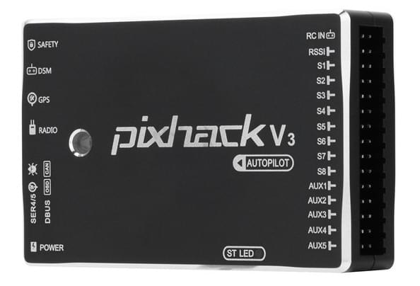

# Pixhack V3

:::warning PX4에서는 이 제품을 제조하지 않습니다. 하드웨어 지원과 호환 문제는 [제조사](https://store.cuav.net/)에 문의하십시오.
:::

CUAV *Pixhack V3* 비행 컨트롤러는 주로 상용 시스템 제조업체를 위한 자동조종장치입니다.

이 보드는 SOLO Pixhawk<sup>&reg;</sup> 2 (PH2) 비행 컨트롤러의 변형으로, 개방형 하드웨어 설계 [Pixhawk 프로젝트](https://pixhawk.org/) **FMUv3**를 기반으로합니다. [NuttX](https://nuttx.apache.org/) OS에서 PX4를 실행하며, PX4 또는 ArduPilot<sup>&reg;</sup> (APM) 펌웨어와 완벽하게 호환됩니다.

*Pixhack V3*는 더 나은 인터페이스 레이아웃과 진동감쇠 및 온도조절 시스템을 추가하였으며, 원 디자인을 개선하였습니다.



:::note
이 비행 컨트롤러는 [제조업체의 지원](../flight_controller/autopilot_manufacturer_supported.md)을 받을 수 있습니다.
:::


## 요약

* 마이크로 프로세서:
  * STM32F427
  * STM32F100 (오류복구 코프로세서)
* 센서:
  * 가속도계 (3): LS303D, MPU6000, MPU9250/hmc5983
  * 자이로스코프 (3): L3GD20, MPU6000, MPU9250
  * 나침반 (2): LS303D, MPU9250
  * 기압계 (2): MS5611 X2
* 인터페이스:
  * MAVLink UART (2)
  * GPS UART (2)
  * 디버그 UART (1)
  * RC 입력(PPM, SBUS, DSM/DSM2 용)
  * RSSI 입력: PWM 또는 3.3ADC
  * I2C (2)
  * CAN 버스 (1)
  * ADC 입력: 3.3V X1 , 6.6V X1
  * PWM 출력: 8 PWM IO + 4 IO
* 전원 시스템:
  * PM 전원 입력: 4.5 ~ 5.5V
  * USB 전원 입력: 5.0V +- 0.25v
* 중량과 크기
  * 중량: 63g
  * 폭: 68mm
  * 두께: 17mm
  * 길이: 44mm
* 기타 특성:
  * 작동 온도: -20 ~ 60°c

## 유효성

보드는 아래에서 구입할 수 있습니다.
* [store.cuav.net](http://store.cuav.net/index.php?id_product=8&id_product_attribute=0&rewrite=pixhack-v3-autopilot&controller=product&id_lang=3)
* [leixun.aliexpress.com/store](https://leixun.aliexpress.com/store)

## 펌웨어 빌드

::::tip 대부분의 사용자들은 펌웨어를 빌드할 필요는 없습니다. 하드웨어가 연결되면 *QGroundControl*에 의해 사전 구축되고 자동으로 설치됩니다.
:::

이 대상에 대한 [PX4 빌드](../dev_setup/building_px4.md) 방법 :
```
make px4_fmu-v3_default
```

## 핀배열과 회로도

* [문서/배선 가이드](http://doc.cuav.net/flight-controller/pixhack/en/pixhack-v3.html)

## 시리얼 포트 매핑

| UART   | 장치         | 포트             |
| ------ | ---------- | -------------- |
| UART1  | /dev/ttyS0 | IO 디버그         |
| USART2 | /dev/ttyS1 | TELEM1 (흐름 제어) |
| USART3 | /dev/ttyS2 | TELEM2 (흐름 제어) |
| UART4  |            |                |
| UART7  | 콘솔         |                |
| UART8  | SERIAL4    |                |