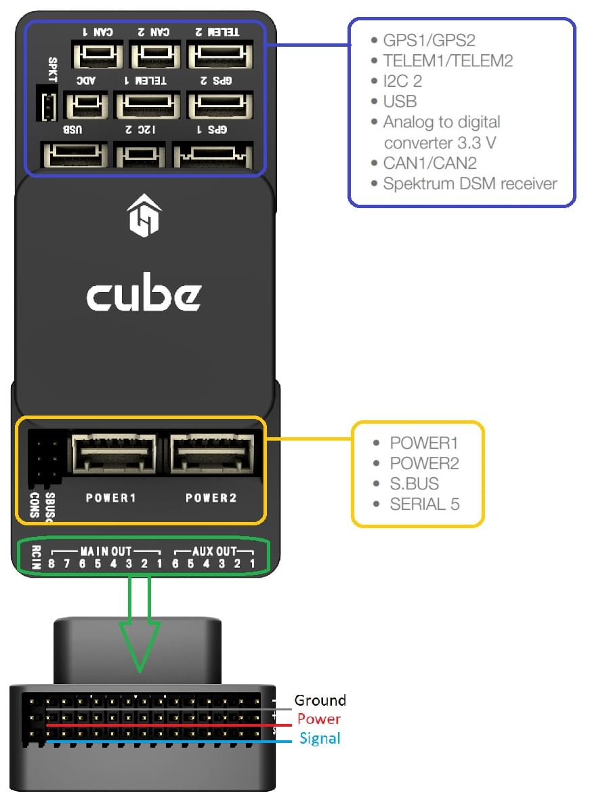
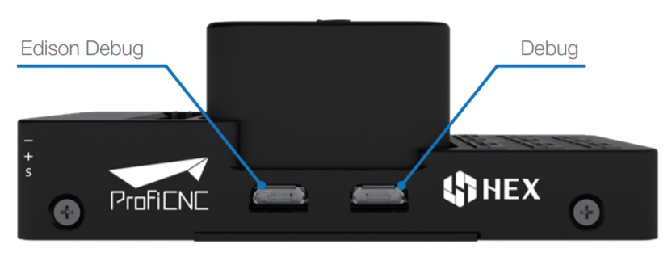
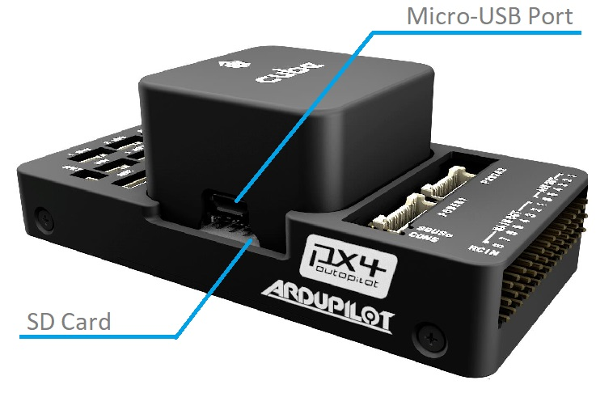

# Hex Cube Black 비행 컨트롤러

:::warning PX4에서는 이 제품을 제조하지 않습니다. 하드웨어 지원과 호환 문제는 [제조사](https://cubepilot.org/#/home)에 문의하십시오.
:::

:::tip
[Cube Orange](cubepilot_cube_orange.md)는이 제품의 후속 제품입니다. 그러나, [Pixhawk 표준](autopilot_pixhawk_standard.md)과 같은 산업 표준에 기반한 제품을 사용하는 것이 바람직합니다. 이 비행 컨트롤러는 표준을 따르지 않으며, 특허받은 커넥터를 사용합니다.
:::

[Hex Cube Black](http://www.proficnc.com/61-system-kits2) 비행 컨트롤러(이전의 Pixhawk 2.1)는 주로 상용 시스템 제조업체를 위한 자동조종장치입니다. [Pixhawk-project](https://pixhawk.org/) **FMUv3** 개방형 하드웨어 설계를 기반으로 [NuttX](https://nuttx.apache.org/) OS에서 PX4를 실행합니다.


배선을 줄이고 신뢰성을 높이며 조립을 쉽게하기 위해 도메인 별 캐리어 보드와 함께 사용하도록 설계되었습니다. 예를 들어, 상용 검사 기체 캐리어보드에는 보조 컴퓨터용 연결이 포함될 수 있는 반면, 레이서 용 캐리어보드는 기체 프레임을 형성하는 ESC를 포함할 수 있습니다.

Cube에는 2 개의 IMU에 진동 차단이 포함되어 있으며, 세 번째 고정 IMU는 참조 백업용으로 사용됩니다.

:::note
제조업체 [Cube Docs](https://docs.cubepilot.org/user-guides/autopilot/the-cube-module-overview)에는 [큐브 색상 간의 차이점](https://docs.cubepilot.org/user-guides/autopilot/the-cube-module-overview#differences-between-cube-colours) 뿐만 아니라 자세한 정보를 제공합니다.
:::

:::tip
이 자동조종장치는 PX4 유지관리 및 테스트 팀에서 [지원](../flight_controller/autopilot_pixhawk_standard.md)합니다.
:::


## 주요 특징

* 32 비트 STM32F427 [Cortex-M4F](http://en.wikipedia.org/wiki/ARM_Cortex-M#Cortex-M4)<sup>&reg;</sup> 코어 (FPU 포함)
* 168 MHz / 252 MIPS
* 256 KB RAM
* 2MB 플래시 \(완전 액세스 가능\)
* 32 비트 STM32F103 failsafe 코프로세서
* 14 개 PWM/서보 출력(페일세이프 및 수동 오버라이드 포함 8 개, 보조, 고전력 호환 6 개)
* 추가 주변 장치(UART, I2C, CAN) 다양한 연결 옵션
* 전용 프로세서 및 독립형 전원 공급 장치(고정익 적용)로 비행중 복구 및 수동 오버라이드 통합 백업 시스템
* 백업 시스템은 믹싱을 통합하여 일관된 자동조종장치와 수동 오버라이드 믹싱 모드를 제공합니다(고정익 적용).
* 중복 전원공급장치 및 자동 장애 조치
* 외부 안전 스위치
* 다색 LED 주시각 표시기
* 고전력 멀티톤 피에조 오디오 표시기
* 장기간 고속 로깅용 microSD 카드


<span id="stores"></span>
## 구매처

[Cube Black](http://www.proficnc.com/61-system-kits) (ProfiCNC)

## 조립

[큐브 배선 개요](../assembly/quick_start_cube.md)


## 사양

### 프로세서

* 32 비트 STM32F427 [Cortex M4](http://en.wikipedia.org/wiki/ARM_Cortex-M#Cortex-M4) 코어 (FPU 포함)
* 168 MHz / 252 MIPS
* 256 KB RAM
* 2MB 플래시 (완전 액세스 가능)
* 32 비트 STM32F103 failsafe 코프로세서

### 센서

* TBA

### 인터페이스

* 5x UART (직렬 포트), 1 개의 고전력 지원, 2x (HW 흐름 제어 포함)
* 2x CAN (하나는 내부 3.3V 트랜시버, 하나는 확장 커넥터에 있음)
* Spektrum DSM / DSM2 / DSM-X® Satellite 호환 입력
* Futaba S.BUS® 호환 입력 및 출력
* PPM 합계 신호 입력
* RSSI (PWM 또는 전압) 입력
* I2C
* SPI
* 3.3v ADC 입력
* 내부 microUSB 포트 및 외부 microUSB 포트 확장

### 전력 시스템 및 보호

* 자동 복구 기능의 이상적인 다이오드 컨트롤러
* ervo 레일 고출력 (최대 10V) 및 고전류 (10A +) 준비
* 모든 주변 장치 출력 과전류 보호, 모든 입력 ESD 보호


### 정격 전압

Pixhawk 는 3 개의 전원이 공급되는 경우에는 전원 공급 장치의 3중 중복이 가능합니다. 세 개의 레일은 전원 모듈 입력, 서보 레일 입력과 USB 입력입니다.

#### 정상 작동 최대 정격 전압

이러한 조건에서 전원은 아래의 순서대로 시스템에 전원을 공급하여야합니다.

- 전원 모듈 입력 (4.8V ~ 5.4V)
- 서보 레일 입력 (4.8V ~ 5.4V) **수동 오버라이드의 경우 최대 10V이지만 전력 모듈 입력이 없는 경우 자동 조종 장치 부품은 5.7V 이상에서 전원이 꺼집니다.**
- USB 전원 입력 (4.8V ~ 5.4V)

#### 절대 최대 정격 전압

아래의 조건에서 시스템은 전원을 사용하지 않지만(작동하지 않음), 그대로 유지됩니다.

- 전원 모듈 입력(4.1V ~ 5.7V, 0V ~ 20V 손상되지 않음)
- 서보 레일 입력(4.1V ~ 5.7V, 0V ~ 20V)
- USB 전원 입력(4.1V ~ 5.7V, 0V ~ 6V)


## 핀배열과 회로도

보드 설계도와 문서는 [The Cube Project](https://github.com/proficnc/The-Cube)를 참고하십시오.

## 포트

### 위쪽 (GPS, TELEM 등)



<span id="serial_ports"></span>
### 시리얼 포트 매핑

| UART   | 장치         | 포트                           |
| ------ | ---------- | ---------------------------- |
| USART1 | /dev/ttyS0 | <!-- IO debug? -->
|
| USART2 | /dev/ttyS1 | TELEM1 (흐름 제어)               |
| USART3 | /dev/ttyS2 | TELEM2 (흐름 제어)               |
| UART4  | /dev/ttyS3 | GPS1                         |
| USART6 | /dev/ttyS4 | PX4IO                        |
| UART7  | /dev/ttyS5 | 콘솔                           |
| UART8  | /dev/ttyS6 | <!-- unknown -->

|<!-- Note: Got ports using https://github.com/PX4/PX4-user_guide/pull/672#issuecomment-598198434 -->
<!-- This originally said " **TEL4:** /dev/ttyS6 (ttyS4 UART):  **Note** `TEL4` is labeled as `GPS2` on Cube." -->


### 디버그 포트



### USB/SDCard 포트




## 펌웨어 빌드

::::tip 대부분의 사용자들은 펌웨어를 빌드할 필요는 없습니다. 하드웨어가 연결되면 *QGroundControl*에 의해 사전 구축되고 자동으로 설치됩니다.
:::

이 대상에 대한 [PX4 빌드](../dev_setup/building_px4.md) :
```
make px4_fmu-v3_default
```

## 이슈

Cube Black의 CAN1과 CAN2의 실크 스크린이 뒤집힙니다 (CAN1은 CAN2이고 그 반대의 경우도 마찬가지임).

## 추가 정보 및 문서

- [큐브 배선 개요](../assembly/quick_start_cube.md)
- Cube 문서 (제조사) :
  - [큐브 모듈 개요](https://docs.cubepilot.org/user-guides/autopilot/the-cube-module-overview)
  - [큐브 사용 설명서](https://docs.cubepilot.org/user-guides/autopilot/the-cube-user-manual)
  - [미니 캐리어 보드](https://docs.cubepilot.org/user-guides/carrier-boards/mini-carrier-board)
