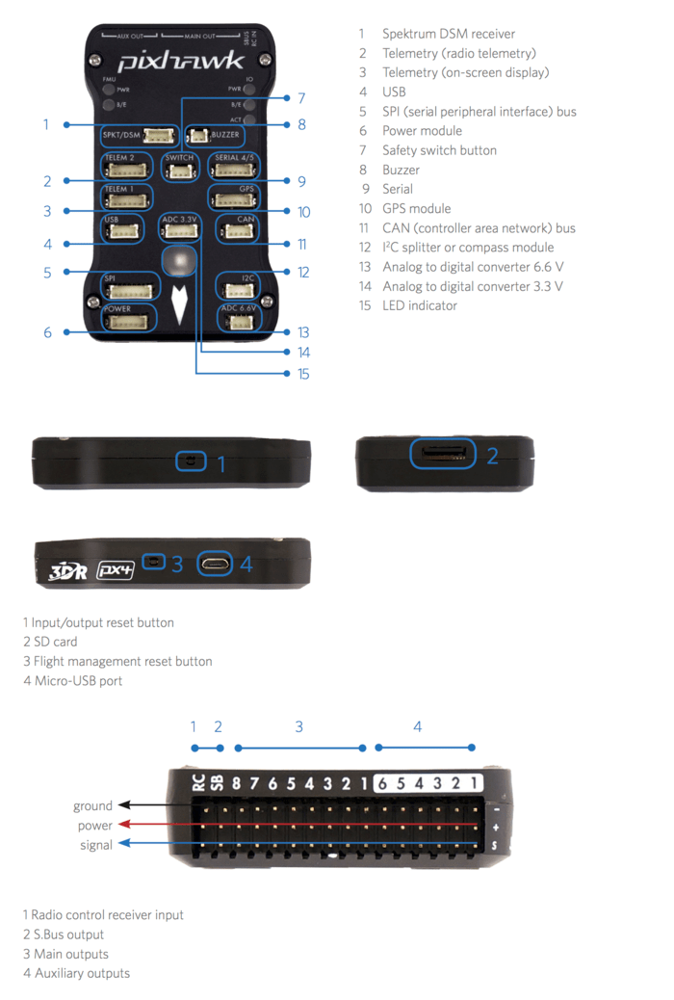
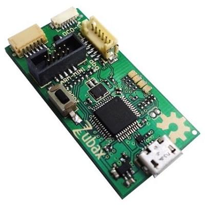
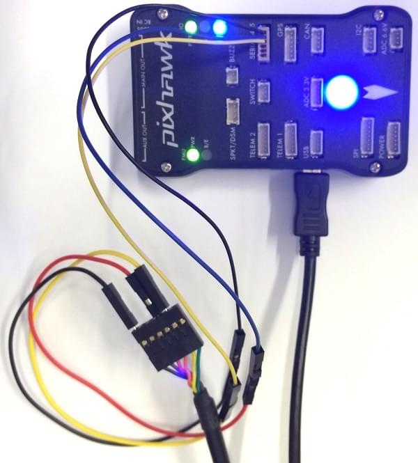

# 3DR Pixhawk 1 비행 콘트롤러 (단종됨)

:::warning PX4에서는 이 제품을 제조하지 않습니다. 지원 또는 규정준수 문제는 제조업체에 문의하십시오.
:::

:::warning
이 비행 컨트롤러는 [단종](../flight_controller/autopilot_experimental.md)되었습니다. 대체품으로 [mRo Pixhawk](../flight_controller/mro_pixhawk.md)을 사용할 수 있습니다.
:::

*3DR Pixhawk&reg; 1* 자동조종장치는 [Pixhawk-project](https://pixhawk.org/) **FMUv2**를 기반의 인기있는 범용 비행 콘트롤러입니다. 하드웨어 설계에서 PX4FMU와 PX4IO의 기능을 결합하였습니다. PX4는 [NuttX](https://nuttx.apache.org/) OS에서 실행됩니다.

PX4 조립 및 설정 방법은 [Pixhawk 배선 개요](../assembly/quick_start_pixhawk.md)를 참고하십시오.

## 주요 특징

* 메인 시스템 온칩: [STM32F427](http://www.st.com/web/en/catalog/mmc/FM141/SC1169/SS1577/LN1789) 
  * CPU : 단정밀도 FPU의 180MHz ARM&reg; Cortexex&reg; M4
  * RAM : 256KB SRAM (L1)
* 장애복구 시스템 온칩 : STM32F100 
  * CPU: 24 MHz ARM Cortex M3
  * RAM : 8KB SRAM
* Wifi: ESP8266 외장형
* GPS: u-blox&reg; 7/8 (Hobbyking&reg;) / u-blox 6 (3D Robotics)
* 광류 센서: [PX4 Flow unit](../sensor/px4flow.md)
* 중복 전원공급장치 및 자동 장애 조치
* 외부 안전 스위치
* 다색 LED 주시각 표시기
* 고전력 멀티톤 피에조 오디오 표시기
* 장기간 고속 로깅용 microSD 카드

연결성

* I2C 1개
* CAN 1개 (2개는 옵션)
* ADC 1개
* UART 4개 (흐름 제어 2개 포함)
* 콘솔 1개
* 수동 오버라이드 기능이 있는 PWM 8개
* 6개 PWM / GPIO / PWM 입력
* S.BUS / PPM / Spektrum 입력
* S.BUS 출력

# 구매처

원래 3DR&reg;에서 제조하였습니다. 이 보드는 PX4&reg;의 최초 표준 마이크로 콘트롤러 플랫폼이었습니다. 보드가 더 이상 3DR에서 제조되지는 않지만, [mRo Pixhawk](../flight_controller/mro_pixhawk.md)을 대용품으로 사용할 수 있습니다.

mRo Pixhawk 주문:

* [베어본 (Bare Bones)](https://store.mrobotics.io/Genuine-PixHawk-1-Barebones-p/mro-pixhawk1-bb-mr.htm) - 보드만(3DR Pixhawk 대체품으로 유용합니다)
* [mRo Pixhawk 2.4.6 필수 키트](https://store.mrobotics.io/Genuine-PixHawk-Flight-Controller-p/mro-pixhawk1-minkit-mr.htm) - 텔레메트리 무선 통신을 제외한 모든 것
* mRo Pixhawk 2.4.6 쿨 키트 (한정판)</0> - 텔레메트리 라디오를 포함하여 필요한 모든 것</li> </ul> 
  
  ## 사양
  
  ### 프로세서
  
  * 32 비트 STM32F427 [Cortex-M4F](http://en.wikipedia.org/wiki/ARM_Cortex-M#Cortex-M4) 코어 (FPU 포함)
  * 168 MHz
  * 256 KB RAM
  * 2 MB Flash
  * 32 비트 STM32F103 장애복구 코프로세서
  
  ### 센서
  
  * ST Micro L3GD20H 3축 16비트 자이로스코프
  * ST 마이크로 LSM303D 14 비트 가속도계/자력계
  * Invensense MPU 6000 3축 가속도계/자이로스코프
  * MEAS MS5611 기압계
  
  ### 인터페이스
  
  * UART (직렬 포트) 5개, 1 개의 고전력 지원, 2x (HW 흐름 제어 포함)
  * CAN 2개(하나는 내부 3.3V 트랜시버, 하나는 확장 커넥터에 있음)
  * Spektrum DSM/DSM2/DSM-X® Satellite 호환 입력
  * Futaba S.BUS® 호환 입출력
  * PPM sum signal input
  * RSSI (PWM or voltage) input
  * I2C
  * SPI
  * 3.3 and 6.6V ADC inputs
  * Internal microUSB port and external microUSB port extension
  
  @[youtube](https://youtu.be/gCCC5A-Bvv4)
  
  ### Power System and Protection
  
  * Ideal diode controller with automatic failover
  * Servo rail high-power (max. 10V) and high-current (10A+) ready
  * All peripheral outputs over-current protected, all inputs ESD protected
  
  ## Voltage Ratings
  
  Pixhawk can be triple-redundant on the power supply if three power sources are supplied. The three rails are: Power module input, servo rail input, USB input.
  
  ### Normal Operation Maximum Ratings
  
  Under these conditions all power sources will be used in this order to power the system
  
  * Power module input (4.8V to 5.4V)
  * Servo rail input (4.8V to 5.4V) **UP TO 10V FOR MANUAL OVERRIDE, BUT AUTOPILOT PART WILL BE UNPOWERED ABOVE 5.7V IF POWER MODULE INPUT IS NOT PRESENT**
  * USB power input (4.8V to 5.4V)
  
  ### Absolute Maximum Ratings
  
  Under these conditions the system will not draw any power (will not be operational), but will remain intact.
  
  * Power module input (4.1V to 5.7V, 0V to 20V undamaged)
  * Servo rail input (4.1V to 5.7V, 0V to 20V)
  * USB power input (4.1V to 5.7V, 0V to 6V) 
  
  ## Schematics
  
  [FMUv2 + IOv2 schematic](https://raw.githubusercontent.com/PX4/Hardware/master/FMUv2/PX4FMUv2.4.5.pdf) -- Schematic and layout
  
:::note
As a CC-BY-SA 3.0 licensed Open Hardware design, all schematics and design files are [available](https://github.com/PX4/Hardware).
:::
  
  ## Connectors
  
:::tip
The RC IN port is for RC receivers only and provides power. **NEVER** connect any servos, power supplies or batteries to it or to the receiver connected to it.
:::
  
  
  
  ## Pinouts
  
  #### TELEM1, TELEM2 ports
  
  | Pin     | Signal    | Volt  |
  | ------- | --------- | ----- |
  | 1 (red) | VCC       | +5V   |
  | 2 (blk) | TX (OUT)  | +3.3V |
  | 3 (blk) | RX (IN)   | +3.3V |
  | 4 (blk) | CTS (IN)  | +3.3V |
  | 5 (blk) | RTS (OUT) | +3.3V |
  | 6 (blk) | GND       | GND   |
  
  #### GPS port
  
  | Pin     | Signal   | Volt  |
  | ------- | -------- | ----- |
  | 1 (red) | VCC      | +5V   |
  | 2 (blk) | TX (OUT) | +3.3V |
  | 3 (blk) | RX (IN)  | +3.3V |
  | 4 (blk) | CAN2 TX  | +3.3V |
  | 5 (blk) | CAN2 RX  | +3.3V |
  | 6 (blk) | GND      | GND   |
  
  #### SERIAL 4/5 port
  
  Due to space constraints two ports are on one connector.
  
  | Pin     | Signal  | Volt  |
  | ------- | ------- | ----- |
  | 1 (red) | VCC     | +5V   |
  | 2 (blk) | TX (#4) | +3.3V |
  | 3 (blk) | RX (#4) | +3.3V |
  | 4 (blk) | TX (#5) | +3.3V |
  | 5 (blk) | RX (#5) | +3.3V |
  | 6 (blk) | GND     | GND   |
  
  #### ADC 6.6V
  
  | Pin     | Signal | Volt        |
  | ------- | ------ | ----------- |
  | 1 (red) | VCC    | +5V         |
  | 2 (blk) | ADC IN | up to +6.6V |
  | 3 (blk) | GND    | GND         |
  
  #### ADC 3.3V
  
  | Pin     | Signal | Volt        |
  | ------- | ------ | ----------- |
  | 1 (red) | VCC    | +5V         |
  | 2 (blk) | ADC IN | up to +3.3V |
  | 3 (blk) | GND    | GND         |
  | 4 (blk) | ADC IN | up to +3.3V |
  | 5 (blk) | GND    | GND         |
  
  #### I2C
  
  | Pin     | Signal | Volt           |
  | ------- | ------ | -------------- |
  | 1 (red) | VCC    | +5V            |
  | 2 (blk) | SCL    | +3.3 (pullups) |
  | 3 (blk) | SDA    | +3.3 (pullups) |
  | 4 (blk) | GND    | GND            |
  
  #### CAN
  
  | Pin     | Signal | Volt |
  | ------- | ------ | ---- |
  | 1 (red) | VCC    | +5V  |
  | 2 (blk) | CAN_H  | +12V |
  | 3 (blk) | CAN_L  | +12V |
  | 4 (blk) | GND    | GND  |
  
  #### SPI
  
  | Pin     | Signal         | Volt |
  | ------- | -------------- | ---- |
  | 1 (red) | VCC            | +5V  |
  | 2 (blk) | SPI_EXT_SCK  | +3.3 |
  | 3 (blk) | SPI_EXT_MISO | +3.3 |
  | 4 (blk) | SPI_EXT_MOSI | +3.3 |
  | 5 (blk) | !SPI_EXT_NSS | +3.3 |
  | 6 (blk) | !GPIO_EXT      | +3.3 |
  | 7 (blk) | GND            | GND  |
  
  #### POWER
  
  | Pin     | Signal  | Volt  |
  | ------- | ------- | ----- |
  | 1 (red) | VCC     | +5V   |
  | 2 (blk) | VCC     | +5V   |
  | 3 (blk) | CURRENT | +3.3V |
  | 4 (blk) | VOLTAGE | +3.3V |
  | 5 (blk) | GND     | GND   |
  | 6 (blk) | GND     | GND   |
  
  #### SWITCH
  
  | Pin     | Signal           | Volt  |
  | ------- | ---------------- | ----- |
  | 1 (red) | VCC              | +3.3V |
  | 2 (blk) | !IO_LED_SAFETY | GND   |
  | 3 (blk) | SAFETY           | GND   |
  
  ## Serial Port Mapping
  
  | UART   | Device     | Port                  |
  | ------ | ---------- | --------------------- |
  | UART1  | /dev/ttyS0 | IO debug              |
  | USART2 | /dev/ttyS1 | TELEM1 (flow control) |
  | USART3 | /dev/ttyS2 | TELEM2 (flow control) |
  | UART4  |            |                       |
  | UART7  | CONSOLE    |                       |
  | UART8  | SERIAL4    |                       |
  
  <!-- Note: Got ports using https://github.com/PX4/px4_user_guide/pull/672#issuecomment-598198434 -->
  
  ## Debug Ports
  
  ### Console Port
  
  The [PX4 System Console](../debug/system_console.md) runs on the port labeled [SERIAL4/5](#serial-4-5-port).
  
:::tip
A convenient way to connect to the console is to use a [Dronecode probe](https://kb.zubax.com/display/MAINKB/Dronecode+Probe+documentation), as it comes with connectors that can be used with several different Pixhawk devices. Simply connect the 6-pos DF13 1:1 cable on the [Dronecode probe](https://kb.zubax.com/display/MAINKB/Dronecode+Probe+documentation) to the Pixhawk `SERIAL4/5` port.
  
  
:::
  
  The pinout is standard serial pinout, designed to connect to a [3.3V FTDI](https://www.digikey.com/product-detail/en/TTL-232R-3V3/768-1015-ND/1836393) cable (5V tolerant).
  
  | 3DR Pixhawk 1 |           | FTDI                 |
  | ------------- | --------- | -------------------- |
  | 1             | +5V (red) | | N/C                |
  | 2             | S4 Tx     | | N/C                |
  | 3             | S4 Rx     | | N/C                |
  | 4             | S5 Tx     | 5 | FTDI RX (yellow) |
  | 5             | S5 Rx     | 4 | FTDI TX (orange) |
  | 6             | GND       | 1 | FTDI GND (black) |
  
  The wiring for an FTDI cable to a 6-pos DF13 1:1 connector is shown in the figure below.
  
  
  
  The complete wiring is shown below.
  
  
  
:::note
For information on how to *use* the console see: [System Console](../debug/system_console.md).
:::
  
  ### SWD Port
  
  The [SWD](../debug/swd_debug.md) (JTAG) ports are hidden under the cover (which must be removed for hardware debugging). There are separate ports for FMU and IO, as highlighted below.
  
  
  
  The ports are ARM 10-pin JTAG connectors, which you will probably have to solder. The pinout for the ports is shown below (the square markers in the corners above indicates pin 1).
  
  
  
  <!-- For more information on SWD debugging see devguide [link to follow] -->
  
:::note
All Pixhawk FMUv2 boards have a similar SWD port.
:::
  
  ## Building Firmware
  
:::tip
Most users will not need to build this firmware! It is pre-built and automatically installed by *QGroundControl* when appropriate hardware is connected.
:::
  
  To [build PX4](../dev_setup/building_px4.md) for this target:
  
      make px4_fmu-v2_default
      
  
  ## Parts / Housings
  
  * **ARM MINI JTAG (J6)**: 1.27 mm 10pos header (SHROUDED), for Black Magic Probe: FCI 20021521-00010D4LF ([Distrelec](http://www.distrelec.ch/en/Pin-header-SMT-straight-for-IDC-1-27-mm-10-Minitek-127-Pin-header-for-IDC%2C-shrouded%2C-straight%2C-SMT-FCI-20021521-00010D4LF/p/14352308?q=20021521-00010D4LF&page=1&origPos=1&origPageSize=10&simi=99.4), [Digi-Key](https://www.digikey.com/product-detail/en/20021521-00010T1LF/609-4054-ND/2414951),) or Samtec FTSH-105-01-F-DV-K (untested) or Harwin M50-3600542 ([Digikey](https://www.digikey.com/products/en?keywords=M50-3600542) or [Mouser](http://ch.mouser.com/ProductDetail/Harwin/M50-3600542/?qs=%2fha2pyFadujTt%2fIEz8xdzrYzHAVUnbxh8Ki%252bwWYPNeEa09PYvTkIOQ%3d%3d)) 
    * JTAG Adapter Option #1: [BlackMagic Probe](https://1bitsquared.com/products/black-magic-probe). Note, may come without cables (check with manufacturer). If so, you will need the **Samtec FFSD-05-D-06.00-01-N** cable ([Samtec sample service](http://www.samtec.com/suddenservice/samples/samples.aspx) or [Digi-Key Link: SAM8218-ND](http://www.digikey.com/product-search/en?x=0&y=0&lang=en&site=us&KeyWords=FFSD-05-D-06.00-01-N)) or [Tag Connect Ribbon](http://www.tag-connect.com/CORTEXRIBBON10) and a Mini-USB cable.
    * JTAG Adapter Option #2: [Digi-Key Link: ST-LINK/V2](https://www.digikey.com/product-detail/en/stmicroelectronics/ST-LINK-V2/497-10484-ND) / [ST USER MANUAL](http://www.st.com/internet/com/TECHNICAL_RESOURCES/TECHNICAL_LITERATURE/USER_MANUAL/DM00026748.pdf), needs an ARM Mini JTAG to 20pos adapter: [Digi-Key Link: 726-1193-ND](https://www.digikey.com/products/en?keywords=MDL-ADA2)
    * JTAG Adapter Option #3: [SparkFun Link: Olimex ARM-TINY](http://www.sparkfun.com/products/8278) or any other OpenOCD-compatible ARM Cortex JTAG adapter, needs an ARM Mini JTAG to 20pos adapter: [Digi-Key Link: 726-1193-ND](https://www.digikey.com/products/en?keywords=MDL-ADA2)
  * **USARTs**: Hirose DF13 6 pos ([Digi-Key Link: DF13A-6P-1.25H(20)](https://www.digikey.com/products/en?keywords=H3371-ND)) 
    * Mates: Hirose DF13 6 pos housing ([Digi-Key Link: Hirose DF13-6S-1.25C](https://www.digikey.com/products/en?keywords=H2182-ND))
  * **I2C and CAN**: Hirose DF13 4 pos ([Digi-Key Link: DF13A-4P-1.25H(20)](https://www.digikey.com/products/en?keywords=H3369-ND))
  
  ## Supported Platforms / Airframes
  
  Any multicopter / airplane / rover or boat that can be controlled with normal RC servos or Futaba S-Bus servos.