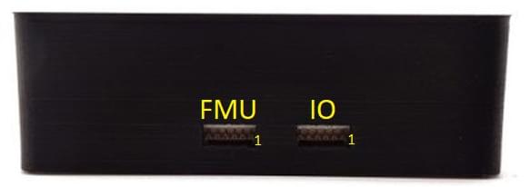

# Pixhawk 3 프로

:::warning PX4에서는 이 제품을 제조하지 않습니다. 하드웨어 지원과 호환 문제는 [제조사](https://store-drotek.com/)에 문의하십시오.
:::

Pixhawk<sup>&reg;</sup> 3 Pro는 일부 업그레이드와 기능이 추가된 FMUv4 하드웨어 설계 (Pixracer)를 기반으로합니다. 이 보드는 [Drotek<sup>&reg;</sup>](https://drotek.com)과 PX4에 의해 설계되었습니다.


:::note
주요 하드웨어 문서는 여기를 참고하십시오.
https://drotek.gitbook.io/pixhawk-3-pro/hardware
:::

:::tip
이 자동조종장치는 PX4 유지관리 및 테스트 팀에서 [지원](../flight_controller/autopilot_pixhawk_standard.md)합니다.
:::

## 요약

- 마이크로컨트롤러 : **STM32F469**; 플래시 용량은 **2MiB**, RAM 용량은 **384KiB**입니다.
- **ICM-20608-G** 자이로 / 가속도계
- **MPU-9250** 자이로 / 가속도계 / 자력계
- **LIS3MDL** 나침반
- 2개의 SPI 버스를 통해 연결된 센서(고속 버스 1개와 저잡음 버스 1개)
- 2개의 I2C 버스
- CAN 버스 2 개
- 2 개의 전원 모듈에서 전압 / 배터리 판독
- FrSky<sup>&reg;</sup> 인버터
- 메인 8 개 + AUX PWM 출력 6개(개별 IO 칩, PX4IO)
- microSD (로깅)
- S.BUS / Spektrum / SUMD / PPM 입력
- JST GH 사용자 친화적 커넥터 : Pixracer와 동일한 커넥터와 핀배열

## 구매처

[Drotek 상점](https://store.drotek.com/)에서 구매 (EU) :

- [Pixhawk 3 프로 (패키지)](https://store.drotek.com/autopilots/844-pixhawk-3-pro-pack.html)
- [Pixhawk 3 프로](https://store.drotek.com/autopilots/821-pixhawk-pro-autopilot-8944595120557.html)

[readymaderc](https://www.readymaderc.com)에서 구매 (미국) :

- [Pixhawk 3 프로](https://www.readymaderc.com/products/details/pixhawk-3-pro-flight-controller)

## 펌웨어 빌드

::::tip 대부분의 사용자들은 펌웨어를 빌드할 필요는 없습니다. It is pre-built and automatically installed by _QGroundControl_ when appropriate hardware is connected.
:::

이 대상에 대한 [PX4 빌드](../dev_setup/building_px4.md) :

```
make px4_fmu-v4pro_default
```

## 디버그 포트

보드에는 아래와 같은 FMU와 IO 디버그 포트가 있습니다.



The pinouts and connector comply with the [Pixhawk Debug Mini](../debug/swd_debug.md#pixhawk-debug-mini) interface defined in the [Pixhawk Connector Standard](https://github.com/pixhawk/Pixhawk-Standards/blob/master/DS-009%20Pixhawk%20Connector%20Standard.pdf) (JST SM06B connector).

| 핀     | 신호               | 전압    |
| ----- | ---------------- | ----- |
| 1 (적) | VCC TARGET SHIFT | +3.3V |
| 2 (흑) | CONSOLE TX (출력)  | +3.3V |
| 3 (흑) | CONSOLE RX (입력)  | +3.3V |
| 4 (흑) | SWDIO            | +3.3V |
| 5 (흑) | SWCLK            | +3.3V |
| 6 (흑) | GND              | GND   |

이 포트의 배선과 사용 정보는 다음을 참조하십시오.

- [SWD Debug Port](../debug/swd_debug.md)
- [PX4 시스템 콘솔](../debug/system_console.md#pixhawk_debug_port) (참고, FMU 콘솔은 UART7에 매핑됨).

## 시리얼 포트 매핑

| UART   | 장치         | 포트             |
| ------ | ---------- | -------------- |
| UART1  | /dev/ttyS0 | 와이파이           |
| USART2 | /dev/ttyS1 | TELEM1 (흐름 제어) |
| USART3 | /dev/ttyS2 | TELEM2 (흐름 제어) |
| UART4  |            |                |
| UART7  | 콘솔         |                |
| UART8  | SERIAL4    |                |

<!-- Note: Got ports using https://github.com/PX4/PX4-user_guide/pull/672#issuecomment-598198434 -->
